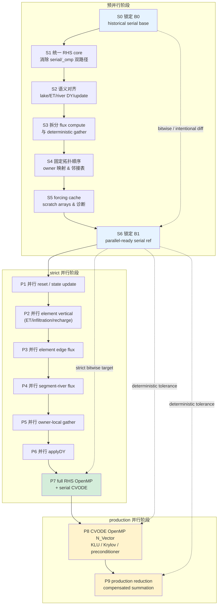
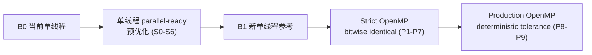

# SHUD OpenMP 并行改造总体实施方案（终版）

> **本文档替代**以下四份文档，是 SHUD 求解器加速的唯一权威实施路线：
>
> 1. `SHUD_solver_acceleration_roadmap.md`（2026-04-23，决策层）
> 2. `SHUD_single_thread_preoptimization_for_parallel.md`（2026-04-26，预优化层）
> 3. `SHUD_parallel_alignment_accuracy_plan.md`（2026-04-26，精度验收层）
> 4. `SHUD_parallel_complete_package/SHUD_parallel_full_plan.md`（2026-04-26，合并版）
>
> 版本：v1.0 | 日期：2026-04-27 | SHUD 源码子模块路径：`openMP/SHUD/`

---

## 1. 项目概述与核心原则

### 1.1 目标

**通过 OpenMP 并行化显著降低 SHUD 的 wall-clock 运行时间。**

约束条件：
- 串行与并行路径物理方程等价（同一套 RHS core）
- strict 阶段精度与单线程 base bitwise identical
- production 阶段精度在可解释的工程容差内，水量守恒不恶化

### 1.2 核心原则

| 编号 | 原则 | 含义 |
|---|---|---|
| C1 | 唯一 RHS core | `f_loop()` / `f_loop_omp()` 不再各自演化；OpenMP 只是 execution policy |
| C2 | compute 与 gather 分离 | 通量计算只写唯一 slot；汇总由 owner-local 固定顺序 gather 完成 |
| C3 | strict 阶段不改物理 | 不改 forcing 插值、不改容差、不改公式、不改求和算法 |
| C4 | CVODE 内部并行晚于 RHS 并行 | 先 RHS bitwise，再 CVODE vector/solver 并行 |
| C5 | 阶段门控 | 每阶段有 go/no-go checklist，不通过不进入下一阶段 |

---

## 2. 基线定义与精度等级

### 2.1 四层基线

| 基线 | 是什么 | 怎么来的 | 用途 |
|---|---|---|---|
| **B0** | 当前 SHUD 原样编译的单线程结果 | 不改任何代码，锁定编译环境后直接跑 | 历史参考；后续所有改动的对照起点 |
| **B1** | 重构后的单线程结果 | S0–S6 完成后：统一 RHS core、拆完 side-effect、固定拓扑顺序，仍以单线程运行 | **并行阶段的唯一对照**；长期回归标准 |
| **P-strict** | strict OpenMP 并行结果 | P1–P7：RHS 内部 OpenMP，CVODE 仍用 serial N_Vector | 目标：与 B1 **bitwise identical** |
| **P-prod** | production 并行结果 | P8–P9：CVODE OpenMP N_Vector、Krylov solver、tree reduction | 允许与 B1 有微小可解释差异；deterministic 可复现 |

**B0 与 B1 的核心区别**：B0 是当前代码的"原始快照"（serial/omp 双路径并存、side-effect 未拆、可能含已知 bug）；B1 是经过预并行重构后的"干净单线程"（唯一 RHS core、compute/gather 分离、拓扑固定）。两者都是单线程运行，但 B1 的代码结构已经为并行做好了准备。

**B1 vs B0 的精度关系**：理想目标 bitwise identical——说明重构只改了代码结构，没改计算逻辑。若 B1 修复了明确 bug（如 omp 路径的 river DY 公式与 serial 不一致），则 B1 可能与 B0 有差异，必须在 `B1_CHANGELOG.md` 中逐项记录差异来源、影响范围和验收指标。

### 2.2 六级精度等级（A0–A5）

| 等级 | 名称 | 定义 | 适用阶段 |
|---|---|---|---|
| **A0** | baseline repeatability | 单线程 base 多次运行 bitwise identical | S0 |
| **A1** | refactor equivalence | 重构后不开并行，与 B0 bitwise identical | S1–S6 |
| **A2** | RHS bitwise equivalence | 单次 RHS 评估中所有关键数组和 `DY` bitwise identical | P1–P6 |
| **A3** | full-run bitwise equivalence | 完整 CVODE run 输出与 B1 bitwise identical，CVODE stats 一致 | P7 |
| **A4** | deterministic tolerance | 并行结果重复运行一致，与 B1 差异在阈值内 | P8 |
| **A5** | physical acceptance | 水文指标、水量守恒和跨流域表现可接受 | P9 及生产评估 |

### 2.3 A4 容差阈值（待标定）

A4 阈值不能预设，必须在 P7 通过后、进入 P8 前，基于 B1 实际输出来标定。

**标定方法**：

1. 用 B1 benchmark 算例，记录各状态变量（surface/unsat/GW/river/lake）的量级范围和典型变化幅度
2. 在 P7 strict 阶段，记录不同编译器优化级别（`-O1` vs `-O2`）下的 bitwise 差异，作为"纯浮点噪声"的经验下界
3. 进入 P8 后，逐项对比 P-prod 与 B1 的差异分布（max/p95/p99），取合理倍数作为门槛
4. 水量守恒、NSE/KGE 等水文指标阈值参考 B1 自身在不同算例上的表现区间

**需要标定的指标清单**：

| 指标 | 标定依据 |
|---|---|
| 状态变量最大绝对差 | 按变量分组（surface/unsat/GW/river/lake），参考各自量级 |
| 水量平衡残差 | 参考 B1 自身残差水平 |
| ΔNSE / ΔKGE | 参考 B1 在多个算例上的基线值 |
| 峰值流量相对差 | 参考 B1 benchmark 算例的洪峰量级 |
| 径流总量相对差 | 参考 B1 多年累积量 |
| 同线程重复运行 | 必须 bitwise identical 或严格 deterministic（这条不需要标定） |

> 在 B1 锁定前，不写死任何具体数字。

---

## 3. 阶段路线图

### 3.1 Mermaid 总图



### 3.2 简化版路线



---

## 4. 源码关键观察

以下观察基于 SHUD 子模块 `openMP/SHUD/src/` 中的实际源码，是本方案所有阶段划分的依据。

### 4.1 RHS 入口双路径分叉

**文件**：`src/Model/f.cpp` (L7–L26)

```cpp
#ifdef _OPENMP_ON
    Y = NV_DATA_OMP(CV_Y);
    DY = NV_DATA_OMP(CV_Ydot);
    MD->f_update_omp(Y, DY, t);    // ← OMP 路径
    MD->f_loop_omp(Y, DY, t);
    MD->f_applyDY_omp(DY, t);
#else
    Y = NV_DATA_S(CV_Y);
    DY = NV_DATA_S(CV_Ydot);
    MD->f_update(Y, DY, t);        // ← serial 路径
    MD->f_loop(t);
    MD->f_applyDY(DY, t);
#endif
```

**问题**：serial 与 OpenMP 是两套 RHS 实现，而非同一 kernel 的不同 execution policy。当并行结果与单线程不一致时，无法归因。

### 4.2 f_loop() 与 f_loop_omp() 过程覆盖差异

**serial `f_loop()`**（`src/ModelData/MD_f.cpp` L8–L49）包含：
- Lake element 分支：`updateLakeElement()` → `fun_Ele_lakeVertical()` → `qLakeEvap/qLakePrcp` 累加（L11–L16）
- 普通 element：`f_etFlux()` → `updateElement()` → `fun_Ele_Infiltraion()` → `fun_Ele_Recharge()`（L17–L24）
- Lake element horizontal：`fun_Ele_lakeHorizon()`（L27–L29）
- segment flux → river downflow → lake evap clamp → `PassValue()`

**OpenMP `f_loop_omp()`**（`src/ModelData/MD_f_omp.cpp` L69–L100）：
- **缺失** `f_etFlux()` 调用
- **缺失** lake element vertical/horizontal 处理
- **缺失** lake evaporation/precipitation clamp
- 直接进入 `updateElement()` → infiltration/recharge → surface/sub → segment → river → `PassValue()`

### 4.3 river DY 公式不一致

**serial `f_applyDY()`**（`src/ModelData/MD_f.cpp` L119–L141）：
```cpp
DY[iRIV] = (- QrivUp[i] - QrivSurf[i] - QrivSub[i] - QrivDown[i] + Riv[i].qBC) / Riv[i].Length;
if(DY[iRIV] < -1. * Riv[i].u_CSarea)
    DY[iRIV] = -1. * Riv[i].u_CSarea;
DY[iRIV] = fun_dAtodY(DY[iRIV], Riv[i].u_topWidth, Riv[i].bankslope);
```
先按 reach length 计算截面积变化 → 限制负向面积变化 → `fun_dAtodY()` 转换为水深变化。

**OpenMP `f_applyDY_omp()`**（`src/ModelData/MD_f_omp.cpp` L54–L65）：
```cpp
DY[iRIV] = (- QrivUp[i] - QrivSurf[i] - QrivSub[i] - QrivDown[i] + Riv[i].qBC) / Riv[i].u_TopArea;
```
直接除以 `u_TopArea`，**缺失**面积限制和 `fun_dAtodY()` 转换。这不是浮点顺序差异，而是方程本身不同。

### 4.4 f_update() 与 f_update_omp() 初始化差异

**serial `f_update()`**（`src/ModelData/MD_update.cpp` L60–L147）：
- 清零 `QeleSurf[i][j]`/`QeleSub[i][j]`/`QeleSurfTot`/`QeleSubTot`（L64–L69）
- 状态镜像 `uYsf/uYus/uYgw` **不做** `max(0, Y)` clamp（L70–L74）
- 清零 `QrivSurf/QrivSub/QrivUp`（L123–L127）
- 清零 `Qe2r_Surf/Qe2r_Sub`（L128–L131）
- **Lake 完整初始化**：`yLakeStg`/`lake.update()`/`y2LakeArea`/`QLakeSurf/Sub`/`qLakeEvap/Prcp`/`QLakeRivIn/Out`（L132–L143）
- 清零 `DY[0:NumY]`（L144–L146）

**OpenMP `f_update_omp()`**（`src/ModelData/MD_f_omp.cpp` L104–L170）：
- 状态镜像 `uYsf/uYus` **做了** `max(0, Y)` clamp（L116–L117）
- `uYgw` **做了** `max(0, Y)` clamp（L121）
- **缺失** lake 初始化
- **缺失** `QrivSurf/QrivSub/QrivUp` 清零
- **缺失** `Qe2r_Surf/Qe2r_Sub` 清零
- `QeleSurf/QeleSub` 清零被注释掉（L133–L135）

### 4.5 shared accumulator side-effect

共享写分两类：**被 `PassValue()` 覆盖的死代码**和**真正需要拆的共享写**。

#### 死代码（被 `PassValue()` 零化后重新累加，实际不影响结果）

**`fun_Seg_surface()`**（`src/ModelData/MD_RiverFlux.cpp` L100–L113）：
```cpp
QsegSurf[i] = WeirFlow_jtoi(...);
QrivSurf[iRiv]  +=  QsegSurf[i];   // ← 死��码：PassValue() L158-170 会清零并重新累加
Qe2r_Surf[iEle] += -QsegSurf[i];   // ← 死代码：PassValue() L163-172 会清零并重新累加
```

**`fun_Seg_sub()`**（L114–L126）同理。这些 `+=` 在 serial 和 OMP 路径中都是冗余的，因为 `PassValue()`（`MD_f.cpp` L156–L196）会先清零 `QrivSurf/QrivSub/QrivUp/Qe2r_Surf/Qe2r_Sub`（L158–L166），再从 `QsegSurf/QsegSub` 重新累加（L167–L174）。

#### 真正需要拆的共享写（不在 `PassValue()` 覆盖范围内）

**`Flux_RiverDown()`**（`MD_RiverFlux.cpp` L5–L63）中 toLake 分支：
```cpp
QLakeRivIn[Riv[i].toLake] += QrivDown[i];  // L24, 真正的共享写
```

**`fun_Ele_surface()`**（`MD_ElementFlux.cpp` L35–L97）中 lake neighbor 分支：
```cpp
QLakeSurf[ilake] += Q;  // L52, 真正的共享写
```

**`fun_Ele_sub()`**（L100–L156）中 lake neighbor 分支：
```cpp
QLakeSub[ilake] += Q;  // L121, 真正的共享写
```

**`PassValue()`**（`MD_f.cpp` L156–L196）��身是当前的 gather 实现：
- `QrivSurf[ir] += QsegSurf[i]`（L170）— 串行执行，无并行风险
- `Qe2r_Surf[ie] += -QsegSurf[i]`（L172）— 同上
- `QrivUp[iDownStrm] += -QrivDown[i]`（L177）— 同上

`PassValue()` 在串行中是安全���。并行改造时需将其重构为使用预构建 adjacency list 的 owner-local gather，但不需要从 `fun_Seg_*` "移入"累加逻辑——只需删掉 `fun_Seg_*` 里的死 `+=`。

### 4.6 `f_applyDY_omp` 局部变量 data race

**文件**：`src/ModelData/MD_f_omp.cpp` L9–L67

```cpp
void Model_Data::f_applyDY_omp(double *DY, double t){
    double area;                    // ← 声明在 parallel region 外
    int isf, ius, igw, i;          // ← isf/ius/igw 也在外面
#pragma omp parallel default(shared) private(i)  // 只有 i 是 private
    {
#pragma omp for
        for (i = 0; i < NumEle; i++) {
            isf = iSF; ius = iUS; igw = iGW;  // 多线程同时写同一个 isf/ius/igw
            area = Ele[i].area;                 // 多线程同时写同一个 area
```

`area`、`isf`、`ius`、`igw` 声明在 `#pragma omp parallel` 之外且 `default(shared)`，多线程同时写同一内存地址。这是 **data race（undefined behavior）**，不只是累加顺序问题。当前碰巧能跑是因为编译器可能将其优化进寄存器，但不可依赖。

**修复**：S1 统一 RHS core 时，将这些变量声明到 for 循环体内部，或显式标记为 `private`。

### 4.7 `PassValue()` 覆盖了 `fun_Seg_*` 的 side-effect

**`fun_Seg_surface()`**（`MD_RiverFlux.cpp` L107–L108）写 `QrivSurf[iRiv] += QsegSurf[i]` 和 `Qe2r_Surf[iEle] += -QsegSurf[i]`。但 **`PassValue()`**（`MD_f.cpp` L156–L196）在 `f_loop` 末尾会先把 `QrivSurf/QrivSub/QrivUp/Qe2r_Surf/Qe2r_Sub` **全部清零**（L158–L166），然后从 `QsegSurf/QsegSub` **重新累加**（L167–L174）。

这意味着 `fun_Seg_surface/sub` 里的 `+=` 是**死代码**——无论写什么值，`PassValue()` 都会覆盖。`fun_Seg_sub` 同理。

**真正需要拆的共享写**只有 `PassValue()` 外部的：
- `Flux_RiverDown()` L24：`QLakeRivIn[toLake] += QrivDown[i]`（不在 PassValue 覆盖范围）
- `fun_Ele_surface()` L52：`QLakeSurf[ilake] += Q`（不在 PassValue 覆盖范围）
- `fun_Ele_sub()` L121：`QLakeSub[ilake] += Q`（不在 PassValue 覆盖范围）

S3 的实际工作：**删掉 fun_Seg_surface/sub 里的死 `+=`**；对 lake 相关的共享写做 compute/gather 拆分；`PassValue()` 本身就是 gather，重构为使用预构建 adjacency list 的确定性版本。

### 4.8 `updateforcing()` 中孤立的 `#pragma omp for`

**文件**：`src/ModelData/MD_ET.cpp` L12–L14

```cpp
#ifdef _OPENMP_ON
#pragma omp for
#endif
    for (i = 0; i < NumForc; i++){
        tsd_weather[i].movePointer(t);
    }
```

此 `#pragma omp for` 没有外层 `#pragma omp parallel`。除非 `updateforcing()` 从某个 parallel region 内部被调用，否则这是孤立指令，运行时退化为串行。需在 S1 阶段确认其调用上下文并修正。

### 4.9 uncoupled 路径的 clamp 不一致

`f.cpp` L34–L125 定义了五个 uncoupled RHS 函数（`f_surf`、`f_unsat`、`f_gw`、`f_river`、`f_lake`），它们调用 `f_updatei()`（`MD_update.cpp` L3–L59）。`f_updatei()` 对所有状态变量统一做 `max(0, Y)` clamp：

```cpp
// MD_update.cpp L7
uYsf[i] = (Y[i] >= 0.) ? Y[i] : 0.;  // f_updatei case 1
// L11
uYus[i] = (Y[i] >= 0.) ? Y[i] : 0.;  // f_updatei case 2
// L17-19
uYgw[i] = (Y[i] >= 0.) ? Y[i] : 0.;  // f_updatei case 3
```

而 serial coupled 路径的 `f_update()`（`MD_update.cpp` L70–L74）不做 clamp：`uYsf[i] = Y[iSF]`。

这意味着 coupled 和 uncoupled 模式的负状态处理语义不同。当前方案以 coupled 路径为主线，uncoupled 暂不纳入并行改造，但需要记录这个差异，避免后续混淆。

### 4.10 全局变量裸指针

**文件**：`src/Model/shud.cpp` L18–L24 + `src/Model/Macros.hpp` L100–L108

```cpp
// shud.cpp L18-24: 定义
double *uYsf; double *uYus; double *uYgw; double *uYriv; double *uYlake;
double timeNow;

// Macros.hpp L100-108: extern 声明
extern double *uYsf; ... extern double timeNow;
```

`uYsf/uYus/uYgw/uYriv/uYlake/timeNow` 是全局变量，不是 `Model_Data` 成员。`iSF/iUS/iGW/iRIV/iLAKE` 宏（`Macros.hpp` L21–L25）展开后直接用 `NumEle/NumRiv`（`Model_Data` 成员）索引这些全局指针。当前 CVODE 单线程调 `f()` 所以安全，但如果未来有并发 RHS（如 Jacobian 并行差分估计），全局状态会冲突。S1 阶段应将这些收编到 `Model_Data` 内部。

### 4.11 `ET()` 也有孤立的 `#pragma omp for`

**文件**：`src/ModelData/MD_ET.cpp` L113–L114

```cpp
#ifdef _OPENMP_ON
#pragma omp for
#endif
    for(i = 0; i < NumEle; i++) { ...
```

与 §4.8 中 `updateforcing()` 同一个问题。`ET()` 从 `shud.cpp` L94 的主循环串行调用（`MD->ET(t, tnext)`），无外层 parallel region，`#pragma omp for` 是孤立指令。

### 4.12 `AccTemperature.getACC()` 除零风险

**文件**：`src/classes/AccTemperature.hpp` L60–L62

```cpp
double getACC(){
    return ACC / que.size();  // que.size() 初始为 0
}
```

`push(x, tnow)` 只在 `(tnow - Time_start) >= 1440` 时才实际入队。模拟前 1440 分钟内 `que` 为空，`getACC()` 除零 → NaN → 传播到 `fu_Surf[i]`/`fu_Sub[i]` → 影响入渗/补给。这是**现有 bug**（非并行引入），但 cryosphere 启用时会影响 B0 基线稳定性。S0 锁定 B0 时需确认 cryosphere 算例是否触发此问题。

### 4.13 当前代码已使用 OpenMP N_Vector

**文件**：`src/Model/shud.cpp` L58–L59

```cpp
#ifdef _OPENMP_ON
    udata = N_VNew_OpenMP(NY, MD->CS.num_threads, sunctx);
    du = N_VNew_OpenMP(NY, MD->CS.num_threads, sunctx);
```

方案 P8 将"引入 OpenMP N_Vector"列为 production 阶段任务，但**当前代码已经在用**。这意味着 CVODE 内部 norm/dot/reduction 在 OMP 模式下已经是多线程的。方案原则 C4"CVODE 内部并行晚于 RHS 并行"在当前代码中已被违反。P7 strict 阶段如果要用 serial N_Vector 做 bitwise 验证，需**显式改回** `N_VNew_Serial`。

### 4.14 `movePointer()` 非线程安全

**文件**：`src/classes/TimeSeriesData.cpp` L116–L136

`movePointer()` 修改 `iNow`、`iNext`，可能触发 `read_csv()`（重新打开文件）。多个 element 可能共享同一个 `tsd_weather[idx]`（`Ele[i].iForc` 相同），当前只在串行 loop 中调用（`MD_ET.cpp` L21–L24）。如果未来并行化 `tReadForcing`，共享同一 forcing 对象的多个 element 会冲突。S5 forcing 改造时必须处理。

### 4.15 `f_etFlux()` 中 `printf` 警告在并行中不安全

**文件**：`src/ModelData/MD_ET.cpp` L215–L216

```cpp
if(qEleETA[i] > qEleETP[i] * 2.){
    printf("Warning: More AET(%.3E) than PET(%.3E) on Element (%d).", ...);
}
```

P2 并行化 element vertical 时，多线程 `printf` 会交错输出。不影响数值但产生乱码日志。应改为写 diagnostic buffer，RHS 后串行输出。

### 4.16 forcing I/O 模式

**`TimeSeriesData::read_csv()`**（`src/classes/TimeSeriesData.cpp` L45–L89）：
- 每次 refill 重新打开文件（L48）
- 跳过 `MAXQUE * nQue + 2` 行（L57–L60）
- 读入下一段 queue

**`getX()`**（L102–L105）直接返回 `ts[iNow][col]`，zero-order hold，不做插值。

### 4.17 求解控制参数

**`Model_Control.hpp`**（`src/classes/Model_Control.hpp` L104–L108）：
```cpp
double abstol = 1.0e-4;
double reltol = 1.0e-3;
double InitStep = 1.e-2;
double MaxStep = 30;
double SolverStep = 2;
```
均为标量，未提供 vector absolute tolerance。

---

## 5. 预并行阶段（S0–S6）

### S0：锁定 B0 历史基线

**目标**：在任何代码改造前，锁定当前单线程 SHUD 的行为和性能画像。

**具体任务**：

| # | 任务 | 涉及文件 | 说明 |
|---|---|---|---|
| S0.1 | 固定编译环境 | `CMakeLists.txt` / Makefile | 固定编译器/版本、`-O2`、禁止 `-ffast-math`、固定 SUNDIALS 版本 |
| S0.2 | 选定 benchmark 算例 | 外部数据 | 至少 5 类：小流域无 lake、小流域有 lake、中等流域含 river network、BC/SS 算例、dry/wet transition |
| S0.3 | 记录完整输出 | — | 所有 model output 文件归档 |
| S0.4 | 记录 CVODE stats | `src/Model/shud.cpp` | `nFCall`、内部步数、error test failure、linear solver stats |
| S0.5 | 记录 RHS 中间量 | `src/ModelData/MD_f.cpp` | 在 `f_loop()` / `f_applyDY()` 关键点 dump flux 和 DY 数组 |
| S0.6 | 记录 wall-clock / I/O 分项 | — | 总时间、每次 RHS 时间、forcing I/O 时间、输出时间、peak memory |

**验收标准（A0）**：

- [ ] 同一 binary、同一输入、3 次单线程运行 bitwise identical
- [ ] CVODE stats 完全一致
- [ ] 性能报告可重复

**Go/No-Go → S1**：B0 自身不可复现，不进入 S1。

**风险**：算例过少导致基线代表性不足；只看总时间不看 RHS/I/O/CVODE 分项会误判瓶颈。

---

### S1：统一 RHS core

**目标**：把 `f_update() / f_update_omp()`、`f_loop() / f_loop_omp()`、`f_applyDY() / f_applyDY_omp()` 三对函数合并为唯一 RHS core。

**具体任务**：

| # | 任务 | 涉及文件 | 行号参考 | 说明 |
|---|---|---|---|---|
| S1.1 | 新建 `rhs_core()` 框架 | 新建 `MD_rhs_core.cpp`，修改 `f.cpp` | `f.cpp` L7–L26 | 引入 `ExecPolicy` 枚举（Serial / StrictOMP / ProductionOMP），`f()` 内调用 `rhs_core(Y, DY, t, policy)` |
| S1.2 | 合并 `f_update` / `f_update_omp` | `MD_update.cpp` L60–L147, `MD_f_omp.cpp` L104–L170 | — | 统一为 `rhs_reset_and_update_state()`；B1 继承 serial 语义（不做 `max(0,Y)` clamp，含 lake 初始化） |
| S1.3 | 合并 `f_loop` / `f_loop_omp` | `MD_f.cpp` L8–L49, `MD_f_omp.cpp` L69–L100 | — | 统一为 `rhs_compute_flux()`；保留完整 lake/ET/element/segment/river/PassValue 过程顺序 |
| S1.4 | 合并 `f_applyDY` / `f_applyDY_omp` | `MD_f.cpp` L51–L154, `MD_f_omp.cpp` L9–L67 | — | 统一为 `rhs_apply_dy()`；river DY 使用 serial 公式（含 length、area clamp、`fun_dAtodY()`） |
| S1.5 | 保留旧路径供 A/B 对比 | `f.cpp` | — | 通过编译宏或运行参数切换 legacy/core，方便过渡期验证 |

**建议 RHS core 结构**：

```cpp
void rhs_core(double* Y, double* DY, double t, ExecPolicy policy) {
    rhs_reset_and_update_state(Y, DY, t, policy);
    rhs_element_vertical(t, policy);       // ET, infiltration, recharge
    rhs_element_horizontal(t, policy);     // surface/sub lateral flux
    rhs_segment_river_flux(t, policy);     // segment flux compute
    rhs_river_downflow(t, policy);         // river downstream flux
    rhs_lake_flux(t, policy);              // lake evap/precip clamp
    rhs_deterministic_gather(policy);      // PassValue() 替代
    rhs_apply_dy(DY, t, policy);           // DY assembly
}
```

**验收标准（A1）**：

- [ ] `policy=Serial` 下 RHS snapshots 与 B0 bitwise identical
- [ ] 完整 run 与 B0 bitwise identical
- [ ] CVODE stats 与 B0 identical
- [ ] `nFCall` 一致

**Go/No-Go → S2**：唯一 RHS core 初版未完成或不通过 bitwise，不进入 S2。

**风险**：重构过程中改变过程顺序（ET vs infiltration 先后、lake vertical/horizon 先后、PassValue 位置）。

---

### S2：语义对齐

**目标**：在唯一 RHS core 内，明确 B1 对 lake、ET、river DY、update/init、负状态处理的统一语义。

**具体任务**：

| #    | 对齐项                  | 当前差异                                                                      | B1 处理原则                              | 涉及文件/行号                                             |
| ---- | -------------------- | ------------------------------------------------------------------------- | ------------------------------------ | --------------------------------------------------- |
| S2.1 | lake vertical        | serial 有 `updateLakeElement()` + `fun_Ele_lakeVertical()`；OMP 缺失          | core 必须显式包含                          | `MD_f.cpp` L11–L16, `MD_ElementFlux.cpp` L2–L17     |
| S2.2 | lake horizontal      | serial 有 `fun_Ele_lakeHorizon()`；OMP 缺失                                   | core 必须包含                            | `MD_f.cpp` L28–L29, `MD_ElementFlux.cpp` L18–L23    |
| S2.3 | ET flux              | serial 普通 element 调 `f_etFlux()`；OMP 缺失                                   | core 在非 lake element 上调 `f_etFlux()` | `MD_ET.cpp` L167–L228                               |
| S2.4 | river DY 公式          | serial：length + area clamp + `fun_dAtodY()`；OMP：直接除 `u_TopArea`           | 采用 serial 公式                         | `MD_f.cpp` L119–L141 vs `MD_f_omp.cpp` L54–L65      |
| S2.5 | lake DY              | serial 有完整 lake DY；OMP 缺失                                                 | core 必须包含                            | `MD_f.cpp` L142–L153                                |
| S2.6 | 负状态 clamp            | serial 不做 `max(0,Y)` → `uYsf = Y[iSF]`；OMP 做 `(Y[iSF] >= 0) ? Y[iSF] : 0` | 统一为 serial 语义（不 clamp），除非另立数值变更      | `MD_update.cpp` L70–L74 vs `MD_f_omp.cpp` L116–L117 |
| S2.7 | lake 初始化             | serial 清零所有 lake flux；OMP 缺失                                              | core 完整 reset                        | `MD_update.cpp` L132–L143                           |
| S2.8 | Qe2r/QrivSurf/Sub 清零 | serial 在 `f_update()` 中清零；OMP 在 `PassValue()` 中清零                         | 统一到 update 阶段                        | `MD_update.cpp` L123–L131 vs `MD_f.cpp` L157–L165   |
| S2.9 | `f_applyDY_omp` data race | `area/isf/ius/igw` 声明在 parallel region 外且 `default(shared)` | 声明到 for 循环内部或标记 `private` | `MD_f_omp.cpp` L10–L16（见 §4.6） |
| S2.10 | `updateforcing()` 孤立 `omp for` | `#pragma omp for` 无外层 parallel region | 确认调用上下文；若孤立则移除或包裹 parallel | `MD_ET.cpp` L12–L14（见 §4.8） |
| S2.11 | lake element DY=0 | serial 对 lake element 置零 `DY[i]/DY[ius]/DY[igw]`；OMP 缺失 | core 必须包含 | `MD_f.cpp` L108–L112 |
| S2.12 | uncoupled 路径 clamp | `f_updatei()` 统一做 `max(0,Y)` clamp；coupled `f_update()` 不 clamp | 记录差异；当前方案以 coupled 路径为主线，uncoupled 暂不纳入并行改造 | `MD_update.cpp` L3–L59 vs L60–L147（见 §4.9） |
| S2.13 | 全局变量裸指针 | `uYsf/uYus/uYgw/uYriv/uYlake/timeNow` 是全局变量，非 `Model_Data` 成员 | S1 收编到 `Model_Data` 内部；iSF/iUS/iGW 宏同步修改 | `shud.cpp` L18–L24, `Macros.hpp` L21–L25, L100–L108（见 §4.10） |
| S2.14 | `ET()` 孤立 `omp for` | 与 `updateforcing()` 同一问题 | 确认调用上下文；若孤立则移除 | `MD_ET.cpp` L113–L114（见 §4.11） |
| S2.15 | `AccTemperature.getACC()` 除零 | `que.size()==0` 时除零 → NaN | 加 guard：`que.empty() ? 0.0 : ACC/que.size()`；若修改则记入 `B1_CHANGELOG.md` | `AccTemperature.hpp` L60–L62（见 §4.12） |
| S2.16 | 当前已使用 OpenMP N_Vector | `shud.cpp` L58–59 已用 `N_VNew_OpenMP` | P7 strict 阶段需显式改回 `N_VNew_Serial` | `shud.cpp` L58–L59（见 §4.13） |

**验收标准（A1）**：

- [ ] 纯继承 serial 语义时，与 B0 bitwise identical
- [ ] 若修复明确 bug，需在 `B1_CHANGELOG.md` 单独记录，不混入并行对齐

**Go/No-Go → S3**：语义 diff report 未完成，不进入 S3。

**风险**：最容易把"并行对齐"误做成"物理修正"。规则：**凡会改变 B0 serial 输出的修复，必须单独立项**。

---

### S3：拆分 flux compute 与 deterministic gather

**目标**：消除所有并行不安全的共享写，形成"纯计算 + owner-local gather"结构。

**具体任务**分两类：

#### S3a：删除死代码（被 `PassValue()` 覆盖，见 §4.7）

| # | 死代码 | 源文件/行号 | 改造方向 |
|---|---|---|---|
| S3a.1 | `QrivSurf[iRiv] += QsegSurf[i]` | `MD_RiverFlux.cpp` L107 | 直接删除，`PassValue()` 已从 `QsegSurf` 重新累加 |
| S3a.2 | `Qe2r_Surf[iEle] += -QsegSurf[i]` | `MD_RiverFlux.cpp` L108 | 同上 |
| S3a.3 | `QrivSub[iRiv] += QsegSub[i]` | `MD_RiverFlux.cpp` L121 | 同上 |
| S3a.4 | `Qe2r_Sub[iEle] += -QsegSub[i]` | `MD_RiverFlux.cpp` L122 | 同上 |

删除后 `fun_Seg_surface/sub` 变成纯函数：只写 `QsegSurf[i]` / `QsegSub[i]`，不碰任何 accumulator。

#### S3b：拆分真正的共享写（不在 `PassValue()` 覆盖范围内）

| # | 当前共享写 | 源文件/行号 | 改造方向 |
|---|---|---|---|
| S3b.1 | `QLakeRivIn[toLake] += QrivDown[i]` | `MD_RiverFlux.cpp` L24 | `Flux_RiverDown()` 只写 `QrivDown[i]`；lake 汇总移到 gather |
| S3b.2 | `QLakeSurf[ilake] += Q` | `MD_ElementFlux.cpp` L52 | `fun_Ele_surface()` lake 分支写 per-edge slot；gather 汇总 |
| S3b.3 | `QLakeSub[ilake] += Q` | `MD_ElementFlux.cpp` L121 | `fun_Ele_sub()` lake 分支写 per-edge slot；gather 汇总 |
| S3b.4 | `qLakeEvap[..] += ...` / `qLakePrcp[..] += ...` | `MD_f.cpp` L15–L16 | 写 per-element contribution slot；gather 汇总 |

#### S3c：重构 `PassValue()` 为确定性 gather

| # | 当前实现 | 源文件/行号 | 改造方向 |
|---|---|---|---|
| S3c.1 | `QrivSurf[ir] += QsegSurf[i]` 等 segment→river/element 累加 | `MD_f.cpp` L167–L174 | 使用预构建 adjacency list，固定顺序累加 |
| S3c.2 | `QrivUp[iDownStrm] += -QrivDown[i]` | `MD_f.cpp` L177 | 移到 downstream river owner gather |
| S3c.3 | `PassValue()` 整体 | `MD_f.cpp` L156–L196 | 替换为 `rhs_deterministic_gather()`，合并 S3b 的 lake gather |

**gather 推荐模式**（以 segment→river 为例）：

```cpp
// Step 1: Pure compute (可并行)
for (int iseg = 0; iseg < NumSegmt; ++iseg) {
    QsegSurf[iseg] = compute_seg_surface(RivSeg[iseg].iEle-1, RivSeg[iseg].iRiv-1, iseg);
    QsegSub[iseg]  = compute_seg_sub(RivSeg[iseg].iEle-1, RivSeg[iseg].iRiv-1, iseg);
}

// Step 2: Owner-local gather (可并行，每个 river 由唯一线程负责)
for (int ir = 0; ir < NumRiv; ++ir) {
    double surf = 0.0, sub = 0.0;
    for (int k = 0; k < seg_by_riv[ir].size(); ++k) {
        int iseg = seg_by_riv[ir][k]; // 固定 segment id 升序
        surf += QsegSurf[iseg];
        sub  += QsegSub[iseg];
    }
    QrivSurf[ir] = surf;
    QrivSub[ir]  = sub;
}
```

**验收标准（A1）**：

- [ ] 若 gather 顺序与 B0 循环顺序一致：RHS bitwise identical
- [ ] 若顺序改变：先锁定为 B1 新参考，记录差异
- [ ] 水量平衡误差不变

**Go/No-Go → S4**：存在任何共享 `+=`，不进入并行阶段。

---

### S4：固定拓扑顺序与 owner 映射

**目标**：构建并固定排序的 adjacency list，让所有 gather 有确定的 owner 和确定的贡献顺序。

**具体任务**：

| # | 邻接表 | 用途 | 排序规则 |
|---|---|---|---|
| S4.1 | `seg_by_riv[ir]` | river 汇总 segment surface/sub flux | segment id 升序，匹配 B0 loop |
| S4.2 | `seg_by_ele[ie]` | element 汇总 segment 交换 flux | segment id 升序，匹配 B0 loop |
| S4.3 | `upstream_by_down[ir]` | downstream river 汇总 upstream downflow | upstream river id 升序 |
| S4.4 | `riv_in_by_lake[ilake]` | lake 汇总 river 入流 | river id 升序 |
| S4.5 | `ele_by_lake[ilake]` | lake 汇总 element evap/precip | element id 升序 |
| S4.6 | `lake_bank_edge_by_lake[ilake]` | lake 汇总岸边 element flux | element id + edge id 升序 |
| S4.7 | `edge_by_ele[ie]` | element 汇总三邻边 flux | 固定 `j=0..2` |

**数据来源**：`RivSeg[i].iEle` / `RivSeg[i].iRiv`（`Model_Data.hpp` L187）、`Riv[i].down`（`River.hpp`）、`Ele[i].iLake`（`Element.hpp`）、`Ele[i].nabr[j]`/`Ele[i].lakenabr[j]`（`Element.hpp`）。

**验收标准（A1）**：

- [ ] 使用 adjacency list 后的 gather 与旧 `PassValue()` bitwise identical
- [ ] topology manifest（YAML 或 JSON）可导出、可回归检查
- [ ] 所有 accumulator 有唯一 owner

**风险**：排序规则一旦改变，会改变浮点求和顺序。排序规则必须写入 manifest 并纳入回归测试。

---

### S5：forcing cache、scratch arrays 与诊断接口

**目标**：消除 I/O 瓶颈，整理 scratch arrays 写入所有权，增加 solver 诊断。

#### S5a：forcing cache

| # | 任务 | 涉及文件/行号 | 说明 |
|---|---|---|---|
| S5a.1 | 持久化 file stream | `TimeSeriesData.cpp` L45–L89 | `read_csv()` 不再每次 refill 重新打开文件 |
| S5a.2 | 大块 buffer / preload | 同上 | 小文件 preload；大文件 memory-map 或 buffered sequential reader |
| S5a.3 | 保持 `getX()` 语义 | `TimeSeriesData.cpp` L102–L105 | zero-order hold 不变，不引入插值 |
| S5a.4 | forcing checksum | — | 记录 cache hit/miss 和 refill 时间 |

**验收**：`getX(t, col)` 与 B0 bitwise identical；完整 run bitwise identical。

#### S5b：scratch arrays 与共享状态

| # | 检查对象 | 涉及文件 | 改造原则 |
|---|---|---|---|
| S5b.1 | `qEle*`、`Qele*`、`Qseg*`、`Qriv*`、`QLake*` | `Model_Data.hpp` L121–L184 | 每个数组元素只有唯一 owner 写入 |
| S5b.2 | `Ele[i].updateElement()` | `Element.cpp` | 确认只改自身字段 |
| S5b.3 | `Riv[i].updateRiver()` | `River.cpp` | 确认只改自身字段 |
| S5b.4 | `lake[i].update()` | `Lake.cpp` | 确认只改自身字段 |
| S5b.5 | RHS 内 debug print / NaN check | 多处 | RHS 内只写 diagnostic buffer；RHS 后串行输出 |

#### S5c：solver 诊断

| 诊断项 | 来源 |
|---|---|
| CVODE internal steps | SUNDIALS CVodeGetNumSteps |
| RHS evaluations | `nFCall`（`Model_Data.hpp` L38） |
| error test failures | CVodeGetNumErrTestFails |
| nonlinear iterations | CVodeGetNumNonlinSolvIters |
| linear iterations | CVodeGetNumLinIters |
| last step size / current order | CVodeGetLastStep / CVodeGetLastOrder |
| RHS 子阶段耗时 | 自定义 timer：update / ET / lateral / segment / river / gather / applyDY |
| forcing I/O 耗时 | 自定义 timer |

**验收标准（A1）**：

- [ ] 所有优化不改变 RHS 输出
- [ ] 诊断开关默认可关闭
- [ ] 开启诊断时结果不变

---

### S6：锁定 B1 parallel-ready serial reference

**目标**：B1 是后续所有并行阶段的唯一 base。

**B1 必须具备的性质**：

- [ ] 唯一 RHS core（S1 完成）
- [ ] 所有 serial/omp 语义差异已对齐（S2 完成）
- [ ] flux compute 与 gather 已拆分（S3 完成）
- [ ] 拓扑顺序固定（S4 完成）
- [ ] forcing 访问语义锁定（S5a 完成）
- [ ] scratch arrays owner 明确（S5b 完成）
- [ ] 单线程完整 run 可复现
- [ ] strict instrumentation 可定位差异

**验收标准**：

理想目标：`B1 == B0 bitwise identical`

允许例外：若 B1 包含明确 bug fix，必须提供：
- `B1_CHANGELOG.md`（差异来源、影响范围、验收指标）
- `B0_vs_B1_RHS_report`
- `B0_vs_B1_full_run_report`
- `water_balance_report`

**Go/No-Go → P1**：

- [ ] B1 已锁定
- [ ] B1 单线程多次运行 bitwise identical
- [ ] RHS snapshot 工具可用
- [ ] full run 对比工具可用
- [ ] topology manifest 可用
- [ ] 所有 shared accumulation 已拆为 deterministic gather
- [ ] 编译选项固定且无 fast-math
- [ ] `schedule(static)` 规则确定

---

## 6. 并行阶段（P1–P9）

### P1：并行 reset / state update / initialization

**目标**：并行化最安全的 owner-local state update。

**可并行计算**：

| 计算 | 并行方式 | owner | 涉及文件 |
|---|---|---|---|
| `DY[i] = 0` | `parallel for schedule(static)` | state index | `MD_update.cpp` L144–L146 |
| `uYsf/uYus/uYgw` 更新 | element loop | element | `MD_update.cpp` L61–L101 |
| element BC/SS 更新 | element loop | element | 同上 |
| `qEleExfil/qEleInfil` 清零 | element loop | element | `MD_update.cpp` L83–L84 |
| `QeleSurf/QeleSub` 清零 | element loop | element | `MD_update.cpp` L64–L69 |
| `uYriv` + `Riv[i].updateRiver()` | river loop | river | `MD_update.cpp` L103–L121 |
| river BC 更新 | river loop | river | 同上 |
| lake stage / area / flux 清零 | lake loop | lake | `MD_update.cpp` L132–L143 |

**禁止**：update 阶段不汇总跨 element/river/lake 的 flux；不做 debug print；不对共享计数器做非原子写。

**验收标准（A2 → A3）**：P1 RHS snapshot 与 B1 bitwise identical；完整 run 与 B1 bitwise identical；CVODE stats identical。

**风险**：`Ele[i].updateElement()`/`Riv[i].updateRiver()`/`lake[i].update()` 若内部写共享对象，会破坏并行安全。需先审查。

---

### P2：并行 element vertical processes

**目标**：并行化 element-local 垂向过程（ET/snow/interception/infiltration/recharge）。

**可并行计算**：

| 计算 | owner | 涉及文件/行号 |
|---|---|---|
| `f_etFlux(i, t)` | element | `MD_ET.cpp` L167–L228 |
| `Ele[i].updateElement(uYsf, uYus, uYgw)` | element | `MD_f.cpp` L21 |
| `fun_Ele_Infiltraion(i, t)` | element | `MD_ElementFlux.cpp` L30–L33 |
| `fun_Ele_Recharge(i, t)` | element | `MD_ElementFlux.cpp` L24–L27 |
| lake element vertical 本地项 | element | `MD_ElementFlux.cpp` L2–L17 |

**前提条件**：
- 每个函数只写 `Ele[i]` 自身字段和 `qEle*[i]`
- `qLakeEvap[lake] += ...` 已在 S3 拆为 per-element contribution slot
- forcing `movePointer()` 在 RHS 前串行完成（`MD_ET.cpp` L16–L17），并行线程只读 `getX()`

**验收标准（A2）**：P2 RHS snapshot 与 B1 bitwise identical。

**风险**：
- `AccT_surf[i].push(T, t)`（`MD_ET.cpp` L127）需确认只改 element-owned `_AccTemp` 对象
- `f_etFlux()` 内的 `printf` 警告（`MD_ET.cpp` L215）需在并行中禁用或改为 buffer

---

### P3：并行 element horizontal / edge flux compute

**目标**：并行化 element-element surface/subsurface lateral flux。

**可并行计算**：

| 计算 | owner | 涉及文件 |
|---|---|---|
| `fun_Ele_surface(i, t)` | element i | `MD_ElementFlux.cpp` L35–L97 |
| `fun_Ele_sub(i, t)` | element i | `MD_ElementFlux.cpp` L100–L156 |

**策略**：保持 element-owner + 固定 `j=0..2` loop。每个线程只写 `QeleSurf[i][j]` / `QeleSub[i][j]`。

**关键前提**：
- `fun_Ele_surface()` 中 lake neighbor 分支的 `QLakeSurf[ilake] += Q`（L52）已在 S3 改为写 per-edge slot
- `fun_Ele_sub()` 中的 `QLakeSub[ilake] += Q`（L121）同理
- 函数不写邻居的 `QeleSurf[inabr][jnabr]`（当前已注释，`MD_f.cpp` L181–L195）

**验收标准（A2）**：`QeleSurf[i][j]` / `QeleSub[i][j]` 与 B1 bitwise identical。

**风险**：若 `fun_Ele_surface()` 或 `fun_Ele_sub()` 同时写两侧 element flux，需改为 edge-owner 模式。

---

### P4：并行 segment-river flux compute

**目标**：并行化 segment flux 和 river downflow 的纯计算部分。

**可并行计算**：

| 计算 | 改造目标 | 涉及文件/行号 |
|---|---|---|
| `fun_Seg_surface(iEle, iRiv, iSeg)` | 只写 `QsegSurf[iSeg]` | `MD_RiverFlux.cpp` L100–L113 |
| `fun_Seg_sub(iEle, iRiv, iSeg)` | 只写 `QsegSub[iSeg]` | `MD_RiverFlux.cpp` L114–L126 |
| `Flux_RiverDown(t, i)` | 只写 `QrivDown[i]` | `MD_RiverFlux.cpp` L5–L63 |

**推荐结构**：

```cpp
#pragma omp parallel for schedule(static)
for (int iseg = 0; iseg < NumSegmt; ++iseg) {
    compute_seg_surface(RivSeg[iseg].iEle-1, RivSeg[iseg].iRiv-1, iseg);
    compute_seg_sub(RivSeg[iseg].iEle-1, RivSeg[iseg].iRiv-1, iseg);
}
#pragma omp parallel for schedule(static)
for (int i = 0; i < NumRiv; ++i) {
    compute_river_down(t, i);   // 只写 QrivDown[i]，不写 QLakeRivIn
}
```

**禁止**：`QrivSurf[ir] += ...`、`Qe2r_Surf[ie] += ...`、`QLakeRivIn[..] += ...`，全部移到 P5 gather。

**验收标准（A2）**：`QsegSurf/QsegSub/QrivDown` 与 B1 bitwise identical。

---

### P5：并行 owner-local deterministic gather

**目标**：并行化所有多源汇总，但保持每个 owner 内的浮点加法顺序固定。

**可并行计算**：

| gather | owner | adjacency list | 贡献顺序 |
|---|---|---|---|
| segment → river surf/sub | river | `seg_by_riv[ir]` | segment id 升序 |
| segment → element surf/sub | element | `seg_by_ele[ie]` | segment id 升序 |
| upstream → downstream river | downstream river | `upstream_by_down[ir]` | upstream river id 升序 |
| river → lake | lake | `riv_in_by_lake[ilake]` | river id 升序 |
| lake bank element → lake surf/sub | lake | `lake_bank_edge_by_lake[ilake]` | element id 升序 |
| lake element evap/precip → lake | lake | `ele_by_lake[ilake]` | element id 升序 |
| element edge → element total | element | `j=0..2` | 先 `Qe2r_*`，再 `j=0,1,2` |

**推荐模式**：

```cpp
#pragma omp parallel for schedule(static)
for (int ir = 0; ir < NumRiv; ++ir) {
    double surf = 0.0, sub = 0.0;
    for (int k = 0; k < seg_by_riv[ir].size(); ++k) {
        int iseg = seg_by_riv[ir][k];
        surf += QsegSurf[iseg];
        sub  += QsegSub[iseg];
    }
    QrivSurf[ir] = surf;
    QrivSub[ir]  = sub;
}
```

**为什么不用 OpenMP reduction / atomic**：OpenMP 规范指出 reduction values 的组合位置和顺序 unspecified，不能保证 bitwise identical（OpenMP 5.0 §2.19.5.4）。`atomic +=` 避免 data race 但不保证顺序。

**验收标准（A2）**：所有 gather 输出数组与 B1 bitwise identical；`max_ulp(DY) = 0`。

---

### P6：并行 applyDY

**目标**：并行化 DY assembly。

**可并行计算**：

| 计算 | owner | 涉及文件/行号 |
|---|---|---|
| element DY (surface/unsat/GW) | element | `MD_f.cpp` L54–L118 |
| element BC/SS DY 修正 | element | `MD_f.cpp` L78–L90 |
| element lake DY 置零 | element | `MD_f.cpp` L108–L112 |
| river DY | river | `MD_f.cpp` L119–L141 |
| lake DY | lake | `MD_f.cpp` L142–L153 |

**关键要求**：river DY 必须使用 B1 统一公式（含 length、area clamp、`fun_dAtodY()`），**不能**继承旧 `_omp` 的 `u_TopArea` 公式。

**验收标准（A2）**：`DY` 全量 `memcmp` 一致；`max_ulp(DY) = 0`。

---

### P7：完整 RHS OpenMP + serial CVODE

**目标**：在 CVODE 仍使用 serial `N_Vector` / 原线性求解器的前提下，全部 RHS 子阶段使用 OpenMP。

**改造要点**：
- `rhs_core(..., ExecPolicy::StrictOMP)` 打开所有 P1–P6 的 parallel region
- CVODE **必须改回** `N_VNew_Serial()`（注意：当前代码 `shud.cpp` L58–L59 已用 `N_VNew_OpenMP`，见 §4.13，需显式切换）
- 不换线性求解器
- 不改容差

**验收标准（A3）**：

| 项 | 标准 |
|---|---|
| 单次 RHS probe | `DY_parallel == DY_B1` bitwise identical |
| 完整 CVODE run | 所有输出 bitwise identical |
| CVODE stats | internal steps / RHS calls / error test failures 完全一致 |
| 多线程重复性 | 同线程数重复运行 bitwise identical |
| 不同线程数 | strict 模式下也应 bitwise identical（gather 顺序不依赖线程数） |

**Go/No-Go → P8**：P7 未通过 bitwise，不进入 P8。

**风险**：
- parallel region 创建/销毁开销可能降低小流域速度收益
- 编译器因 OpenMP 开关改变 floating behavior（建议 strict 模式 `-fp-model=strict` 或等价选项）

---

### P8：CVODE OpenMP N_Vector / KLU / Krylov / preconditioner

**目标**：进入 production 阶段，优化 CVODE 内部向量运算和线性求解层。

**改造方向**：

| 改造 | 目的 | 备注 |
|---|---|---|
| OpenMP `N_Vector` | 加速 CVODE vector ops (norm/dot/scale) | 可能改变 reduction 顺序 |
| Sparse matrix + KLU | 中小规模稀疏直接解 | 需 Jacobian sparsity pattern |
| GMRES / FGMRES | 大规模刚性系统 | SUNDIALS 推荐 GMRES 作为一般选择 |
| 物理分块 preconditioner | 降低 Krylov 迭代 | surface/unsat/GW/river/lake 分块 |
| vector absolute tolerance | 按变量尺度控制误差 | `Model_Control.hpp` L104–L105 当前为标量 |
| rootfinding | 阈值过程事件定位 | CVodeRootInit |

**验收标准（A4）**：

- [ ] 同线程重复运行 deterministic
- [ ] 不同线程数差异在 §2.3 标定的容差内
- [ ] 水量守恒不恶化
- [ ] 水文指标（NSE/KGE/峰值/总量）变化在 §2.3 标定的容差内
- [ ] CVODE stats 变化可解释

**风险**：
- CVODE 自适应步长会放大极小浮点差异
- 线性求解器变化可能改变收敛路径
- 预条件器 setup time 可能吃掉 Krylov 迭代节省的时间
- KLU 需要管理稀疏模式与 Jacobian 更新时机

---

### P9：production deterministic reduction / compensated summation

**目标**：在生产模式下进一步提高数值稳定性和并行效率。

**可选策略**：

| 策略 | 作用 | 与 B1 bitwise identical? |
|---|---|---|
| fixed pairwise summation | 降低求和误差，固定顺序 | 否 |
| Kahan / Neumaier summation | 降低累计误差 | 否 |
| binned / superaccumulator | 强可复现 | 否，成本高 |
| deterministic tree reduction | 多线程稳定复现 | 否 |

**验收标准（A4/A5）**：

- [ ] 同线程数多次运行 bitwise identical 或严格 deterministic
- [ ] 不同线程数之间差异低于 tolerance
- [ ] 水文指标不恶化
- [ ] 若数值误差更低，可作为 new numerical reference 单独立项

**关键约束**：P9 必须晚于 P7。更好的求和算法可能使结果偏离 B1，但这不是错误——问题在于不能和并行 bug 混在一起。

---

## 7. 风险登记表

### 7.1 风险分级

| 等级 | 含义 | 处理原则 |
|---|---|---|
| R0 | 不影响结果，只影响结构或性能 | 可继续，需回归 |
| R1 | 可能产生 bit 差异，但可定位 | 暂停 strict 并行，先锁定 B1 |
| R2 | 可能改变物理语义 | 必须单独立项 |
| R3 | 可能导致非确定性或 data race | 必须阻断 |
| R4 | 可能导致守恒破坏或 solver 不稳定 | 必须回滚 |

### 7.2 具体风险

| ID | 风险 | 等级 | 来源 | 控制措施 | 阻断阶段 |
|---|---|---|---|---|---|
| RISK-01 | 继续维护两套 RHS 路径 | R3 | `f.cpp` L7–L26 | 建立唯一 RHS core | S1 前 |
| RISK-02 | lake/ET/river DY 语义未对齐 | R2/R3 | §4.2–4.4 | B1 继承 serial 语义；差异单独记录 | S2 前 |
| RISK-03 | shared floating accumulation | R3 | `PassValue()`、`fun_Seg_*`、`Flux_RiverDown` | compute/gather 拆分 | P4/P5 前 |
| RISK-04 | OpenMP reduction 顺序不确定 | R3(strict)/R1(prod) | OpenMP §2.19.5.4 | strict 禁止；prod 用 deterministic reduction | P1–P7 |
| RISK-05 | forcing cache 改变时间采样语义 | R2 | `TimeSeriesData.cpp` L45–L89 | 先保持 B0 语义；插值独立进入精度路线 | S5 前 |
| RISK-06 | CVODE OpenMP N_Vector 提前引入 | R1/R2 | SUNDIALS docs | 先完成 P7；再进入 P8 | P7 前 |
| RISK-07 | 编译器优化改变浮点行为 | R2/R3 | fast-math/FMA/版本差异 | 固定工具链；禁止 fast-math；compile manifest | 全程 |
| RISK-11 | `f_applyDY_omp` 局部变量 data race | R3 | `MD_f_omp.cpp` L10–L16（§4.6） | S1 合并 RHS core 时修复：变量声明到循环体内或标记 private | S1 前 |
| RISK-12 | `updateforcing()` 和 `ET()` 孤立 `#pragma omp for` | R1 | `MD_ET.cpp` L12–L14, L113–L114（§4.8, §4.11） | S1 确认调用上下文；若孤立则移除 | S1 前 |
| RISK-13 | 全局变量裸指针阻碍并发 RHS | R2 | `shud.cpp` L18–L24, `Macros.hpp` L100–L108（§4.10） | S1 收编到 Model_Data；iSF/iUS/iGW 宏重构 | S1 前 |
| RISK-14 | `AccTemperature.getACC()` 除零 → NaN | R4 | `AccTemperature.hpp` L60–L62（§4.12） | 加 empty guard；cryosphere 算例纳入 B0 | S0 前 |
| RISK-15 | 当前已用 OpenMP N_Vector，违反 C4 原则 | R2 | `shud.cpp` L58–L59（§4.13） | P7 strict 显式改回 N_VNew_Serial | P7 前 |
| RISK-16 | `movePointer()` 非线程安全 | R3 | `TimeSeriesData.cpp` L116–L136（§4.14） | S5 forcing 改造时处理；并行前 movePointer 必须串行完成 | P2 前 |
| RISK-17 | `f_etFlux()` 中 `printf` 在并行中交错 | R0 | `MD_ET.cpp` L215–L216（§4.15） | 改为 diagnostic buffer | P2 前 |
| RISK-08 | 未初始化数组或旧值残留 | R4 | serial/omp update 覆盖不一致 | 统一 reset；debug 模式 fill NaN/sentinel | P1 前 |
| RISK-09 | 诊断/日志输出破坏并行确定性 | R1/R3 | RHS 内 debug print | RHS 内只写 buffer；RHS 后串行输出 | P1 起 |
| RISK-10 | production 被误当 strict | R2 | CVODE vector/Krylov/tree reduction | 明确 StrictOMP / ProductionOMP 模式 | P8 起 |

### 7.3 阶段 go/no-go 汇总

| 进入阶段 | 必须满足的条件 |
|---|---|
| → S1 | B0 已锁定；单线程自复现；编译环境固定 |
| → S3 | 唯一 RHS core 初版完成；`policy=Serial` 与 B0 bitwise identical |
| → S6 (B1) | compute/gather 拆分完成；topology manifest 可用；forcing cache 与 B0 getX() bitwise identical |
| → P1 | B1 已锁定；strict 编译选项确定；不存在共享浮点 `+=` |
| → P4/P5 | P1–P3 bitwise 通过；segment flux 函数只写 `Qseg*`；gather list 排序与 B1 一致 |
| → P7 | P1–P6 每阶段 RHS snapshot 均 bitwise identical |
| → P8 | P7 full RHS OpenMP + serial CVODE 通过；production tolerance 已定义 |
| → P9 | P8 solver 路径已稳定；production 结果 deterministic；与 B1 误差在容差内 |

---

## 8. 编译与运行规则

### 8.1 strict 模式（S0–P7）

| 类别 | 规则 |
|---|---|
| 禁止 | `-ffast-math`、非受控 FMA contraction、非受控 reassociation |
| 禁止 | 普通 OpenMP `reduction(+:sum)` 用于 strict floating sum |
| 禁止 | `atomic` floating `+=` 用于 strict accumulator |
| 禁止 | `schedule(dynamic)` / `schedule(guided)` |
| 要求 | 固定编译器和版本；固定 SUNDIALS 版本 |
| 要求 | `schedule(static)`；owner-local gather |
| 要求 | 单线程 CVODE `N_Vector_Serial` 作为 P1–P7 的参考 |

### 8.2 production 模式（P8–P9）

| 类别 | 规则 |
|---|---|
| 允许 | OpenMP `N_Vector`、Krylov solver、pairwise/tree reduction |
| 要求 | deterministic within tolerance |
| 要求 | 同配置多次运行可复现 |
| 记录 | CVODE stats、容差报告、水量平衡报告 |

### 8.3 分支策略

| 分支/模式 | 作用 |
|---|---|
| `baseline/current` (tag: `B0`) | 当前单线程参考 |
| `serial-parallel-ready` (tag: `B1`) | 单线程 parallel-ready 版本 |
| `parallel-strict` | RHS 并行，追求 bitwise |
| `parallel-production` | 允许 deterministic tolerance，追求最高性能 |

### 8.4 回滚策略

每阶段保留 tag：`B0-tag` → `S1-rhs-core-tag` → `S3-gather-split-tag` → `B1-tag` → `P1-update-omp-tag` → ... → `P7-full-rhs-omp-tag` → `P8-cvode-prod-tag`

差异排查顺序：
1. 停在 RHS snapshot，不跑完整 run
2. 找 first mismatch array
3. 找 first mismatch index
4. 判断是公式差异、求和顺序差异、未初始化、还是共享写
5. 回滚到上一 tag，单独修复

---

## 9. RHS snapshot 验证数组清单

以下数组是 strict 阶段 bitwise 比较的完整清单：

```text
# 状态镜像
uYsf, uYus, uYgw, uYriv, uYlake, yLakeStg, y2LakeArea

# Forcing / ET
qElePrep, qEleNetPrep, qEleETP, qEleETA
qEleEvapo, qEleTrans, qEleE_IC
qPotEvap, qPotTran, iBeta

# Vertical flux
qEleInfil, qEleRecharge, qEleExfil
qEs, qEu, qEg, qTu, qTg

# Horizontal flux
QeleSurf[i][j], QeleSub[i][j]
QeleSurfTot, QeleSubTot

# Segment flux
QsegSurf, QsegSub

# River-element exchange
Qe2r_Surf, Qe2r_Sub

# River flux
QrivSurf, QrivSub, QrivUp, QrivDown

# Lake flux
QLakeSurf, QLakeSub, QLakeRivIn, QLakeRivOut
qLakeEvap, qLakePrcp

# 状态导数
DY[0 : NumY]
```

比较标准（strict 阶段）：
```text
max_abs_diff = 0
max_ulp_diff = 0
NaN/Inf pattern identical
array length/order identical
first_mismatch = none
```

---

## 10. 推荐交付物

| 交付物 | 内容 | 阶段 |
|---|---|---|
| B0 benchmark set | 小/中/大流域，含 lake/non-lake、dry/wet、BC/SS | S0 |
| RHS snapshot harness | 固定 t/Y，导出所有关键 flux 和 DY 数组 | S0 |
| compile manifest | 编译器/版本/选项/SUNDIALS 版本 | S0 |
| B1 reference result | 单线程 parallel-ready 锁定输出 | S6 |
| B1_CHANGELOG.md | B0→B1 差异说明（如有） | S6 |
| topology manifest | adjacency list 排序规则（YAML/JSON） | S4 |
| strict OpenMP report | 每阶段与 B1 的 bitwise 对比报告 | P1–P7 |
| production tolerance report | P-prod 与 B1 的容差、守恒和性能报告 | P8–P9 |
| risk register | 每阶段风险、触发条件和回滚方案 | 全程 |

---

## 11. 参考文件索引

### 11.1 SHUD 源码文件（子模块 `openMP/SHUD/src/`）

| 文件 | 路径 | 关键内容 |
|---|---|---|
| `f.cpp` | `src/Model/f.cpp` | RHS 入口，serial/OMP 分叉（L7–L26） |
| `MD_f.cpp` | `src/ModelData/MD_f.cpp` | serial `f_loop()`（L8–L49）、`f_applyDY()`（L51–L154）、`PassValue()`（L156–L196） |
| `MD_f_omp.cpp` | `src/ModelData/MD_f_omp.cpp` | OMP `f_loop_omp()`（L69–L100）、`f_applyDY_omp()`（L9–L67）、`f_update_omp()`（L104–L170） |
| `MD_RiverFlux.cpp` | `src/ModelData/MD_RiverFlux.cpp` | `Flux_RiverDown()`（L5–L63）、`fun_Seg_surface()`（L100–L113）、`fun_Seg_sub()`（L114–L126） |
| `MD_ElementFlux.cpp` | `src/ModelData/MD_ElementFlux.cpp` | `fun_Ele_surface()`（L35–L97）、`fun_Ele_sub()`（L100–L156）、lake vertical/horizontal（L2–L23） |
| `MD_ET.cpp` | `src/ModelData/MD_ET.cpp` | `updateforcing()`（L10–L25）、`tReadForcing()`（L26–L105）、`ET()`（L106–L166）、`f_etFlux()`（L167–L228） |
| `MD_update.cpp` | `src/ModelData/MD_update.cpp` | `f_update()`（L60–L147）、`f_updatei()`（L3–L59） |
| `TimeSeriesData.cpp` | `src/classes/TimeSeriesData.cpp` | `read_csv()`（L45–L89）、`getX()`（L102–L105）、`movePointer()`（L116–L136） |
| `Model_Control.hpp` | `src/classes/Model_Control.hpp` | 标量 `abstol`/`reltol`（L104–L105）、`num_threads`（L101）、`SolverStep`（L108） |
| `Model_Data.hpp` | `src/ModelData/Model_Data.hpp` | flux arrays 声明（L121–L184）、函数声明 |
| `shud.cpp` | `src/Model/shud.cpp` | 主求解循环，CVODE 驱动 |
| `Macros.hpp` | `src/Model/Macros.hpp` | `iSF`/`iUS`/`iGW`/`iRIV`/`iLAKE` 状态索引宏 |

### 11.2 外部依据

| 编号 | 来源 | 内容 |
|---|---|---|
| R1 | SHUD README | fully coupled, FVM, C/C++, SUNDIALS/CVODE 6.0+, OpenMP |
| R11 | SUNDIALS CVODE docs | Krylov 方法通常优于直接法；GMRES 推荐；预条件器关键 |
| R12 | SUNDIALS KLU docs | 稀疏线性系统；symbolic/numeric factorization 复用 |
| R13 | SUNDIALS CVODE usage | vector absolute tolerances 更适合多尺度状态向量 |
| R14 | SUNDIALS CVodeRootInit | 事件根检测 |
| OMP-5.0 | OpenMP 5.0 §2.19.5.4 | reduction 组合位置和顺序 unspecified |

### 11.3 被本文档替代的文件

| 文件 | 日期 | 状态 |
|---|---|---|
| `SHUD_solver_acceleration_roadmap.md` | 2026-04-23 | **已替代** |
| `SHUD_single_thread_preoptimization_for_parallel.md` | 2026-04-26 | **已替代** |
| `SHUD_parallel_alignment_accuracy_plan.md` | 2026-04-26 | **已替代** |
| `SHUD_parallel_complete_package/SHUD_parallel_full_plan.md` | 2026-04-26 | **已替代** |

---

> **一句话总结**：目标是并行提速。路线是先统一 RHS core 确保路径等价（S0–S6），再在 B1 上做 strict bitwise 并行证明精度不变（P1–P7），最后进入 production 并行换取最大性能（P8–P9）。每一步都有门控，不通过不前进。
