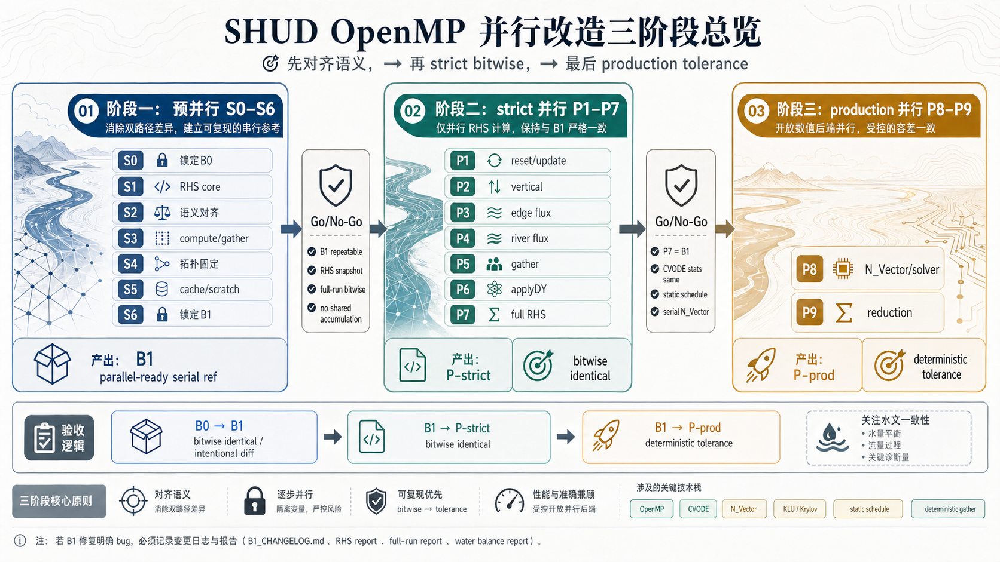
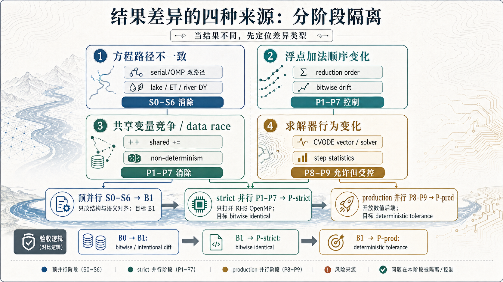
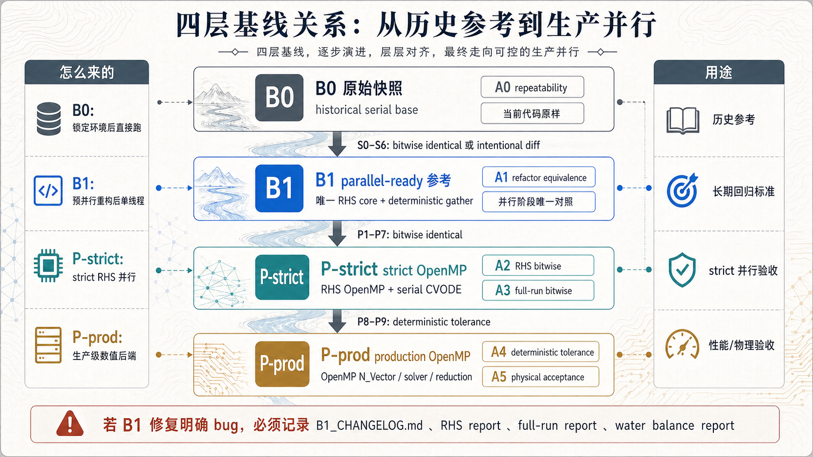
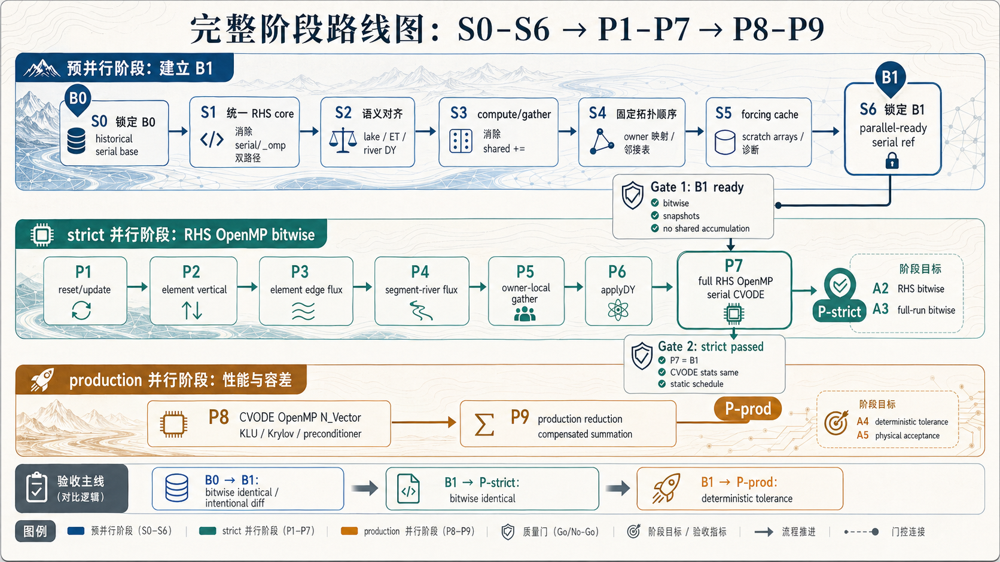
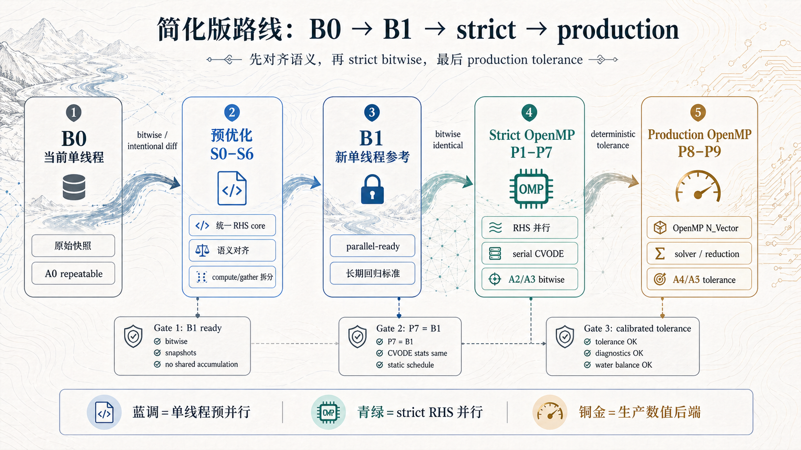
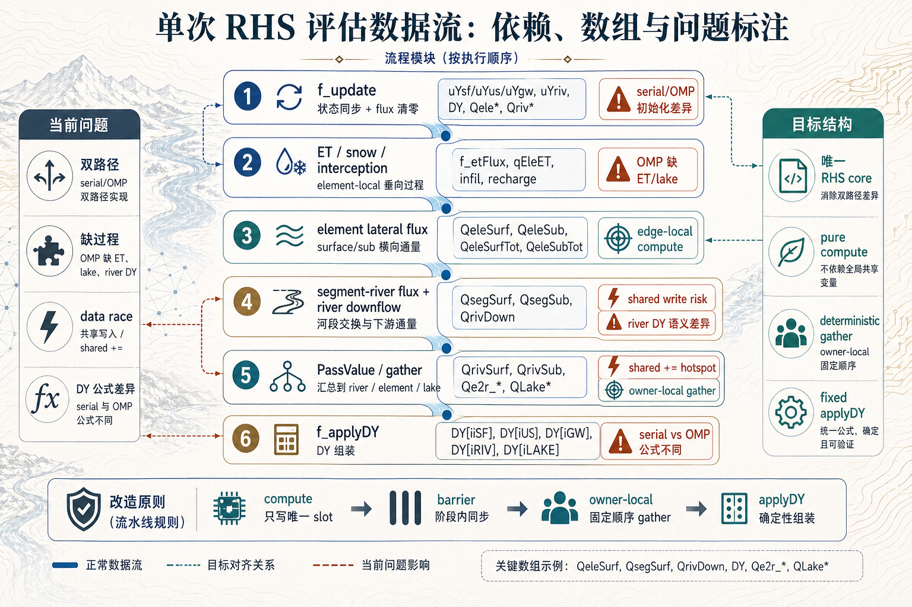
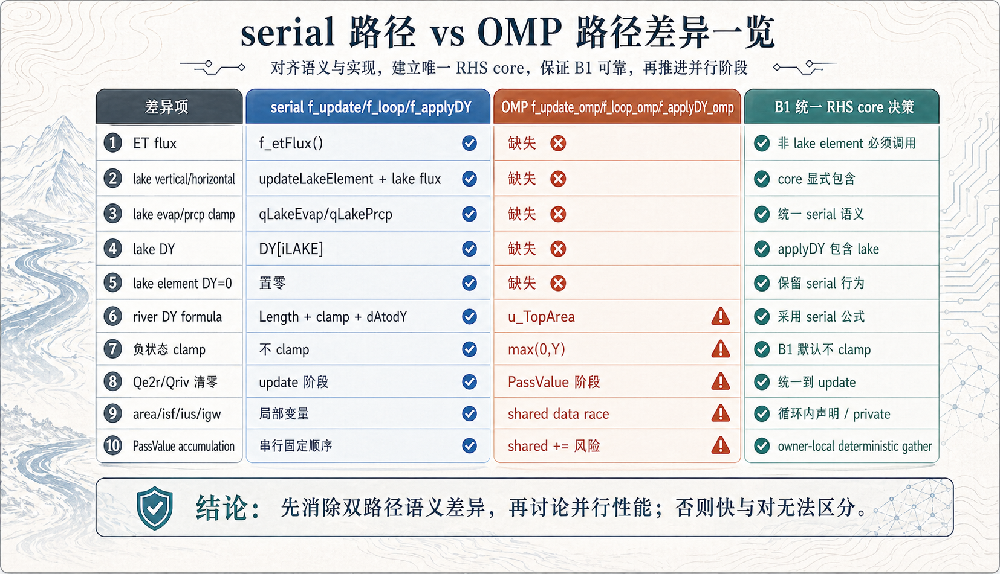
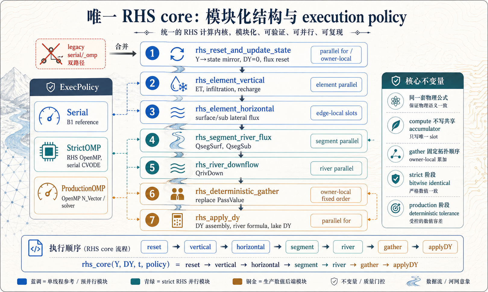
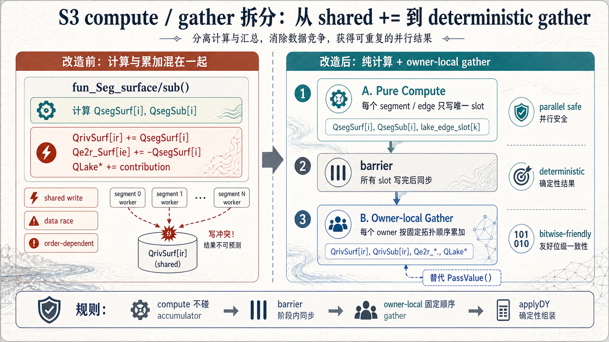
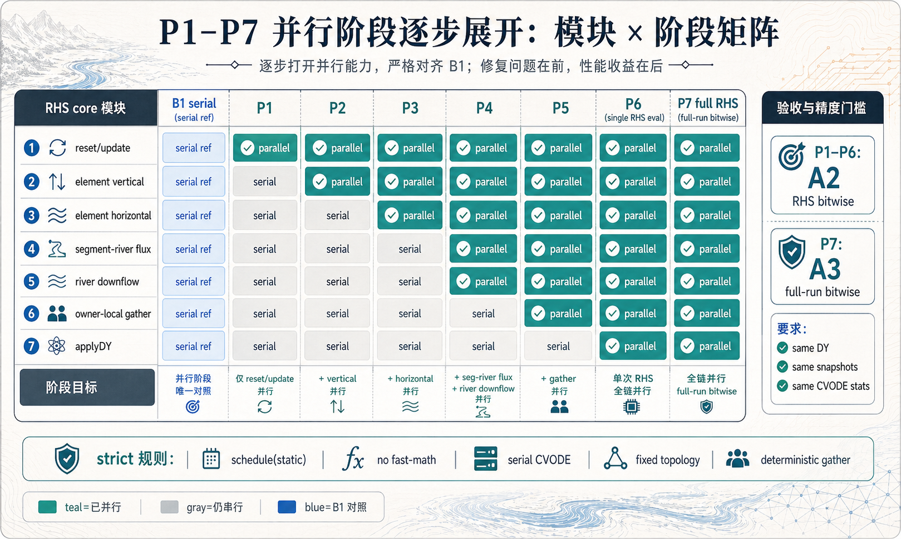

# SHUD OpenMP 并行改造总体实施方案（终版）

> **本文档替代**以下四份文档，是 SHUD 求解器加速的唯一权威实施路线：
>
> 1. `SHUD_solver_acceleration_roadmap.md`（2026-04-23，决策层）
> 2. `SHUD_single_thread_preoptimization_for_parallel.md`（2026-04-26，预优化层）
> 3. `SHUD_parallel_alignment_accuracy_plan.md`（2026-04-26，精度验收层）
> 4. `SHUD_parallel_complete_package/SHUD_parallel_full_plan.md`（2026-04-26，合并版）
>
> 版本：v1.1 | 日期：2026-04-27 | SHUD 源码子模块路径：`openMP/SHUD/`

---

## 0. 为什么做这件事，怎么做

### 0.1 为什么要并行改造

SHUD 是一个全耦合水文模型，核心求解由 SUNDIALS/CVODE 驱动。随着应用流域规模增大（数千到数万三角单元 + 河网 + 湖泊），单次模拟的 wall-clock 时间成为科研和参数校准的主要瓶颈。SHUD 已经依赖 CVODE 和 OpenMP 基础设施，具备并行加速的天然条件。

但当前的 OpenMP 实现不能直接用：源码中 serial 和 OMP 是**两套不同的 RHS 路径**——方程不同（river DY 公式）、过程覆盖不同（OMP 缺 ET/lake）、初始化行为不同（负状态 clamp）、甚至存在 data race（共享局部变量）。在这种基线上做加速，加出来的"快"和"对"无法区分。

因此，这次改造的核心目标很简单：**让 SHUD 跑得更快，同时确保结果可信。**

### 0.2 分三个大阶段做

整个改造分为三个大阶段，递进关系如下：



> **阶段一：预并行（S0–S6）** — 整理单线程代码，产出 B1（parallel-ready 参考结果）
> **阶段二：strict 并行（P1–P7）** — 逐步开 OpenMP，要求与 B1 bitwise identical
> **阶段三：production 并行（P8–P9）** — 放开 CVODE 内部并行，追求最大性能

### 0.3 每个阶段的验收标准

| 阶段 | 核心问题 | 验收标准 |
|---|---|---|
| 预并行（S0–S6） | 重构有没有改掉计算？ | B1 与 B0（原始单线程）bitwise identical；若有 bug fix 导致差异，必须逐项记录 |
| strict 并行（P1–P7） | 并行有没有改掉模型？ | P-strict 与 B1 bitwise identical：同一输入、同一线程数、同一结果，连 CVODE 内部步数都一致 |
| production 并行（P8–P9） | 性能优化有没有超出容差？ | P-prod 与 B1 差异在标定容差内；同配置可复现；水量守恒不恶化 |

### 0.4 为什么必须分阶段

不分阶段的后果是：当结果和原来不一样时，你分不清是**方程路径不一致**（该修的 bug）、**浮点加法顺序变了**（并行的必然代价）、**共享变量竞争**（并行的 bug）、还是**求解器行为变了**（CVODE 参数调整）。四种原因混在一起，既不能定位问题，也不能说服自己和别人结果是对的。



分阶段做，每个阶段只引入一类变化：
- S0–S6 只改代码结构，不改计算逻辑 → 差异 = 0，否则就是重构 bug
- P1–P7 只加 OpenMP 并行策略，不改方程 → 差异 = 0，否则就是并行 bug
- P8–P9 才放开数值后端 → 差异 ≠ 0 但可解释，否则就是容差设计问题

每一步都有明确的"门控"——不通过就不进入下一步。这不是保守，而是让每一步的结论可信。

---

## 1. 目标与核心原则

### 1.1 目标

**通过 OpenMP 并行化显著降低 SHUD 的 wall-clock 运行时间。**

约束条件：
- 串行与并行路径物理方程等价（同一套 RHS core）
- strict 阶段精度与单线程 base bitwise identical
- production 阶段精度在可解释的工程容差内，水量守恒不恶化

### 1.2 核心原则

| 编号 | 原则 | 含义 |
|---|---|---|
| C1 | 唯一 RHS core | `f_loop()` / `f_loop_omp()` 不再各自演化；OpenMP 只是 execution policy |
| C2 | compute 与 gather 分离 | 通量计算只写唯一 slot；汇总由 owner-local 固定顺序 gather 完成 |
| C3 | strict 阶段不改物理 | 不改 forcing 插值、不改容差、不改公式、不改求和算法 |
| C4 | CVODE 内部并行晚于 RHS 并行 | 先 RHS bitwise，再 CVODE vector/solver 并行 |
| C5 | 阶段门控 | 每阶段有 go/no-go checklist，不通过不进入下一阶段 |

---

## 2. 基线定义与精度等级

### 2.1 四层基线



| 基线 | 是什么 | 怎么来的 | 用途 |
|---|---|---|---|
| **B0** | 当前 SHUD 原样编译的单线程结果 | 不改任何代码，锁定编译环境后直接跑 | 历史参考；后续所有改动的对照起点 |
| **B1** | 重构后的单线程结果 | S0–S6 完成后：统一 RHS core、拆完 side-effect、固定拓扑顺序，仍以单线程运行 | **并行阶段的唯一对照**；长期回归标准 |
| **P-strict** | strict OpenMP 并行结果 | P1–P7：RHS 内部 OpenMP，CVODE 仍用 serial N_Vector | 目标：与 B1 **bitwise identical** |
| **P-prod** | production 并行结果 | P8–P9：CVODE OpenMP N_Vector、Krylov solver、tree reduction | 允许与 B1 有微小可解释差异；deterministic 可复现 |

**B0 与 B1 的核心区别**：B0 是当前代码的"原始快照"（serial/omp 双路径并存、side-effect 未拆、可能含已知 bug）；B1 是经过预并行重构后的"干净单线程"（唯一 RHS core、compute/gather 分离、拓扑固定）。两者都是单线程运行，但 B1 的代码结构已经为并行做好了准备。

**B1 vs B0 的精度关系**：理想目标 bitwise identical——说明重构只改了代码结构，没改计算逻辑。若 B1 修复了明确 bug（如 omp 路径的 river DY 公式与 serial 不一致），则 B1 可能与 B0 有差异，必须在 `B1_CHANGELOG.md` 中逐项记录差异来源、影响范围和验收指标。

### 2.2 六级精度等级（A0–A5）

| 等级 | 名称 | 定义 | 适用阶段 |
|---|---|---|---|
| **A0** | baseline repeatability | 单线程 base 多次运行 bitwise identical | S0 |
| **A1** | refactor equivalence | 重构后不开并行，与 B0 bitwise identical | S1–S6 |
| **A2** | RHS bitwise equivalence | 单次 RHS 评估中所有关键数组和 `DY` bitwise identical | P1–P6 |
| **A3** | full-run bitwise equivalence | 完整 CVODE run 输出与 B1 bitwise identical，CVODE stats 一致 | P7 |
| **A4** | deterministic tolerance | 并行结果重复运行一致，与 B1 差异在阈值内 | P8 |
| **A5** | physical acceptance | 水文指标、水量守恒和跨流域表现可接受 | P9 及生产评估 |

### 2.3 A4 容差阈值（待标定）

A4 阈值不能预设，必须在 P7 通过后、进入 P8 前，基于 B1 实际输出来标定。

**标定方法**：

1. 用 B1 benchmark 算例，记录各状态变量（surface/unsat/GW/river/lake）的量级范围和典型变化幅度
2. 在 P7 strict 阶段，记录不同编译器优化级别（`-O1` vs `-O2`）下的 bitwise 差异，作为"纯浮点噪声"的经验下界
3. 进入 P8 后，逐项对比 P-prod 与 B1 的差异分布（max/p95/p99），取合理倍数作为门槛
4. 水量守恒、NSE/KGE 等水文指标阈值参考 B1 自身在不同算例上的表现区间

**需要标定的指标清单**：

| 指标 | 标定依据 |
|---|---|
| 状态变量最大绝对差 | 按变量分组（surface/unsat/GW/river/lake），参考各自量级 |
| 水量平衡残差 | 参考 B1 自身残差水平 |
| ΔNSE / ΔKGE | 参考 B1 在多个算例上的基线值 |
| 峰值流量相对差 | 参考 B1 benchmark 算例的洪峰量级 |
| 径流总量相对差 | 参考 B1 多年累积量 |
| 同线程重复运行 | 必须 bitwise identical 或严格 deterministic（这条不需要标定） |

> 在 B1 锁定前，不写死任何具体数字。

---

## 3. 阶段路线图

### 3.1 完整路线图



### 3.2 简化版路线



---

## 4. 源码关键观察

以下观察基于 SHUD 子模块 `openMP/SHUD/src/` 中的实际源码，是本方案所有阶段划分的依据。





### 4.1 RHS 入口双路径分叉

**文件**：`src/Model/f.cpp` (L7–L26)

```cpp
#ifdef _OPENMP_ON
    Y = NV_DATA_OMP(CV_Y);
    DY = NV_DATA_OMP(CV_Ydot);
    MD->f_update_omp(Y, DY, t);    // ← OMP 路径
    MD->f_loop_omp(Y, DY, t);
    MD->f_applyDY_omp(DY, t);
#else
    Y = NV_DATA_S(CV_Y);
    DY = NV_DATA_S(CV_Ydot);
    MD->f_update(Y, DY, t);        // ← serial 路径
    MD->f_loop(t);
    MD->f_applyDY(DY, t);
#endif
```

**问题**：serial 与 OpenMP 是两套 RHS 实现，而非同一 kernel 的不同 execution policy。当并行结果与单线程不一致时，无法归因。

### 4.2 f_loop() 与 f_loop_omp() 过程覆盖差异

**serial `f_loop()`**（`src/ModelData/MD_f.cpp` L8–L49）包含：
- Lake element 分支：`updateLakeElement()` → `fun_Ele_lakeVertical()` → `qLakeEvap/qLakePrcp` 累加（L11–L16）
- 普通 element：`f_etFlux()` → `updateElement()` → `fun_Ele_Infiltraion()` → `fun_Ele_Recharge()`（L17–L24）
- Lake element horizontal：`fun_Ele_lakeHorizon()`（L27–L29）
- segment flux → river downflow → lake evap clamp → `PassValue()`

**OpenMP `f_loop_omp()`**（`src/ModelData/MD_f_omp.cpp` L69–L100）：
- **缺失** `f_etFlux()` 调用
- **缺失** lake element vertical/horizontal 处理
- **缺失** lake evaporation/precipitation clamp
- 直接进入 `updateElement()` → infiltration/recharge → surface/sub → segment → river → `PassValue()`

### 4.3 river DY 公式不一致

**serial `f_applyDY()`**（`src/ModelData/MD_f.cpp` L119–L141）：
```cpp
DY[iRIV] = (- QrivUp[i] - QrivSurf[i] - QrivSub[i] - QrivDown[i] + Riv[i].qBC) / Riv[i].Length;
if(DY[iRIV] < -1. * Riv[i].u_CSarea)
    DY[iRIV] = -1. * Riv[i].u_CSarea;
DY[iRIV] = fun_dAtodY(DY[iRIV], Riv[i].u_topWidth, Riv[i].bankslope);
```
先按 reach length 计算截面积变化 → 限制负向面积变化 → `fun_dAtodY()` 转换为水深变化。

**OpenMP `f_applyDY_omp()`**（`src/ModelData/MD_f_omp.cpp` L54–L65）：
```cpp
DY[iRIV] = (- QrivUp[i] - QrivSurf[i] - QrivSub[i] - QrivDown[i] + Riv[i].qBC) / Riv[i].u_TopArea;
```
直接除以 `u_TopArea`，**缺失**面积限制和 `fun_dAtodY()` 转换。这不是浮点顺序差异，而是方程本身不同。

### 4.4 f_update() 与 f_update_omp() 初始化差异

**serial `f_update()`**（`src/ModelData/MD_update.cpp` L60–L147）：
- 清零 `QeleSurf[i][j]`/`QeleSub[i][j]`/`QeleSurfTot`/`QeleSubTot`（L64–L69）
- 状态镜像 `uYsf/uYus/uYgw` **不做** `max(0, Y)` clamp（L70–L74）
- 清零 `QrivSurf/QrivSub/QrivUp`（L123–L127）
- 清零 `Qe2r_Surf/Qe2r_Sub`（L128–L131）
- **Lake 完整初始化**：`yLakeStg`/`lake.update()`/`y2LakeArea`/`QLakeSurf/Sub`/`qLakeEvap/Prcp`/`QLakeRivIn/Out`（L132–L143）
- 清零 `DY[0:NumY]`（L144–L146）

**OpenMP `f_update_omp()`**（`src/ModelData/MD_f_omp.cpp` L104–L170）：
- 状态镜像 `uYsf/uYus` **做了** `max(0, Y)` clamp（L116–L117）
- `uYgw` **做了** `max(0, Y)` clamp（L121）
- **缺失** lake 初始化
- **缺失** `QrivSurf/QrivSub/QrivUp` 清零
- **缺失** `Qe2r_Surf/Qe2r_Sub` 清零
- `QeleSurf/QeleSub` 清零被注释掉（L133–L135）

### 4.5 shared accumulator side-effect

共享写分两类：**被 `PassValue()` 覆盖的死代码**和**真正需要拆的共享写**。

#### 死代码（被 `PassValue()` 零化后重新累加，实际不影响结果）

**`fun_Seg_surface()`**（`src/ModelData/MD_RiverFlux.cpp` L100–L113）：
```cpp
QsegSurf[i] = WeirFlow_jtoi(...);
QrivSurf[iRiv]  +=  QsegSurf[i];   // ← 死��码：PassValue() L158-170 会清零并重新累加
Qe2r_Surf[iEle] += -QsegSurf[i];   // ← 死代码：PassValue() L163-172 会清零并重新累加
```

**`fun_Seg_sub()`**（L114–L126）同理。这些 `+=` 在 serial 和 OMP 路径中都是冗余的，因为 `PassValue()`（`MD_f.cpp` L156–L196）会先清零 `QrivSurf/QrivSub/QrivUp/Qe2r_Surf/Qe2r_Sub`（L158–L166），再从 `QsegSurf/QsegSub` 重新累加（L167–L174）。

#### 真正需要拆的共享写（不在 `PassValue()` 覆盖范围内）

**`Flux_RiverDown()`**（`MD_RiverFlux.cpp` L5–L63）中 toLake 分支：
```cpp
QLakeRivIn[Riv[i].toLake] += QrivDown[i];  // L24, 真正的共享写
```

**`fun_Ele_surface()`**（`MD_ElementFlux.cpp` L35–L97）中 lake neighbor 分支：
```cpp
QLakeSurf[ilake] += Q;  // L52, 真正的共享写
```

**`fun_Ele_sub()`**（L100–L156）中 lake neighbor 分支：
```cpp
QLakeSub[ilake] += Q;  // L121, 真正的共享写
```

**`PassValue()`**（`MD_f.cpp` L156–L196）��身是当前的 gather 实现：
- `QrivSurf[ir] += QsegSurf[i]`（L170）— 串行执行，无并行风险
- `Qe2r_Surf[ie] += -QsegSurf[i]`（L172）— 同上
- `QrivUp[iDownStrm] += -QrivDown[i]`（L177）— 同上

`PassValue()` 在串行中是安全���。并行改造时需将其重构为使用预构建 adjacency list 的 owner-local gather，但不需要从 `fun_Seg_*` "移入"累加逻辑——只需删掉 `fun_Seg_*` 里的死 `+=`。

### 4.6 `f_applyDY_omp` 局部变量 data race

**文件**：`src/ModelData/MD_f_omp.cpp` L9–L67

```cpp
void Model_Data::f_applyDY_omp(double *DY, double t){
    double area;                    // ← 声明在 parallel region 外
    int isf, ius, igw, i;          // ← isf/ius/igw 也在外面
#pragma omp parallel default(shared) private(i)  // 只有 i 是 private
    {
#pragma omp for
        for (i = 0; i < NumEle; i++) {
            isf = iSF; ius = iUS; igw = iGW;  // 多线程同时写同一个 isf/ius/igw
            area = Ele[i].area;                 // 多线程同时写同一个 area
```

`area`、`isf`、`ius`、`igw` 声明在 `#pragma omp parallel` 之外且 `default(shared)`，多线程同时写同一内存地址。这是 **data race（undefined behavior）**，不只是累加顺序问题。当前碰巧能跑是因为编译器可能将其优化进寄存器，但不可依赖。

**修复**：S1 统一 RHS core 时，将这些变量声明到 for 循环体内部，或显式标记为 `private`。

### 4.7 `PassValue()` 覆盖了 `fun_Seg_*` 的 side-effect

**`fun_Seg_surface()`**（`MD_RiverFlux.cpp` L107–L108）写 `QrivSurf[iRiv] += QsegSurf[i]` 和 `Qe2r_Surf[iEle] += -QsegSurf[i]`。但 **`PassValue()`**（`MD_f.cpp` L156–L196）在 `f_loop` 末尾会先把 `QrivSurf/QrivSub/QrivUp/Qe2r_Surf/Qe2r_Sub` **全部清零**（L158–L166），然后从 `QsegSurf/QsegSub` **重新累加**（L167–L174）。

这意味着 `fun_Seg_surface/sub` 里的 `+=` 是**死代码**——无论写什么值，`PassValue()` 都会覆盖。`fun_Seg_sub` 同理。

**真正需要拆的共享写**只有 `PassValue()` 外部的：
- `Flux_RiverDown()` L24：`QLakeRivIn[toLake] += QrivDown[i]`（不在 PassValue 覆盖范围）
- `fun_Ele_surface()` L52：`QLakeSurf[ilake] += Q`（不在 PassValue 覆盖范围）
- `fun_Ele_sub()` L121：`QLakeSub[ilake] += Q`（不在 PassValue 覆盖范围）

S3 的实际工作：**删掉 fun_Seg_surface/sub 里的死 `+=`**；对 lake 相关的共享写做 compute/gather 拆分；`PassValue()` 本身就是 gather，重构为使用预构建 adjacency list 的确定性版本。

### 4.8 `updateforcing()` 中孤立的 `#pragma omp for`

**文件**：`src/ModelData/MD_ET.cpp` L12–L14

```cpp
#ifdef _OPENMP_ON
#pragma omp for
#endif
    for (i = 0; i < NumForc; i++){
        tsd_weather[i].movePointer(t);
    }
```

此 `#pragma omp for` 没有外层 `#pragma omp parallel`。除非 `updateforcing()` 从某个 parallel region 内部被调用，否则这是孤立指令，运行时退化为串行。需在 S1 阶段确认其调用上下文并修正。

### 4.9 uncoupled 路径的 clamp 不一致

`f.cpp` L34–L125 定义了五个 uncoupled RHS 函数（`f_surf`、`f_unsat`、`f_gw`、`f_river`、`f_lake`），它们调用 `f_updatei()`（`MD_update.cpp` L3–L59）。`f_updatei()` 对所有状态变量统一做 `max(0, Y)` clamp：

```cpp
// MD_update.cpp L7
uYsf[i] = (Y[i] >= 0.) ? Y[i] : 0.;  // f_updatei case 1
// L11
uYus[i] = (Y[i] >= 0.) ? Y[i] : 0.;  // f_updatei case 2
// L17-19
uYgw[i] = (Y[i] >= 0.) ? Y[i] : 0.;  // f_updatei case 3
```

而 serial coupled 路径的 `f_update()`（`MD_update.cpp` L70–L74）不做 clamp：`uYsf[i] = Y[iSF]`。

这意味着 coupled 和 uncoupled 模式的负状态处理语义不同。当前方案以 coupled 路径为主线，uncoupled 暂不纳入并行改造，但需要记录这个差异，避免后续混淆。

### 4.10 全局变量裸指针

**文件**：`src/Model/shud.cpp` L18–L24 + `src/Model/Macros.hpp` L100–L108

```cpp
// shud.cpp L18-24: 定义
double *uYsf; double *uYus; double *uYgw; double *uYriv; double *uYlake;
double timeNow;

// Macros.hpp L100-108: extern 声明
extern double *uYsf; ... extern double timeNow;
```

`uYsf/uYus/uYgw/uYriv/uYlake/timeNow` 是全局变量，不是 `Model_Data` 成员。`iSF/iUS/iGW/iRIV/iLAKE` 宏（`Macros.hpp` L21–L25）展开后直接用 `NumEle/NumRiv`（`Model_Data` 成员）索引这些全局指针。当前 CVODE 单线程调 `f()` 所以安全，但如果未来有并发 RHS（如 Jacobian 并行差分估计），全局状态会冲突。S1 阶段应将这些收编到 `Model_Data` 内部。

### 4.11 `ET()` 孤立 `#pragma omp for` + 循环外局部变量 data race

**文件**：`src/ModelData/MD_ET.cpp` L106–L165

**问题 1 — 孤立 pragma**：与 §4.8 中 `updateforcing()` 同一个问题。`ET()` 从 `shud.cpp` L94 的主循环串行调用（`MD->ET(t, tnext)`），无外层 parallel region，`#pragma omp for` 是孤立指令。

**问题 2 — 循环外局部变量**：以下变量全部声明在 `for` 循环体**外部**（L107–L112）：

```cpp
double  T=NA_VALUE,  LAI=NA_VALUE, MF =NA_VALUE, prcp = NA_VALUE;  // L107
double  snFrac, snAcc, snMelt, snStg;                                // L108
double  icAcc, icEvap, icStg, icMax, vgFrac;                         // L109
double  DT_min = tnext - t;                                          // L110
double  ta_surf, ta_sub;                                              // L111
int i;                                                                // L112
```

如果未来将此循环包进 `#pragma omp parallel`，这些变量在 `default(shared)` 下全部共享 → **16 个标量同时被多线程读写 = data race**。仅删除孤立 pragma 不够，并行化时必须将 `T, LAI, MF, prcp, snFrac, snAcc, snMelt, snStg, icAcc, icEvap, icStg, icMax, vgFrac, ta_surf, ta_sub, i` 声明移入循环体内部或显式标记 `private`。`DT_min` 是循环不变量（只读），可保持共享。

### 4.12 `AccTemperature.getACC()` 除零风险

**文件**：`src/classes/AccTemperature.hpp` L60–L62

```cpp
double getACC(){
    return ACC / que.size();  // que.size() 初始为 0
}
```

`push(x, tnow)` 只在 `(tnow - Time_start) >= 1440` 时才实际入队。模拟前 1440 分钟内 `que` 为空，`getACC()` 除零 → NaN → 传播到 `fu_Surf[i]`/`fu_Sub[i]` → 影响入渗/补给。这是**现有 bug**（非并行引入），但 cryosphere 启用时会影响 B0 基线稳定性。S0 锁定 B0 时需确认 cryosphere 算例是否触发此问题。

### 4.13 当前代码已使用 OpenMP N_Vector

**文件**：`src/Model/shud.cpp` L58–L59

```cpp
#ifdef _OPENMP_ON
    udata = N_VNew_OpenMP(NY, MD->CS.num_threads, sunctx);
    du = N_VNew_OpenMP(NY, MD->CS.num_threads, sunctx);
```

方案 P8 将"引入 OpenMP N_Vector"列为 production 阶段任务，但**当前代码已经在用**。这意味着 CVODE 内部 norm/dot/reduction 在 OMP 模式下已经是多线程的。方案原则 C4"CVODE 内部并行晚于 RHS 并行"在当前代码中已被违反。P7 strict 阶段如果要用 serial N_Vector 做 bitwise 验证，需**显式改回** `N_VNew_Serial`。

### 4.14 `movePointer()` 非线程安全

**文件**：`src/classes/TimeSeriesData.cpp` L116–L136

`movePointer()` 修改 `iNow`、`iNext`，可能触发 `read_csv()`（重新打开文件）。多个 element 可能共享同一个 `tsd_weather[idx]`（`Ele[i].iForc` 相同），当前只在串行 loop 中调用（`MD_ET.cpp` L21–L24）。如果未来并行化 `tReadForcing`，共享同一 forcing 对象的多个 element 会冲突。S5 forcing 改造时必须处理。

### 4.15 `f_etFlux()` 中 `printf` 警告在并行中不安全

**文件**：`src/ModelData/MD_ET.cpp` L215–L216

```cpp
if(qEleETA[i] > qEleETP[i] * 2.){
    printf("Warning: More AET(%.3E) than PET(%.3E) on Element (%d).", ...);
}
```

P2 并行化 element vertical 时，多线程 `printf` 会交错输出。不影响数值但产生乱码日志。应改为写 diagnostic buffer，RHS 后串行输出。

### 4.16 forcing I/O 模式

**`TimeSeriesData::read_csv()`**（`src/classes/TimeSeriesData.cpp` L45–L89）：
- 每次 refill 重新打开文件（L48）
- 跳过 `MAXQUE * nQue + 2` 行（L57–L60）
- 读入下一段 queue

**`getX()`**（L102–L105）直接返回 `ts[iNow][col]`，zero-order hold，不做插值。

### 4.17 求解控制参数

**`Model_Control.hpp`**（`src/classes/Model_Control.hpp` L104–L108）：
```cpp
double abstol = 1.0e-4;
double reltol = 1.0e-3;
double InitStep = 1.e-2;
double MaxStep = 30;
double SolverStep = 2;
```
均为标量，未提供 vector absolute tolerance。

### 4.18 `fun_Ele_sub()` lake 分支 `Ele[inabr].u_effKH` 越界/语义风险

**`fun_Ele_sub()`**（`MD_ElementFlux.cpp` L100–L156）中，lake 分支（`ilake >= 0`）在 L117 计算导水率：

```cpp
inabr = Ele[i].nabr[j] - 1;          // L105
ilake = Ele[i].lakenabr[j] - 1;      // L106
if(ilake >= 0){                        // L107 — 进入 lake 分支
    // ...
    Kmean = 0.5 * (Ele[i].u_effKH + Ele[inabr].u_effKH);  // L117 — 使用 inabr
```

**越界风险**：lake 分支入口仅检查 `ilake >= 0`，未检查 `inabr >= 0`。若 `nabr[j] == 0`（无邻居），则 `inabr == -1`，`Ele[-1].u_effKH` 越界。

**数据流保护**：`lakenabr[j]` 的唯一赋值点在 `MD_Lake.cpp` L133–L144，赋值前已检查 `inabr >= 0` 且 `Ele[inabr].iLake > 0`。因此当前数据流下 `lakenabr[j] > 0` 蕴含 `nabr[j] > 0`——但这是**隐含保证**，代码中无显式 assert。

**物理语义疑问**：`Ele[inabr]` 是 lake element，其 `u_effKH`（有效水平导水率）是否有物理意义？Lake element 本质上是水体而非土壤，若其土壤属性未专门赋值，则 Kmean 计算结果可能不可靠。

**对比**：`fun_Ele_surface()` L46–L52 的 lake 分支使用堰流公式（`WeirFlow_jtoi`），不依赖 `Ele[inabr]` 任何属性，无此问题。

### 4.19 `N_VDestroy_Serial` 与 `N_VNew_OpenMP` 类型不匹配

**文件**：`src/Model/shud.cpp` L58–L59, L111–L112

```cpp
// 创建（_OPENMP_ON 分支）
udata = N_VNew_OpenMP(NY, MD->CS.num_threads, sunctx);  // L58
du = N_VNew_OpenMP(NY, MD->CS.num_threads, sunctx);      // L59

// 销毁（无条件）
N_VDestroy_Serial(udata);  // L111
N_VDestroy_Serial(du);      // L112
```

`N_VNew_OpenMP` 创建的向量内部结构与 `N_VNew_Serial` 不同（额外存储线程数等元数据）。用 `N_VDestroy_Serial` 释放 OpenMP 向量是**类型不匹配**，可能导致内存泄漏或 undefined behavior。

**修复**：使用 generic `N_VDestroy()`（SUNDIALS 提供的类型无关销毁函数），自动根据向量的实际类型调用正确的释放逻辑。这在 strict 阶段（改回 Serial）暂时安全，但 P8a 重新启用 OpenMP N_Vector 前**必须修正**。

### 4.20 `updateElement()` 在 `updateforcing()` 和 `f_loop()` 中被重复调用

**调用链**：

1. `updateforcing()` → `MD_ET.cpp` L22：`Ele[i].updateElement(uYsf[i], uYus[i], uYgw[i])`
2. `f_loop()` → `MD_f.cpp` L21（非 lake element）：`Ele[i].updateElement(uYsf[i], uYus[i], uYgw[i])`

**分析**：`updateElement()`（`Element.cpp` L257–L294）是幂等函数——纯粹根据 `(Ysurf, Yunsat, Ygw)` 计算 `u_effKH, u_deficit, u_satn, u_theta, u_satKr, u_phius, u_effkInfi`。两次调用之间 `uYsf/uYus/uYgw` 未被修改（`ET()` 不改这些值），因此第二次调用**输入相同、输出相同**——是冗余计算。

**并行化影响**：
- 冗余调用本身不影响正确性（幂等保证）
- 但 `updateElement()` 修改 `Ele[i]` 的多个成员字段（写操作），在并行化时若 P2（element vertical）和其他并行阶段的边界不清晰，可能造成混淆
- `updateforcing()` 中的调用在 ET 之前，`f_loop()` 中的调用在 infiltration 之前——如果未来重构将 ET 和 infiltration 拆到不同并行区间，需明确 `updateElement()` 的唯一调用点

**原则**：S1b 抽取 `f_loop()` 时保持双重调用不变（纯搬运）；S2 或 S3 阶段审查后决定是否消除冗余——消除时需确认 ET 不依赖 `updateElement()` 的输出（或在 ET 之前已有等效调用）。

---

## 5. 预并行阶段（S0–S6）

### S0：锁定 B0 历史基线

**目标**：在任何代码改造前，锁定当前单线程 SHUD 的行为和性能画像。

**具体任务**：

| # | 任务 | 涉及文件 | 说明 |
|---|---|---|---|
| S0.1 | 固定编译环境 | `CMakeLists.txt` / Makefile | 固定编译器/版本、`-O2`、禁止 `-ffast-math`、固定 SUNDIALS 版本 |
| S0.2 | 选定并注册 benchmark 算例 | `benchmarks/` 目录 | ���少 5 类算例（见下方 benchmark 规范），每个算例产出 `manifest.yaml` |
| S0.3 | ��录完整输出 | `benchmarks/<case>/B0_output/` | 所有 model output 文件归档到对应算例目录 |
| S0.4 | 记录 CVODE stats | `src/Model/shud.cpp` | `nFCall`、内部步数、error test failure、linear solver stats |
| S0.5 | 记录 RHS 中间量 | `src/ModelData/MD_f.cpp` | 在 `f_loop()` / `f_applyDY()` 关键点 dump flux 和 DY 数�� |
| S0.6 | 记录 wall-clock / I/O 分项 | — | 总时间、每次 RHS 时间、forcing I/O 时间、输出时间、peak memory |

#### S0.2 Benchmark 规范

每个算例以 `benchmarks/<case>/manifest.yaml` 描述，格式如下：

```yaml
# benchmarks/<case>/manifest.yaml
project_name: "small_no_lake"
description: "小流域无 lake，基础回归测试"

# --- 流域规模 ---
NumEle: 500
NumRiv: 120
NumLake: 0
NumY: 1620          # = 3*NumEle + NumRiv + NumLake

# --- 输入 ---
input_dir: "/data/shud_benchmarks/small_no_lake/input/"
forcing_duration_days: 365
has_cryosphere: false
has_lake: false
has_BC_SS: false
dry_wet_transition: false

# --- 运行 ---
run_command: "./shud small_no_lake.para"
threads: [1]                    # S0–S6 只用单线程；P1+ 扩展为 [1, 2, 4, 8]
expected_walltime_sec: 120      # 单线程预期运行时间（量级参考）

# --- RHS snapshot probe ---
snapshot_probe:
  t_values: [86400, 864000, 8640000]   # 模拟时间点（秒），覆盖 1d / 10d / 100d
  Y_source: "cvode_state"              # snapshot 从 CVODE Y vector 提取
  arrays_to_dump:                      # 需对比的中间量
    - "DY"
    - "QeleSurf"
    - "QeleSub"
    - "QrivSurf"
    - "QrivSub"
    - "flux_ET"

# --- 输出比较 ---
output_compare:
  full_run_regression: true             # 是否纳入 full-run regression
  output_files:                         # 需 bitwise 对比的输出文件列表
    - "output/ele_surf.dat"
    - "output/ele_unsat.dat"
    - "output/ele_gw.dat"
    - "output/riv_stage.dat"
    - "output/lake_stage.dat"           # 仅 has_lake=true 时存在
  cvode_stats_file: "output/cvode_stats.txt"
  water_balance_file: "output/water_balance.txt"
```

**必需的 5 ���算例**：

| 算例 ID | 类型 | 关键特征 | NumY 量级 |
|---|---|---|---|
| `small_no_lake` | 小流域无 lake | 基础回归，最快反馈 | < 5,000 |
| `small_with_lake` | 小流域有 lake | 覆盖 lake vertical/horizontal/DY 路径 | < 5,000 |
| `medium_river` | 中等流域含 river network | 测试 segment/river/PassValue 拓扑 | 5,000 – 50,000 |
| `bc_ss_case` | 含 BC/SS 边界条件 | 覆盖 boundary condition 更新路径 | 视情况 |
| `dry_wet` | dry/wet transition | 覆盖极端状态（Y≈0）和负值处��� | 视情况 |

**可选扩展算例**（用于 P8a 规模评估）：

| 算例 ID | 类型 | 关键特征 | NumY 量级 |
|---|---|---|---|
| `large_basin` | 大流域 | P8a NumY 门槛评估 | > 100,000 |
| `cryosphere` | 冻融过程 | 覆盖 `AccTemperature` 路径和 §4.12 除零风险 | 视情况 |

**验收标准（A0）**：

- [ ] 所有 benchmark 算例的 `manifest.yaml` 已填写且字段完整
- [ ] 同一 binary、��一输入、3 次单线程运行 bitwise identical（对每��算例）
- [ ] CVODE stats 完全一致（���每个算例）
- [ ] 性能报告可重复
- [ ] RHS snapshot probe 在指定 `t_values` 处可提取且三次运行 identical

**Go/No-Go → S1**：任何 benchmark 算例 B0 自身不可复现，不进入 S1。

**风险**：算例过少导致基线代表性���足；只看总时间不看 RHS/I/O/CVODE 分项会误判瓶颈；算例数据包路径若为绝对路径则不可移植。

---

### S1：逐函数抽取 serial RHS core

> **设计原则**：每个子阶段只动一个函数，其余函数仍走原 legacy 路径。每一步完成后立即做 bitwise 验证，确保抽取本身没有改变计算。**不在此阶段合并 serial 与 \_omp 实现**——\_omp 路径暂时保持原样不动，serial/omp 语义差异的对齐留给 S2。

**目标**：把 serial 路径的 `f_update()`、`f_loop()`、`f_applyDY()` 逐个抽取到新的 RHS core 框架中，形成可替换的 serial core wrapper。

#### S1a：脚手架 + 抽取 `f_update()`

| #     | 任务                                     | 涉及文件                                            | 说明                                                                                                      |
| ----- | -------------------------------------- | ----------------------------------------------- | ------------------------------------------------------------------------------------------------------- |
| S1a.1 | 新建 `rhs_core()` 调用骨架                   | 新建 `MD_rhs_core.cpp`，修改 `f.cpp` L7–L26         | `f()` 内引入 `#ifdef USE_RHS_CORE` 分支，调用 `rhs_core()`；默认关闭，legacy 路径不变                                      |
| S1a.2 | 抽取 serial `f_update()` → `rhs_update()` | `MD_update.cpp` L60–L147 → `MD_rhs_core.cpp`   | **纯搬运**：逻辑、变量名、调用顺序与 serial `f_update()` 100% 一致；`rhs_core()` 中调用 `rhs_update()`，其余步骤仍 fallback 调原函数 |
| S1a.3 | A/B 验证                                  | —                                               | `USE_RHS_CORE` 开启，仅 `rhs_update()` 走新路径，其余走 legacy；与 B0 **bitwise identical**                             |

**验收门控**：
- [ ] `rhs_update()` 路径 vs legacy `f_update()`：单次 RHS 评估 DY snapshot bitwise identical
- [ ] 完整 run 与 B0 bitwise identical

**Go/No-Go → S1b**：S1a 未通过 bitwise 不进入 S1b。

---

#### S1b：抽取 `f_loop()`

| #     | 任务                                   | 涉及文件                                    | 说明                                                                                                              |
| ----- | -------------------------------------- | ------------------------------------------- | ----------------------------------------------------------------------------------------------------------------- |
| S1b.1 | 抽取 serial `f_loop()` → `rhs_flux()`    | `MD_f.cpp` L8–L49 → `MD_rhs_core.cpp`      | **纯搬运**：lake/ET/element/segment/river/PassValue 过程顺序严格保持；`rhs_core()` 中 `rhs_update()` 后调用 `rhs_flux()` |
| S1b.2 | A/B 验证                                  | —                                           | `rhs_update()` + `rhs_flux()` 走新路径，`applyDY` 仍走 legacy；与 B0 **bitwise identical**                               |

**验收门控**：
- [ ] `rhs_flux()` 中间 flux 数组与 legacy `f_loop()` bitwise identical
- [ ] 完整 run 与 B0 bitwise identical

**Go/No-Go → S1c**：S1b 未通过 bitwise 不进入 S1c。

---

#### S1c：抽取 `f_applyDY()`

| #     | 任务                                      | 涉及文件                                      | 说明                                                                                       |
| ----- | ----------------------------------------- | --------------------------------------------- | ------------------------------------------------------------------------------------------ |
| S1c.1 | 抽取 serial `f_applyDY()` → `rhs_apply()`  | `MD_f.cpp` L51–L154 → `MD_rhs_core.cpp`      | **纯搬运**：river DY 使用 serial 公式（含 length、area clamp、`fun_dAtodY()`）；`rhs_core()` 全部三步均走新路径 |
| S1c.2 | A/B 验证                                    | —                                             | 完整 `rhs_core()` 全 serial 路径与 legacy 路径 bitwise identical                                  |

**验收门控**：
- [ ] 完整 `rhs_core()` serial 路径 vs legacy：单次 RHS 评估 DY bitwise identical
- [ ] 完整 run 与 B0 bitwise identical
- [ ] CVODE stats 与 B0 identical
- [ ] `nFCall` 一致

**Go/No-Go → S1d**：S1c 未通过 bitwise 不进入 S1d。

---

#### S1d：引入 ExecPolicy 枚举 + legacy 切换

| #     | 任务                          | 涉及文件                            | 说明                                                                                                                                            |
| ----- | ----------------------------- | ----------------------------------- | ----------------------------------------------------------------------------------------------------------------------------------------------- |
| S1d.1 | 引入 `ExecPolicy` 枚举           | `MD_rhs_core.cpp`，`f.cpp`          | 定义 `Serial / StrictOMP / ProductionOMP`；`rhs_core()` 接收 policy 参数但 **S1 阶段只实现 Serial 分支**，OMP 分支留空 stub                                        |
| S1d.2 | 删除 `#ifdef USE_RHS_CORE` 脚手架 | `f.cpp`                            | `f()` 默认走 `rhs_core(policy=Serial)`；legacy 路径通过编译宏 `LEGACY_RHS` 保留供 A/B 对比                                                                     |
| S1d.3 | 最终 A/B 验证                    | —                                   | `policy=Serial` 完整 run 与 B0 bitwise identical；`LEGACY_RHS` 编译同样 bitwise                                                                        |

**验收门控**：
- [ ] `policy=Serial` 下完整 run 与 B0 bitwise identical
- [ ] `LEGACY_RHS` 编译下完整 run 与 B0 bitwise identical
- [ ] CVODE stats 一致，`nFCall` 一致

**Go/No-Go → S2**：S1d 不通过 bitwise 不进入 S2。`_omp` 路径此时仍未合并，留待 S2 语义对齐后处理。



**S1 完成后 RHS core 结构**（仅 Serial 分支有实现）：

```cpp
void rhs_core(double* Y, double* DY, double t, ExecPolicy policy) {
    rhs_update(Y, DY, t, policy);          // S1a 抽取，serial 语义
    rhs_flux(t, policy);                   // S1b 抽取，保持完整过程顺序
    rhs_apply(DY, t, policy);              // S1c 抽取，serial 公式
}
```

> 注意：S1 的 `rhs_flux()` 内部保持 `f_loop()` 的原始粒度（lake → ET → element → segment → river → PassValue），**不做子函数拆分**（如 `rhs_element_vertical` / `rhs_element_horizontal` 等）。过程子函数的拆分属于 S3 或更晚阶段的可选重构，S1 的唯一目标是"搬运不变、逐步验证"。

**风险**：
- 抽取过程中遗漏隐含的全局状态依赖（`uYsf/uYus/uYgw` 等全局变量、`timeNow` 赋值位置）
- `PassValue()` 在 `f_loop()` 内部的位置如果搬运不精确会破坏 flux 累加逻辑
- 每个子阶段的 fallback 混合调用（新路径函数 + legacy 函数）需确保全局状态一致

---

### S2：语义对齐 + 合并 \_omp 路径

**目标**：在 S1 已验证的 serial RHS core 基础上，逐项对比 `_omp` 路径的语义差异，选择正确语义合并进 core，**最终删除 `f_update_omp()` / `f_loop_omp()` / `f_applyDY_omp()` 三个独立函数**。合并完成后，`rhs_core(policy=Serial)` 仍与 B0 bitwise identical。

> **前置状态**：S1 结束时 `_omp` 三个函数仍存在且未修改。S2 的工作是将 `_omp` 中"正确但 serial 缺失"的逻辑（如有）补入 core，而非把 `_omp` 的所有行为照搬。每个 S2.x 子项完成后均需 bitwise 验证。

**具体任务**：

**S2.1 — lake vertical**
- **差异**：serial 有 `updateLakeElement()` + `fun_Ele_lakeVertical()`；OMP 缺失
- **原则**：core 必须显式包含
- **文件**：`MD_f.cpp` L11–L16, `MD_ElementFlux.cpp` L2–L17

**S2.2 — lake horizontal**
- **差异**：serial 有 `fun_Ele_lakeHorizon()`；OMP 缺失
- **原则**：core 必须包含
- **文件**：`MD_f.cpp` L28–L29, `MD_ElementFlux.cpp` L18–L23

**S2.3 — ET flux**
- **差异**：serial 普通 element 调 `f_etFlux()`；OMP 缺失
- **原则**：core 在非 lake element 上调 `f_etFlux()`
- **文件**：`MD_ET.cpp` L167–L228

**S2.4 — river DY 公式**
- **差异**：serial：length + area clamp + `fun_dAtodY()`；OMP：直接除 `u_TopArea`
- **原则**：采用 serial 公式
- **文件**：`MD_f.cpp` L119–L141 vs `MD_f_omp.cpp` L54–L65

**S2.5 — lake DY**
- **差异**：serial 有完整 lake DY；OMP 缺失
- **原则**：core 必须包含
- **文件**：`MD_f.cpp` L142–L153

**S2.6 — 负状态 clamp**
- **差异**：serial 不做 `max(0,Y)` → `uYsf = Y[iSF]`；OMP 做 `(Y[iSF] >= 0) ? Y[iSF] : 0`
- **原则**：统一为 serial 语义（不 clamp），除非另立数值变更
- **文件**：`MD_update.cpp` L70–L74 vs `MD_f_omp.cpp` L116–L117

**S2.7 — lake 初始化**
- **差异**：serial 清零所有 lake flux；OMP 缺失
- **原则**：core 完整 reset
- **文件**：`MD_update.cpp` L132–L143

**S2.8 — Qe2r/QrivSurf/Sub 清零**
- **差异**：serial 在 `f_update()` 中清零；OMP 在 `PassValue()` 中清零
- **原则**：统一到 update 阶段
- **文件**：`MD_update.cpp` L123–L131 vs `MD_f.cpp` L157–L165

**S2.9 — `f_applyDY_omp` data race**
- **差异**：`area/isf/ius/igw` 声明在 parallel region 外且 `default(shared)`
- **原则**：声明到 for 循环内部或标记 `private`
- **文件**：`MD_f_omp.cpp` L10–L16（见 §4.6）

**S2.10 — `updateforcing()` 孤立 `omp for`**
- **差异**：`#pragma omp for` 无外层 parallel region
- **原则**：确认调用上下文；若孤立则移除或包裹 parallel
- **文件**：`MD_ET.cpp` L12–L14（见 §4.8）

**S2.11 — lake element DY=0**
- **差异**：serial 对 lake element 置零 `DY[i]/DY[ius]/DY[igw]`；OMP 缺失
- **原则**：core 必须包含
- **文件**：`MD_f.cpp` L108–L112

**S2.12 — uncoupled 路径 clamp**
- **差异**：`f_updatei()` 统一做 `max(0,Y)` clamp；coupled `f_update()` 不 clamp
- **原则**：记录差异；当前方案以 coupled 路径为主线，uncoupled 暂不纳入并行改造
- **文件**：`MD_update.cpp` L3–L59 vs L60–L147（见 §4.9）

**S2.13 — 全局变量裸指针**
- **差异**：`uYsf/uYus/uYgw/uYriv/uYlake/timeNow` 是全局变量，非 `Model_Data` 成员
- **原则**：S2 收编到 `Model_Data` 内部；iSF/iUS/iGW 宏同步修改
- **文件**：`shud.cpp` L18–L24, `Macros.hpp` L21–L25, L100–L108（见 §4.10）

**S2.14 — `ET()` 孤立 `omp for` + 循环外局部变量 data race**
- **问题 1**：孤立 `#pragma omp for`，与 `updateforcing()` 同一问题
- **问题 2**：`T, LAI, MF, prcp, snFrac, snAcc, snMelt, snStg, icAcc, icEvap, icStg, icMax, vgFrac, ta_surf, ta_sub, i` 共 16 个标量声明在循环外（L107–L112），并行化时 `default(shared)` 导致 data race
- **原则**：移除孤立 pragma；将所有 element-local scalar 移入 `for` 循环体内部（或显式 `private`）；`DT_min` 为循环不变量可保持共享
- **文件**：`MD_ET.cpp` L106–L165（见 §4.11）

**S2.15 — `AccTemperature.getACC()` 除零**
- **差异**：`que.size()==0` 时除零 → NaN
- **原则**：加 guard：`que.empty() ? 0.0 : ACC/que.size()`；若修改则记入 `B1_CHANGELOG.md`
- **文件**：`AccTemperature.hpp` L60–L62（见 §4.12）

**S2.16 — 当前已使用 OpenMP N_Vector**
- **差异**：`shud.cpp` L58–59 已用 `N_VNew_OpenMP`
- **原则**：P7 strict 阶段需显式改回 `N_VNew_Serial`
- **文件**：`shud.cpp` L58–L59（见 §4.13）

**S2.17 — `fun_Ele_sub()` lake 分支 `Ele[inabr].u_effKH` 越界/语义风险**（⚠️ blocker）
- **问题**：`MD_ElementFlux.cpp` L107–L121，lake 分支进入条件是 `ilake >= 0`，但 L117 计算 `Kmean` 时使用了 `Ele[inabr].u_effKH`（`inabr = Ele[i].nabr[j] - 1`），**未检查 `inabr >= 0`**
- **数据流分析**：`lakenabr[j]` 仅在 `MD_Lake.cpp` L133–L144 赋值，赋值前已检查 `inabr >= 0` 且 `Ele[inabr].iLake > 0`，所以**当前数据流下 `inabr` 在 lake 分支中一定合法**。但这是隐含依赖，不是显式保证
- **物理语义疑问**：lake 边的地下水导水率取 `0.5 * (Ele[i].u_effKH + Ele[inabr].u_effKH)`，其中 `Ele[inabr]` 是 lake element。Lake element 的 `u_effKH` 是否有物理意义？如果 lake element 的土壤属性未赋值或无意义，则 Kmean 计算结果不可靠
- **对比**：`fun_Ele_surface()` 的 lake 分支（L46–L52）使用堰流公式，不依赖 `inabr`，无此问题
- **原则**：
  1. 在 `fun_Ele_sub()` lake 分支入口加 `assert(inabr >= 0)` 防御性检查
  2. 审查 lake element 的 `u_effKH` 赋值来源，确认其物理意义
  3. 若 lake element 的 `u_effKH` 无意义，应改为仅用 `Ele[i].u_effKH`（bank element 自身导水率）或引入 lake-bed 导水率参数
  4. 若修改公式则属于**物理语义变更**，必须记入 `B1_CHANGELOG.md`
- **文件**：`MD_ElementFlux.cpp` L100–L156（`fun_Ele_sub()`），`MD_Lake.cpp` L133–L144（`lakenabr` 赋值）

**验收标准（A1）**：

- [ ] 纯继承 serial 语义时，与 B0 bitwise identical
- [ ] 若修复明确 bug，需在 `B1_CHANGELOG.md` 单独记录，不混入并行对齐

**Go/No-Go → S3**：语义 diff report 未完成，不进入 S3。

**风险**：最容易把"并行对齐"误做成"物理修正"。规则：**凡会改变 B0 serial 输出的修复，必须单独立项**。

---

### S3：拆分 flux compute 与 deterministic gather

**目标**：消除所有并行不安全的共享写，形成"纯计算 + owner-local gather"结构。



**具体任务**分两类：

#### S3a：删除死代码（被 `PassValue()` 覆盖，见 §4.7）

| # | 死代码 | 源文件/行号 | 改造方向 |
|---|---|---|---|
| S3a.1 | `QrivSurf[iRiv] += QsegSurf[i]` | `MD_RiverFlux.cpp` L107 | 直接删除，`PassValue()` 已从 `QsegSurf` 重新累加 |
| S3a.2 | `Qe2r_Surf[iEle] += -QsegSurf[i]` | `MD_RiverFlux.cpp` L108 | 同上 |
| S3a.3 | `QrivSub[iRiv] += QsegSub[i]` | `MD_RiverFlux.cpp` L121 | 同上 |
| S3a.4 | `Qe2r_Sub[iEle] += -QsegSub[i]` | `MD_RiverFlux.cpp` L122 | 同上 |

删除后 `fun_Seg_surface/sub` 变成纯函数：只写 `QsegSurf[i]` / `QsegSub[i]`，不碰任何 accumulator。

#### S3b：拆分真正的共享写（不在 `PassValue()` 覆盖范围内）

| # | 当前共享写 | 源文件/行号 | 改造方向 |
|---|---|---|---|
| S3b.1 | `QLakeRivIn[toLake] += QrivDown[i]` | `MD_RiverFlux.cpp` L24 | `Flux_RiverDown()` 只写 `QrivDown[i]`；lake 汇总移到 gather |
| S3b.2 | `QLakeSurf[ilake] += Q` | `MD_ElementFlux.cpp` L52 | `fun_Ele_surface()` lake 分支写 per-edge slot；gather 汇总 |
| S3b.3 | `QLakeSub[ilake] += Q` | `MD_ElementFlux.cpp` L121 | `fun_Ele_sub()` lake 分支写 per-edge slot；gather 汇总 |
| S3b.4 | `qLakeEvap[..] += ...` / `qLakePrcp[..] += ...` | `MD_f.cpp` L15–L16 | 写 per-element contribution slot；gather 汇总 |

#### S3c：重构 `PassValue()` 为确定性 gather

| # | 当前实现 | 源文件/行号 | 改造方向 |
|---|---|---|---|
| S3c.1 | `QrivSurf[ir] += QsegSurf[i]` 等 segment→river/element 累加 | `MD_f.cpp` L167–L174 | 使用预构建 adjacency list，固定顺序累加 |
| S3c.2 | `QrivUp[iDownStrm] += -QrivDown[i]` | `MD_f.cpp` L177 | 移到 downstream river owner gather |
| S3c.3 | `PassValue()` 整体 | `MD_f.cpp` L156–L196 | 替换为 `rhs_deterministic_gather()`，合并 S3b 的 lake gather |

**gather 推荐模式**（以 segment→river 为例）：

```cpp
// Step 1: Pure compute (可并行)
for (int iseg = 0; iseg < NumSegmt; ++iseg) {
    QsegSurf[iseg] = compute_seg_surface(RivSeg[iseg].iEle-1, RivSeg[iseg].iRiv-1, iseg);
    QsegSub[iseg]  = compute_seg_sub(RivSeg[iseg].iEle-1, RivSeg[iseg].iRiv-1, iseg);
}

// Step 2: Owner-local gather (可并行，每个 river 由唯一线程负责)
for (int ir = 0; ir < NumRiv; ++ir) {
    double surf = 0.0, sub = 0.0;
    for (int k = 0; k < seg_by_riv[ir].size(); ++k) {
        int iseg = seg_by_riv[ir][k]; // 固定 segment id 升序
        surf += QsegSurf[iseg];
        sub  += QsegSub[iseg];
    }
    QrivSurf[ir] = surf;
    QrivSub[ir]  = sub;
}
```

**验收标准（A1）**：

- [ ] 若 gather 顺序与 B0 循环顺序一致：RHS bitwise identical
- [ ] 若顺序改变：先锁定为 B1 新参考，记录差异
- [ ] 水量平衡误差不变

**Go/No-Go → S4**：存在任何共享 `+=`，不进入并行阶段。

---

### S4：固定拓扑顺序与 owner 映射

**目标**：构建并固定排序的 adjacency list，让所有 gather 有确定的 owner 和确定的贡献顺序。

**具体任务**：

| # | 邻接表 | 用途 | 排序规则 |
|---|---|---|---|
| S4.1 | `seg_by_riv[ir]` | river 汇总 segment surface/sub flux | segment id 升序，匹配 B0 loop |
| S4.2 | `seg_by_ele[ie]` | element 汇总 segment 交换 flux | segment id 升序，匹配 B0 loop |
| S4.3 | `upstream_by_down[ir]` | downstream river 汇总 upstream downflow | upstream river id 升序 |
| S4.4 | `riv_in_by_lake[ilake]` | lake 汇总 river 入流 | river id 升序 |
| S4.5 | `ele_by_lake[ilake]` | lake 汇总 element evap/precip | element id 升序 |
| S4.6 | `lake_bank_edge_by_lake[ilake]` | lake 汇总岸边 element flux | element id + edge id 升序 |
| S4.7 | `edge_by_ele[ie]` | element 汇总三邻边 flux | 固定 `j=0..2` |

**数据来源**：`RivSeg[i].iEle` / `RivSeg[i].iRiv`（`Model_Data.hpp` L187）、`Riv[i].down`（`River.hpp`）、`Ele[i].iLake`（`Element.hpp`）、`Ele[i].nabr[j]`/`Ele[i].lakenabr[j]`（`Element.hpp`）。

**验收标准（A1）**：

- [ ] 使用 adjacency list 后的 gather 与旧 `PassValue()` bitwise identical
- [ ] topology manifest（YAML 或 JSON）可导出、可回归检查
- [ ] 所有 accumulator 有唯一 owner

**风险**：排序规则一旦改变，会改变浮点求和顺序。排序规则必须写入 manifest 并纳入回归测试。

---

### S5：forcing 线程安全、scratch arrays 与诊断接口

**目标**：确保 forcing 访问在并行环境下安全、整理 scratch arrays 写入所有权、增加 solver 诊断。**此阶段不做 I/O 性能优化**。

#### S5a：forcing 线程安全（correctness-minimal）

> **原则**：只解决并行正确性前提，不做性能优化。`movePointer()` 保持串行调用语义，`getX()` 在 RHS 并行区内只读。

| # | 任务 | 涉及文件/行号 | 说明 |
|---|---|---|---|
| S5a.1 | 确认 `movePointer()` 调用时机 | `TimeSeriesData.cpp` | 必须在 RHS 并行区**外**串行调用；记录当前调用点位置 |
| S5a.2 | 确认 `getX()` 只读语义 | `TimeSeriesData.cpp` L102–L105 | 验证 `getX(t, col)` 在 `movePointer()` 之后不修改任何共享状态；zero-order hold 不变 |
| S5a.3 | 标记 thread-safety 契约 | `TimeSeriesData.hpp` | 在接口上明确注释：`movePointer()` = single-thread mutate；`getX()` = thread-safe read-only |

**验收**：`getX(t, col)` 与 B0 bitwise identical；完整 run bitwise identical。此步骤**不修改任何 I/O 逻辑**，仅审计和标注。

#### S5b：scratch arrays 与共享状态

| # | 检查对象 | 涉及文件 | 改造原则 |
|---|---|---|---|
| S5b.1 | `qEle*`、`Qele*`、`Qseg*`、`Qriv*`、`QLake*` | `Model_Data.hpp` L121–L184 | 每个数组元素只有唯一 owner 写入 |
| S5b.2 | `Ele[i].updateElement()` | `Element.cpp` | 确认只改自身字段 |
| S5b.3 | `Riv[i].updateRiver()` | `River.cpp` | 确认只改自身字段 |
| S5b.4 | `lake[i].update()` | `Lake.cpp` | 确认只改自身字段 |
| S5b.5 | RHS 内 debug print / NaN check | 多处 | RHS 内只写 diagnostic buffer；RHS 后串行输出 |

#### S5c：solver 诊断

| 诊断项 | 来源 |
|---|---|
| CVODE internal steps | SUNDIALS CVodeGetNumSteps |
| RHS evaluations | `nFCall`（`Model_Data.hpp` L38） |
| error test failures | CVodeGetNumErrTestFails |
| nonlinear iterations | CVodeGetNumNonlinSolvIters |
| linear iterations | CVodeGetNumLinIters |
| last step size / current order | CVodeGetLastStep / CVodeGetLastOrder |
| RHS 子阶段耗时 | 自定义 timer：update / ET / lateral / segment / river / gather / applyDY |
| forcing I/O 耗时 | 自定义 timer |

**验收标准（A1）**：

- [ ] 所有改动不改变 RHS 输出
- [ ] 诊断开关默认可关闭
- [ ] 开启诊断时结果不变

---

### S6：锁定 B1 parallel-ready serial reference

**目标**：B1 是后续所有并行阶段的唯一 base。

**B1 必须具备的性质**：

- [ ] 唯一 RHS core（S1 完成）
- [ ] 所有 serial/omp 语义差异已对齐，`_omp` 函数已删除（S2 完成）
- [ ] flux compute 与 gather 已拆分（S3 完成）
- [ ] 拓扑顺序固定（S4 完成）
- [ ] forcing 线程安全契约已标注（S5a 完成）
- [ ] scratch arrays owner 明确（S5b 完成）
- [ ] 单线程完整 run 可复现
- [ ] strict instrumentation 可定位差异

**验收标准**：

理想目标：`B1 == B0 bitwise identical`

允许例外：若 B1 包含明确 bug fix，必须提供：
- `B1_CHANGELOG.md`（差异来源、影响范围、验收指标）
- `B0_vs_B1_RHS_report`
- `B0_vs_B1_full_run_report`
- `water_balance_report`

**Go/No-Go → P1**：

- [ ] B1 已锁定
- [ ] B1 单线程多次运行 bitwise identical
- [ ] RHS snapshot 工具可用
- [ ] full run 对比工具可用
- [ ] topology manifest 可用
- [ ] 所有 shared accumulation 已拆为 deterministic gather
- [ ] 编译选项固定且无 fast-math
- [ ] `schedule(static)` 规则确定

---

### Opt-IO：forcing I/O 性能优化（B1 后可选）

> **定位**：这是一个独立的单线程性能优化阶段，**不是并行正确性的前提**。可在 B1 锁定后任意时间执行，也可推迟到 P-strict 全部完成后再做。与 P1–P9 无依赖关系。

**目标**：消除 `TimeSeriesData::read_csv()` 的重复 I/O 开销。

| # | 任务 | 涉及文件/行号 | 说明 |
|---|---|---|---|
| Opt-IO.1 | 持久化 file stream | `TimeSeriesData.cpp` L45–L89 | `read_csv()` 不再每次 refill 重新打开文件 |
| Opt-IO.2 | 大块 buffer / preload | 同上 | 小文件 preload；大文件 memory-map 或 buffered sequential reader |
| Opt-IO.3 | 保持 `getX()` 语义 | `TimeSeriesData.cpp` L102–L105 | zero-order hold 不变，不引入插值 |
| Opt-IO.4 | forcing checksum | — | 记录 cache hit/miss 和 refill 时间 |
| Opt-IO.5 | 可开关设计 | — | 通过编译宏 `USE_FORCING_CACHE` 开关；关闭时退回原始 I/O 路径 |

**验收**：
- [ ] `USE_FORCING_CACHE` 开启：`getX(t, col)` 与 B1 bitwise identical；完整 run bitwise identical
- [ ] `USE_FORCING_CACHE` 关闭：行为与 B1 完全一致
- [ ] I/O 耗时下降（S5c 诊断 timer 对比）

**风险**：I/O 语义变更（边界行处理、队列 refill 时机、文件 seek 位置）引入静默差异。编译宏开关是安全阀。

---

## 6. 并行阶段（P1–P9）



### P1：并行 reset / state update / initialization

**目标**：并行化最安全的 owner-local state update。

**可并行计算**：

| 计算 | 并行方式 | owner | 涉及文件 |
|---|---|---|---|
| `DY[i] = 0` | `parallel for schedule(static)` | state index | `MD_update.cpp` L144–L146 |
| `uYsf/uYus/uYgw` 更新 | element loop | element | `MD_update.cpp` L61–L101 |
| element BC/SS 更新 | element loop | element | 同上 |
| `qEleExfil/qEleInfil` 清零 | element loop | element | `MD_update.cpp` L83–L84 |
| `QeleSurf/QeleSub` 清零 | element loop | element | `MD_update.cpp` L64–L69 |
| `uYriv` + `Riv[i].updateRiver()` | river loop | river | `MD_update.cpp` L103–L121 |
| river BC 更新 | river loop | river | 同上 |
| lake stage / area / flux 清零 | lake loop | lake | `MD_update.cpp` L132–L143 |

**禁止**：update 阶段不汇总跨 element/river/lake 的 flux；不做 debug print；不对共享计数器做非原子写。

**验收标准（A2 → A3）**：P1 RHS snapshot 与 B1 bitwise identical；完整 run 与 B1 bitwise identical；CVODE stats identical。

**风险**：`Ele[i].updateElement()`/`Riv[i].updateRiver()`/`lake[i].update()` 若内部写共享对象，会破坏并行安全。需先审查。

---

### P2：并行 element vertical processes

**目标**：并行化 element-local 垂向过程（ET/snow/interception/infiltration/recharge）。

**可并行计算**：

| 计算 | owner | 涉及文件/行号 |
|---|---|---|
| `f_etFlux(i, t)` | element | `MD_ET.cpp` L167–L228 |
| `Ele[i].updateElement(uYsf, uYus, uYgw)` | element | `MD_f.cpp` L21 |
| `fun_Ele_Infiltraion(i, t)` | element | `MD_ElementFlux.cpp` L30–L33 |
| `fun_Ele_Recharge(i, t)` | element | `MD_ElementFlux.cpp` L24–L27 |
| lake element vertical 本地项 | element | `MD_ElementFlux.cpp` L2–L17 |

**前提条件**：
- 每个函数只写 `Ele[i]` 自身字段和 `qEle*[i]`
- `qLakeEvap[lake] += ...` 已在 S3 拆为 per-element contribution slot
- forcing `movePointer()` 在 RHS 前串行完成（`MD_ET.cpp` L16–L17），并行线程只读 `getX()`

**验收标准（A2）**：P2 RHS snapshot 与 B1 bitwise identical。

**风险**：
- `AccT_surf[i].push(T, t)`（`MD_ET.cpp` L127）需确认只改 element-owned `_AccTemp` 对象
- `f_etFlux()` 内的 `printf` 警告（`MD_ET.cpp` L215）需在并行中禁用或改为 buffer

---

### P3：并行 element horizontal / edge flux compute

**目标**：并行化 element-element surface/subsurface lateral flux。

**可并行计算**：

| 计算 | owner | 涉及文件 |
|---|---|---|
| `fun_Ele_surface(i, t)` | element i | `MD_ElementFlux.cpp` L35–L97 |
| `fun_Ele_sub(i, t)` | element i | `MD_ElementFlux.cpp` L100–L156 |

**策略**：保持 element-owner + 固定 `j=0..2` loop。每个线程只写 `QeleSurf[i][j]` / `QeleSub[i][j]`。

**关键前提**：
- `fun_Ele_surface()` 中 lake neighbor 分支的 `QLakeSurf[ilake] += Q`（L52）已在 S3 改为写 per-edge slot
- `fun_Ele_sub()` 中的 `QLakeSub[ilake] += Q`（L121）同理
- 函数不写邻居的 `QeleSurf[inabr][jnabr]`（当前已注释，`MD_f.cpp` L181–L195）

**验收标准（A2）**：`QeleSurf[i][j]` / `QeleSub[i][j]` 与 B1 bitwise identical。

**风险**：若 `fun_Ele_surface()` 或 `fun_Ele_sub()` 同时写两侧 element flux，需改为 edge-owner 模式。

---

### P4：并行 segment-river flux compute

**目标**：并行化 segment flux 和 river downflow 的纯计算部分。

**可并行计算**：

| 计算 | 改造目标 | 涉及文件/行号 |
|---|---|---|
| `fun_Seg_surface(iEle, iRiv, iSeg)` | 只写 `QsegSurf[iSeg]` | `MD_RiverFlux.cpp` L100–L113 |
| `fun_Seg_sub(iEle, iRiv, iSeg)` | 只写 `QsegSub[iSeg]` | `MD_RiverFlux.cpp` L114–L126 |
| `Flux_RiverDown(t, i)` | 只写 `QrivDown[i]` | `MD_RiverFlux.cpp` L5–L63 |

**推荐结构**：

```cpp
#pragma omp parallel for schedule(static)
for (int iseg = 0; iseg < NumSegmt; ++iseg) {
    compute_seg_surface(RivSeg[iseg].iEle-1, RivSeg[iseg].iRiv-1, iseg);
    compute_seg_sub(RivSeg[iseg].iEle-1, RivSeg[iseg].iRiv-1, iseg);
}
#pragma omp parallel for schedule(static)
for (int i = 0; i < NumRiv; ++i) {
    compute_river_down(t, i);   // 只写 QrivDown[i]，不写 QLakeRivIn
}
```

**禁止**：`QrivSurf[ir] += ...`、`Qe2r_Surf[ie] += ...`、`QLakeRivIn[..] += ...`，全部移到 P5 gather。

**验收标准（A2）**：`QsegSurf/QsegSub/QrivDown` 与 B1 bitwise identical。

---

### P5：并行 owner-local deterministic gather

**目标**：并行化所有多源汇总，但保持每个 owner 内的浮点加法顺序固定。

**可并行计算**：

| gather | owner | adjacency list | 贡献顺序 |
|---|---|---|---|
| segment → river surf/sub | river | `seg_by_riv[ir]` | segment id 升序 |
| segment → element surf/sub | element | `seg_by_ele[ie]` | segment id 升序 |
| upstream → downstream river | downstream river | `upstream_by_down[ir]` | upstream river id 升序 |
| river → lake | lake | `riv_in_by_lake[ilake]` | river id 升序 |
| lake bank element → lake surf/sub | lake | `lake_bank_edge_by_lake[ilake]` | element id 升序 |
| lake element evap/precip → lake | lake | `ele_by_lake[ilake]` | element id 升序 |
| element edge → element total | element | `j=0..2` | 先 `Qe2r_*`，再 `j=0,1,2` |

**推荐模式**：

```cpp
#pragma omp parallel for schedule(static)
for (int ir = 0; ir < NumRiv; ++ir) {
    double surf = 0.0, sub = 0.0;
    for (int k = 0; k < seg_by_riv[ir].size(); ++k) {
        int iseg = seg_by_riv[ir][k];
        surf += QsegSurf[iseg];
        sub  += QsegSub[iseg];
    }
    QrivSurf[ir] = surf;
    QrivSub[ir]  = sub;
}
```

**为什么不用 OpenMP reduction / atomic**：OpenMP 规范指出 reduction values 的组合位置和顺序 unspecified，不能保证 bitwise identical（OpenMP 5.0 §2.19.5.4）。`atomic +=` 避免 data race 但不保证顺序。

**验收标准（A2）**：所有 gather 输出数组与 B1 bitwise identical；`max_ulp(DY) = 0`。

---

### P6：并行 applyDY

**目标**：并行化 DY assembly。

**可并行计算**：

| 计算 | owner | 涉及文件/行号 |
|---|---|---|
| element DY (surface/unsat/GW) | element | `MD_f.cpp` L54–L118 |
| element BC/SS DY 修正 | element | `MD_f.cpp` L78–L90 |
| element lake DY 置零 | element | `MD_f.cpp` L108–L112 |
| river DY | river | `MD_f.cpp` L119–L141 |
| lake DY | lake | `MD_f.cpp` L142–L153 |

**关键要求**：river DY 必须使用 B1 统一公式（含 length、area clamp、`fun_dAtodY()`），**不能**继承旧 `_omp` 的 `u_TopArea` 公式。

**验收标准（A2）**：`DY` 全量 `memcmp` 一致；`max_ulp(DY) = 0`。

---

### P7：完整 RHS OpenMP + serial CVODE

**目标**：在 CVODE 仍使用 serial `N_Vector` / 原线性求解器的前提下，全部 RHS 子阶段使用 OpenMP。

**改造要点**：
- `rhs_core(..., ExecPolicy::StrictOMP)` 打开所有 P1–P6 的 parallel region
- CVODE **必须改回** `N_VNew_Serial()`（注意：当前代码 `shud.cpp` L58–L59 已用 `N_VNew_OpenMP`，见 §4.13，需显式切换）
- 不换线性求解器
- 不改容差

**验收标准（A3）**：

| 项 | 标准 |
|---|---|
| 单次 RHS probe | `DY_parallel == DY_B1` bitwise identical |
| 完整 CVODE run | 所有输出 bitwise identical |
| CVODE stats | internal steps / RHS calls / error test failures 完全一致 |
| 多线程重复性 | 同线程数重复运行 bitwise identical |
| 不同线程数 | strict 模式下也应 bitwise identical（gather 顺序不依赖线程数） |

**Go/No-Go → P8**：P7 未通过 bitwise，不进入 P8。

**风险**：
- parallel region 创建/销毁开销可能降低小流域速度收益
- 编译器因 `-fopenmp` 开关改变浮点代码生成（FMA contraction、向量化路径）。**必须使用 §8.1.1 compiler matrix 中对应编译器的 strict FP flags**
- 跨线程数 bitwise 依赖所有 gather 均为 owner-local；若遗漏一个 `omp reduction(+:...)` 则不同线程数结果不同
- CVODE 必须使用 `N_VNew_Serial`（见 §4.13）；若忘记切回，`N_VDotProd` reduction 顺序随线程数变化

---

### P8：production CVODE 改造（P8a–P8e）

> **原则**：每个子阶段只改变 CVODE 的一个维度。每步完成后记录 CVODE stats 变化（内部步数、RHS 调用次数、误差测试失败次数）和水文指标变化，确认在 §2.3 容差内。不允许跨子阶段叠加变更——P8b 必须在 P8a 验收通过的代码上开始，不能同时引入。

**通用验收标准（A4，适用于 P8a–P8e 每一步）**：

- [ ] 同线程重复运行 deterministic
- [ ] 不同线程数差异在 §2.3 标定的容差内
- [ ] 水量守恒不恶化
- [ ] 水文指标（NSE/KGE/峰值/总量）变化在 §2.3 标定的容差内
- [ ] CVODE stats 变化可解释且已记录

---

#### P8a：OpenMP N_Vector（有条件启用）

**目标**：评估并有条件地将 `N_VNew_Serial` 切换为 `N_VNew_OpenMP`，加速 CVODE 内部 vector ops（norm、dot、scale、linear combination）。

> **规模门槛**：SUNDIALS 文档明确指出，OpenMP/Pthreads N_Vector 的线程创建和同步开销在向量长度 **≈ 100,000** 以下时可能无法被并行计算抵消。SHUD 的 `NumY = 3*NumEle + NumRiv + NumLake`，许多实际流域的 NumY 远低于此门槛。因此 P8a 不是无条件启用，而是需要**先评估再决策**。

| # | 任务 | 涉及文件 | 说明 |
|---|---|---|---|
| P8a.1 | 规模评估 | — | 计算目标 benchmark 算例的 NumY；若所有 benchmark 的 NumY < 50,000，**跳过 P8a**，RHS OpenMP + serial N_Vector 即为 production baseline |
| P8a.2 | vector op profiling | S5c 诊断 timer | 在 P7 结果上测量 CVODE vector ops（norm/dot/scale）占总 solver 时间的比例；若 < 10%，即使 NumY 足够大，OpenMP N_Vector 收益也有限 |
| P8a.3 | **前置：修复 N_VDestroy 类型不匹配** | `shud.cpp` L111–L112 | `N_VDestroy_Serial()` → generic `N_VDestroy()`（见 §4.19）；这是资源生命周期正确性修复，**无论是否启用 OpenMP N_Vector 都必须做** |
| P8a.4 | 有条件切换 | `shud.cpp` L58–L59 | 仅当 P8a.1 和 P8a.2 均表明有收益时：`N_VNew_Serial` → `N_VNew_OpenMP`（注意：当前代码已用 `N_VNew_OpenMP`，P7 为 strict 改回了 Serial） |
| P8a.5 | A/B 性能对比 | — | serial N_Vector vs OpenMP N_Vector 端到端 wall time 对比；若 OpenMP 版本更慢，回退到 serial N_Vector |
| P8a.6 | 记录 reduction 行为 | — | `N_VDotProd_OpenMP` 使用 `omp reduction(+:sum)`，结果随线程数可能有 ULP 级差异；记录并确认在容差内 |

**决策矩阵**：

| NumY | vector op 占比 | 决策 |
|---|---|---|
| < 50,000 | 任意 | **跳过**：serial N_Vector 为 production baseline |
| 50,000 – 100,000 | < 10% | **跳过**：收益不足以覆盖开销 |
| 50,000 – 100,000 | ≥ 10% | **试验**：A/B 对比决定 |
| > 100,000 | 任意 | **启用**：但仍需 A/B 对比确认实际加速 |

**风险**：
- `N_VDotProd` / `N_VL1Norm` 的 reduction 顺序随线程数变化 → CVODE 收敛路径微变 → 自适应步长放大差异
- 小流域启用 OpenMP N_Vector 可能因线程同步开销**反而更慢**
- 需对比 P7 strict 结果确认偏差量级

**Go/No-Go → P8b**：P8a 评估/验收完成后进入 P8b（无论最终决策是启用还是跳过）。

---

#### P8b：vector absolute tolerance

**目标**：将标量 `abstol` 替换为按变量尺度的向量 `abstol`，改善误差控制。

| 任务 | 涉及文件 | 说明 |
|---|---|---|
| 构建 `abstol` 向量 | `Model_Control.hpp` L104–L105 | surface / unsat / GW / river / lake 各状态设定独立绝对容差 |
| 切换 CVODE 接口 | `shud.cpp` | `CVodeSVtolerances()` 替代 `CVodeSStolerances()` |
| 容差选择文档 | — | 记录各状态的物理量级和对应容差选择依据 |

**风险**：改变误差控制会改变 CVODE 内部步数和 RHS 调用次数，属于**物理语义变更**。需对比 P8a 结果评估水文指标变化。

**Go/No-Go → P8c**：P8b 未通过 A4 不进入 P8c。

---

#### P8c：稀疏矩阵 + KLU 直接解

**目标**：为中小规模流域引入稀疏 Jacobian + KLU 直接求解器，替代 CVODE 默认的 dense solver。

| 任务 | 涉及文件 | 说明 |
|---|---|---|
| 构建 Jacobian sparsity pattern | 新建 `MD_jacobian.cpp` | 从拓扑（element 邻接 + river 连接 + segment 关联）导出 CSC 结构 |
| 集成 SUNLinSol_KLU | `shud.cpp` | 替换 `CVDense` / `SUNLinSol_Dense` |
| Jacobian 更新策略 | — | 初始全量；后续 lagged update 或 CVODE 内部 DQ 近似 |

**风险**：
- KLU 需要正确的 sparsity pattern，遗漏非零元会导致求解错误
- 稀疏 Jacobian 的差分近似需要额外 RHS 评估，小流域可能比 dense 更慢
- 需管理 symbolic/numeric factorization 的时机

**Go/No-Go → P8d**：P8c 未通过 A4 不进入 P8d。

---

#### P8d：GMRES / FGMRES + preconditioner

**目标**：为大规模流域引入 Krylov 迭代求解器 + 物理分块预条件器。

| 任务 | 涉及文件 | 说明 |
|---|---|---|
| 集成 SUNLinSol_SPGMR | `shud.cpp` | SUNDIALS 推荐 GMRES 作为通用 Krylov 选择；设初始 Krylov 维度 |
| 实现 preconditioner | 新建 `MD_precond.cpp` | surface/unsat/GW/river/lake 分块对角预条件器；`CVodeSetPreconditioner()` |
| FGMRES 备选 | — | 若 preconditioner 是 variable（如 incomplete factorization），需用 FGMRES 替代 GMRES |
| Krylov 参数调优 | — | maxl（最大 Krylov 维度）、precond setup frequency、restart 策略 |

**风险**：
- preconditioner setup time 可能吃掉 Krylov 迭代节省的时间（需 profiling）
- 不良预条件器导致 Krylov 不收敛 → CVODE 报 `CONV_FAILURE`
- 对于小流域，KLU (P8c) 可能优于 Krylov；需对比选择

**Go/No-Go → P8e**：P8d 未通过 A4 不进入 P8e。

---

#### P8e：rootfinding（阈值事件定位）

**目标**：利用 CVODE rootfinding 机制精确定位物理阈值过程（如地表积水/消退、河道漫溢）。

| 任务 | 涉及文件 | 说明 |
|---|---|---|
| 定义 root function | 新建 `MD_rootfn.cpp` | `g(t,Y)` 返回需要监控的阈值条件（如 `Y_surf - threshold`） |
| 注册 CVodeRootInit | `shud.cpp` | 设定 root function 和需监控的根数量 |
| root event 处理 | — | 在 root event 时记录/调整状态，然后恢复 CVODE 积分 |

**风险**：
- rootfinding 增加额外 RHS 评估开销
- root event 处理如果修改状态，需确保 CVODE 正确 reinitialize
- 过多 root function 会显著降低性能

**Go/No-Go → P9**：P8e 未通过 A4 不进入 P9。

---

### P9：production deterministic reduction / compensated summation

**目标**：在生产模式下进一步提高数值稳定性和并行效率。

**可选策略**：

| 策略 | 作用 | 与 B1 bitwise identical? |
|---|---|---|
| fixed pairwise summation | 降低求和误差，固定顺序 | 否 |
| Kahan / Neumaier summation | 降低累计误差 | 否 |
| binned / superaccumulator | 强可复现 | 否，成本高 |
| deterministic tree reduction | 多线程稳定复现 | 否 |

**验收标准（A4/A5）**：

- [ ] 同线程数多次运行 bitwise identical 或严格 deterministic
- [ ] 不同线程数之间差异低于 tolerance
- [ ] 水文指标不恶化
- [ ] 若数值误差更低，可作为 new numerical reference 单独立项

**关键约束**：P9 必须晚于 P7。更好的求和算法可能使结果偏离 B1，但这不是错误——问题在于不能和并行 bug 混在一起。

---

## 7. 风险登记表

### 7.1 风险分级

| 等级 | 含义 | 处理原则 |
|---|---|---|
| R0 | 不影响结果，只影响结构或性能 | 可继续，需回归 |
| R1 | 可能产生 bit 差异，但可定位 | 暂停 strict 并行，先锁定 B1 |
| R2 | 可能改变物理语义 | 必须单独立项 |
| R3 | 可能导致非确定性或 data race | 必须阻断 |
| R4 | 可能导致守恒破坏或 solver 不稳定 | 必须回滚 |

### 7.2 具体风险

| ID | 风险 | 等级 | 来源 | 控制措施 | 阻断阶段 |
|---|---|---|---|---|---|
| RISK-01 | 继续维护两套 RHS 路径 | R3 | `f.cpp` L7–L26 | 建立唯一 RHS core | S1 前 |
| RISK-02 | lake/ET/river DY 语义未对齐 | R2/R3 | §4.2–4.4 | B1 继承 serial 语义；差异单独记录 | S2 前 |
| RISK-03 | shared floating accumulation | R3 | `PassValue()`、`fun_Seg_*`、`Flux_RiverDown` | compute/gather 拆分 | P4/P5 前 |
| RISK-04 | OpenMP reduction 顺序不确定 | R3(strict)/R1(prod) | OpenMP §2.19.5.4 | strict 禁止；prod 用 deterministic reduction | P1–P7 |
| RISK-05 | forcing cache 改变时间采样语义 | R2 | `TimeSeriesData.cpp` L45–L89 | 先保持 B0 语义；插值独立进入精度路线 | S5 前 |
| RISK-06 | CVODE 改造项叠加引入不可定位的 regression | R1/R2 | SUNDIALS docs | P8a–P8e 严格串行，每步独立验收；先完成 P7 再进入 P8a | P7 前 |
| RISK-07 | 编译器优化改变浮点行为 | R2/R3 | fast-math/FMA/版本差异 | 固定工具链；禁止 fast-math；compile manifest | 全程 |
| RISK-11 | `f_applyDY_omp` 局部变量 data race | R3 | `MD_f_omp.cpp` L10–L16（§4.6） | S1 合并 RHS core 时修复：变量声明到循环体内或标记 private | S1 前 |
| RISK-12 | `updateforcing()` 和 `ET()` 孤立 `#pragma omp for` + `ET()` 16 个循环外局部变量 data race | R3 | `MD_ET.cpp` L12–L14, L106–L165（§4.8, §4.11） | 移除孤立 pragma；所有 element-local scalar 移入循环体内部或显式 private | S2 前 |
| RISK-13 | 全局变量裸指针阻碍并发 RHS | R2 | `shud.cpp` L18–L24, `Macros.hpp` L100–L108（§4.10） | S1 收编到 Model_Data；iSF/iUS/iGW 宏重构 | S1 前 |
| RISK-14 | `AccTemperature.getACC()` 除零 → NaN | R4 | `AccTemperature.hpp` L60–L62（§4.12） | 加 empty guard；cryosphere 算例纳入 B0 | S0 前 |
| RISK-15 | 当前已用 OpenMP N_Vector，违反 C4 原则 | R2 | `shud.cpp` L58–L59（§4.13） | P7 strict 显式改回 N_VNew_Serial | P7 前 |
| RISK-16 | `movePointer()` 非线程安全 | R3 | `TimeSeriesData.cpp` L116–L136（§4.14） | S5 forcing 改造时处理；并行前 movePointer 必须串行完成 | P2 前 |
| RISK-17 | `f_etFlux()` 中 `printf` 在并行中交错 | R0 | `MD_ET.cpp` L215–L216（§4.15） | 改为 diagnostic buffer | P2 前 |
| RISK-08 | 未初始化数组或旧值残留 | R4 | serial/omp update 覆盖不一致 | 统一 reset；debug 模式 fill NaN/sentinel | P1 前 |
| RISK-09 | 诊断/日志输出破坏并行确定性 | R1/R3 | RHS 内 debug print | RHS 内只写 buffer；RHS 后串行输出 | P1 起 |
| RISK-10 | production 被误当 strict | R2 | CVODE vector/Krylov/tree reduction | 明确 StrictOMP / ProductionOMP 模式 | P8 起 |
| RISK-18 | `fun_Ele_sub()` lake 分支隐含依赖 `inabr` 合法性 | R2/R4 | `MD_ElementFlux.cpp` L105–L117（§4.18） | 加 `assert(inabr >= 0)`；审查 lake element `u_effKH` 物理意义；若改公式记入 B1_CHANGELOG | S2 前（blocker） |
| RISK-19 | `N_VDestroy_Serial` 释放 `N_VNew_OpenMP` 创建的向量 | R2/R4 | `shud.cpp` L58–L59, L111–L112（§4.19） | 改用 generic `N_VDestroy()`；P8a 前置修复 | P8a 前 |
| RISK-20 | `updateElement()` 在 `updateforcing()` 和 `f_loop()` 中重复调用 | R0 | `MD_ET.cpp` L22, `MD_f.cpp` L21（§4.20） | 幂等函数，当前无害；S1b 纯搬运保持不变；S2/S3 审查是否消除冗余 | S3 前 |

### 7.3 阶段 go/no-go 汇总

| 进入阶段 | 必须满足的条件 |
|---|---|
| → S1 | B0 已锁定；单线程自复现；编译环境固定 |
| → S3 | 唯一 RHS core 初版完成；`policy=Serial` 与 B0 bitwise identical |
| → S6 (B1) | compute/gather 拆分完成；topology manifest 可用；forcing cache 与 B0 getX() bitwise identical |
| → P1 | B1 已锁定；strict 编译选项确定；不存在共享浮点 `+=` |
| → P4/P5 | P1–P3 bitwise 通过；segment flux 函数只写 `Qseg*`；gather list 排序与 B1 一致 |
| → P7 | P1–P6 每阶段 RHS snapshot 均 bitwise identical |
| → P8 | P7 full RHS OpenMP + serial CVODE 通过；production tolerance 已定义 |
| → P9 | P8 solver 路径已稳定；production 结果 deterministic；与 B1 误差在容差内 |

---

## 8. 编译与运行规则

### 8.1 strict 模式（S0–P7）

| 类别 | 规则 |
|---|---|
| 禁止 | `-ffast-math`、非受控 FMA contraction、非受控 reassociation |
| 禁止 | 普通 OpenMP `reduction(+:sum)` 用于 strict floating sum |
| 禁止 | `atomic` floating `+=` 用于 strict accumulator |
| 禁止 | `schedule(dynamic)` / `schedule(guided)` |
| 要求 | 固定编译器和版本；固定 SUNDIALS 版本 |
| 要求 | `schedule(static)`；owner-local gather |
| 要求 | 单线程 CVODE `N_Vector_Serial` 作为 P1–P7 的参考 |

#### 8.1.1 Strict FP compiler matrix

> **目标**：确保开启 `-fopenmp` 后编译器不因 OpenMP 代码生成而改变浮点运算顺序或精度。以下 flags 在 strict 阶段（S0–P7）为**必须**。

| 编译器 | 版本要求 | Strict FP flags | 说明 |
|---|---|---|---|
| **GCC** | ≥ 10 | `-O2 -ffp-contract=off -fno-fast-math` | GCC 默认 `-ffp-contract=fast`（允许 FMA contraction），必须显式关闭；`-O2` 不含 reassociation，`-O3` 会开启 `-ftree-loop-vectorize` 但不 reassociate（安全） |
| **Clang** | ≥ 12 | `-O2 -ffp-contract=off -fno-fast-math` | Clang 默认 `-ffp-contract=on`（仅 within-statement FMA），`off` 更严格；注意 Clang 的 `-fopenmp` 需 libomp 而非 libgomp |
| **Intel oneAPI (icx)** | ≥ 2022 | `-O2 -fp-model=strict` | `-fp-model=strict` 等价于禁止 FMA contraction + 禁止 reassociation + 禁止 flush-to-zero；这是最严格的设置 |
| **Intel classic (icc)** | ≥ 19 | `-O2 -fp-model strict` | 同上，注意 icc 默认 `-fp-model=fast=1`，必须显式覆盖 |
| **Apple Clang** | ≥ 13 (Xcode 13+) | `-O2 -ffp-contract=off -fno-fast-math` | 与 upstream Clang 一致；macOS arm64 默认启用 FMA 硬件指令，`-ffp-contract=off` 阻止编译器自动 fuse |

**跨编译器 bitwise 不保证**：即使全部使用上述 strict flags，**不同编译器之间**的完整 run 仍可能不 bitwise identical（指令选择、寄存器分配差异）。Strict 阶段的 bitwise 要求是**同一编译器、同一版本、同一 flags** 下的自比较。

**P7 跨线程数 bitwise 的额外要求**：
- 所有 gather 必须是 owner-local（不依赖 `omp reduction`），确保浮点累加顺序与线程数无关
- `schedule(static)` 的 chunk 划分随线程数变化，但每个 element/river 的**计算本身**不涉及跨线程累加，所以单 element 结果不受线程数影响
- 如果 CVODE 内部 norm/dot 使用了 OpenMP N_Vector（当前代码已用），P7 必须**显式改回 `N_VNew_Serial`**，否则 `N_VDotProd` 的 reduction 顺序会随线程数改变

**compile manifest 模板**（S0 产出，全程维护）：

```
compiler:    gcc 12.3.0
flags:       -O2 -ffp-contract=off -fno-fast-math -fopenmp
sundials:    6.6.0
nvector:     N_VNew_Serial (strict) / N_VNew_OpenMP (production)
os:          Linux 5.15 x86_64
platform:    [具体机器标识]
```

### 8.2 production 模式（P8–P9）

| 类别 | 规则 |
|---|---|
| 允许 | OpenMP `N_Vector`、Krylov solver、pairwise/tree reduction |
| 要求 | deterministic within tolerance |
| 要求 | 同配置多次运行可复现 |
| 记录 | CVODE stats、容差报告、水量平衡报告 |

### 8.3 分支策略

| 分支/模式 | 作用 |
|---|---|
| `baseline/current` (tag: `B0`) | 当前单线程参考 |
| `serial-parallel-ready` (tag: `B1`) | 单线程 parallel-ready 版本 |
| `parallel-strict` | RHS 并行，追求 bitwise |
| `parallel-production` | 允许 deterministic tolerance，追求最高性能 |

### 8.4 回滚策略

每阶段保留 tag：`B0-tag` → `S1-rhs-core-tag` → `S3-gather-split-tag` → `B1-tag` → `P1-update-omp-tag` → ... → `P7-full-rhs-omp-tag` → `P8-cvode-prod-tag`

差异排查顺序：
1. 停在 RHS snapshot，不跑完整 run
2. 找 first mismatch array
3. 找 first mismatch index
4. 判断是公式差异、求和顺序差异、未初始化、还是共享写
5. 回滚到上一 tag，单独修复

---

## 9. RHS snapshot 验证数组清单

以下数组是 strict 阶段 bitwise 比较的完整清单：

```text
# 状态镜像
uYsf, uYus, uYgw, uYriv, uYlake, yLakeStg, y2LakeArea

# Forcing / ET
qElePrep, qEleNetPrep, qEleETP, qEleETA
qEleEvapo, qEleTrans, qEleE_IC
qPotEvap, qPotTran, iBeta

# Vertical flux
qEleInfil, qEleRecharge, qEleExfil
qEs, qEu, qEg, qTu, qTg

# Horizontal flux
QeleSurf[i][j], QeleSub[i][j]
QeleSurfTot, QeleSubTot

# Segment flux
QsegSurf, QsegSub

# River-element exchange
Qe2r_Surf, Qe2r_Sub

# River flux
QrivSurf, QrivSub, QrivUp, QrivDown

# Lake flux
QLakeSurf, QLakeSub, QLakeRivIn, QLakeRivOut
qLakeEvap, qLakePrcp

# 状态导数
DY[0 : NumY]
```

比较标准（strict 阶段）：
```text
max_abs_diff = 0
max_ulp_diff = 0
NaN/Inf pattern identical
array length/order identical
first_mismatch = none
```

---

## 10. 推荐交付物

| 交付物 | 内容 | 阶段 |
|---|---|---|
| B0 benchmark set | `benchmarks/<case>/manifest.yaml` + 输入数据 + B0 归档输出；至少 5 类算例 | S0 |
| RHS snapshot harness | 固定 t/Y，导出所有关键 flux 和 DY 数组 | S0 |
| compile manifest | 编译器/版本/选项/SUNDIALS 版本 | S0 |
| B1 reference result | 单线程 parallel-ready 锁定输出 | S6 |
| B1_CHANGELOG.md | B0→B1 差异说明（如有） | S6 |
| topology manifest | adjacency list 排序规则（YAML/JSON） | S4 |
| strict OpenMP report | 每阶段与 B1 的 bitwise 对比报告 | P1–P7 |
| production tolerance report | P-prod 与 B1 的容差、守恒和性能报告 | P8–P9 |
| risk register | 每阶段风险、触发条件和回滚方案 | 全程 |

---

## 11. 参考文件索引

### 11.1 SHUD 源码文件（子模块 `openMP/SHUD/src/`）

| 文件 | 路径 | 关键内容 |
|---|---|---|
| `f.cpp` | `src/Model/f.cpp` | RHS 入口，serial/OMP 分叉（L7–L26） |
| `MD_f.cpp` | `src/ModelData/MD_f.cpp` | serial `f_loop()`（L8–L49）、`f_applyDY()`（L51–L154）、`PassValue()`（L156–L196） |
| `MD_f_omp.cpp` | `src/ModelData/MD_f_omp.cpp` | OMP `f_loop_omp()`（L69–L100）、`f_applyDY_omp()`（L9–L67）、`f_update_omp()`（L104–L170） |
| `MD_RiverFlux.cpp` | `src/ModelData/MD_RiverFlux.cpp` | `Flux_RiverDown()`（L5–L63）、`fun_Seg_surface()`（L100–L113）、`fun_Seg_sub()`（L114–L126） |
| `MD_ElementFlux.cpp` | `src/ModelData/MD_ElementFlux.cpp` | `fun_Ele_surface()`（L35–L97）、`fun_Ele_sub()`（L100–L156）、lake vertical/horizontal（L2–L23） |
| `MD_ET.cpp` | `src/ModelData/MD_ET.cpp` | `updateforcing()`（L10–L25）、`tReadForcing()`（L26–L105）、`ET()`（L106–L166）、`f_etFlux()`（L167–L228） |
| `MD_update.cpp` | `src/ModelData/MD_update.cpp` | `f_update()`（L60–L147）、`f_updatei()`（L3–L59） |
| `TimeSeriesData.cpp` | `src/classes/TimeSeriesData.cpp` | `read_csv()`（L45–L89）、`getX()`（L102–L105）、`movePointer()`（L116–L136） |
| `Model_Control.hpp` | `src/classes/Model_Control.hpp` | 标量 `abstol`/`reltol`（L104–L105）、`num_threads`（L101）、`SolverStep`（L108） |
| `Model_Data.hpp` | `src/ModelData/Model_Data.hpp` | flux arrays 声明（L121–L184）、函数声明 |
| `shud.cpp` | `src/Model/shud.cpp` | 主求解循环，CVODE 驱动 |
| `Macros.hpp` | `src/Model/Macros.hpp` | `iSF`/`iUS`/`iGW`/`iRIV`/`iLAKE` 状态索引宏 |

### 11.2 外部依据

| 编号 | 来源 | 内容 |
|---|---|---|
| R1 | SHUD README | fully coupled, FVM, C/C++, SUNDIALS/CVODE 6.0+, OpenMP |
| R11 | SUNDIALS CVODE docs | Krylov 方法通常优于直接法；GMRES 推荐；预条件器关键 |
| R12 | SUNDIALS KLU docs | 稀疏线性系统；symbolic/numeric factorization 复用 |
| R13 | SUNDIALS CVODE usage | vector absolute tolerances 更适合多尺度状态向量 |
| R14 | SUNDIALS CVodeRootInit | 事件根检测 |
| OMP-5.0 | OpenMP 5.0 §2.19.5.4 | reduction 组合位置和顺序 unspecified |

### 11.3 被本文档替代的文件

| 文件 | 日期 | 状态 |
|---|---|---|
| `SHUD_solver_acceleration_roadmap.md` | 2026-04-23 | **已替代** |
| `SHUD_single_thread_preoptimization_for_parallel.md` | 2026-04-26 | **已替代** |
| `SHUD_parallel_alignment_accuracy_plan.md` | 2026-04-26 | **已替代** |
| `SHUD_parallel_complete_package/SHUD_parallel_full_plan.md` | 2026-04-26 | **已替代** |

---

> **一句话总结**：目标是并行提速。路线是先统一 RHS core 确保路径等价（S0–S6），再在 B1 上做 strict bitwise 并行证明精度不变（P1–P7），最后进入 production 并行换取最大性能（P8–P9）。每一步都有门控，不通过不前进。
