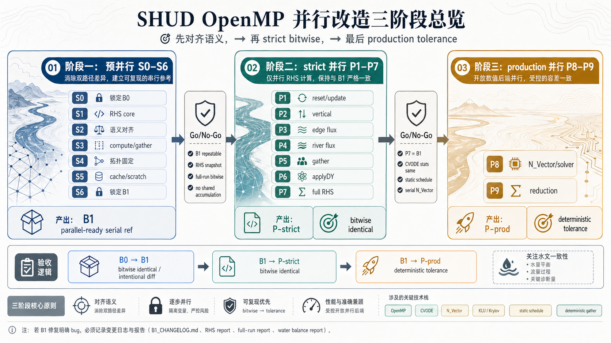
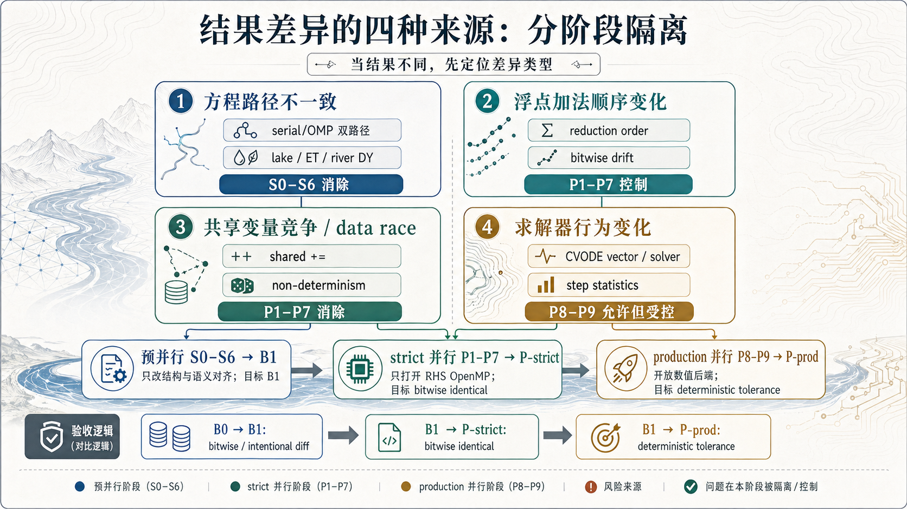
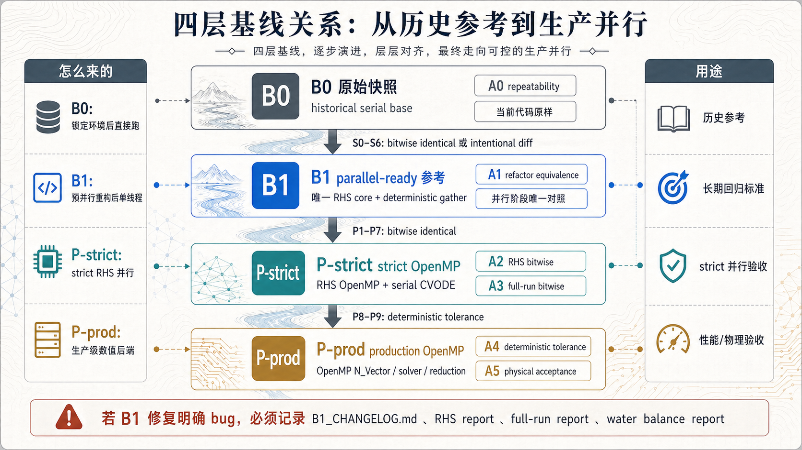
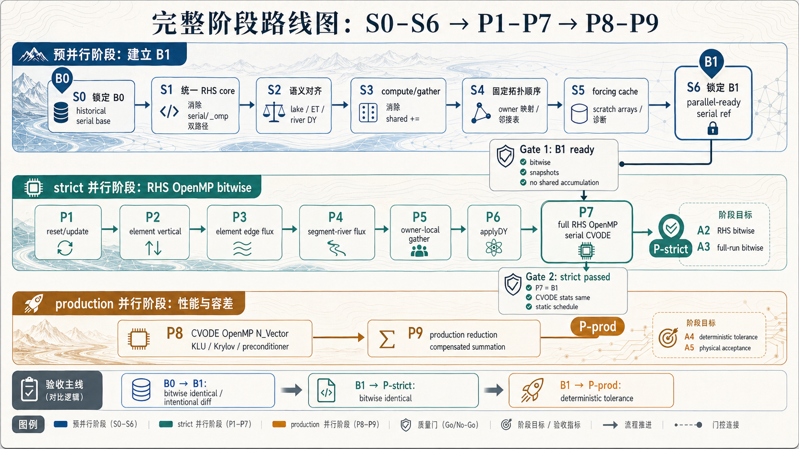
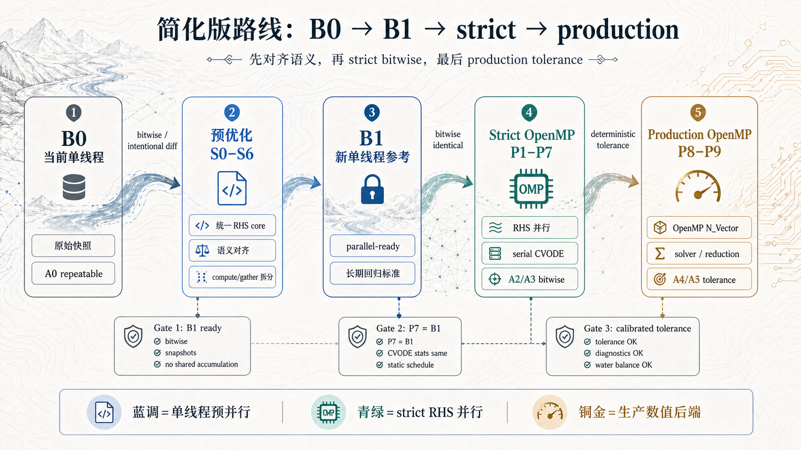
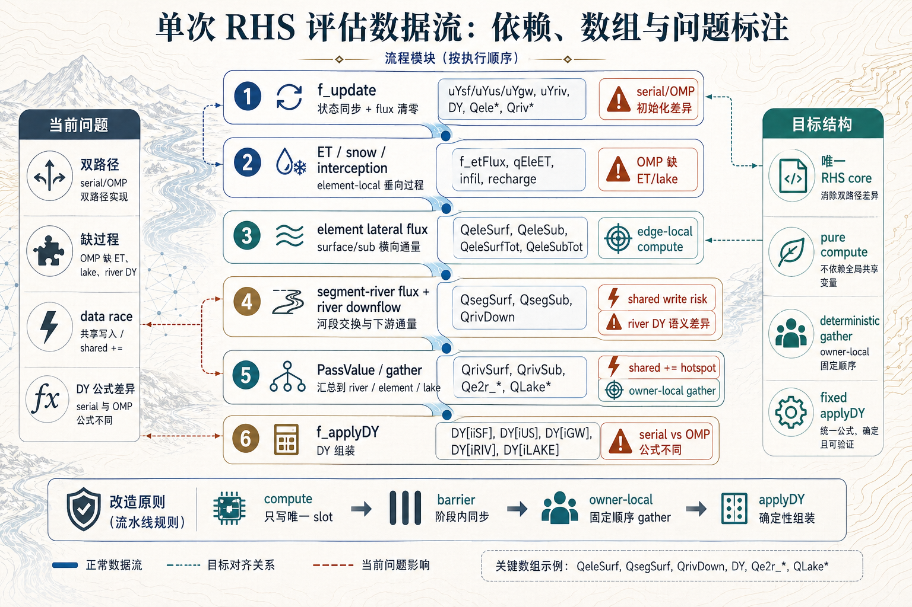
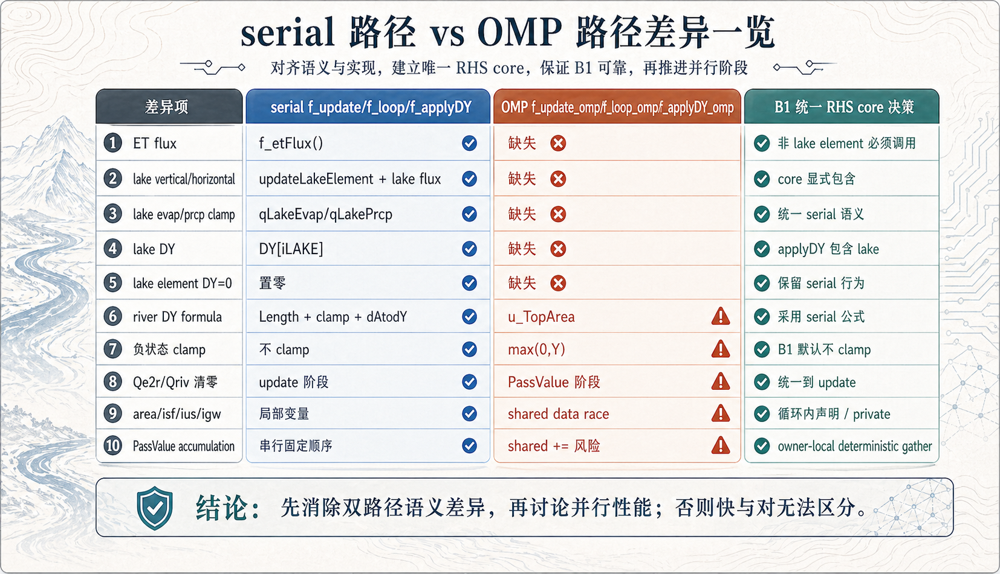
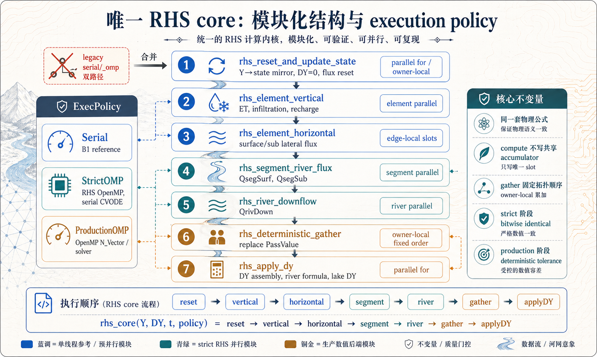
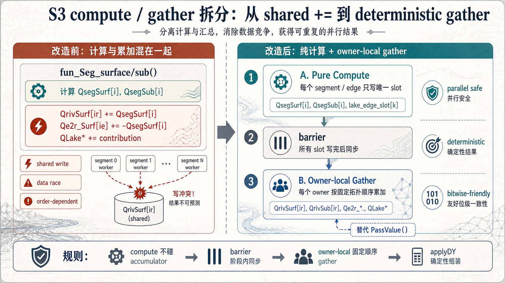
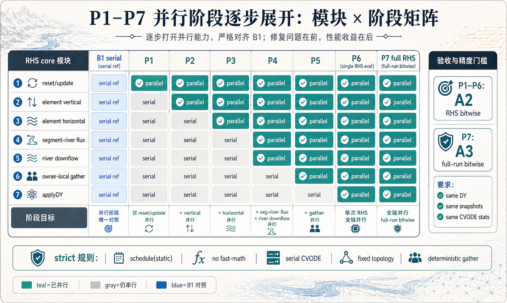

# SHUD OpenMP 并行改造总体实施方案（终版）

> **本文档替代**以下四份文档，是 SHUD 求解器加速的唯一权威实施路线：
>
> 1. `SHUD_solver_acceleration_roadmap.md`（2026-04-23，决策层）
> 2. `SHUD_single_thread_preoptimization_for_parallel.md`（2026-04-26，预优化层）
> 3. `SHUD_parallel_alignment_accuracy_plan.md`（2026-04-26，精度验收层）
> 4. `SHUD_parallel_complete_package/SHUD_parallel_full_plan.md`（2026-04-26，合并版）
>
> 版本：v1.4 | 日期：2026-06-22 | SHUD 源码子模块路径：`SHUD/` (pinned to `78c37a1`，B0-tag `95ddc375`)

> **v1.5 修订要点**（P1d epic capstone 后，按 PR-H 实测 + 两轮独立 GPT Pro 复查 + codebase 事实核查修订）：
> 12. **M12（§6 P2a 重写 NO-GO + §6 P1e.6/.7/.8 改链 + §7.2 RISK-16 → 不触发 + §7.3 P2a 行改 + §P2b 前提条件改写）**：P1e closure 后 P2a profile 前置实测（heihe forcing.trimmed fair-compare + heihe_x4 production target，SHUD pin `7a1dc8f` 含 nested-Timer fix）发现 forcing+ET %wall 全线低位：heihe 13.39% / heihe_x4 7.97%（v0.2 76.91% 是 v0.3 NFS-artifact 误判 → v0.4 dataset size artifact 正解，缩 413× dataset → 缩 75% wall 证明）。Amdahl sp@8 上界 <1.15×（heihe 1.13× / heihe_x4 1.07×），远不及 P1e RHS 1.729×。**P2a NO-GO（不启动）**：原 M11 P2a.1-.8 14-PR 模板全部不实施（设计语汇由 P2b / P5 继承）；M12 修订：§P2a 改写为 NO-GO 决策段（含 fair-compare 数据 + v0.3 → v0.4 解读修订 + 替代路径 P2b/P8-precond + M7 forcing_trim deployment 副产物）；P1e.6 Go/No-Go 题目 → P2b/P8-precond；P1e.8 后续移交改 → P2b/P8-precond；§7.2 RISK-16 movePointer 风险标 P2a NO-GO 不触发；§7.3 → P2a 行标 NO-GO + 新增 → P2b 行直接由 P1e 后置启动；§P2b 前提条件 "P2a 已验证 pre-CVODE 输入正确" 改为 "pre-CVODE 保持 P1e SHIP-state 串行"。详 `docs/p2a/p2a_profile_baseline.md` v0.4 + `docs/case_deployment_map.md`。
> 11. **M11（§6 P1e.4/.7/.8 实测回填 + §6 P2a 重梳理 + §8.1 strict-omp SHIP 状态 + §7.3 P2a 启动前置 verified）**：P1e epic (#308) 2026-06-25 closure。14 PR (PR-A..PR-M + PR-B0 audit) 完成 ExecPolicy::StrictOMP 实施 + 2×2 build matrix 因果实验 + 6/6 cross-platform 决定论。AC-S1 + AC-S2 PASS；AC-S3 PARTIAL (heihe 1.066× FAIL <1.3× / heihe_x4 1.729× PASS ≥1.5×) → §4.6.2 partial-closure SHIP。SHUD pin `3341368d` + P1e-tag annotated `25023eff32d1` + baseline/P1e D11 locked。M11 修订：§P1e Status 改 COMPLETE + 验收节回填实测数据 + P1e.7 改写为实测 carve-out + 新增 P1e.8 后续移交；§P2a 基于 P1e 经验重梳理为 P2a.1-.8 子节（2×2 因果实验 + SHUD_PRE_CVODE_THREADS env split + §4.6.2 partial-closure 决策 + D7 AND-gate + D11 forward-compat stacking）；§8.1 strict-omp mode SHIP；§7.3 P2a 启动前置 verified。详 `docs/p1e_summary.md` (顶层) + `docs/p1e/p1e_summary.md` (capstone) + ADR-0002 closure。
> 10. **M10（§1.1.2 + §3 路线图 + §4.13 + §4.17 + §6 P1c.5 / P2a 启动前置 + §6 新增 P1d / P1e + §7.2 RISK + §7.3 + §8.1）**：P1c PARTIAL CLOSURE 后 P1d epic (#274) 尝试 NUMA env + first-touch + Kahan revert 收尾，PR-H 8-cell 实测 3 SHALL gate FAIL（A3a + nst Δ=0 at N≥4）。事实核查发现：(a) `shud_omp` 当前实际跑的是 **Serial 水文 RHS + OpenMP N_Vector backend**——`SHUD/src/Model/f.cpp:54` 始终调 `ExecPolicy::Serial`，`StrictOMP/ProductionOMP` 在 `MD_rhs_core.cpp:802-811` 是 `std::abort()` 桩；(b) SPGMR 没注册 preconditioner（`cvode_config.cpp:259` `SUNLinSol_SPGMR(udata, 0, 0, sunctx)` 后无 `CVodeSetPreconditioner`）；(c) N≥4 cross-N 散度根因是 SUNDIALS `NVECTOR_OPENMP` 内 `N_VDotProd_OpenMP` / `N_VWSqrSumLocal_OpenMP` 用 `reduction(+:sum) schedule(static)`，跨 N reduction tree 不固定；(d) PR-C/D/E 添加的 steady-state first-touch loops 是为完全没发生的 owner-compute 做的页面预放置（consumer 是单线程），无效优化。M10 修订：P1d 以 **E′ containment closure** 收尾——production 默认 `NUM_OPENMP=1`、`shud_omp` 标 `fast-omp experimental, non-production`、3 SHALL gate 重写为 **4-mode spec**（serial / strict-omp / det-omp / fast-omp）strict 承诺保留在 strict-omp mode 内、PR-C/D/E steady-state first-touch 标 deprecated（allocation-time first-touch 保留）；新增 **P1e epic (F 路)** = Serial N_Vector + StrictOMP RHS（替换 abort 桩 + 真正并行水文 RHS + 复用 deterministic_gather），启动前必须做 **2×2 build 因果实验**（A/B/C/D × N∈{1,2,4,8} × 3 reps）验证 NVECTOR reduction 是主因；P2a 启动前置链路从 P1c → P2a 改为 P1c → P1d → P1e → P2a；KLU 推到 `docs/adr/0002-solver-path.md` 作 4 路对比，不阻塞 F 路。§3 路线图 figures M10 修订仍保留 v1.3 版本 caveat。

> **v1.4 修订要点**（P1 epic capstone 后，按 PR-K2 #223 实测数据 + design D5 NG3 反馈修订）：
> 9. **M9（§1.1.2 + §3 路线图 + §6 P1c 新增 + §6 P7 精简 + §7.2 RISK-04 + §7.3 + §8.1）**：P1 epic 实测发现 `NUM_OPENMP ∈ {4, 8}` 下 CVODE `nst` 漂移 (heihe nst N=1/2/4/8 = 6773 / 6773 / 6585 / 6684)，根因在 B1b 阶段 S2 P3–P5 已并行 owner-local gather 的 tree-reduction depth N > 2 跃迁。M9 修订将 v1.3 §6 P7.3.5 的 deterministic-reduction tree-shape 固化工作整体迁出 P7、独立为新阶段 **P1c**（位于 P1 与 P2a 之间，走 design D9 fast-path + master plan C8 forward-compat stacking，产物为 `P1c-tag` + `baseline/P1c`），使 P2 起所有 P-strict 子阶段均可 claim A3a strict。原 §6 P7 精简为 fork-join fusion + `OMP_CUTOFF` cutoff，deterministic-reduction 改由 P1c 前置满足；§1.1.2 加 P1c 一档；§7.2 RISK-04 重新归类至 P1c；§7.3 加 P1c 行；§8.1 strict 模式 P 列表加 P1c。§3 路线图 figures 暂保留 v1.3 版本，加 caveat 说明 M10 重画。

> **v1.3 修订要点**（S0 完成后，按 S0.12 profile 实测数据与 profile_decision.md 签字结论回写）：
> 6. **M6（§1.1.1 + §S0.2 + §S0.12 + §5 Opt-IO）**：S0 实测后 spec 与现实校齐——§1.1.1 拆 P7 strict Amdahl-bounded 中间目标 vs P9 production T 目标；§S0.12 profile gate 改为"先剔除 IO 主导 case 再按决策驱动 case 阈值判定"，跨平台 delta > 10pp 改为"不阻塞 + review note"，timer bucket 拆 `t_init`；§S0.2 manifest 加 `endpoint` 字段（含 `deferred-upstream`），90 天截断升为项目纪律；§5 Opt-IO 对 IO 主导 case（heihe）升级为硬性前置。
> 7. **M7（§6 P1 入口前）**：B1a capstone PR-12 实测发现 90 天 cfg 截断（§S0.2 部署铁律）只动 `cfg.para END`、**不动** forcing CSV，SHUD 启动期仍把 1951-2024 全量 forcing 塞内存（heihe_x4 1693 站 × 21.6 万行 ≈ 13min I/O），bitwise 不受影响但 P1+ 任何 timing 测量都被 I/O 严重污染。新增 §6 P1 入口前置铁律：所有 P-strict / P-prod 部署必须用 trimmed forcing（窗口 = cfg [START, END] ± 2 天 buffer），否则 §1.1.1 加速比目标与 §S0.12 profile gate 全部不可信。
> 8. **M8（§5 S5 / §S5d / §S6a / §S6b）**：B1a capstone PR-12 #156 实操按"S0–S4 完成即锁 B1a-tag"（与 §4.22 L690 "S5d 必须在 B1a 锁定**之后**" 一致），但 §S5d 旧 preamble L1378 写"B1a 尚未锁定（S5d 是 B1a 的最后一块）" + §S6a 旧 B1a 必备清单 L1455-1458 把 S5a/S5b/S5c/S5d 列为 B1a prereq——两处与 §4.22 L690 + PR-12 实操矛盾。本修订：(a) §S5 preamble 明确标注"B1a 锁定后启动 = B1b 结构改造前置"；(b) §S5d L1378 改 "B1a 尚未锁定 → B1a 已锁定，S5d 是 B1b 的最后一块结构改造"；(c) §S6a B1a 必备清单删除 S5a/S5b/S5c/S5d 4 行（B1a 只要求 S0–S4 完成 + bitwise == B0）；(d) §S6b preamble 追加"在 S5a/S5b/S5c/S5d 全部完成后" 前置门，bug fix 列表保持不变。

> **v1.2 修订要点**（基于第二轮深度审查，吸收 M1–M5 五条结构性修订）：
> 1. **M5（§2.2）**：A3 拆为 A3a/A3b/A3c，跨线程数 bitwise 从硬门控降为加分项
> 2. **M1（§1.1.1 + §1.2 + §5 S0.12）**：加入按流域规模量化加速比目标；新增 C6/C7/C8 原则；新增 S0.12 RHS 占比 profile 强制门控
> 3. **M3-prep（§4.17）+ M3（§6 P8）**：修正"基线为 dense solver"的事实错误；P8 按真实 ROI 重排为 P8-precond → P8-tune → P8-NVector → P8-KLU
> 4. **M2（§6 P7）**：强制单 parallel 区融合 + `nowait/barrier/single` + `NumEle < OMP_CUTOFF` serial fallback
> 5. **M4-prep（§4.22）+ M4（§5 S5d）**：新增数据布局 + NUMA first-touch + 线程绑定改造阶段

---

## 0. 为什么做这件事，怎么做

### 0.1 为什么要并行改造

SHUD 是一个全耦合水文模型，核心求解由 SUNDIALS/CVODE 驱动。随着应用流域规模增大（数千到数万三角单元 + 河网 + 湖泊），单次模拟的 wall-clock 时间成为科研和参数校准的主要瓶颈。SHUD 已经依赖 CVODE 和 OpenMP 基础设施，具备并行加速的天然条件。

但当前的 OpenMP 实现不能直接用：源码中 serial 和 OMP 是**两套不同的 RHS 路径**——方程不同（river DY 公式）、过程覆盖不同（OMP 缺 ET/lake）、初始化行为不同（负状态 clamp）、甚至存在 data race（共享局部变量）。在这种基线上做加速，加出来的"快"和"对"无法区分。

因此，这次改造的核心目标很简单：**让 SHUD 跑得更快，同时确保结果可信。**

### 0.2 分三个大阶段做

整个改造分为三个大阶段，递进关系如下：



> **阶段一：预并行（S0–S6）** — 整理单线程代码，产出 B1a（重构等价基线）和 B1b（bug-fix 后 parallel-ready 基线）
> **阶段二：strict 并行（P1 → P1c → P2–P7）** — 逐步开 OpenMP，要求与 B1b bitwise identical；M9 修订后 P1c 作为 deterministic-reduction 前置插入 P1 与 P2 之间
> **阶段三：production 并行（P8–P9）** — 放开 CVODE 内部并行，追求最大性能

### 0.3 每个阶段的验收标准

| 阶段 | 核心问题 | 验收标准 |
|---|---|---|
| 预并行（S0–S4） | 重构有没有改掉计算？ | B1a 与 B0 **bitwise identical**——纯结构重构，零计算变更 |
| 预并行（S5–S6） | bug fix 的影响可解释吗？ | B1b 与 B0 的差异在 `B0_vs_B1b_report` 中逐项记录且可解释 |
| strict 并行（P1） | first parallel candidate baseline 是否守住 N=1 强制门？ | `NUM_OPENMP=1` 与 B1b bitwise identical（强制）；`NUM_OPENMP>1` 允许 A3a/A3b fallback（design D5 NG3）|
| strict 并行（P1c） | deterministic-reduction 是否消除 N≥4 nst 漂移？ | A3a：N ∈ {1, 2, 4, 8} 全部 bitwise identical；CVODE `nst` 跨线程数完全相等（修复 P1 实测漂移） |
| strict 并行（P2–P7） | 并行有没有改掉模型？ | A3a：同线程数与 B1b bitwise identical；A3b：跨线程数 ULP 级差异在工程上界内；A3c 可选 |
| production 并行（P8–P9） | 性能优化有没有超出容差？ | P-prod 与 B1b 差异在标定容差内；同配置可复现；水量守恒不恶化 |

### 0.4 为什么必须分阶段

不分阶段的后果是：当结果和原来不一样时，你分不清是**方程路径不一致**（该修的 bug）、**浮点加法顺序变了**（并行的必然代价）、**共享变量竞争**（并行的 bug）、还是**求解器行为变了**（CVODE 参数调整）。四种原因混在一起，既不能定位问题，也不能说服自己和别人结果是对的。



分阶段做，每个阶段只引入一类变化：
- S0–S6 只改代码结构，不改计算逻辑 → 差异 = 0，否则就是重构 bug
- P1–P7 只加 OpenMP 并行策略，不改方程 → 差异 = 0，否则就是并行 bug
- P8–P9 才放开数值后端 → 差异 ≠ 0 但可解释，否则就是容差设计问题

每一步都有明确的"门控"——不通过就不进入下一步。这不是保守，而是让每一步的结论可信。

---

## 1. 目标与核心原则

### 1.1 目标

**通过 OpenMP 并行化显著降低 SHUD 的 wall-clock 运行时间。**

#### 1.1.1 量化加速比目标（按流域规模分级）

> 以下目标基于**目标部署平台**（典型科研工作站：单插槽 8 物理核 x86_64 Linux、`-O2 -ffp-contract=off -fopenmp`、`OMP_PROC_BIND=close OMP_PLACES=cores`、warm cache、forcing 已 preload）。所有数字是 **P9 完成后**对 B1b 单线程的 wall-clock 加速比目标，分两类：M（最小可接受，未达到必须复盘）和 T（目标值，达到即视为成功）。
>
> **重要**：这些目标**只在目标部署平台验收**。本地开发平台（如 Apple Silicon Mac）跑出的数字只用于开发期参考，不计入 go/no-go。两平台角色分工见 §5 S0.12 跨平台执行声明。

| 流域规模 | NumEle | NumY 量级 | 1→2 线程 (M / T) | 1→4 线程 (M / T) | 1→8 线程 (M / T) | 主导优化 |
|---|---|---|---|---|---|---|
| Small | < 1,000 | < 5k | 1.0× / 1.3× | 1.0× / 1.8× | 1.0× / 2.0× | 仅 cutoff 走 serial；并行收益由 fork-join 吃掉 |
| Medium | 1,000 – 10,000 | 5k – 40k | 1.4× / 1.7× | 2.2× / 3.0× | 3.0× / 4.5× | RHS owner-local 并行 + SoA layout |
| Large | 10,000 – 100,000 | 40k – 400k | 1.5× / 1.8× | 2.8× / 3.5× | 4.5× / 6.0× | RHS 并行 + N_Vector OpenMP + **预条件器降低 Krylov 迭代数** |
| XLarge | > 100,000 | > 400k | 1.6× / 1.9× | 3.0× / 3.8× | 5.5× / 7.0× | 同上 + 可能引入 KLU 或更强 precond |

**Amdahl 上限说明**：根据 S0.12 实测的 `t_RHS_kernel / t_total` 比例 `f`，理论上限 `S_max = 1 / (1 - f + f/N)`。若 S0.12 测得 `f < 0.5`（RHS 不占主导），上述 T 列目标需要 P8（预条件器 + N_Vector）配合才能达到，**仅靠 P1–P7 RHS 并行无法达成 T 目标**。

**P7 strict 退出目标 vs P9 production 最终目标**（M6 修订）：上表是 **P9 完成后**对 B1b 的最终目标。S0.12 实测后已知 P1–P7 strict 阶段（仅 RHS 并行）的 Amdahl 8 核上界远低于 T 列，因此 P7 strict 退出按以下 Amdahl-bounded 中间目标验收，达不到 T 列不阻塞，但必须能解释剩余加速比由 P8 哪一项补齐：

| 流域规模 | 代表 case（S0 实测）| RHS 占比 f | P7 strict 8 核 Amdahl 上界 | P7 strict 8 核验收（M / T）|
|---|---|---|---|---|
| Small | keliya / xinanjiang_upstream | 36% – 49% | 1.6× – 2.0× | 1.0× / 1.5× |
| Medium（非 IO 主导）| qhh / qinyijiang | 37% – 65% | 1.6× – 2.3× | 1.5× / 2.0× |
| Medium（IO 主导）| heihe（t_forcing_io = 79%）| 12% | 1.13× | **不独立验收**；必须先过 Opt-IO，详见 §5 Opt-IO |
| Large | heihe_x4 | 67% | 2.4× | 1.8× / 2.2× |
| XLarge | heihe_x16 | （待 S0.12 复测）| — | 同 Large 等比例外推 |

**对 §1.1.1 主表的影响**：T 列**保留为 P9 完成后**的目标；P7 strict 退出 go/no-go 用上方 Amdahl-bounded 表，差距由 P8 补齐（precond 降 Krylov 迭代数 + N_Vector 内部并行）。

> **P1 实测注 (2026-06-22 / P1 epic capstone, PR-G #214 + PR-K2 #223)**：
>
> - **heihe**：M7 forcing trim 工具 (PR-A #212) 投产后，trimmed forcing 重测 (PR-G) 实测 `t_forcing_io = 1.90%` (远低于原 79%)，IO 主导假设解除；但 P1 实测 sp@8 = 1.08×，归因变更为 NumEle = 6335 这一 Medium 偏小规模下 OMP fork-join overhead 与 Amdahl serial fraction (B1b S2 P3–P5 owner-local gather 起点 serial) 主导。"不独立验收"条款字面保留，归因更新为 fork-join + serial-fraction 双重约束。
> - **heihe_x4**：P1 实测 sp@8 = 1.14×，远低于 P7 strict M = 1.8×；P1 为 first OMP candidate (仅 `MD_update.cpp` 三处 owner loop)，未引入 S5d SoA、owner-local gather 并行、`OMP_CUTOFF`、N_Vector 并行；当前数据为 P1 起点报告 (master plan §1.1.2 + design D5 NG3 允许)，预期由 P2+/P7 阶段闭合至 M 列。
> - 详见 `docs/p1/p1_perf_baseline.md` §2、`docs/p1_summary.md` §5.2、`docs/profile_decision.md` 更新段。

#### 1.1.2 约束条件

- 串行与并行路径物理方程等价（同一套 RHS core）
- strict 阶段精度等级 (按 P 子阶段分级，M9 修订)：
  - **P1**（first parallel candidate baseline；2026-06-22 已实测）：`NUM_OPENMP=1` vs B1b/B1-tag bitwise **强制** (master plan §2.2 A0 / A1 + design `p1-update-omp` D5 NG3)；`NUM_OPENMP>1` 优先 A3a，若仅满足 A3b 或同时不满足 A3a 与 A3b 均不阻塞 P1 lock，但需在 `docs/p1/p1_perf_baseline.md` 与 spec `p1-state-update-parallel` L205–L209 (PROMOTE 后版本) 记录 CVODE `nst` 漂移证据 + cross-ref P1c deterministic-reduction work scope。
  - **P1c**（deterministic-reduction 前置；M9 新增）：`NUM_OPENMP ∈ {1, 2, 4, 8}` 全部 A3a bitwise **强制**；CVODE `nst` 跨线程数完全相等（修复 P1 实测 N ≥ 4 漂移）；产物为 `P1c-tag` + `baseline/P1c` (forward-compat stacking on `P1-update-omp-tag`)。详 §6 P1c。
  - **P1d**（NUMA + first-touch + Kahan revert 收尾；M10 新增 PARTIAL CLOSURE）：4-mode spec (serial / strict-omp / det-omp / fast-omp)；`serial` mode N=1 SHALL canonical bitwise vs `P1-update-omp-tag`；`strict-omp` mode 跨 N bitwise + nst Δ=0 + N=1 reverse-compat (待 P1e 实现，本 epic 仅 spec 定义)；`fast-omp` mode (=当前 `shud_omp`) MAY 不可复现，明确 non-production。PR-C/D/E steady-state first-touch 在 owner-compute 实现前为 deprecated 无效优化，下个 epic (P1e) 重新设计。产物：`P1d-tag` + `baseline/P1d` (containment closure narrative + 指向 P1e)。详 §6 P1d。
  - **P1e**（F 路：Serial N_Vector + StrictOMP RHS；M10 新增）：`ExecPolicy::StrictOMP` 路径替换 `std::abort()` 桩；单 parallel region + phase-based for + `default(none)`；复用 `rhs_deterministic_gather()`（并行 owner 外层 + canonical fold 内层）；`NUM_RHS_THREADS` 与 `NUM_NVECTOR_THREADS` 分离；删 steady-state first-touch，保留 allocation-time first-touch；启动前 2×2 build 因果实验（A: Serial+Serial / B: NVEC+Serial=current shud_omp / C: Serial+StrictOMP=候选 production / D: NVEC+StrictOMP=research）× N∈{1,2,4,8} × 3 reps。验收：C mode 跨 N bitwise + nst Δ=0 + 加速。产物：`P1e-tag` + `baseline/P1e`。详 §6 P1e。
  - **P2 至 P6**：基于 P1c 之上，统一要求 A3a 强制（同线程数 bitwise）；A3b 强制（跨线程数 ULP 上界）；A3c 可选。fallback 路径仅在 reviewer 显式批准时启用，须 cross-ref 新风险登记。
  - **P7 strict 退出门**：A3a + A3b 强制（继承 P1c → P2 → P6 链路）；A3c 可选；fork-join 计数 ≤ 1 / RHS（M2 v1.1 fusion 要求）。
- production 阶段精度在可解释的工程容差内，水量守恒不恶化
- 不同流域规模档位的目标独立验收，小流域达不到 T 不阻塞中/大流域

### 1.2 核心原则

| 编号 | 原则 | 含义 |
|---|---|---|
| C1 | 唯一 RHS core | `f_loop()` / `f_loop_omp()` 不再各自演化；OpenMP 只是 execution policy |
| C2 | compute 与 gather 分离 | 通量计算只写唯一 slot；汇总由 owner-local 固定顺序 gather 完成 |
| C3 | strict 阶段不改物理 | 不改 forcing 插值、不改容差、不改公式、不改求和算法 |
| C4 | CVODE 内部并行晚于 RHS 并行 | 先 RHS bitwise，再 CVODE vector/solver 并行 |
| C5 | 阶段门控 | 每阶段有 go/no-go checklist，不通过不进入下一阶段 |
| C6 | profile-driven 优先级 | S0.12 实测各子系统占总 wall-clock 比例后才决定 P1–P9 优先级；占比 < 10% 的子系统不投入并行预算 |
| C7 | fork-join 最少化 | RHS 内每次调用最多一个 `#pragma omp parallel` 区，多个 stage 用 `#pragma omp for` + `barrier`/`single` 组合，不在 RHS 内重复 fork-join |
| C8 | 小流域 cutoff | `NumEle < OMP_CUTOFF`（编译期或运行期可配置，默认 1024）时 RHS 强制走 serial 路径，跳过 parallel 区 |

---

## 2. 基线定义与精度等级

### 2.1 四层基线



| 基线 | 是什么 | 怎么来的 | 用途 |
|---|---|---|---|
| **B0** | 当前 SHUD 原样编译的单线程结果 | 不改任何代码，锁定编译环境后直接跑 | 历史参考；后续所有改动的对照起点 |
| **B1a** | 重构等价的单线程结果 | S0–S4 完成后：统一 RHS core、拆完 side-effect、固定拓扑顺序，**不修任何 bug**，仍以单线程运行 | 证明"重构没改计算"；必须与 B0 **bitwise identical** |
| **B1b** | bug-fix 后的 parallel-ready 单线程结果 | 在 B1a 基础上修复已知 bug（S5–S6）：`AccTemperature` 除零、`N_VDestroy` 类型不匹配、lake 分支语义等 | **并行阶段的唯一对照**；长期回归标准 |
| **P-strict** | strict OpenMP 并行结果 | P1–P7：RHS 内部 OpenMP，CVODE 仍用 serial N_Vector | 目标：与 B1b **bitwise identical** |
| **P-prod** | production 并行结果 | P8–P9：CVODE OpenMP N_Vector、Krylov solver、tree reduction | 允许与 B1b 有微小可解释差异；deterministic 可复现 |

**为什么拆成 B1a 和 B1b**：证明"重构没有改变计算"和证明"修 bug 后结果变化合理"是两件完全不同的事。如果都塞进一个 B1，后续一旦结果变化，难以判断是 refactor 改坏了还是 bug fix 合理改变了输出。

**B1a vs B0**：**必须 bitwise identical**，无例外。B1a 只做结构提取、函数搬迁、ExecPolicy 接口引入、宏解耦（§4.21）、compute/gather 拆分、拓扑固定——所有这些都是纯结构变更，不触碰计算逻辑。如果 B1a ≠ B0，说明重构引入了 bug，必须修复后才能继续。

**B1b vs B0**：允许不同，但必须提供完整的 `B0_vs_B1b_report`，逐项记录每个差异的来源（哪个 bug fix）、影响范围和验收指标。B1b 包含的 bug fix 清单在 `B1b_CHANGELOG.md` 中管理。

**B1b vs B1a**：差异恰好等于所有 bug fix 的效果之和，可通过 `B1a_vs_B1b_report` 精确归因。

### 2.2 六级精度等级（A0–A5）

| 等级 | 名称 | 定义 | 适用阶段 |
|---|---|---|---|
| **A0** | baseline repeatability | 单线程 base 多次运行 bitwise identical | S0 |
| **A1** | refactor equivalence | 重构后不开并行，与 B0 bitwise identical | S1–S4（→ B1a） |
| **A1b** | bug-fix accountability | bug fix 后与 B0 的差异逐项归因且可解释 | S5–S6（B1a → B1b） |
| **A2** | RHS bitwise equivalence | 单次 RHS 评估中所有关键数组和 `DY` 与 B1b bitwise identical（同线程数） | P1–P6 |
| **A3a** | same-thread full-run bitwise | 同线程数下完整 CVODE run 输出与 B1b **bitwise identical**，CVODE stats 一致 | P7 强制 |
| **A3b** | cross-thread tight tolerance | 不同线程数之间 `max_ulp(DY) ≤ 4` 且 `max_abs_diff(state) < 1e-12`，CVODE 内部步数差异 ≤ 0.1% | P7 强制 |
| **A3c** | cross-thread full bitwise | 不同线程数之间完整 run bitwise identical | P7 **可选**（加分项，不进 go/no-go） |
| **A4** | deterministic tolerance | 并行结果重复运行一致，与 B1b 差异在 §2.3 标定阈值内 | P8 |
| **A5** | physical acceptance | 水文指标、水量守恒和跨流域表现可接受 | P9 及生产评估 |

> **为什么把 A3 拆三档**：A3c（跨线程数 bitwise）的工程意义主要是"差异定位时容易回溯"，不是科研正确性证据；任何 SUNDIALS 内部隐式 OpenMP、任何遗漏 `+=`、Apple Silicon 上 inline 函数的 FMA 选择都可能破坏它，代价巨大。**对外发表水文结果只需 A3a + A4** 即可；A3b 给出跨线程数差异的工程上界，足够定位 bug；A3c 作为加分项，达到则记入交付物，未达到不阻塞 P8。

### 2.3 A4 容差阈值（待标定）

A4 阈值不能预设，必须在 P7 通过后、进入 P8 前，基于 B1b 实际输出来标定。

**标定方法**：

1. 用 B1b benchmark 算例，记录各状态变量（surface/unsat/GW/river/lake）的量级范围和典型变化幅度
2. 在 P7 strict 阶段，记录不同编译器优化级别（`-O1` vs `-O2`）下的 bitwise 差异，作为"纯浮点噪声"的经验下界
3. 进入 P8 后，逐项对比 P-prod 与 B1b 的差异分布（max/p95/p99），取合理倍数作为门槛
4. 水量守恒、NSE/KGE 等水文指标阈值参考 B1b 自身在不同算例上的表现区间

**需要标定的指标清单**：

| 指标 | 标定依据 |
|---|---|
| 状态变量最大绝对差 | 按变量分组（surface/unsat/GW/river/lake），参考各自量级 |
| 水量平衡残差 | 参考 B1b 自身残差水平 |
| ΔNSE / ΔKGE | 参考 B1b 在多个算例上的基线值 |
| 峰值流量相对差 | 参考 B1b benchmark 算例的洪峰量级 |
| 径流总量相对差 | 参考 B1b 多年累积量 |
| 同线程重复运行 | 必须 bitwise identical 或严格 deterministic（这条不需要标定） |

> 在 B1b 锁定前，不写死任何具体数字。

---

## 3. 阶段路线图

> **M9 + M10 caveat (2026-06-22 / 2026-06-24)**：以下两幅 figure (`fig03_full_roadmap.png` / `fig04_simplified_roadmap.png`) 反映 v1.3 阶段顺序 (P1 → P2a → … → P7)，**未包含 M9 新增的 P1c (deterministic-reduction 前置) + M10 新增的 P1d (NUMA + first-touch + Kahan revert containment closure) / P1e (F 路：Serial N_Vector + StrictOMP RHS)**。最新阶段顺序以 §6 章节文本为准 (P1 → **P1c → P1d → P1e** → P2a → P2b → P3 → P4 → P5 → P6 → P7)。Figures 计划在 M11 修订时重画并替换（M10 仍保留 v1.3 版本）。

### 3.1 完整路线图



### 3.2 简化版路线



---

## 4. 源码关键观察

以下观察基于 SHUD 子模块 `SHUD/src/` 中的实际源码，是本方案所有阶段划分的依据。





### 4.1 RHS 入口双路径分叉

**文件**：`src/Model/f.cpp` (L7–L26)

```cpp
#ifdef _OPENMP_ON
    Y = NV_DATA_OMP(CV_Y);
    DY = NV_DATA_OMP(CV_Ydot);
    MD->f_update_omp(Y, DY, t);    // ← OMP 路径
    MD->f_loop_omp(Y, DY, t);
    MD->f_applyDY_omp(DY, t);
#else
    Y = NV_DATA_S(CV_Y);
    DY = NV_DATA_S(CV_Ydot);
    MD->f_update(Y, DY, t);        // ← serial 路径
    MD->f_loop(t);
    MD->f_applyDY(DY, t);
#endif
```

**问题**：serial 与 OpenMP 是两套 RHS 实现，而非同一 kernel 的不同 execution policy。当并行结果与单线程不一致时，无法归因。

### 4.2 f_loop() 与 f_loop_omp() 过程覆盖差异

**serial `f_loop()`**（`src/ModelData/MD_f.cpp` L8–L49）包含：
- Lake element 分支：`updateLakeElement()` → `fun_Ele_lakeVertical()` → `qLakeEvap/qLakePrcp` 累加（L11–L16）
- 普通 element：`f_etFlux()` → `updateElement()` → `fun_Ele_Infiltraion()` → `fun_Ele_Recharge()`（L17–L24）
- Lake element horizontal：`fun_Ele_lakeHorizon()`（L27–L29）
- segment flux → river downflow → lake evap clamp → `PassValue()`

**OpenMP `f_loop_omp()`**（`src/ModelData/MD_f_omp.cpp` L69–L100）：
- **缺失** `f_etFlux()` 调用
- **缺失** lake element vertical/horizontal 处理
- **缺失** lake evaporation/precipitation clamp
- 直接进入 `updateElement()` → infiltration/recharge → surface/sub → segment → river → `PassValue()`

### 4.3 river DY 公式不一致

**serial `f_applyDY()`**（`src/ModelData/MD_f.cpp` L119–L141）：
```cpp
DY[iRIV] = (- QrivUp[i] - QrivSurf[i] - QrivSub[i] - QrivDown[i] + Riv[i].qBC) / Riv[i].Length;
if(DY[iRIV] < -1. * Riv[i].u_CSarea)
    DY[iRIV] = -1. * Riv[i].u_CSarea;
DY[iRIV] = fun_dAtodY(DY[iRIV], Riv[i].u_topWidth, Riv[i].bankslope);
```
先按 reach length 计算截面积变化 → 限制负向面积变化 → `fun_dAtodY()` 转换为水深变化。

**OpenMP `f_applyDY_omp()`**（`src/ModelData/MD_f_omp.cpp` L54–L65）：
```cpp
DY[iRIV] = (- QrivUp[i] - QrivSurf[i] - QrivSub[i] - QrivDown[i] + Riv[i].qBC) / Riv[i].u_TopArea;
```
直接除以 `u_TopArea`，**缺失**面积限制和 `fun_dAtodY()` 转换。这不是浮点顺序差异，而是方程本身不同。

### 4.4 f_update() 与 f_update_omp() 初始化差异

**serial `f_update()`**（`src/ModelData/MD_update.cpp` L60–L147）：
- 清零 `QeleSurf[i][j]`/`QeleSub[i][j]`/`QeleSurfTot`/`QeleSubTot`（L64–L69）
- 状态镜像 `uYsf/uYus/uYgw` **不做** `max(0, Y)` clamp（L70–L74）
- 清零 `QrivSurf/QrivSub/QrivUp`（L123–L127）
- 清零 `Qe2r_Surf/Qe2r_Sub`（L128–L131）
- **Lake 完整初始化**：`yLakeStg`/`lake.update()`/`y2LakeArea`/`QLakeSurf/Sub`/`qLakeEvap/Prcp`/`QLakeRivIn/Out`（L132–L143）
- 清零 `DY[0:NumY]`（L144–L146）

**OpenMP `f_update_omp()`**（`src/ModelData/MD_f_omp.cpp` L104–L170）：
- 状态镜像 `uYsf/uYus` **做了** `max(0, Y)` clamp（L116–L117）
- `uYgw` **做了** `max(0, Y)` clamp（L121）
- **缺失** lake 初始化
- **缺失** `QrivSurf/QrivSub/QrivUp` 清零
- **缺失** `Qe2r_Surf/Qe2r_Sub` 清零
- `QeleSurf/QeleSub` 清零被注释掉（L133–L135）

### 4.5 shared accumulator side-effect

共享写分两类：**被 `PassValue()` 覆盖的死代码**和**真正需要拆的共享写**。

#### 死代码（被 `PassValue()` 零化后重新累加，实际不影响结果）

**`fun_Seg_surface()`**（`src/ModelData/MD_RiverFlux.cpp` L100–L113）：
```cpp
QsegSurf[i] = WeirFlow_jtoi(...);
QrivSurf[iRiv]  +=  QsegSurf[i];   // ← 死代码：PassValue() L158-170 会清零并重新累加
Qe2r_Surf[iEle] += -QsegSurf[i];   // ← 死代码：PassValue() L163-172 会清零并重新累加
```

**`fun_Seg_sub()`**（L114–L126）同理。这些 `+=` 在 serial 和 OMP 路径中都是冗余的，因为 `PassValue()`（`MD_f.cpp` L156–L196）会先清零 `QrivSurf/QrivSub/QrivUp/Qe2r_Surf/Qe2r_Sub`（L158–L166），再从 `QsegSurf/QsegSub` 重新累加（L167–L174）。

#### 真正需要拆的共享写（不在 `PassValue()` 覆盖范围内）

**`Flux_RiverDown()`**（`MD_RiverFlux.cpp` L5–L63）中 toLake 分支：
```cpp
QLakeRivIn[Riv[i].toLake] += QrivDown[i];  // L24, 真正的共享写
```

**`fun_Ele_surface()`**（`MD_ElementFlux.cpp` L35–L97）中 lake neighbor 分支：
```cpp
QLakeSurf[ilake] += Q;  // L52, 真正的共享写
```

**`fun_Ele_sub()`**（L100–L156）中 lake neighbor 分支：
```cpp
QLakeSub[ilake] += Q;  // L121, 真正的共享写
```

**`PassValue()`**（`MD_f.cpp` L156–L196）本身是当前的 gather 实现：
- `QrivSurf[ir] += QsegSurf[i]`（L170）— 串行执行，无并行风险
- `Qe2r_Surf[ie] += -QsegSurf[i]`（L172）— 同上
- `QrivUp[iDownStrm] += -QrivDown[i]`（L177）— 同上

`PassValue()` 在串行中是安全的。并行改造时需将其重构为使用预构建 adjacency list 的 owner-local gather，但不需要从 `fun_Seg_*` "移入"累加逻辑——只需删掉 `fun_Seg_*` 里的死 `+=`。

### 4.6 `f_applyDY_omp` 局部变量 data race

**文件**：`src/ModelData/MD_f_omp.cpp` L9–L67

```cpp
void Model_Data::f_applyDY_omp(double *DY, double t){
    double area;                    // ← 声明在 parallel region 外
    int isf, ius, igw, i;          // ← isf/ius/igw 也在外面
#pragma omp parallel default(shared) private(i)  // 只有 i 是 private
    {
#pragma omp for
        for (i = 0; i < NumEle; i++) {
            isf = iSF; ius = iUS; igw = iGW;  // 多线程同时写同一个 isf/ius/igw
            area = Ele[i].area;                 // 多线程同时写同一个 area
```

`area`、`isf`、`ius`、`igw` 声明在 `#pragma omp parallel` 之外且 `default(shared)`，多线程同时写同一内存地址。这是 **data race（undefined behavior）**，不只是累加顺序问题。当前碰巧能跑是因为编译器可能将其优化进寄存器，但不可依赖。

**修复**：S1 统一 RHS core 时，将这些变量声明到 for 循环体内部，或显式标记为 `private`。

### 4.7 `PassValue()` 覆盖了 `fun_Seg_*` 的 side-effect

**`fun_Seg_surface()`**（`MD_RiverFlux.cpp` L107–L108）写 `QrivSurf[iRiv] += QsegSurf[i]` 和 `Qe2r_Surf[iEle] += -QsegSurf[i]`。但 **`PassValue()`**（`MD_f.cpp` L156–L196）在 `f_loop` 末尾会先把 `QrivSurf/QrivSub/QrivUp/Qe2r_Surf/Qe2r_Sub` **全部清零**（L158–L166），然后从 `QsegSurf/QsegSub` **重新累加**（L167–L174）。

这意味着 `fun_Seg_surface/sub` 里的 `+=` 是**死代码**——无论写什么值，`PassValue()` 都会覆盖。`fun_Seg_sub` 同理。

**真正需要拆的共享写**只有 `PassValue()` 外部的：
- `Flux_RiverDown()` L24：`QLakeRivIn[toLake] += QrivDown[i]`（不在 PassValue 覆盖范围）
- `fun_Ele_surface()` L52：`QLakeSurf[ilake] += Q`（不在 PassValue 覆盖范围）
- `fun_Ele_sub()` L121：`QLakeSub[ilake] += Q`（不在 PassValue 覆盖范围）

S3 的实际工作：**删掉 fun_Seg_surface/sub 里的死 `+=`**；对 lake 相关的共享写做 compute/gather 拆分；`PassValue()` 本身就是 gather，重构为使用预构建 adjacency list 的确定性版本。

### 4.8 `updateforcing()` 中孤立的 `#pragma omp for`

**文件**：`src/ModelData/MD_ET.cpp` L12–L14

```cpp
#ifdef _OPENMP_ON
#pragma omp for
#endif
    for (i = 0; i < NumForc; i++){
        tsd_weather[i].movePointer(t);
    }
```

此 `#pragma omp for` 没有外层 `#pragma omp parallel`。除非 `updateforcing()` 从某个 parallel region 内部被调用，否则这是孤立指令，运行时退化为串行。需在 S1 阶段确认其调用上下文并修正。

### 4.9 uncoupled 路径的 clamp 不一致

`f.cpp` L34–L125 定义了五个 uncoupled RHS 函数（`f_surf`、`f_unsat`、`f_gw`、`f_river`、`f_lake`），它们调用 `f_updatei()`（`MD_update.cpp` L3–L59）。`f_updatei()` 对所有状态变量统一做 `max(0, Y)` clamp：

```cpp
// MD_update.cpp L7
uYsf[i] = (Y[i] >= 0.) ? Y[i] : 0.;  // f_updatei case 1
// L11
uYus[i] = (Y[i] >= 0.) ? Y[i] : 0.;  // f_updatei case 2
// L17-19
uYgw[i] = (Y[i] >= 0.) ? Y[i] : 0.;  // f_updatei case 3
```

而 serial coupled 路径的 `f_update()`（`MD_update.cpp` L70–L74）不做 clamp：`uYsf[i] = Y[iSF]`。

这意味着 coupled 和 uncoupled 模式的负状态处理语义不同。当前方案以 coupled 路径为主线，uncoupled 暂不纳入并行改造，但需要记录这个差异，避免后续混淆。

### 4.10 全局变量裸指针

**文件**：`src/Model/shud.cpp` L18–L24 + `src/Model/Macros.hpp` L100–L108

```cpp
// shud.cpp L18-24: 定义
double *uYsf; double *uYus; double *uYgw; double *uYriv; double *uYlake;
double timeNow;

// Macros.hpp L100-108: extern 声明
extern double *uYsf; ... extern double timeNow;
```

`uYsf/uYus/uYgw/uYriv/uYlake/timeNow` 是全局变量，不是 `Model_Data` 成员。`iSF/iUS/iGW/iRIV/iLAKE` 宏（`Macros.hpp` L21–L25）展开后直接用 `NumEle/NumRiv`（`Model_Data` 成员）索引这些全局指针。当前 CVODE 单线程调 `f()` 所以安全，但如果未来有并发 RHS（如 Jacobian 并行差分估计），全局状态会冲突。

**P1–P7 影响评估**：P1–P7 的 strict OpenMP 不要求 RHS reentrant——CVODE 仍然单线程调用 `f()`，只在 RHS 内部做 `#pragma omp parallel for`。全局指针在 RHS 入口由主线程赋值后，在 parallel region 内仅被只读访问（每个线程通过 `iSF/iUS/iGW` 宏索引自己负责的 element），不存在竞争。因此全局指针迁移**不是 P1–P7 的前置条件**。

**迁移时机**：推迟到 P8+ 或独立的 LibSHUD / Reentrant RHS 改造阶段。届时若需要并发 RHS（Jacobian 并行差分估计等），再将全局指针收编到 `Model_Data` 内部。

### 4.11 `ET()` 孤立 `#pragma omp for` + 循环外局部变量 data race

**文件**：`src/ModelData/MD_ET.cpp` L106–L165

**问题 1 — 孤立 pragma**：与 §4.8 中 `updateforcing()` 同一个问题。`ET()` 从 `shud.cpp` L94 的主循环串行调用（`MD->ET(t, tnext)`），无外层 parallel region，`#pragma omp for` 是孤立指令。

**问题 2 — 循环外局部变量**：以下变量全部声明在 `for` 循环体**外部**（L107–L112）：

```cpp
double  T=NA_VALUE,  LAI=NA_VALUE, MF =NA_VALUE, prcp = NA_VALUE;  // L107
double  snFrac, snAcc, snMelt, snStg;                                // L108
double  icAcc, icEvap, icStg, icMax, vgFrac;                         // L109
double  DT_min = tnext - t;                                          // L110
double  ta_surf, ta_sub;                                              // L111
int i;                                                                // L112
```

如果未来将此循环包进 `#pragma omp parallel`，这些变量在 `default(shared)` 下全部共享 → **16 个标量同时被多线程读写 = data race**。仅删除孤立 pragma 不够，并行化时必须将 `T, LAI, MF, prcp, snFrac, snAcc, snMelt, snStg, icAcc, icEvap, icStg, icMax, vgFrac, ta_surf, ta_sub, i` 声明移入循环体内部或显式标记 `private`。`DT_min` 是循环不变量（只读），可保持共享。

### 4.12 `AccTemperature.getACC()` 除零风险

**文件**：`src/classes/AccTemperature.hpp` L60–L62

```cpp
double getACC(){
    return ACC / que.size();  // que.size() 初始为 0
}
```

`push(x, tnow)` 只在 `(tnow - Time_start) >= 1440` 时才实际入队。模拟前 1440 分钟内 `que` 为空，`getACC()` 除零 → NaN → 传播到 `fu_Surf[i]`/`fu_Sub[i]` → 影响入渗/补给。这是**现有 bug**（非并行引入），但 cryosphere 启用时会影响 B0 基线稳定性。S0 锁定 B0 时需确认 cryosphere 算例是否触发此问题。

### 4.13 当前代码已使用 OpenMP N_Vector

**文件**：`src/Model/shud.cpp` L58–L59

```cpp
#ifdef _OPENMP_ON
    udata = N_VNew_OpenMP(NY, MD->CS.num_threads, sunctx);
    du = N_VNew_OpenMP(NY, MD->CS.num_threads, sunctx);
```

方案 P8 将"引入 OpenMP N_Vector"列为 production 阶段任务，但**当前代码已经在用**。这意味着 CVODE 内部 norm/dot/reduction 在 OMP 模式下已经是多线程的。方案原则 C4"CVODE 内部并行晚于 RHS 并行"在当前代码中已被违反。P7 strict 阶段如果要用 serial N_Vector 做 bitwise 验证，需**显式改回** `N_VNew_Serial`。

> **M10 修订（2026-06-24）补充事实核查**：P1d epic PR-H 实测 + codebase 事实核查确认：(a) `shud_omp` build target (`SHUD/Makefile`) 硬编码 `-DSHUD_USE_OPENMP_NVECTOR=1 -lsundials_nvecopenmp`；(b) SUNDIALS 6.0.0 `NVECTOR_OPENMP` 内 `N_VDotProd_OpenMP` / `N_VWSqrSumLocal_OpenMP` (WRMS norm 底层) 用 `reduction(+:sum) schedule(static)`，跨 N reduction tree 顺序不固定 → 这是 P1d PR-H 实测 cross-N rivqdown.dat mean rel error 10-25% 的真正根因。详 `docs/p1d/p1d_pr_h_final_run.md` § "Post-verdict 修订" + ADR `docs/adr/0002-solver-path.md`。

### 4.14 `movePointer()` 非线程安全

**文件**：`src/classes/TimeSeriesData.cpp` L116–L136

`movePointer()` 修改 `iNow`、`iNext`，可能触发 `read_csv()`（重新打开文件）。多个 element 可能共享同一个 `tsd_weather[idx]`（`Ele[i].iForc` 相同），当前只在串行 loop 中调用（`MD_ET.cpp` L21–L24）。如果未来并行化 `tReadForcing`，共享同一 forcing 对象的多个 element 会冲突。S5 forcing 改造时必须处理。

### 4.15 `f_etFlux()` 中 `printf` 警告在并行中不安全

**文件**：`src/ModelData/MD_ET.cpp` L215–L216

```cpp
if(qEleETA[i] > qEleETP[i] * 2.){
    printf("Warning: More AET(%.3E) than PET(%.3E) on Element (%d).", ...);
}
```

P2b 并行化 RHS element vertical 时，多线程 `printf` 会交错输出。不影响数值但产生乱码日志。应改为写 diagnostic buffer，RHS 后串行输出。

### 4.16 forcing I/O 模式

**`TimeSeriesData::read_csv()`**（`src/classes/TimeSeriesData.cpp` L45–L89）：
- 每次 refill 重新打开文件（L48）
- 跳过 `MAXQUE * nQue + 2` 行（L57–L60）
- 读入下一段 queue

**`getX()`**（L102–L105）直接返回 `ts[iNow][col]`，zero-order hold，不做插值。

### 4.17 求解控制参数与线性求解器实际配置

> **历史更正**：本节 v1.0 仅审了 `Model_Control.hpp` 中的标量容差，未审 `cvode_config.cpp`，错误地把基线线性求解器当成 "CVODE 默认 dense solver"。这导致 v1.0 的 P8b/P8c 描述（"替代 dense"、"集成 SPGMR"）方向错误。v1.1 修正。

> **M10 修订（2026-06-24）补充事实核查**：P1d epic 事实核查 `SHUD/src/Equations/cvode_config.cpp:259` `SUNLinSol_SPGMR(udata, 0, 0, sunctx)`，后续**无** `CVodeSetPreconditioner` 调用——确认当前 baseline 是 **matrix-free SPGMR with NO preconditioner**。这修正了 P1d 中间过程的根因误判（"multi-threaded preconditioner 导致 SPGMR 漂移"为错；SPGMR 根本没 precond）。Block-Jacobi physics-based preconditioner 推到 ADR `docs/adr/0002-solver-path.md` 作 P2 后续优化路线之一。

#### 4.17.1 容差与时间步控制

**`Model_Control.hpp`**（`src/classes/Model_Control.hpp` L104–L108）：
```cpp
double abstol = 1.0e-4;
double reltol = 1.0e-3;
double InitStep = 1.e-2;
double MaxStep = 30;
double SolverStep = 2;
```
均为标量，未提供 vector absolute tolerance。Opt-Tol 阶段处理（§6 P8）。

#### 4.17.2 基线线性求解器：matrix-free SPGMR（**重要更正**）

**文件**：[cvode_config.cpp:176-180](SHUD/src/Equations/cvode_config.cpp:176)

```cpp
LS = SUNLinSol_SPGMR(udata, 0, 0, sunctx);
//                          ^  ^
//                          |  +-- maxl = 0 → SUNDIALS 默认 5（Krylov 子空间维度）
//                          +----- pretype = 0 → PREC_NONE（无预条件器）
check_flag((void *)LS, "SUNLinSol_SPGMR", 0);

flag = CVodeSetLinearSolver(cvode_mem, LS, NULL);
//                                          ^^^^
//                                          +-- 第三参 NULL = matrix-free
//                                              Jacobian-vector 积 Jv 用差分近似（DQ）
```

**等价配置**：**Matrix-free SPGMR + 无预条件器 + Krylov 维度 5 + 默认 restart**。

**性能特征**：
- 每次 Krylov iteration 调用 1 次完整 RHS 做 `Jv ≈ (f(y + σv) - f(y)) / σ` 差分近似 → `nfeLS` 直接是 Krylov 累计迭代数
- `nfe + nfeLS` 是 CVODE 调 RHS 的总次数；通常 `nfeLS / nfe ∈ [1, 10]`，越大说明 Krylov 迭代越密集
- 无预条件意味着 GMRES 收敛速度完全由系统本身条件数决定，对刚性系统（SHUD 的 GW + surface 耦合）会很慢
- `maxl=5` 是非常保守的设置，意味着每 5 次 iter 就要 restart 一次，丢失收敛历史

**对 P8 路线的修正**（详见 §6 P8）：
- ❌ v1.0 P8b "用 KLU 替代默认 dense solver" — **基线根本不是 dense**，描述无效
- ❌ v1.0 P8c "集成 SUNLinSol_SPGMR" — **SPGMR 早已在跑**，集成无意义
- ✅ v1.1 P8-precond（新第一优先）：在现有 SPGMR 基础上加物理分块预条件器，降 nfeLS
- ✅ v1.1 P8-tune：调 maxl/restart/EpsLin
- ✅ v1.1 P8-KLU（评估后决定）：构造 sparsity + colored FD Jacobian，与 preconditioned SPGMR A/B 对比

**S0.12 profile gate 关联**：`ratio_nfeLS_over_nfe` 越大，P8-precond 的潜在收益越大（每减少一次 Krylov iter 就直接减少一次 RHS 调用，是双重收益）。

### 4.18 `fun_Ele_sub()` lake 分支 `Ele[inabr].u_effKH` 越界/语义风险

**`fun_Ele_sub()`**（`MD_ElementFlux.cpp` L100–L156）中，lake 分支（`ilake >= 0`）在 L117 计算导水率：

```cpp
inabr = Ele[i].nabr[j] - 1;          // L105
ilake = Ele[i].lakenabr[j] - 1;      // L106
if(ilake >= 0){                        // L107 — 进入 lake 分支
    // ...
    Kmean = 0.5 * (Ele[i].u_effKH + Ele[inabr].u_effKH);  // L117 — 使用 inabr
```

**越界风险**：lake 分支入口仅检查 `ilake >= 0`，未检查 `inabr >= 0`。若 `nabr[j] == 0`（无邻居），则 `inabr == -1`，`Ele[-1].u_effKH` 越界。

**数据流保护**：`lakenabr[j]` 的唯一赋值点在 `MD_Lake.cpp` L133–L144，赋值前已检查 `inabr >= 0` 且 `Ele[inabr].iLake > 0`。因此当前数据流下 `lakenabr[j] > 0` 蕴含 `nabr[j] > 0`——但这是**隐含保证**，代码中无显式 assert。

**物理语义疑问**：`Ele[inabr]` 是 lake element，其 `u_effKH`（有效水平导水率）是否有物理意义？Lake element 本质上是水体而非土壤，若其土壤属性未专门赋值，则 Kmean 计算结果可能不可靠。

**对比**：`fun_Ele_surface()` L46–L52 的 lake 分支使用堰流公式（`WeirFlow_jtoi`），不依赖 `Ele[inabr]` 任何属性，无此问题。

### 4.19 `N_VDestroy_Serial` 与 `N_VNew_OpenMP` 类型不匹配

**文件**：`src/Model/shud.cpp` L58–L59, L111–L112

```cpp
// 创建（_OPENMP_ON 分支）
udata = N_VNew_OpenMP(NY, MD->CS.num_threads, sunctx);  // L58
du = N_VNew_OpenMP(NY, MD->CS.num_threads, sunctx);      // L59

// 销毁（无条件）
N_VDestroy_Serial(udata);  // L111
N_VDestroy_Serial(du);      // L112
```

`N_VNew_OpenMP` 创建的向量内部结构与 `N_VNew_Serial` 不同（额外存储线程数等元数据）。用 `N_VDestroy_Serial` 释放 OpenMP 向量是**类型不匹配**，可能导致内存泄漏或 undefined behavior。

**修复**：使用 generic `N_VDestroy()`（SUNDIALS 提供的类型无关销毁函数），自动根据向量的实际类型调用正确的释放逻辑。这在 strict 阶段（改回 Serial）暂时安全，但 P8-NVector 重新启用 OpenMP N_Vector 前**必须修正**。

### 4.20 `updateElement()` 在 `updateforcing()` 和 `f_loop()` 中被重复调用

**调用链**：

1. `updateforcing()` → `MD_ET.cpp` L22：`Ele[i].updateElement(uYsf[i], uYus[i], uYgw[i])`
2. `f_loop()` → `MD_f.cpp` L21（非 lake element）：`Ele[i].updateElement(uYsf[i], uYus[i], uYgw[i])`

**分析**：`updateElement()`（`Element.cpp` L257–L294）是幂等函数——纯粹根据 `(Ysurf, Yunsat, Ygw)` 计算 `u_effKH, u_deficit, u_satn, u_theta, u_satKr, u_phius, u_effkInfi`。两次调用之间 `uYsf/uYus/uYgw` 未被修改（`ET()` 不改这些值），因此第二次调用**输入相同、输出相同**——是冗余计算。

**并行化影响**：
- 冗余调用本身不影响正确性（幂等保证）
- 但 `updateElement()` 修改 `Ele[i]` 的多个成员字段（写操作），在并行化时若 P2a（pre-CVODE ET）和 P2b（RHS vertical）的边界不清晰，可能造成混淆
- `updateforcing()` 中的调用在 ET 之前（P2a 管辖），`f_loop()` 中的调用在 infiltration 之前（P2b 管辖）——两者现已拆分为独立并行阶段，需明确 `updateElement()` 在每个阶段中的唯一调用点

**原则**：S1b 抽取 `f_loop()` 时保持双重调用不变（纯搬运）；S2 或 S3 阶段审查后决定是否消除冗余——消除时需确认 ET 不依赖 `updateElement()` 的输出（或在 ET 之前已有等效调用）。

### 4.21 `_OPENMP_ON` 宏耦合了三个独立关注点

**文件**：`Macros.hpp` L11–L18, `f.cpp` L7–L26, `shud.cpp` L55–L63

当前单一宏 `_OPENMP_ON` 同时控制三件独立的事情：

| 关注点 | 受控代码 | 说明 |
|---|---|---|
| **N_Vector 数据访问** | `f.cpp` 全部 6 个 RHS 函数中的 `NV_DATA_OMP` / `NV_DATA_S` | 决定如何从 SUNDIALS N_Vector 取裸指针 |
| **RHS 执行路径** | `f.cpp` L10–L12：`f_update_omp` / `f_loop_omp` / `f_applyDY_omp` vs serial 版本 | 决定走哪套 RHS 实现 |
| **N_Vector 后端** | `shud.cpp` L58–L59：`N_VNew_OpenMP` / `N_VNew_Serial` | 决定 CVODE 内部 vector ops 的并行后端 |

`Macros.hpp` 中还用 `_OPENMP_ON` 控制 `SET_VALUE` 宏和头文件包含（`nvector_openmp.h` vs `nvector_serial.h`）。

**问题**：P7 目标是"full RHS OpenMP + serial CVODE N_Vector"。用单一宏无法表达"RHS 内部并行但 CVODE vector ops 串行"这个状态——打开 `_OPENMP_ON` 会同时启用 OpenMP N_Vector，关闭则完全失去 RHS 并行。

**解耦方案**：引入三个正交宏替代 `_OPENMP_ON`：

```
SHUD_ENABLE_OPENMP_RHS       // 控制 RHS 内部 OpenMP loop（P1–P7 可打开）
SHUD_USE_OPENMP_NVECTOR      // 控制 SUNDIALS N_Vector backend（P8-NVector 才允许打开）
SHUD_LEGACY_OMP_RHS          // 保留旧 _omp 路径供 A/B 对比（逐步删除）
```

**阶段语义**：

| 阶段 | `SHUD_ENABLE_OPENMP_RHS` | `SHUD_USE_OPENMP_NVECTOR` | 说明 |
|---|---|---|---|
| S0–S1 | OFF | OFF | 纯 serial baseline |
| P1–P7 strict | ON | **OFF** | RHS 并行 + serial N_Vector = bitwise safe |
| P8-NVector+ | ON | ON（有条件） | CVODE 内部也并行 |

**N_Vector 数据访问统一**：`NV_DATA_OMP(v)` 和 `NV_DATA_S(v)` 应统一为 SUNDIALS 提供的 generic 接口 `N_VGetArrayPointer(v)`。该接口通过 N_Vector 的 virtual operation table 自动分派到正确后端，**消除业务代码对具体 N_Vector 类型的编译期依赖**。这使得 `f.cpp` 中 6 个函数的 `#ifdef` 可以完全消除。`Macros.hpp` 中的 `SET_VALUE` 宏同样应改用 `NV_Ith(v,i)`（generic）或直接用指针算术。

> **SUNDIALS 版本要求**：`N_VGetArrayPointer()` 在 SUNDIALS ≥ 2.5 中可用（作为 generic N_Vector API 的一部分）。`N_VDestroy()`（generic）同样需要 ≥ 2.5。S0 锁定编译环境时必须确认 SUNDIALS 版本满足此要求。当前代码使用的 `SUNContext`（`shud.cpp` L50）是 SUNDIALS 6.0+ 特性，因此版本约束实际上已被满足。

**实施时机**：S1d 引入 ExecPolicy 时**一并完成**宏解耦和 `N_VGetArrayPointer` 统一（见 S1d 新增任务）。

### 4.22 数据布局：访存受限 + NUMA first-touch 风险

> **重要观察**：SHUD 的 element kernel 是典型的 memory-bound 计算（每次 RHS 邻居访问跳跃、状态读写密集），单插槽 OpenMP 加速比的实际上限由内存带宽和 cache 命中率决定，**不是计算密度**。v1.0 master plan 把这一段（归档预优化文档里有，path: archive/SHUD_single_thread_preoptimization_for_parallel.md 的 P4 节）误删了，v1.1 补回并强化。

#### 4.22.1 `_Element` 多继承导致的 fat-AoS

**文件**：[Element.hpp:22-130](SHUD/src/classes/Element.hpp:22)

```cpp
class Triangle { node[3], nabr[3], lakenabr[3], nabrToMe[3], edge[3], area, slope[3],
                 Dist2Edge[3], x, y, z_bottom, z_surf, zcentroid }                       // ~24 doubles + ints
class AttriuteIndex { iSoil, iGeol, iLC, IC, iForc, iMF, iSS, iBC, iLake, ilakebank }    // ~10 ints
class _Element : public Triangle, public Soil_Layer, public Geol_Layer,
                 public Landcover, public AttriuteIndex {
    index, RivID, RivSegID, windH, Dist2Nabor[3], FixPressure, AquiferDepth, WetlandLevel,
    RootReachLevel, MacporeLevel, avgRough[3], depression, yBC, QBC, QSS,
    iupdGW[3], iupdSF[3], u_qi, u_qex, u_qr, u_effKH, u_satn, u_wf, u_deficit, u_theta,
    u_phius, u_Ginfi, u_satKr, u_effkInfi, Kmax
    // + Soil_Layer / Geol_Layer / Landcover 自带的所有字段（未列）
};
```

`sizeof(_Element)` 估算 **600–1000 字节**（实际值需编译后 `static_assert(sizeof(_Element) == ...)` 测量），单个 cache line 64 字节，意味着访问一个 element 要拖 10–16 条 cache line 进 L1。

**RHS hot path 实际只读**（[MD_ElementFlux.cpp:35-156](SHUD/src/ModelData/MD_ElementFlux.cpp:35) + [MD_f.cpp:54-118](SHUD/src/ModelData/MD_f.cpp:54)）：
- `nabr[3], lakenabr[3], edge[3], Dist2Nabor[3], Dist2Edge[3]` —— 几何邻居
- `area, z_surf, z_bottom, depression, Rough, avgRough[3]` —— 几何/糙度
- `u_effKH, u_satn, u_deficit, u_theta, u_phius, u_satKr, u_effkInfi` —— 状态导出量
- `iLake, iBC, iSS, QBC, QSS, yBC, Sy` —— BC/SS
- `VegFrac, FixPressure, ImpAF`（继承自 Landcover/Soil）—— ET 相关

合计约 30–40 个标量，其余几百字节全是 RHS 用不到的初始化/IO/calib 字段，**纯 cache 污染**。

#### 4.22.2 Jagged `double**` 数组

**文件**：[Model_Data.hpp:121-122](SHUD/src/ModelData/Model_Data.hpp:121)

```cpp
double **QeleSurf;    /* Overland Flux */
double **QeleSub;     /* Subsurface Flux */
```

实际分配是 `NumEle` 次独立 `new double[3]`（推断自 `malloc_EleRiv()`），导致 `QeleSurf[i]` 和 `QeleSurf[i+1]` 在堆上**地址不连续**，硬件 prefetcher 无法预测下一个 element 的 flux 槽位置。每个 element flux 读写都是潜在 cache miss。

同类问题：方案没列举但同样存在的还有可能是 `Riv[i].*` 内部数组、`RivSeg[i].*` 等——需在 S5d 启动时全量审计。

#### 4.22.3 NUMA first-touch 错误归属

`Model_Data::malloc_EleRiv()` 和 `LoadIC()` 在**主线程**串行执行，根据 Linux first-touch policy，所有数据页落在主线程所在的 NUMA node。

后果：
- 单插槽（无 NUMA）：无影响
- 双插槽（2-socket Xeon / EPYC）：1/2 的线程跨 NUMA 访问，单次访问 latency ×2–3 倍
- 大流域且 8+ 线程跨插槽时，加速比可能不升反降

方案 v1.0 完全没提；v1.1 在 S5d 中加 parallel first-touch 初始化。

#### 4.22.4 线程绑定缺失

当前代码 [shud.cpp:56](SHUD/src/Model/shud.cpp:56) 只调 `omp_set_num_threads(...)`，未设 `OMP_PROC_BIND` / `OMP_PLACES`。后果：

- OS 调度器可能在物理核之间迁移线程 → 线程切换时 L1/L2 cache 全部失效
- 在 HT/SMT 启用的机器上，两个线程可能落到同一物理核的两个 SMT，竞争 ALU/FPU 资源
- 跨 socket 调度时引入 NUMA 跨节点访问

**最低要求**（写入 compile/run manifest）：`OMP_PROC_BIND=close OMP_PLACES=cores` —— 把线程钉到物理核且互相靠近，不允许迁移。

#### 4.22.5 改造时机与影响范围

| 改造 | 时机 | bitwise 影响 | 收益估计 |
|---|---|---|---|
| 热字段 SoA 抽取（`ElementHotData`） | S5d | 不变（只换访问路径） | cache miss ↓ 50–70%，单线程也受益 |
| `QeleSurf/QeleSub` 一维化（`double[NumEle*3]`） | S5d | 不变（仅 layout，运算顺序不变） | prefetch 命中率显著提升 |
| Parallel first-touch | S5d | 不变 | 双 socket 机器加速比 +20–40% |
| `OMP_PROC_BIND=close OMP_PLACES=cores` | S0 manifest + S5d 写入 run script | 不变（仅运行时调度） | 跨 socket 时 +10–30%；单 socket 时 ~+5% |

> **关键约束**：S5d 必须在 B1a 锁定**之后**、P1 之前完成；layout 改动属于"结构变更不改运算"，与 §0.4 的 S0–S6 原则一致，必须保持 bitwise = B1a。

---

## 5. 预并行阶段（S0–S6）

### S0：锁定 B0 历史基线

**目标**：在任何代码改造前，锁定当前单线程 SHUD 的行为和性能画像。

**具体任务**：

| # | 任务 | 涉及文件 | 说明 |
|---|---|---|---|
| S0.1 | 固定编译环境 | `CMakeLists.txt` / Makefile | 固定编译器/版本、`-O2`、禁止 `-ffast-math`、固定 SUNDIALS 版本（≥ 6.0，见 §4.21） |
| S0.2 | 选定并注册 benchmark 算例 | `benchmarks/` 目录 | 至少 5 类算例（见下方 benchmark 规范），每个算例产出 `manifest.yaml` |
| S0.3 | 记录完整输出 | `benchmarks/<case>/B0_output/` | 所有 model output 文件归档到对应算例目录 |
| S0.4 | 记录 CVODE stats | `src/Model/shud.cpp` | `nfe`（RHS 评估）、`nst`（内部步数）、`netf`（error test failure）、linear solver stats（`nli` / `nfeLS` / `npe` / `nps` / `ncfl` / `lenrwLS` / `leniwLS`）——15-key 集合见 §F19 / `tools/cvode_stats_diff/`；SHUD 内部计数器 `nFCall`（`Model_Data.hpp` L38）由独立 capability 跟踪，不进入 CVODE stats invariance gate |
| S0.5 | 记录 RHS 中间量 | `src/ModelData/MD_f.cpp` | 在 `f_loop()` / `f_applyDY()` 关键点 dump flux 和 DY 数组 |
| S0.6 | 记录 wall-clock / I/O 分项 | — | 总时间、每次 RHS 时间、forcing I/O 时间、输出时间、peak memory |
| S0.7 | **RHS snapshot 工具** | `tools/rhs_snapshot/` | 在指定 `t_values` 处 dump DY / flux 数组到二进制文件；支持从 manifest 读取 probe 配置 |
| S0.8 | **Snapshot 比对工具** | `tools/compare_snapshot/` | 二进制 bitwise diff + 人类可读 ULP report；返回非零 exit code 当差异存在 |
| S0.9 | **CI workflow** | `.github/workflows/serial-baseline.yml` | 自动化流水线：checkout SHUD submodule → build serial → run smallest benchmark → dump RHS snapshot → compare against golden snapshot → 记录 CVODE stats / compile flags / git hash → pass/fail |
| S0.10 | **分支创建** | — | 创建 `baseline/current` 分支并 tag `B0-tag`；后续 S1–S6 在 feature branch 上工作 |
| S0.11 | **状态矩阵** | `docs/status_matrix.md` | 各阶段 × 各 benchmark 的 pass/fail 矩阵，CI 自动更新或手动填写 |
| S0.12 | **RHS 占比 profile（profile gate）** | `tools/profile/`, `cvode_config.cpp` 已有 stats | 见 §S0.12 子节 |

> **S0.7–S0.11 的目的**：S0 不只是"跑一遍记录结果"，而是要建立**自动门控基础设施**。没有 CI workflow 和 snapshot 工具，后续 S1a–S1d 的 bitwise gate 就只能靠人肉跑——做一两次可以，做 20 个子阶段不现实。S0.9 的 CI 不需要复杂——最小 benchmark、单线程、约 2 分钟内跑完——但它必须在每次 push 时自动运行并报 pass/fail。

#### S0.12 RHS 占比 profile（profile gate）

> **为什么必须前置**：整个 P1–P7 都在并行 RHS。如果 RHS 不占总 wall-clock 的主导（设阈值 50%），那把 RHS 完美并行的 Amdahl 上限就远低于 §1.1.1 的 T 目标，**优先级必须重排，先做 P8 预条件器**。S0.12 是把这个判断从"凭感觉"变成"凭数据"的强制门控。

**测量对象**：在 B0（单线程）上对每个 benchmark 算例运行一次，分项记录以下时间占比：

| 分项 | 测量方法 | 期望（量级） |
|---|---|---|
| `t_RHS_kernel` | 在 `f()` 入口/出口加 timer（`MD_f.cpp` 全部三个子函数：`f_update` + `f_loop` + `f_applyDY`） | RHS 本身的计算耗时 |
| `t_RHS_total = t_RHS_kernel × (nfe + nfeLS)` | nfe/nfeLS 由 [cvode_config.cpp:45,72](SHUD/src/Equations/cvode_config.cpp:45) 的 `CVodeGetNumRhsEvals` / `CVodeGetNumLinRhsEvals` 直接取 | RHS 总耗时（含 Krylov DQ Jv 近似） |
| `t_CVODE_internal` | `t_solver - t_RHS_total`（solver 时间扣除 RHS） | SUNDIALS 内部：N_Vector ops、SPGMR 迭代、step control |
| `t_forcing_io` | `MD_ET.cpp::updateforcing` + `tReadForcing` 加 timer | forcing 读取与插值 |
| `t_ET` | `MD_ET.cpp::ET` 加 timer | 主循环内的 ET 计算（独立于 RHS） |
| `t_output` | `Model_Control::PrintData` 等输出函数 timer | I/O 输出 |
| `t_init` | SUNDIALS init + mesh load + integrator setup（一次性启动开销）| 短跑 case < 5%，长跑 case << 1%；**M6 修订**：S0 实测 xinanjiang_upstream 19.7s 短跑 t_other=22.4% 来自启动开销主导，过渡期内可继续记入 `t_other` 并在 `profile_decision.md` 注明，P-phase 退出前必须拆出为独立 bucket |
| `t_other` | 残差 | 应 < 5%，否则重测 |

**输出物**：`benchmarks/<case>/profile_B0.yaml`，每个算例一份：

```yaml
case: small_no_lake
NumEle: 500
NumY: 1620
walltime_total_sec: 118.4
breakdown:
  t_RHS_kernel:        { sec: 0.0021, pct_of_RHS_total: 100.0 }
  t_RHS_total:         { sec:  74.2,  pct_of_total: 62.7 }   # ← 决定 RHS 并行优先级
  t_CVODE_internal:    { sec:  18.6,  pct_of_total: 15.7 }
  t_forcing_io:        { sec:  12.4,  pct_of_total: 10.5 }
  t_ET:                { sec:   8.1,  pct_of_total:  6.8 }
  t_output:            { sec:   4.3,  pct_of_total:  3.6 }
  t_other:             { sec:   0.8,  pct_of_total:  0.7 }
cvode_stats:
  nfe:    12450
  nfeLS:  35820
  nni:     4120
  nli:    35820
  nsetups:  892
  netf:      24
ratio_nfeLS_over_nfe: 2.88   # Krylov DQ Jv 占比；> 2 表示线性求解迭代密集，预条件器收益大
```

**Profile Gate（强制门控，进入 S1 前必须满足）**：

> **M6 修订**：阈值判定**先剔除 IO 主导 case 再做决策**。S0 实测 heihe `t_forcing_io = 79%`、RHS 占比仅 12%，若不剔除会把整组拉到 [10%, 30%) 区间；剔除后剩余 5 个 case 中决策驱动 case（heihe_x4 = 66.55%）落在 ≥ 50% 区间，整组按"走原方案"判定。

| 测量结果（剔除 IO 主导 case 后）| 触发动作 |
|---|---|
| **决策驱动 case** `t_RHS_total / t_total ≥ 50%`（决策驱动 case = §1.1.1 最大规模档典型 case，即 P-phase 实际加速目标，目前为 `heihe_x4`）| **走原方案**：P1–P7 RHS 并行优先；多数派落点不优先于决策驱动 case |
| 决策驱动 case `t_RHS_total / t_total ≥ 50%` **且** `ratio_nfeLS_over_nfe ≥ 1.5` | **平行路线**：P1–P7 与 P8-precond 并行推进 |
| 多数 case `t_RHS_total / t_total ∈ [30%, 50%)` **且** 决策驱动 case < 50% | **优先级重排**：P8-precond 前置到 S6 后立即开始（仍需 B1b 锁定），P1–P7 延后 |
| 多数 case `t_RHS_total / t_total < 30%` | **战略暂停**：召集团队重审整个 P1–P7 投入是否值得，可能直接跳到 P8 路线 |
| **IO 主导 case** `t_forcing_io / t_total > 50%` | **从决策表统计中剔除**，单独走 §5 Opt-IO 路径，且 Opt-IO 升级为该 case 的硬性前置（详见 §5 Opt-IO） |
| 任何 benchmark 的 `t_other > 10%` **且**根因不是启动开销主导 | **暂停**：profile 工具本身有问题，先修工具再继续 |
| `t_other > 10%` 但根因是短跑 case 启动开销主导（如 `t_init` 未独立 bucket）| **不阻塞**：在 `profile_decision.md` 注明，P-phase 退出前补 `t_init` bucket 拆分 |

**实施要点**：
- timer 用 `std::chrono::steady_clock` 或 `clock_gettime(CLOCK_MONOTONIC)`，**不用** `clock()`（CPU 时间 ≠ wall-clock）
- timer 开销必须 < 0.1% wall-clock，关闭时不影响 B0 bitwise（用编译开关 `SHUD_ENABLE_PROFILE`）
- 每个算例跑 3 次，取中位数；同算例三次结果差异 > 5% 必须重测（Apple Silicon 上跑 5 次，见下方平台声明）
- 输出物纳入交付物清单（§10）

#### S0.12 跨平台执行声明（必读）

> **关键工程现实**：profile_B0 数据用于**决定路线**（M1–M6 修订是否成立、P1–P7 与 P8 的优先级），而**最终性能验收数字**必须在**目标部署平台**复测。两件事在不同平台做，必须显式区分，否则会拿 Mac 上的数字当 Linux 集群的承诺。

##### 平台分级

| 平台 | 用途 | 哪些数据可信 |
|---|---|---|
| **本地开发平台**（任意，含 macOS / Apple Silicon）| profile 决策方向 + S0–S6 重构 + bitwise 验证 + P1–P7 功能开发 | wall-clock 占比（趋势）、CVODE stats（精确）、bitwise 比对（精确）|
| **目标部署平台**（团队最终运行 SHUD 的机器）| 最终量化加速比验收（§1.1.1）+ NUMA 验收（§4.22.3 / S5d.3）+ 跨 socket 测试 | 一切性能数字 |

**两个平台都必须各跑一份 `profile_B0.yaml`**，并在 `docs/profile_platform.md` 里横向对比，确认决策方向在两个平台上一致。

##### case × 端点 执行分工（与 §S0.2 benchmark 集对应）

| Case | 本地 Mac | 服务器 Linux | 备注 |
|---|---|---|---|
| `keliya` (484), `xinanjiang_upstream` (801) | ✓ baseline + 开发 + cutoff fallback 验证 | ✓ 加速比验收 | Small，本地秒级 |
| `qinyijiang` (3,155), `kashigeer` (3,204) | ✓ baseline + 开发 | ✓ 加速比验收 | Medium，本地分钟级 |
| `qhh` NWM 版 (4,773 +lake) | ✓ baseline + 开发 + lake 路径调试 | ✓ 加速比验收 | 唯一 lake case |
| `heihe` (6,335) | ✗（forcing 12G 不本地化） | ✓ baseline + 加速比验收 | Medium 高端 |
| `heihe_x4` (Large, 40,046) | ✗ | ✓ **AutoSHUD 生成 (S0-5 已交付)** + baseline + 验收 | NWM/AutoSHUD v2.5.0 + glob-anchor patch；rSHUD v2.5.0（路径见 `CLAUDE.md`） |
| `heihe_x16` (XLarge, ~100k) | ✗ | ✓ 同上（推到 P8 前） | 进 P8 阶段补 |

**铁律**：§1.1.1 量化加速比目标的**所有列只在服务器验收**；本地 Mac 仅供开发期判断方向、跑小 case 的 A3a bitwise 与 cutoff 验证。Mac 数字不计入 go/no-go（详见上方"Apple Silicon 专用补偿"）。

**mesh 加密工具链**：实际采用 `NWM/AutoSHUD` 全流水线 (Path A) — Step1 (DEM/wbd/raster subset) → Step2 (CMFD2.0 forcing + HWSD/USGS LC 切片) → Step3 (triangulate + write SHUD input)。NumCells 参数控 a.max = min(AA1/NumCells, AreaMax)，heihe_x4 用 NumCells=25340 实测 NumEle=40046。AutoSHUD 当前 master HEAD = v2.5.0 tag = commit `32bf6b4`，含 `tools/mesh_refine/autoshud_v2.5.0_cmfd2_glob_anchor.patch` 才能跑通 CMFD2.0（详见 §S0.2 forcing 约定）。rSHUD 源码副本仍在 `tools/rSHUD/`（本地 reference，git ignored）。

##### `docs/profile_platform.md` 模板（强制产出物）

```yaml
# 本地开发平台
local_platform:
  os: "macOS 14.5 Darwin"           # 或 "Linux Ubuntu 22.04"
  cpu: "Apple M2 Pro (10 cores: 6 P-core + 4 E-core)"  # 或 "Intel Xeon 8358 16-core"
  memory: "32 GB unified"            # 或 "256 GB DDR4, 2 sockets"
  numa_nodes: 1                      # macOS / Apple Silicon = 1; 双路 Xeon = 2
  apple_silicon: true                # 触发异构核心补偿
  compiler: "Apple clang 15 + libomp 17"
  flags: "-O2 -ffp-contract=off -Xpreprocessor -fopenmp -lomp"
  profile_purpose: ["decision_only", "bitwise_validation", "p1_p7_dev"]
  profile_NOT_used_for: ["final_speedup_numbers", "numa_validation"]

# 目标部署平台
target_platform:
  os: "Linux RHEL 8 / kernel 4.18"
  cpu: "AMD EPYC 7763 (64 cores, 2 sockets, NPS=4 NUMA per socket)"
  memory: "512 GB DDR4-3200, 8 channels per socket"
  numa_nodes: 8
  apple_silicon: false
  compiler: "GCC 12.3 + libgomp"
  flags: "-O2 -ffp-contract=off -fno-fast-math -fopenmp"
  profile_purpose: ["final_speedup", "numa_validation", "all_acceptance_numbers"]

# 决策一致性检查
decision_consistency:
  ratio_RHS_local:   0.627    # local profile_B0 测得
  ratio_RHS_target:  0.591    # target profile_B0 测得
  delta:              0.036   # 两平台差异
  delta_acceptable:   true    # 差异 < 0.1 算可接受；> 0.1 必须复审决策
  routing_decision_consistent: true   # 两平台的 profile_decision.md 决策落同一档
```

##### Apple Silicon 专用补偿（仅当 `apple_silicon: true`）

| 问题 | 影响 | 应对 |
|---|---|---|
| 异构核心（P-core / E-core 性能差 2–3×）| 同 binary 同输入跑两次结果可能差 10%+ | 5 次取中位数（而非 3 次）；推荐 `taskpolicy -c utility ./shud` 偏向 P-core；`profile_B0.yaml` 加 `±15%` 不确定度字段 |
| macOS 上 `OMP_PROC_BIND` 支持有限 | libomp 不识别 Apple 核心拓扑，绑定生效但语义弱 | 接受 binding 是"软建议"；profile 数字看趋势不看绝对值 |
| Apple Silicon 单芯片 UMA（无 NUMA）| §4.22.3 / S5d.3 的 first-touch 改造**看不到性能提升** | S5d.3/S5d.4 NUMA 验收在 Apple Silicon 上**标记为 N/A**；代码仍要写，等 Linux 多 socket 复测 |
| Apple Clang 默认启用硬件 FMA | bitwise 复现失败 | `-ffp-contract=off` 必加（§8.1.1 已覆盖）|
| Apple Clang 不自带 OpenMP runtime | 编译失败 | `brew install libomp` + `-Xpreprocessor -fopenmp -L$(brew --prefix)/lib -lomp` |

##### macOS 上 Linux 工具的替代

| Linux 工具 | macOS 替代 | 用途 |
|---|---|---|
| `perf stat -e cache-misses,L1-dcache-load-misses` | **Instruments → Counters** 模板 或 `xctrace record --template "Counters"` | S5d cache miss 率验收 |
| `perf record` + `perf report` | **Instruments → Time Profiler** 或 `xctrace record --template "Time Profiler"` | hotspot 定位 |
| `gprof` | clang `-fprofile-generate` PGO 数据 | 调用图 |
| `valgrind/callgrind` | ❌ M 系列不支持，跳过 | — |
| `numactl --hardware` | ❌ macOS 无 NUMA 概念 | tools/numa_check.sh 检测到 `uname -s == Darwin` 时打印 "N/A: single UMA node" |
| `OMP_PROC_BIND=close` | 仍可设但 libomp 实际只做软绑定 | 接受语义弱化；记录在 manifest 中 |

##### 验收复测规则

- **S0.12 决策门控**：在本地平台跑通即可放行 S1；**但必须**在能拿到目标平台前，加一条 placeholder commit 提醒 "S5d / P7 性能验收需在目标平台复测"
- **S5d 验收**（cache miss / NUMA / first-touch）：Apple Silicon 部分项 N/A，目标平台必须全验
- **P7 / P8 加速比验收（§1.1.1 量化表）**：**只认目标平台数字**。本地 Mac 数字仅作开发期参考，**不计入 go/no-go**
- 两个平台的 `profile_B0.yaml` 占比差异 > 10 个百分点 → **不阻塞 S1**，但 `profile_decision.md` **必须**包含 "Cross-platform delta review" 一节，定性解释偏差根因（编译器 / 微架构 / vectorization 差异）并确认 §1.1.1 验收口径锚定 target 平台；若 review 结论是决策方向换档，方阻塞 S1。M6 修订：S0.12 实测 keliya / qinyijiang delta 达 +13pp，按本规则归类为"不阻塞 + review note"，决策仍走原方案。

**Go/No-Go → S1**：所有 benchmark 的 `profile_B0.yaml` 已产出 **且** profile gate 决策已记入 `docs/profile_decision.md` **且** `docs/profile_platform.md` 已声明两个平台的角色分工。决策不写明确即视为"未通过 profile gate"，不进入 S1。

> **当前仓库状态**：截至 S0 开始前，仓库只有 `main` 分支，`.github/workflows/`、`benchmarks/`、`tools/` 目录均不存在。S0 的第一批 commit 就是创建这些目录和脚本。

#### S0.2 Benchmark 规范

每个算例以 `benchmarks/<case>/manifest.yaml` 描述，格式如下：

```yaml
# benchmarks/<case>/manifest.yaml
project_name: "small_no_lake"
description: "小流域无 lake，基础回归测试"

# --- 流域规模 ---
NumEle: 500
NumRiv: 120
NumLake: 0
NumY: 1620          # = 3*NumEle + NumRiv + NumLake

# --- 输入 ---
input_dir: "SHUD/Basins/keliya/input/keliya/"   # 本地路径；服务器侧路径见 CLAUDE.md（双端实验环境）
forcing_dir: "SHUD/Basins/keliya/forcing/"       # tsd.forc 第二行硬编码绝对路径，部署时需改
forcing_duration_days: 365
has_cryosphere: false
has_lake: false
has_BC_SS: false
dry_wet_transition: false

# --- 端点 ---
endpoint: "local-and-server"    # M6 修订：枚举 local-and-server / local-only / server-only / deferred-upstream
                                # deferred-upstream = 上游数据缺口暂时无法跑（如 kashigeer X76 forcing 缺）
                                # 状态矩阵以 N/A 计 aggregate，A0 各项排除该单元格

# --- 运行 ---
run_command: "./shud small_no_lake.para"
threads: [1]                    # S0–S6 只用单线程；P1+ 扩展为 [1, 2, 4, 8]
expected_walltime_sec: 120      # 单线程预期运行时间（量级参考）
# M6 修订：所有 verification run 一律 90 天截断，即部署时把 cfg.para END 字段改为 START + 90。
# manifest 的 forcing_duration_days 保留 case 完整长度（spec 层），90 天截断在部署层执行
# （tools/fix_case_paths/ 自动处理）。例外：post-P9 final production / 对外发表水文结果用 run 才解开截断。

# --- RHS snapshot probe ---
snapshot_probe:
  t_values: [86400, 864000, 8640000]   # 模拟时间点（秒），覆盖 1d / 10d / 100d
  Y_source: "cvode_state"              # snapshot 从 CVODE Y vector 提取
  arrays_to_dump:                      # 需对比的中间量
    - "DY"
    - "QeleSurf"
    - "QeleSub"
    - "QrivSurf"
    - "QrivSub"
    - "flux_ET"

# --- 输出比较 ---
output_compare:
  full_run_regression: true             # 是否纳入 full-run regression
  output_files:                         # 需 bitwise 对比的输出文件列表
    - "output/ele_surf.dat"
    - "output/ele_unsat.dat"
    - "output/ele_gw.dat"
    - "output/riv_stage.dat"
    - "output/lake_stage.dat"           # 仅 has_lake=true 时存在
  cvode_stats_file: "output/cvode_stats.txt"
  water_balance_file: "output/water_balance.txt"
```

**必需的 6 类算例**（基于 NWM Basins 数据集，已落地 `SHUD/Basins/<case>/`）：

| Case ID | NumEle | NumRiv | Lake | 档位（§1.1.1）| 用途 / 覆盖特征 |
|---|---|---|---|---|---|
| `keliya` | 484 | 333 | 0 | Small | **OMP_CUTOFF serial fallback**、A0 重复性、最快反馈 |
| `xinanjiang_upstream` | 801 | 216 | 0 | Small | Small 备份；落在 `OMP_CUTOFF=1024` 边界附近 |
| `qinyijiang` | 3,155 | 319 | 0 | Medium 低 | Medium 典型负载（河网稀疏） |
| `kashigeer` | 3,204 | 2,456 | 0 | Medium | **river/PassValue 拓扑压测**（NumRiv/NumEle=0.77，极端密集河网）；**M6 修订**：endpoint=`deferred-upstream`，X76 forcing 上游缺，本地 + 服务器两端都 N/A（issue #29）|
| `qhh` (NWM 版) | 4,773 | 1,633 | **1** | Medium | **唯一 lake 路径**（覆盖 lake vertical/horizontal/DY） |
| `heihe` | 6,335 | 2,352 | 0 | Medium 高 | Medium 高端真实 case；含冰川/积雪融水（cryosphere 路径） |

**Large/XLarge 算例**（用于 §1.1.1 大流域加速比验收 + P8-NVector / P8-KLU 规模评估）：

| Case ID | NumEle（目标）| 来源 | 档位 | 用途 |
|---|---|---|---|---|
| `heihe_x4` | 40,046（实测；NumCells=25340 配 q=30/MinAngle=30 实际 1.58×） | **AutoSHUD v2.5.0 patched 在服务器从 heihe 4× 加密生成**（S0-5 已交付） | Large | §1.1.1 Large 列加速比验收、P8-NVector NumY 门槛 |
| `heihe_x16`（推到 P8 前补）| ~100,000 | AutoSHUD 同流程 16× 加密 | XLarge | §1.1.1 XLarge 列 + P8-KLU 内存评估 |

> **数据位置约定**：
> - NWM case 数据在 `SHUD/Basins/<case>/`（与服务器侧目录结构同构，具体服务器路径见 `CLAUDE.md`）；目录靠 SHUD submodule 的 `.git/info/exclude` 排除，不进版本控制。
> - **forcing 唯一权威源 = CMFD V0200 (CMFD2.0)**，1.0 (V0106) 已淘汰（heihe NE 角 Juyan Lake 全 NA、且 2018 截止）。AutoSHUD ≤v2.5.0 的 `CMFD_NC2RDS.R` glob 在 CMFD2.0 数据扩到 2020+ 时撞 yr collision（`*2003*` 匹配 200301-200312 + 202003.nc），用 `tools/mesh_refine/autoshud_v2.5.0_cmfd2_glob_anchor.patch` 锚定即可。
> - `heihe` forcing 12G、`HHY` forcing 9.7G **不下载到本地**，按 §S0.12 跨平台分工只在服务器跑。
> - **SHUD 自带的 `SHUD/input/{ccw, heihe, qhh}` 仅用于 `./shud <name>` 跑通验证，不入 benchmark 集**——尤其与 NWM 同名的 `qhh` 是不同 case：自带版 1 站 `forcing.csv`、起始 2002，demo 用；NWM 版 386 站 `forcing/X*.csv`、起始 1979，科研用。两套不可混用。
> - **BC/SS、dry/wet、cryosphere 特征覆盖**：由 `heihe`（冰川/积雪融水）+ `qinyijiang/qhh`（BC/SS 视 cfg 确认）覆盖；S0 实际跑 case 时在 manifest 里标 `has_cryosphere: true` 等字段，不再单列抽象 case ID。

**验收标准（A0）**：

- [ ] 所有 benchmark 算例的 `manifest.yaml` 已填写且字段完整
- [ ] 同一 binary、同一输入、3 次单线程运行 bitwise identical（对每个算例）
- [ ] CVODE stats 完全一致（每个算例）
- [ ] 性能报告可重复
- [ ] RHS snapshot probe 在指定 `t_values` 处可提取且三次运行 identical
- [ ] `tools/rhs_snapshot/` 和 `tools/compare_snapshot/` 可从命令行单独调用且工作正常
- [ ] `.github/workflows/serial-baseline.yml` 在 push 时自动触发，最小 benchmark pass
- [ ] `B0-tag` 已打在 `baseline/current` 分支上
- [ ] `docs/status_matrix.md` 已创建，B0 行全部标记 PASS
- [ ] **`profile_B0.yaml` 已产出，覆盖所有 benchmark**（S0.12）
- [ ] **`docs/profile_decision.md` 已签署**，明确写出 profile gate 触发的优先级决策

**Go/No-Go → S1**：
- 任何 benchmark 算例 B0 自身不可复现，**或** CI workflow 不能自动 pass/fail，不进入 S1
- **profile gate 未做或未签署决策，不进入 S1**（即使 B0 复现性满足）
- 若 profile gate 触发"战略暂停"或"优先级重排"，必须先调整下游阶段顺序，再进入 S1

**风险**：
- 算例过少导致基线代表性不足
- 只看总时间不看 RHS/I/O/CVODE 分项会误判瓶颈
- 算例数据包路径若为绝对路径则不可移植
- CI runner 环境与本地编译环境不一致可能导致 bitwise 差异（必须在 CI 中锁定与 S0.1 相同的编译器和 flags）

---

### S1：逐函数抽取 serial RHS core

> **设计原则**：每个子阶段只动一个函数，其余函数仍走原 legacy 路径。每一步完成后立即做 bitwise 验证，确保抽取本身没有改变计算。**不在此阶段合并 serial 与 \_omp 实现**——\_omp 路径暂时保持原样不动，serial/omp 语义差异的对齐留给 S2。

**目标**：把 serial 路径的 `f_update()`、`f_loop()`、`f_applyDY()` 逐个抽取到新的 RHS core 框架中，形成可替换的 serial core wrapper。

#### S1a：脚手架 + 抽取 `f_update()`

| #     | 任务                                     | 涉及文件                                            | 说明                                                                                                      |
| ----- | -------------------------------------- | ----------------------------------------------- | ------------------------------------------------------------------------------------------------------- |
| S1a.1 | 新建 `rhs_core()` 调用骨架                   | 新建 `MD_rhs_core.cpp`，修改 `f.cpp` L7–L26         | `f()` 内引入 `#ifdef USE_RHS_CORE` 分支，调用 `rhs_core()`；默认关闭，legacy 路径不变                                      |
| S1a.2 | 抽取 serial `f_update()` → `rhs_update()` | `MD_update.cpp` L60–L147 → `MD_rhs_core.cpp`   | **纯搬运**：逻辑、变量名、调用顺序与 serial `f_update()` 100% 一致；`rhs_core()` 中调用 `rhs_update()`，其余步骤仍 fallback 调原函数 |
| S1a.3 | A/B 验证                                  | —                                               | `USE_RHS_CORE` 开启，仅 `rhs_update()` 走新路径，其余走 legacy；与 B0 **bitwise identical**                             |

**验收门控**：
- [ ] `rhs_update()` 路径 vs legacy `f_update()`：单次 RHS 评估 DY snapshot bitwise identical
- [ ] 完整 run 与 B0 bitwise identical

**Go/No-Go → S1b**：S1a 未通过 bitwise 不进入 S1b。

---

#### S1b：抽取 `f_loop()`

| #     | 任务                                   | 涉及文件                                    | 说明                                                                                                              |
| ----- | -------------------------------------- | ------------------------------------------- | ----------------------------------------------------------------------------------------------------------------- |
| S1b.1 | 抽取 serial `f_loop()` → `rhs_flux()`    | `MD_f.cpp` L8–L49 → `MD_rhs_core.cpp`      | **纯搬运**：lake/ET/element/segment/river/PassValue 过程顺序严格保持；`rhs_core()` 中 `rhs_update()` 后调用 `rhs_flux()` |
| S1b.2 | A/B 验证                                  | —                                           | `rhs_update()` + `rhs_flux()` 走新路径，`applyDY` 仍走 legacy；与 B0 **bitwise identical**                               |

**验收门控**：
- [ ] `rhs_flux()` 中间 flux 数组与 legacy `f_loop()` bitwise identical
- [ ] 完整 run 与 B0 bitwise identical

**Go/No-Go → S1c**：S1b 未通过 bitwise 不进入 S1c。

---

#### S1c：抽取 `f_applyDY()`

| #     | 任务                                      | 涉及文件                                      | 说明                                                                                       |
| ----- | ----------------------------------------- | --------------------------------------------- | ------------------------------------------------------------------------------------------ |
| S1c.1 | 抽取 serial `f_applyDY()` → `rhs_apply()`  | `MD_f.cpp` L51–L154 → `MD_rhs_core.cpp`      | **纯搬运**：river DY 使用 serial 公式（含 length、area clamp、`fun_dAtodY()`）；`rhs_core()` 全部三步均走新路径 |
| S1c.2 | A/B 验证                                    | —                                             | 完整 `rhs_core()` 全 serial 路径与 legacy 路径 bitwise identical                                  |

**验收门控**：
- [ ] 完整 `rhs_core()` serial 路径 vs legacy：单次 RHS 评估 DY bitwise identical
- [ ] 完整 run 与 B0 bitwise identical
- [ ] CVODE stats 15-key 集合（`nfe / nfeLS / nni / nli / nsetups / netf / nst / npe / nps / ncfn / ncfl / lenrw / leniw / lenrwLS / leniwLS`）与 B0 归档 byte-equal（`tools/cvode_stats_diff/cvode_stats_diff.sh`，F19 round-2 决定移除 `nFCall`，见 openspec `design.md` D10 rationale）

**Go/No-Go → S1d**：S1c 未通过 bitwise 不进入 S1d。

---

#### S1d：引入 ExecPolicy 枚举 + legacy 切换

| #     | 任务                          | 涉及文件                            | 说明                                                                                                                                            |
| ----- | ----------------------------- | ----------------------------------- | ----------------------------------------------------------------------------------------------------------------------------------------------- |
| S1d.1 | 引入 `ExecPolicy` 枚举           | `MD_rhs_core.cpp`，`f.cpp`          | 定义 `Serial / StrictOMP / ProductionOMP`；`rhs_core()` 接收 policy 参数但 **S1 阶段只实现 Serial 分支**，OMP 分支留空 stub                                        |
| S1d.2 | 删除 `#ifdef USE_RHS_CORE` 脚手架 | `f.cpp`                            | `f()` 默认走 `rhs_core(policy=Serial)`；legacy 路径通过编译宏 `LEGACY_RHS` 保留供 A/B 对比                                                                     |
| S1d.3 | **宏解耦：拆分 `_OPENMP_ON`** | `Macros.hpp`, `f.cpp`, `shud.cpp`, `CMakeLists.txt` | 引入 `SHUD_ENABLE_OPENMP_RHS` / `SHUD_USE_OPENMP_NVECTOR` / `SHUD_LEGACY_OMP_RHS` 三个正交宏替代 `_OPENMP_ON`（见 §4.21）。CMake 中添加对应 option，默认均 OFF |
| S1d.4 | **N_Vector 访问统一** | `f.cpp` 全部 6 个 RHS 函数, `Macros.hpp` | 将 `NV_DATA_OMP(v)` / `NV_DATA_S(v)` 统一为 `N_VGetArrayPointer(v)`，消除 `f.cpp` 中 6 处 `#ifdef` 分支；`Macros.hpp` 中 `SET_VALUE` 改用 generic `NV_Ith(v,i)` 或 `N_VGetArrayPointer(v)[i]` |
| S1d.5 | **N_Vector 创建/销毁统一** | `shud.cpp` L55–L63, L111–L112 | 创建：由 `SHUD_USE_OPENMP_NVECTOR` 控制 `N_VNew_OpenMP` / `N_VNew_Serial`（S1 阶段 OFF → Serial）；销毁：统一使用 generic `N_VDestroy()`（修复 §4.19 类型不匹配） |
| S1d.6 | 最终 A/B 验证                    | —                                   | `policy=Serial` 完整 run 与 B0 bitwise identical；`LEGACY_RHS` 编译同样 bitwise                                                                        |

**验收门控**：
- [ ] `policy=Serial` 下完整 run 与 B0 bitwise identical
- [ ] `LEGACY_RHS` 编译下完整 run 与 B0 bitwise identical
- [ ] CVODE stats 15-key 集合与 B0 归档 byte-equal（`tools/cvode_stats_diff/cvode_stats_diff.sh`；canonical key 列表与 F19 round-2 决定见 S1c 同名门控）
- [ ] `f.cpp` 中不再有 `NV_DATA_OMP` / `NV_DATA_S`（全部改为 `N_VGetArrayPointer`）
- [ ] `shud.cpp` 中 `N_VDestroy_Serial` 全部替换为 `N_VDestroy`
- [ ] `SHUD_USE_OPENMP_NVECTOR=OFF` 时编译不依赖 `nvector_openmp.h`

**Go/No-Go → S2**：S1d 不通过 bitwise 不进入 S2。`_omp` 路径此时仍未合并，留待 S2 语义对齐后处理。



**S1 完成后 RHS core 结构**（仅 Serial 分支有实现）：

```cpp
void rhs_core(double* Y, double* DY, double t, ExecPolicy policy) {
    rhs_update(Y, DY, t, policy);          // S1a 抽取，serial 语义
    rhs_flux(t, policy);                   // S1b 抽取，保持完整过程顺序
    rhs_apply(DY, t, policy);              // S1c 抽取，serial 公式
}
```

> 注意：S1 的 `rhs_flux()` 内部保持 `f_loop()` 的原始粒度（lake → ET → element → segment → river → PassValue），**不做子函数拆分**（如 `rhs_element_vertical` / `rhs_element_horizontal` 等）。过程子函数的拆分属于 S3 或更晚阶段的可选重构，S1 的唯一目标是"搬运不变、逐步验证"。

**风险**：
- 抽取过程中遗漏隐含的全局状态依赖（`uYsf/uYus/uYgw` 等全局变量、`timeNow` 赋值位置）
- `PassValue()` 在 `f_loop()` 内部的位置如果搬运不精确会破坏 flux 累加逻辑
- 每个子阶段的 fallback 混合调用（新路径函数 + legacy 函数）需确保全局状态一致

---

### S2：语义对齐 + 合并 \_omp 路径

**目标**：在 S1 已验证的 serial RHS core 基础上，逐项对比 `_omp` 路径的语义差异，选择正确语义合并进 core，**最终删除 `f_update_omp()` / `f_loop_omp()` / `f_applyDY_omp()` 三个独立函数**。合并完成后，`rhs_core(policy=Serial)` 仍与 B0 bitwise identical。

> **前置状态**：S1 结束时 `_omp` 三个函数仍存在且未修改。S2 的工作是将 `_omp` 中"正确但 serial 缺失"的逻辑（如有）补入 core，而非把 `_omp` 的所有行为照搬。每个 S2.x 子项完成后均需 bitwise 验证。

**具体任务**：

**S2.1 — lake vertical**
- **差异**：serial 有 `updateLakeElement()` + `fun_Ele_lakeVertical()`；OMP 缺失
- **原则**：core 必须显式包含
- **文件**：`MD_f.cpp` L11–L16, `MD_ElementFlux.cpp` L2–L17

**S2.2 — lake horizontal**
- **差异**：serial 有 `fun_Ele_lakeHorizon()`；OMP 缺失
- **原则**：core 必须包含
- **文件**：`MD_f.cpp` L28–L29, `MD_ElementFlux.cpp` L18–L23

**S2.3 — ET flux**
- **差异**：serial 普通 element 调 `f_etFlux()`；OMP 缺失
- **原则**：core 在非 lake element 上调 `f_etFlux()`
- **文件**：`MD_ET.cpp` L167–L228

**S2.4 — river DY 公式**
- **差异**：serial：length + area clamp + `fun_dAtodY()`；OMP：直接除 `u_TopArea`
- **原则**：采用 serial 公式
- **文件**：`MD_f.cpp` L119–L141 vs `MD_f_omp.cpp` L54–L65

**S2.5 — lake DY**
- **差异**：serial 有完整 lake DY；OMP 缺失
- **原则**：core 必须包含
- **文件**：`MD_f.cpp` L142–L153

**S2.6 — 负状态 clamp**
- **差异**：serial 不做 `max(0,Y)` → `uYsf = Y[iSF]`；OMP 做 `(Y[iSF] >= 0) ? Y[iSF] : 0`
- **原则**：统一为 serial 语义（不 clamp），除非另立数值变更
- **文件**：`MD_update.cpp` L70–L74 vs `MD_f_omp.cpp` L116–L117

**S2.7 — lake 初始化**
- **差异**：serial 清零所有 lake flux；OMP 缺失
- **原则**：core 完整 reset
- **文件**：`MD_update.cpp` L132–L143

**S2.8 — Qe2r/QrivSurf/Sub 清零**
- **差异**：serial 在 `f_update()` 中清零；OMP 在 `PassValue()` 中清零
- **原则**：统一到 update 阶段
- **文件**：`MD_update.cpp` L123–L131 vs `MD_f.cpp` L157–L165

**S2.9 — `f_applyDY_omp` data race**
- **差异**：`area/isf/ius/igw` 声明在 parallel region 外且 `default(shared)`
- **原则**：声明到 for 循环内部或标记 `private`
- **文件**：`MD_f_omp.cpp` L10–L16（见 §4.6）

**S2.10 — `updateforcing()` 孤立 `omp for`**
- **差异**：`#pragma omp for` 无外层 parallel region，运行时退化为串行
- **S2 阶段原则**：**只允许移除**该孤立 pragma，**不允许包裹 `#pragma omp parallel`**。原因：`updateforcing()` 内部包含 `movePointer()` 调用（`MD_ET.cpp` L16–L17），这些时间序列指针推进会修改 `TimeSeriesData` 共享状态（`iNow`/`iNext`，可能触发 `read_csv()` 重新打开文件），**必须保持串行执行**（S5a 已确立此契约）。若简单包裹 parallel，会将 `movePointer()` 暴露给多线程竞争
- **并行时机**：`updateforcing()` 中 element-local 的 `tReadForcing` loop 并行属于 **P2a** 阶段，届时会精确划分串行区（`movePointer()`）和并行区（`getX()` 只读访问），不在 S2 提前实施
- **文件**：`MD_ET.cpp` L12–L14（见 §4.8）

**S2.11 — lake element DY=0**
- **差异**：serial 对 lake element 置零 `DY[i]/DY[ius]/DY[igw]`；OMP 缺失
- **原则**：core 必须包含
- **文件**：`MD_f.cpp` L108–L112

**S2.12 — uncoupled 路径 clamp**
- **差异**：`f_updatei()` 统一做 `max(0,Y)` clamp；coupled `f_update()` 不 clamp
- **原则**：记录差异；当前方案以 coupled 路径为主线，uncoupled 暂不纳入并行改造
- **文件**：`MD_update.cpp` L3–L59 vs L60–L147（见 §4.9）

**S2.13 — 全局变量裸指针（记录，不迁移）**
- **差异**：`uYsf/uYus/uYgw/uYriv/uYlake/timeNow` 是全局变量，非 `Model_Data` 成员
- **P1–P7 影响**：strict OpenMP 下 CVODE 仍单线程调 `f()`，全局指针在 RHS 入口赋值后在 parallel region 内只读，无竞争。**不是 P1–P7 前置条件**
- **S2 阶段原则**：仅**记录**风险和当前使用模式（哪些函数读、哪些写、赋值时机），不做迁移。迁移涉及 `Macros.hpp` 宏重构 + 大量函数签名变更，改动面过大，易破坏 B1a bitwise 约束
- **迁移时机**：推迟到 P8+ / LibSHUD / Reentrant RHS 阶段——届时若需并发 RHS（Jacobian 并行差分估计等），再收编到 `Model_Data` 内部
- **文件**：`shud.cpp` L18–L24, `Macros.hpp` L21–L25, L100–L108（见 §4.10）

**S2.14 — `ET()` 孤立 `omp for` + 循环外局部变量 data race**
- **问题 1**：孤立 `#pragma omp for`，与 S2.10 同一问题。**S2 阶段只移除**该孤立 pragma，不包裹 parallel——`ET()` 的并行化属于 **P2a** 阶段
- **问题 2**：`T, LAI, MF, prcp, snFrac, snAcc, snMelt, snStg, icAcc, icEvap, icStg, icMax, vgFrac, ta_surf, ta_sub, i` 共 16 个标量声明在循环外（L107–L112），并行化时 `default(shared)` 导致 data race
- **S2 阶段原则**：移除孤立 pragma；将所有 element-local scalar 移入 `for` 循环体内部（或显式 `private`）——这是纯代码整理，不改变串行语义，不影响 B1a bitwise；`DT_min` 为循环不变量可保持共享
- **文件**：`MD_ET.cpp` L106–L165（见 §4.11）

**S2.15 — `AccTemperature.getACC()` 除零**
- **差异**：`que.size()==0` 时除零 → NaN
- **S2 阶段原则**：仅**记录**此 bug，不在 S2 修复——修复会改变输出，违反 B1a == B0 的约束
- **B1b 阶段修复**（S6a）：加 guard `que.empty() ? 0.0 : ACC/que.size()`，记入 `B1b_CHANGELOG.md`
- **文件**：`AccTemperature.hpp` L60–L62（见 §4.12）

**S2.16 — 当前已使用 OpenMP N_Vector**
- **差异**：`shud.cpp` L58–59 已用 `N_VNew_OpenMP`
- **原则**：**已由 S1d.3–S1d.5 宏解耦解决**（见 §4.21）。N_Vector 后端由 `SHUD_USE_OPENMP_NVECTOR` 独立控制，S1 阶段默认 OFF → `N_VNew_Serial`；P8-NVector 才允许打开。S2 阶段无需额外处理此项
- **文件**：`shud.cpp` L58–L59（见 §4.13）

**S2.17 — `fun_Ele_sub()` lake 分支 `Ele[inabr].u_effKH` 越界/语义风险**（⚠️ blocker）
- **问题**：`MD_ElementFlux.cpp` L107–L121，lake 分支进入条件是 `ilake >= 0`，但 L117 计算 `Kmean` 时使用了 `Ele[inabr].u_effKH`（`inabr = Ele[i].nabr[j] - 1`），**未检查 `inabr >= 0`**
- **数据流分析**：`lakenabr[j]` 仅在 `MD_Lake.cpp` L133–L144 赋值，赋值前已检查 `inabr >= 0` 且 `Ele[inabr].iLake > 0`，所以**当前数据流下 `inabr` 在 lake 分支中一定合法**。但这是隐含依赖，不是显式保证
- **物理语义疑问**：lake 边的地下水导水率取 `0.5 * (Ele[i].u_effKH + Ele[inabr].u_effKH)`，其中 `Ele[inabr]` 是 lake element。Lake element 的 `u_effKH` 是否有物理意义？如果 lake element 的土壤属性未赋值或无意义，则 Kmean 计算结果不可靠
- **对比**：`fun_Ele_surface()` 的 lake 分支（L46–L52）使用堰流公式，不依赖 `inabr`，无此问题
- **S2 阶段原则**（仅限不改变输出的操作）：
  1. 在 `fun_Ele_sub()` lake 分支入口加 `assert(inabr >= 0)` 防御性检查（不影响 release 输出）
  2. 审查并**记录** lake element 的 `u_effKH` 赋值来源和物理意义分析结论
- **B1b 阶段修复**（S6a，若审查确认需要改公式）：
  3. 若 lake element 的 `u_effKH` 无意义，改为仅用 `Ele[i].u_effKH` 或引入 lake-bed 导水率参数
  4. 公式变更属于**物理语义变更**，记入 `B1b_CHANGELOG.md`
- **文件**：`MD_ElementFlux.cpp` L100–L156（`fun_Ele_sub()`），`MD_Lake.cpp` L133–L144（`lakenabr` 赋值）

**验收标准（A1）**：

- [ ] 所有 S2 改动（语义对齐 + 防御性 assert）后，与 B0 **bitwise identical**
- [ ] 输出改变类 bug fix（S2.15 除零、S2.17 公式变更）**不在此阶段实施**，仅记录到待修清单
- [ ] 语义 diff report 完成：每个 serial vs omp 差异已记录处置决策

**Go/No-Go → S3**：语义 diff report 未完成，不进入 S3。

**风险**：最容易把"并行对齐"误做成"物理修正"。规则：**凡会改变 B0 serial 输出的修复，必须单独立项**。

---

### S3：拆分 flux compute 与 deterministic gather

**目标**：消除所有并行不安全的共享写，形成"纯计算 + owner-local gather"结构。



**具体任务**分两类：

#### S3a：删除死代码（被 `PassValue()` 覆盖，见 §4.7）

| # | 死代码 | 源文件/行号 | 改造方向 |
|---|---|---|---|
| S3a.1 | `QrivSurf[iRiv] += QsegSurf[i]` | `MD_RiverFlux.cpp` L107 | 直接删除，`PassValue()` 已从 `QsegSurf` 重新累加 |
| S3a.2 | `Qe2r_Surf[iEle] += -QsegSurf[i]` | `MD_RiverFlux.cpp` L108 | 同上 |
| S3a.3 | `QrivSub[iRiv] += QsegSub[i]` | `MD_RiverFlux.cpp` L121 | 同上 |
| S3a.4 | `Qe2r_Sub[iEle] += -QsegSub[i]` | `MD_RiverFlux.cpp` L122 | 同上 |

删除后 `fun_Seg_surface/sub` 变成纯函数：只写 `QsegSurf[i]` / `QsegSub[i]`，不碰任何 accumulator。

#### S3b：拆分真正的共享写（不在 `PassValue()` 覆盖范围内）

| # | 当前共享写 | 源文件/行号 | 改造方向 |
|---|---|---|---|
| S3b.1 | `QLakeRivIn[toLake] += QrivDown[i]` | `MD_RiverFlux.cpp` L24 | `Flux_RiverDown()` 只写 `QrivDown[i]`；lake 汇总移到 gather |
| S3b.2 | `QLakeSurf[ilake] += Q` | `MD_ElementFlux.cpp` L52 | `fun_Ele_surface()` lake 分支写 per-edge slot；gather 汇总 |
| S3b.3 | `QLakeSub[ilake] += Q` | `MD_ElementFlux.cpp` L121 | `fun_Ele_sub()` lake 分支写 per-edge slot；gather 汇总 |
| S3b.4 | `qLakeEvap[..] += ...` / `qLakePrcp[..] += ...` | `MD_f.cpp` L15–L16 | 写 per-element contribution slot；gather 汇总 |

#### S3c：重构 `PassValue()` 为确定性 gather

| # | 当前实现 | 源文件/行号 | 改造方向 |
|---|---|---|---|
| S3c.1 | `QrivSurf[ir] += QsegSurf[i]` 等 segment→river/element 累加 | `MD_f.cpp` L167–L174 | 使用预构建 adjacency list，固定顺序累加 |
| S3c.2 | `QrivUp[iDownStrm] += -QrivDown[i]` | `MD_f.cpp` L177 | 移到 downstream river owner gather |
| S3c.3 | `PassValue()` 整体 | `MD_f.cpp` L156–L196 | 替换为 `rhs_deterministic_gather()`，合并 S3b 的 lake gather |

**gather 推荐模式**（以 segment→river 为例）：

```cpp
// Step 1: Pure compute (可并行)
for (int iseg = 0; iseg < NumSegmt; ++iseg) {
    QsegSurf[iseg] = compute_seg_surface(RivSeg[iseg].iEle-1, RivSeg[iseg].iRiv-1, iseg);
    QsegSub[iseg]  = compute_seg_sub(RivSeg[iseg].iEle-1, RivSeg[iseg].iRiv-1, iseg);
}

// Step 2: Owner-local gather (可并行，每个 river 由唯一线程负责)
for (int ir = 0; ir < NumRiv; ++ir) {
    double surf = 0.0, sub = 0.0;
    for (int k = 0; k < seg_by_riv[ir].size(); ++k) {
        int iseg = seg_by_riv[ir][k]; // 必须保持 B0 serial loop order
        surf += QsegSurf[iseg];
        sub  += QsegSub[iseg];
    }
    QrivSurf[ir] = surf;
    QrivSub[ir]  = sub;
}
```

> **关键约束：gather 顺序 = B0 serial loop order**
>
> B0 `PassValue()` 的贡献顺序是 `for (i = 0; i < NumSegmt; i++)` 的**原始数组索引顺序**（`MD_f.cpp` L167–L174），不是抽象的"segment id 升序"。如果当前数据结构恰好满足 segment id == array index + 1，则两者等价——但这个等价关系必须在 S4 中通过 assert 或 topology manifest 显式验证。若 assert 失败（id ≠ index + 1），必须使用原始数组索引顺序而非 id 排序。
>
> **S3 默认不允许改变 gather order**。若实现时发现无法保持原始顺序（例如数据结构重组导致不可避免的顺序变化），不能进入 B1a——改为在 B1b 阶段处理，生成 `B1a_vs_B1b_gather_order_report` 记录哪些 gather 顺序变了、影响了哪些浮点求和。

**验收标准（A1）**：

- [ ] 所有 gather 顺序与 B0 serial loop order 完全一致
- [ ] RHS bitwise identical（gather 顺序不变则结果必须不变）
- [ ] 水量平衡误差不变
- [ ] **不允许**"顺序改变但锁定为新参考"——顺序变更属于 B1b 范畴

**Go/No-Go → S4**：存在任何共享 `+=`，不进入并行阶段。

---

### S4：固定拓扑顺序与 owner 映射

**目标**：构建并固定排序的 adjacency list，让所有 gather 有确定的 owner 和确定的贡献顺序。

**具体任务**：

| # | 邻接表 | 用途 | 排序规则 | B0 对应代码 |
|---|---|---|---|---|
| S4.1 | `seg_by_riv[ir]` | river 汇总 segment surface/sub flux | **B0 `iseg` 数组索引升序**（`MD_f.cpp` L167: `for (i=0; i<NumSegmt; i++)`） | `PassValue()` L170–L171 |
| S4.2 | `seg_by_ele[ie]` | element 汇总 segment 交换 flux | **B0 `iseg` 数组索引升序**（同上） | `PassValue()` L172–L173 |
| S4.3 | `upstream_by_down[ir]` | downstream river 汇总 upstream downflow | **B0 `iriv` 数组索引升序**（`MD_f.cpp` L175: `for (i=0; i<NumRiv; i++)`） | `PassValue()` L177 |
| S4.4 | `riv_in_by_lake[ilake]` | lake 汇总 river 入流 | **B0 `iriv` 数组索引升序** | `Flux_RiverDown()` → `QLakeRivIn[toLake] +=` 中 `i` 的遍历顺序 |
| S4.5 | `ele_by_lake[ilake]` | lake 汇总 element evap/precip | **B0 `iele` 数组索引升序**（`MD_f.cpp` L11: `for (i=0; i<NumEle; i++)`） | `f_loop()` L15–L16 |
| S4.6 | `lake_bank_edge_by_lake[ilake]` | lake 汇总岸边 element flux | **B0 `iele` 升序，每个 element 内 `j=0,1,2`** | `fun_Ele_surface/sub()` 中 element loop × edge loop |
| S4.7 | `edge_by_ele[ie]` | element 汇总三邻边 flux | **固定 `j=0,1,2`** | 原始 3-neighbor 循环 |

**排序规则核心原则**：

> 所有 deterministic gather 的贡献顺序**必须**等于 B0 serial loop order——即原始 `for (i = 0; i < N; i++)` 的数组索引遍历顺序。不允许用"id 升序"替代，除非 S4 中通过 assert 证明 `id == array_index + 1` 对所有实体成立。
>
> - **segment → river/element**：按 `iseg = 0..NumSegmt-1` 出现顺序
> - **upstream river → downstream river**：按 `iriv = 0..NumRiv-1` 出现顺序
> - **lake element contribution**：按 `iele = 0..NumEle-1` 出现顺序（每个 element 内 `j=0,1,2`）
> - **element neighbor flux**：按 `j = 0,1,2`

**数据来源**：`RivSeg[i].iEle` / `RivSeg[i].iRiv`（`Model_Data.hpp` L187）、`Riv[i].down`（`River.hpp`）、`Ele[i].iLake`（`Element.hpp`）、`Ele[i].nabr[j]`/`Ele[i].lakenabr[j]`（`Element.hpp`）。

**S4 必须包含的 assert**（写入 topology manifest 并编译期/运行期检查）：

```cpp
// 验证 id == array_index + 1（若不成立，排序必须用 array index 而非 id）
for (int i = 0; i < NumSegmt; ++i) assert(RivSeg[i].id == i + 1);
for (int i = 0; i < NumRiv;   ++i) assert(Riv[i].id == i + 1);
for (int i = 0; i < NumEle;   ++i) assert(Ele[i].id == i + 1);
```

若 assert 失败：adjacency list 必须使用原始数组索引顺序构建，**不能**退而使用 id 排序。

**验收标准（A1）**：

- [ ] 使用 adjacency list 后的 gather 与旧 `PassValue()` **bitwise identical**
- [ ] topology manifest（YAML 或 JSON）记录每个 adjacency list 的排序规则和 B0 对应代码行号
- [ ] 所有 accumulator 有唯一 owner
- [ ] id == index + 1 的 assert 已加入；若 assert 失败则 adjacency list 使用 array index 排序

**风险**：排序规则一旦偏离 B0 serial loop order，浮点求和顺序改变 → 结果不再 bitwise identical。排序规则必须写入 manifest 并纳入回归测试。任何排序变更都不允许在 B1a 阶段引入。

---

### S5：forcing 线程安全、scratch arrays 与诊断接口

> **阶段定位（M8 修订）**：§S5 整体 = **B1a 锁定后启动 + B1b 结构改造前置**。S5a→S5d 全部完成是进入 §S6b（bug fix）+ §S6c（锁定 B1b）的硬门。所有 S5 子项严格 bitwise = B1a（结构变更不改运算）。原 v1.1 把 S5* 列为 B1a prereq 与 §4.22 L690 矛盾，经 PR-12 #156 capstone 实操确认 S5* 属 B1b 范围。

**目标**：确保 forcing 访问在并行环境下安全、整理 scratch arrays 写入所有权、增加 solver 诊断。**此阶段不做 I/O 性能优化**。

#### S5a：forcing 线程安全（correctness-minimal）

> **原则**：只解决并行正确性前提，不做性能优化。`movePointer()` 保持串行调用语义，`getX()` 在 RHS 并行区内只读。

| # | 任务 | 涉及文件/行号 | 说明 |
|---|---|---|---|
| S5a.1 | 确认 `movePointer()` 调用时机 | `TimeSeriesData.cpp` | 必须在 RHS 并行区**外**串行调用；记录当前调用点位置 |
| S5a.2 | 确认 `getX()` 只读语义 | `TimeSeriesData.cpp` L102–L105 | 验证 `getX(t, col)` 在 `movePointer()` 之后不修改任何共享状态；zero-order hold 不变 |
| S5a.3 | 标记 thread-safety 契约 | `TimeSeriesData.hpp` | 在接口上明确注释：`movePointer()` = single-thread mutate；`getX()` = thread-safe read-only |

**验收**：`getX(t, col)` 与 B0 bitwise identical；完整 run bitwise identical。此步骤**不修改任何 I/O 逻辑**，仅审计和标注。

#### S5b：scratch arrays 与共享状态

| # | 检查对象 | 涉及文件 | 改造原则 |
|---|---|---|---|
| S5b.1 | `qEle*`、`Qele*`、`Qseg*`、`Qriv*`、`QLake*` | `Model_Data.hpp` L121–L184 | 每个数组元素只有唯一 owner 写入 |
| S5b.2 | `Ele[i].updateElement()` | `Element.cpp` | 确认只改自身字段 |
| S5b.3 | `Riv[i].updateRiver()` | `River.cpp` | 确认只改自身字段 |
| S5b.4 | `lake[i].update()` | `Lake.cpp` | 确认只改自身字段 |
| S5b.5 | RHS 内 debug print / NaN check | 多处 | RHS 内只写 diagnostic buffer；RHS 后串行输出 |

#### S5c：solver 诊断

| 诊断项 | 来源 |
|---|---|
| CVODE internal steps | SUNDIALS CVodeGetNumSteps |
| RHS evaluations | SUNDIALS `CVodeGetNumRhsEvals`（→ 15-key `nfe`）；SHUD 内部 `nFCall` 计数器（`Model_Data.hpp` L38）作 §C8 RHS 调用归一指标独立追踪，不进入 CVODE stats invariance gate（F19 round-2，详见 openspec `design.md` D10 rationale） |
| error test failures | CVodeGetNumErrTestFails |
| nonlinear iterations | CVodeGetNumNonlinSolvIters |
| linear iterations | CVodeGetNumLinIters |
| last step size / current order | CVodeGetLastStep / CVodeGetLastOrder |
| RHS 子阶段耗时 | 自定义 timer：update / ET / lateral / segment / river / gather / applyDY |
| forcing I/O 耗时 | 自定义 timer |

**验收标准（A1）**：

- [ ] 所有改动不改变 RHS 输出
- [ ] 诊断开关默认可关闭
- [ ] 开启诊断时结果不变

---

#### S5d：数据布局 + NUMA first-touch + 线程绑定

> **定位**：S5d 是 v1.1 新增的关键阶段，承担 §4.22 全部改造。S5d 完成后才能保证后续 P1–P7 的并行加速不被 memory bandwidth / NUMA 拖死。S5d **不改变任何运算**，只换内存布局和访问顺序，必须保持 bitwise = B1a。

**前置条件（M8 修订）**：S5a/S5b/S5c 已完成；**B1a 已锁定**（S5d 是 B1b 的最后一块结构改造，进入 §S6b 前必须完成；bitwise = B1a 必须保持）。

**实施粒度**：分四步，每步独立验证 bitwise = B0/B1a，不通过不进入下一步。

##### S5d.1：热字段抽取 SoA（`ElementHotData`）

| 任务 | 涉及文件 | 说明 |
|---|---|---|
| S5d.1.1 | 新建 `ElementHotData` SoA 容器 | `MD_layout.hpp` (新建) | 把 §4.22.1 列出的 ~40 个 RHS hot path 字段按数组组织：`int nabr_flat[NumEle*3]`, `double edge_flat[NumEle*3]`, `double area[NumEle]`, `double u_effKH[NumEle]`, ... 等 |
| S5d.1.2 | 初始化路径 | `Model_Data::malloc_EleRiv()`, `Model_Data::initialize()` | 从 `_Element` 复制到 `ElementHotData`；保留 `_Element` 不动（init/IO/calib 仍用） |
| S5d.1.3 | RHS hot path 改读 SoA | `MD_ElementFlux.cpp`, `MD_f.cpp`, `MD_ET.cpp` 的 RHS 路径 | 所有 `Ele[i].nabr[j]` 改为 `hot.nabr_flat[3*i+j]` 等；非 RHS 路径不变 |
| S5d.1.4 | 一致性 assertion | RHS 入口 | DEBUG 模式校验 `hot.area[i] == Ele[i].area`（每个时间步抽样）；release 关闭 |

**验证**：S5d.1 完成后单线程 run 与 B1a bitwise identical。

##### S5d.2：jagged 数组扁平化

| 任务 | 涉及文件 | 说明 |
|---|---|---|
| S5d.2.1 | `QeleSurf/QeleSub` 改一维 | `Model_Data.hpp` L121–L122, `malloc_EleRiv()`, 所有 RHS 调用点 | `double **QeleSurf` → `double *QeleSurf_flat` (NumEle*3)；提供 inline `QeleSurfAt(i,j)` 访问器；删除嵌套 malloc/free |
| S5d.2.2 | `Ele[].iupdGW[3]/iupdSF[3]` 等小数组 | `Element.hpp` L94–L95 | 若使用频繁，并入 ElementHotData；否则保留 |
| S5d.2.3 | `Riv[i]` 内部数组审计 | `River.hpp`, `River.cpp` | 列出所有 `double*`/`double[N]` 成员，频繁访问的并入 `RiverHotData` SoA；不频繁访问的保留 |
| S5d.2.4 | `RivSeg[i]` 同上 | `Model_Data.hpp` L187 | 同上 |

**验证**：S5d.2 完成后单线程 run 与 B1a bitwise identical；jagged → flat 不改变内存里数值的实际写入顺序。

##### S5d.3：parallel first-touch 初始化

| 任务 | 涉及文件 | 说明 |
|---|---|---|
| S5d.3.1 | SoA 数组改 parallel 初始化 | `Model_Data::malloc_EleRiv()` | `new double[NumEle*3]` 后立刻 `#pragma omp parallel for schedule(static) for(i=0; i<NumEle; ++i) for(j=0; j<3; ++j) arr[3*i+j] = 0.0;` —— 让每个 NUMA 页归属到将来处理该 element 的线程 |
| S5d.3.2 | `_Element*` 数组的 first-touch | `Model_Data::malloc_EleRiv()` | `_Element` 大对象 placement-new 后用 parallel 循环 touch 一次（即使内容由后续 init 填充） |
| S5d.3.3 | LoadIC 阶段保持串行 | `Model_Data::LoadIC()` | IC 加载本身串行，但加载后**额外做一次 parallel touch**，把内存归属转移到将来处理的线程 |
| S5d.3.4 | 与 S5d.4 线程绑定一致 | — | 必须先设 `OMP_PROC_BIND` 再做 first-touch，否则线程归属变化导致 first-touch 白做 |

**验证**：S5d.3 完成后单线程 run 与 B1a bitwise identical（parallel touch 写入的是初值，运算没变）。

##### S5d.4：线程绑定与运行环境

| 任务 | 涉及文件 | 说明 |
|---|---|---|
| S5d.4.1 | run script 模板 | `tools/run_omp.sh` (新建) | 包装实际运行：导出 `OMP_PROC_BIND=close OMP_PLACES=cores OMP_NUM_THREADS=N`，然后调 `./shud ...` |
| S5d.4.2 | 程序内 fallback | `shud.cpp` 初始化段 | 若 `getenv("OMP_PROC_BIND") == NULL`，输出 warning；不强制覆盖（用户可能有意不绑定） |
| S5d.4.3 | manifest 字段 | `manifest.yaml` | 每个 benchmark 加 `omp_env: { OMP_PROC_BIND: close, OMP_PLACES: cores }` 必填字段 |
| S5d.4.4 | NUMA 探测 | `tools/numa_check.sh` | 启动时打印 `numactl --hardware` 结果，记录到 run log；多 socket 机器必须确认 first-touch 生效 |

**验证**：S5d.4 完成后单线程 run 与 B1a bitwise identical（运行时配置不影响数值）；多线程在 P1+ 阶段衡量加速比。

##### S5d 汇总验收（A1）

- [ ] S5d.1/.2/.3 每步独立 bitwise = B1a
- [ ] `sizeof(ElementHotData) / NumEle` 显著小于 `sizeof(_Element)`（目标 < 20%）
- [ ] L1/L2 cache miss 率（perf stat）较 B1a 下降 ≥ 30%（单线程测量）
- [ ] 双 socket 测试机上，first-touch 启用后 8 线程加速比较未启用 +15% 以上
- [ ] `OMP_PROC_BIND=close OMP_PLACES=cores` 已写入所有 benchmark manifest
- [ ] compile/run manifest 记录线程绑定状态

**风险**：
- SoA 抽取要触及大量 RHS 代码，引入"看似无害"的指针重命名 bug
- jagged → flat 时若忘记某个调用点，编译过但运行 crash
- first-touch 必须先线程绑定后再 touch；顺序反了等于白做
- 多 socket 机器测试缺位会让 NUMA 改造无法验证

---

### S6：锁定 B1a / B1b 基线

#### S6a：锁定 B1a（refactor-equivalent serial reference）

**目标**：证明 S1–S5 全部重构**没有改变任何计算结果**。B1a 是"重构正确性"的最终证据。

**B1a 必须具备的性质（M8 修订：S5* 已移到 §S6b 前置）**：

- [ ] 唯一 RHS core（S1 完成）
- [ ] 所有 serial/omp 语义差异已对齐，`_omp` 函数已删除（S2 完成）
- [ ] flux compute 与 gather 已拆分（S3 完成）
- [ ] 拓扑顺序固定（S4 完成）
- [ ] 宏解耦完成，`_OPENMP_ON` 已消除（S1d.3 完成）
- [ ] 单线程完整 run 可复现
- [ ] strict instrumentation 可定位差异

> S5a/S5b/S5c/S5d **不是** B1a 必备项。S5* 全部归入 §S6b B1b 结构改造前置（M8 修订；与 §4.22 L690 一致）。

**验收标准（A1，无例外）**：

`B1a == B0 bitwise identical`，**不允许任何差异**。如果不一致，说明重构引入了 bug，必须修复后重新验证。

- [ ] B1a 锁定（git tag `B1a-tag`）
- [ ] B1a 单线程多次运行 bitwise identical
- [ ] 完整 run 与 B0 bitwise identical
- [ ] CVODE stats 与 B0 identical
- [ ] RHS snapshot 工具可用（S0.7 产出，已在 CI 中验证）
- [ ] full run 对比工具可用（S0.8 产出，已在 CI 中验证）
- [ ] topology manifest 可用

**Go/No-Go → S6b**：B1a ≠ B0 不进入 S6b。

---

#### S6b：应用已知 bug fix（B1a → B1b）

> **前置门（M8 修订）**：S5a + S5b + S5c + S5d 全部完成（bitwise == B1a 已验证）。S5* 是 B1b 结构改造前置——必须在 §S6a 锁定 B1a-tag 之后、§S6b 启动 bug fix 之前完成。详见 §S5 阶段定位与 §4.22 L690。

**目标**：在 B1a 锁定 + S5* 结构改造完成的基础上，逐项修复 S2 阶段记录但推迟的已知 bug。每个 fix 独立 commit，单独验证影响。

| # | bug fix | 涉及文件 | 输出影响 | 说明 |
|---|---|---|---|---|
| S6b.1 | `AccTemperature.getACC()` 除零 guard | `AccTemperature.hpp` L60–L62 | 仅影响 cryosphere 启用且模拟前 1440 min 的 NaN 传播路径 | `que.empty() ? 0.0 : ACC/que.size()`（§4.12 / S2.15） |
| S6b.2 | `fun_Ele_sub()` lake 分支公式（若审查确认需改） | `MD_ElementFlux.cpp` L117 | 影响 lake 算例的地下水侧向通量 | 仅当 S2.17 审查结论为"公式需修正"时执行（§4.18 / S2.17） |
| S6b.3 | 其他 S2 记录的待修 bug | — | 按实际发现逐项添加 | 每项需单独评估输出影响范围 |

**每个 fix 的验证流程**：
1. 在 B1a 基础上应用单个 fix
2. 记录 `B1a_vs_B1b_diff_<fix_id>`：哪些输出变了、变了多少、物理上是否合理
3. 若 fix 不影响任何 benchmark 输出（如 `N_VDestroy` 生命周期修复），标记为"zero-impact fix"

**快速路径**：如果所有 S6b fix 在全部 benchmark 上均为 zero-impact（B1a == B1b bitwise identical），则 B1a 和 B1b 合并为单一 tag `B1-tag`，跳过 S6c 的差异报告流程，直接进入 P1。这在实际中很可能发生——S6b.1（AccTemperature 除零）只在 cryosphere 启用且前 1440 分钟触发，S6b.2（lake 公式）可能审查后不需要改。拆分 B1a/B1b 是为了在需要时能精确归因，不是为了制造流程。

**产出物**：
- `B1b_CHANGELOG.md`：所有 bug fix 清单，每项包含差异来源、影响范围和验收判断
- `B1a_vs_B1b_RHS_report`：单次 RHS 评估差异（若 zero-impact 则标注"全 benchmark 无差异"）
- `B1a_vs_B1b_full_run_report`：完整 run 差异（若 zero-impact 则省略）
- `B0_vs_B1b_water_balance_report`：水量平衡对比（若 zero-impact 则省略）

---

#### S6c：锁定 B1b（bug-fixed parallel-ready serial reference）

**目标**：B1b 是后续所有并行阶段的**唯一对照基线**。

**验收标准（A1b）**：

- [ ] B1b 已锁定（git tag `B1b-tag`）
- [ ] B1b 单线程多次运行 bitwise identical
- [ ] `B1b_CHANGELOG.md` 完整，每个 bug fix 有独立的 diff report
- [ ] `B1a_vs_B1b_report` 中所有差异可归因到具体 fix
- [ ] 水量守恒不恶化（对比 B0）

**Go/No-Go → P1**：

- [ ] B1b 已锁定
- [ ] B1b 单线程多次运行 bitwise identical
- [ ] 所有 shared accumulation 已拆为 deterministic gather
- [ ] 编译选项固定且无 fast-math
- [ ] `schedule(static)` 规则确定

---

### Opt-IO：forcing I/O 性能优化（B1b 后；IO 主导 case 硬性前置）

> **定位（M6 修订）**：默认是独立的单线程性能优化阶段，不影响并行正确性。可在 B1b 锁定后任意时间执行，也可推迟到 P-strict 全部完成后再做。
>
> **例外：IO 主导 case 硬性前置**。`profile_B0.yaml` 满足 `t_forcing_io / t_total > 50%` 的 case（S0.12 实测目前已知 `heihe`，t_forcing_io = 79%、RHS = 12%、Amdahl 8 核上界 1.13×），Opt-IO 是 §1.1.1 验收的硬性前置——这类 case 不做 Opt-IO，仅靠 P1–P9 RHS 并行被 Amdahl 上限到 < 1.2×，不可能达成 Medium / Large T 目标。这类 case 在 Opt-IO 完成前**不进入 §1.1.1 加速比统计**，profile_decision.md 必须明确列出。其余 case 维持"可选"定位。

**目标**：消除 `TimeSeriesData::read_csv()` 的重复 I/O 开销。

| # | 任务 | 涉及文件/行号 | 说明 |
|---|---|---|---|
| Opt-IO.1 | 持久化 file stream | `TimeSeriesData.cpp` L45–L89 | `read_csv()` 不再每次 refill 重新打开文件 |
| Opt-IO.2 | 大块 buffer / preload | 同上 | 小文件 preload；大文件 memory-map 或 buffered sequential reader |
| Opt-IO.3 | 保持 `getX()` 语义 | `TimeSeriesData.cpp` L102–L105 | zero-order hold 不变，不引入插值 |
| Opt-IO.4 | forcing checksum | — | 记录 cache hit/miss 和 refill 时间 |
| Opt-IO.5 | 可开关设计 | — | 通过编译宏 `USE_FORCING_CACHE` 开关；关闭时退回原始 I/O 路径 |

**验收**：
- [ ] `USE_FORCING_CACHE` 开启：`getX(t, col)` 与 B1b bitwise identical；完整 run bitwise identical
- [ ] `USE_FORCING_CACHE` 关闭：行为与 B1b 完全一致
- [ ] I/O 耗时下降（S5c 诊断 timer 对比）

**风险**：I/O 语义变更（边界行处理、队列 refill 时机、文件 seek 位置）引入静默差异。编译宏开关是安全阀。

---

## 6. 并行阶段（P1–P9）



### P-strict / P-prod 启动前置铁律：forcing 时间窗 trim（M7 修订）

> **定位**：90 天 cfg 截断（§S0.2 部署铁律）只改 `cfg.para END`，**不改** forcing CSV。SHUD 启动期仍把 1951-2024 全量 forcing 塞入内存，I/O 耗时与全量 model time 等价。B1a / B1b bitwise 验证不受影响（数值结果只依赖 `[START, END]` 窗口），但 **P1–P9 任何 wall-clock / timing 测量都被 forcing init I/O 严重污染**，§1.1.1 加速比目标与 §S0.12 profile gate 全部失真。

**实测证据（B1a capstone PR-12 #156，服务器 cn08，SHUD `0b3998d`，NUM_OPENMP=1）**：

| Case | NumEle | forcing 站数 | forcing init I/O | CVODE 90 天 solve | 总 wall |
|---|---|---|---|---|---|
| heihe | 6,335 | 16 | ~30s | ~470s | 500s |
| heihe_x4 | 40,046 | 1,693 | ~780s（13 min）| ~510s（8.5 min）| 1290s |

heihe_x4 上 forcing init 占 wall **60%**，CVODE 实测仅 40%。若不解决，OpenMP 8 核加速比测出来会被 I/O 大头拖回到 ≈1.5×，§1.1.1 决策驱动 case 的 T 目标完全不可信。

**M7 强制做法（方案 A — 离线 trim）**：所有 P1+ benchmark 部署阶段必须先 trim forcing CSV 到 `[cfg.para START - 2 days, cfg.para END + 2 days]` 窗口（2 天 buffer 给 CVODE 边界插值留余），输出到 `SHUD/Basins/<case>/forcing.trimmed/` 平行目录，同时改 cfg.para `forcing_dir` 指针指向 trimmed 路径。

| 项 | trim 前（B0 行为）| trim 后（P1+ 部署）|
|---|---|---|
| forcing 文件数 | 1693（heihe_x4）| 1693（不变）|
| 每文件行数 | ~216,000（1951–2024，3h 步）| ~720（90 天 + 2 天 buffer × 8/天）|
| heihe_x4 forcing init I/O | ~780s | < 5s |
| heihe_x4 forcing 内存峰值 | ~19 GB | ~60 MB |
| 窗内 bitwise vs B0-tag | 严格等价 | 严格等价（trim 仅删窗外行，窗内数值未动）|

**工具实现**：`tools/forcing_trim/forcing_trim.sh <case> <start_day> <end_day>` —
- 遍历 `SHUD/Basins/<case>/forcing/*.csv`
- `awk` skip 时间戳在窗外的行（保留 2 天 buffer）
- 输出 `SHUD/Basins/<case>/forcing.trimmed/<station>.csv`
- 同步改 cfg.para `forcing_dir` 字段

**验收（P1 启动前）**：
- [ ] 工具实现 + 7 case 全部 trim 完成
- [ ] trim 后 7 case 全部 bitwise vs B0-tag PASS（窗内数值无变化）
- [ ] heihe_x4 forcing init wall < 10s（vs trim 前 780s，>75× 提速）
- [ ] `t_forcing_io / t_total` < 5%（heihe_x4 90 天截断 + trimmed forcing）
- [ ] CI matrix 增加 `forcing_trimmed=1` 轴，所有 P-strict / P-prod 验收一律启用
- [ ] case manifest（§S0.2）`forcing_dir` 字段补 `trimmed_path` 子字段

**适用范围**：

| 场景 | trim 是否强制 |
|---|---|
| B1a / B1b bitwise 验收（A0–A2，§2.2）| 可选（trim 与全量数值等价；CI 默认 trimmed 求一致性）|
| P-strict / P-prod timing 测量（§1.1.1）| **强制 trimmed** |
| §S0.12 profile gate 复测 | **强制 trimmed**（否则 `t_RHS_total / t_total` 分母被 I/O 污染）|
| P-strict / P-prod bitwise 验收（A3a/A3b）| **强制 trimmed**（保持 CI 单一数据路径）|
| post-P9 final production / 对外发表水文结果 run | 解开 cfg END 截断 + 用全量 forcing（同 §S0.2 例外条款）|

**与 §5 Opt-IO 的边界**：Opt-IO 是 `TimeSeriesData::read_csv()` refill 机制优化（cache hit/miss + 大块 buffer），目的是消除重复 I/O 开销。M7 forcing trim 是数据量截断，目的是把 wall-clock 中 forcing 部分降到可忽略。两者**正交**：M7 是 P1 启动前置铁律，Opt-IO 仍按 §5 原定位执行（IO 主导 case 硬性前置；trim 后 heihe 是否仍是 IO 主导需重测，但热路径的 read_csv refill 优化独立有效）。

**与 §S0.2 90 天 cfg 截断的关系**：§S0.2 是 spec 层（manifest `forcing_duration_days` 保留 case 完整长度）+ 部署层（cfg.para END 改成 START + 90）。M7 在部署层再追加一步：trim forcing CSV 到同窗口。三层语义清晰：spec 完整 / cfg 90 天 / forcing CSV 90 天 + 2 天 buffer。

---

### P1：并行 reset / state update / initialization

**目标**：并行化最安全的 owner-local state update。

**可并行计算**：

| 计算 | 并行方式 | owner | 涉及文件 |
|---|---|---|---|
| `DY[i] = 0` | `parallel for schedule(static)` | state index | `MD_update.cpp` L144–L146 |
| `uYsf/uYus/uYgw` 更新 | element loop | element | `MD_update.cpp` L61–L101 |
| element BC/SS 更新 | element loop | element | 同上 |
| `qEleExfil/qEleInfil` 清零 | element loop | element | `MD_update.cpp` L83–L84 |
| `QeleSurf/QeleSub` 清零 | element loop | element | `MD_update.cpp` L64–L69 |
| `uYriv` + `Riv[i].updateRiver()` | river loop | river | `MD_update.cpp` L103–L121 |
| river BC 更新 | river loop | river | 同上 |
| lake stage / area / flux 清零 | lake loop | lake | `MD_update.cpp` L132–L143 |

**禁止**：update 阶段不汇总跨 element/river/lake 的 flux；不做 debug print；不对共享计数器做非原子写。

**验收标准（A2 → A3，按线程数分级；M8 修订）**：

- **`NUM_OPENMP=1` 强制门**：P1 RHS snapshot 与 B1b bitwise identical；完整 run 与 B1b bitwise identical；CVODE stats identical（全部 15 个 canonical key 字面相等）。
- **`NUM_OPENMP>1` 允许 fallback**：优先 A3a（同线程数 bitwise）；若仅满足 A3b（ULP ≤ 4 且 `max_abs_diff < 1e-12`）不阻塞 P1 lock；若同时不满足 A3a 与 A3b，仍允许进入 P1 lock，但 SHALL 记录 CVODE `nst` 漂移证据 + cross-ref P7 final-fusion deterministic-reduction 工作范围（依据 spec `p1-state-update-parallel` L205–L209 PROMOTE 后版本 + design D5 NG3）。
- **P1 实测 (2026-06-22)**：`NUM_OPENMP=1` 强制门 24 / 24 PASS (3 anchor)；`NUM_OPENMP>1` 在 N = 2 全 PASS bitwise，在 N ∈ {4, 8} dual-FAIL with CVODE `nst` 漂移 (heihe nst N=1/2/4/8 = 6773 / 6773 / 6585 / 6684)。详见 `docs/p1_summary.md` §5、`docs/p1/p1_perf_baseline.md` §2。

**风险**：`Ele[i].updateElement()`/`Riv[i].updateRiver()`/`lake[i].update()` 若内部写共享对象，会破坏并行安全。需先审查。

---

### P1c：deterministic-reduction 前置（M9 新增）

> **M9 修订背景**：本节由 v1.3 §6 P7.3.5 整体迁出独立为前置阶段。原 P7.3.5 节定义见 v1.3 commit `e2dd247` 之前的历史快照。

**问题来源**：P1 epic 实测 (2026-06-22, PR-K2 #223) 在 `NUM_OPENMP ∈ {4, 8}` 下出现 CVODE `nst` 漂移 (heihe nst N=1/2/4/8 = 6773 / 6773 / 6585 / 6684)，根因为 B1b 阶段 S2 P3–P5 已并行 owner-local gather 中的 tree-reduction 在 N > 2 时触发 tree-depth 跃迁 (depth-1 → depth-2 → depth-3)，浮点结合律不满足导致 ULP-level RHS sample 漂移，CVODE 自适应步长据此重选，长积分尺度下轨迹分叉 (trajectory bifurcation)。该问题在 P1 三 owner pragma 内**不存在** (owner-local update 无跨 thread 累加)，但叠加在已有 B1b 并行 gather 之上即触发。

**为什么放在 P2 之前**：若不前置修复，P2 起每一个新增并行子阶段（forcing / ET / RHS vertical / horizontal / segment-river / owner-local gather / applyDY）都会**叠加**在这个已坏的 gather 之上，N ≥ 4 strict 路径只会越来越脏；所有 P2–P6 PR 都必须走 design D5 NG3 fallback，直到 P7 一次性收拾。M9 修订将该工作提前为 P1c，目标使 P2 起所有阶段均可 claim strict A3a。

**目标**：将所有 reduction (含 P3–P5 owner-local gather、Krylov norm、若启用的 N_Vector inner-product) 的 tree-shape 固化为与 `NUM_OPENMP` **无关** 的 canonical 形态，使 `DY` 在 N ∈ {1, 2, 4, 8} 下满足 A3a bitwise (不依赖 A3b ULP fallback)。

#### P1c.1 候选技术路径（择一或并用）

| 路径 | 描述 | 复杂度 |
|---|---|---|
| (a) Fixed-shape pairwise canonical reduction | 以固定相邻列表 (fixed adjacency list) 替代 OpenMP 默认 tree-reduction，使配对顺序与线程数解耦；适用于 owner-local gather | 中 |
| (b) Compensated summation (Kahan / Neumaier) | 在每个 owner 累加序列上加补偿项，将 ULP 误差吸收至 fixed-shape 路径 | 低 |
| (c) Deterministic OpenMP N_Vector | 若 P8 / P9 启用 `SHUD_USE_OPENMP_NVECTOR=ON`，须使用 deterministic backend (含 fixed reduction tree + 配对 canonical order)；当前 `nvector_openmp.h` 默认实现 **不满足** 该要求 | 高 (跨 SUNDIALS 边界) |

**实施顺序建议**：先 (a) + (b) 修复 S2 P3–P5 owner-local gather（这是 P1 实测的根因热点）；(c) 推至 P9 deterministic N_Vector 阶段做。

#### P1c.2 修改范围

| 文件 | 改动 |
|---|---|
| `SHUD/src/Model/MD_f.cpp` | `rhs_deterministic_gather()` 中替换 tree-reduction 为 fixed-shape pairwise (按 element ID canonical order) |
| `SHUD/src/Model/MD_f.cpp` | 在每个 owner accumulation 处加 Kahan 补偿（如 (a) 不足以闭合 ULP） |
| 编译选项 | 不引入新宏；P1c 是 strict 阶段固定行为，不允许运行期切换 |

**禁止**：不引入 `omp reduction(+:sum)`；不改 schedule 类型（继续 `schedule(static)`）；不动 fork-join 结构（这是 P7 的工作）。

#### P1c.3 验收标准

**A3a 强制 (跨线程数 bitwise)**：

| 项 | 标准 |
|---|---|
| 单次 RHS probe | `DY` 在 N ∈ {1, 2, 4, 8} 下完全 byte-identical |
| 完整 CVODE run | 同 binary 在 N ∈ {1, 2, 4, 8} 下输出 canonical SHA 完全相等 |
| CVODE `nst` 跨线程数一致 | 所有 strict benchmark case 在 N ∈ {1, 2, 4, 8} 下 `nst` 完全相等 |
| 反向兼容 | `NUM_OPENMP=1` 路径仍与 B1b/B1-tag bitwise (P1 forced gate 不退化) |

**P1 实测复跑（M9 强制门，作为 P1c success gate）**：

P1c 实施完成后，**必须**重新运行 PR-K2 #223 服务器扩展实验：

| Case | NumEle | 实验配置 | 目标 verdict |
|---|---|---|---|
| heihe | 6335 | NUM_OPENMP ∈ {1, 2, 4, 8} × 90d × `OMP_PROC_BIND=close OMP_PLACES=cores` | A3a 全 PASS bitwise；nst 跨 N 相等（修复 v1.3 实测的 6773 / 6773 / 6585 / 6684 漂移） |
| heihe_x4 | 40046 | 同上 | A3a 全 PASS bitwise；nst 跨 N 相等（修复 v1.3 实测的 6571 / 6571 / 6570 / 6572 漂移） |

如任一 cell 仍 FAIL，则 P1c 候选技术路径需迭代 (例如先用 (b) Kahan 不行则升级至 (c) deterministic N_Vector)。

**Mac 验证选项**：PR-K1 #222 已用 snapshot probe 在 Mac 16/16 cell PASS（snapshot 层不触发 N>2 tree-depth），P1c 在 Mac 上不需要额外验证；服务器 PR-K2 复跑是唯一硬性 gate。

#### P1c.4 baseline lock 与 tag

**Tag 命名 + 锁定**：

| 项 | 值 |
|---|---|
| Annotated tag | `P1c-tag` (forward-compat stacking on `P1-update-omp-tag`，per master plan C8) |
| Tag message | 必须含：SHUD pin 变更（P1 `07c677f` → P1c new pin）+ P1c.3 验收数据 + P1 epic cross-ref (`P1-update-omp-tag` ↑) |
| Baseline 分支 | `baseline/P1c`，D11 protection 同 B1b/B1/P1 (lock_branch=true + enforce_admins) |
| 不可变性 | 一次锁死禁止 force-update；后续若需修订走 P1d-tag 二次 stacking |

**与 B-chain 关系**：

```
B0 → B1a → B1b → B1 → P1-update-omp → P1c
                                        ↑ M9 新增 strict A3a 起点
```

#### P1c.5 Go/No-Go → P1d（M10 修订，原 → P2）

- P1c.3 A3a 在 PR-K1 #222 Mac 16/16 cell PASS、PR-K2 #223 server 仍残 `|Δ_nst|=84` → P1c **PARTIAL CLOSURE** (per master plan §6 P1c.7 2026-06-23 修订)
- M10 修订（2026-06-24）：P1c → P2a 链断开；新链 **P1c → P1d → P1e → P2a**
- P1c → P1d 前置：P1c PARTIAL CLOSURE 已记录 + `P1c-tag` + `baseline/P1c` lock 完成
- `NUM_OPENMP=1` 与 B1b/B1-tag bitwise 不退化（P1 forced gate 守住）
- `P1c-tag` 已 push 至 origin + `baseline/P1c` 已 lock
- OpenSpec change `p1c-deterministic-reduction` 已 PROMOTE 至 `openspec/specs/p1c-deterministic-reduction/spec.md`

**风险**：
- 候选技术路径 (a) 实施时若 fixed adjacency list 错位会破坏 N=1 强制门，引发 P1 退化。CI 必须强制 `serial-baseline.yml` 通过。
- 若 RHS-side OMP 残留 reduction 路径未被 P1c 覆盖（如 ET、segment-river flux），P1c 验收仍可能不通过；需在 P1c.2 实施前先 grep 全 RHS 路径定位所有 reduction 站点。
- Kahan 补偿引入额外算术指令，可能造成 wall-clock 微降（~1-3%）；P1c 不要求 wall 不下降，但需在 verification 中记录 wall 变化以备 P7 优化参照。

#### P1c.6 后续移交

- P2a 启动前置：P1c 全部通过 + `baseline/P1c` 锁定
- 若 P1c 揭示更深 reduction 路径（如 SPGMR norm 跨线程数 reduction tree），追加 P1c 子任务而非延迟至 P7
- 文档遗产：`docs/p1c_summary.md` + `docs/p1c_perf_baseline.md` + `docs/p1c_a3a_root_cause.md` (验证 P1 假设 root cause 是 tree-reduction-depth N>2 transition，吸收 F-K2-2 reviewer finding)

---

### P1d：NUMA env + first-touch + Kahan revert containment closure（M10 新增）

**Status**: PARTIAL CLOSURE (containment + spec rewrite + tag/lock + 指向 P1e)。Master plan 此章基于 PR-H 实测 + 两轮独立 GPT Pro 复查 + codebase 事实核查的最终修订。

#### P1d.1 设计意图（事后归类）

P1c PARTIAL CLOSURE 后，P1d 原意尝试用 (1) NUMA env standardization (`OMP_PROC_BIND=close` + `OMP_PLACES=cores`) (2) `MD_rhs_core.cpp` 内 steady-state first-touch loops 给 owner-compute 做页面预放置 (3) revert P1c §4.7 conditional Kahan 注入（验证 first-touch 是否能取代 Kahan）来收尾 P1c 残留的 `|Δ_nst|=84`。

#### P1d.2 实测结论（事实核查）

P1d epic 13-PR burst (PR-A → PR-H) 实施后，PR-H server 8-cell 实测 + GPT Pro 双重复查 + codebase 事实核查全部颠覆原 hypothesis：

1. **PR-G Kahan revert 在 N=1 path 完全成功**：Mac + server 双端实测 heihe N=1 SHA byte-identical 到 spec L123 预写 canonical `7f22bd6faa438d50...`；与 pre-Kahan (de9545d) 完全等价
2. **N≥4 cross-N 散度根因不在我们改造的范围内**：
   - `SHUD/src/Model/f.cpp:54` `MD->rhs_core(Y, DY, t, ExecPolicy::Serial)` — 始终调用 Serial RHS
   - `SHUD/src/Model/MD_rhs_core.cpp:802-811` — `StrictOMP` / `ProductionOMP` case 全部 `std::abort()` 桩
   - `SHUD/Makefile` shud_omp target 硬编码 `-DSHUD_USE_OPENMP_NVECTOR=1`；`SHUD_ENABLE_OPENMP_RHS ?= 0` 默认关
   - `SHUD/src/Equations/cvode_config.cpp:259` SPGMR 后没 `CVodeSetPreconditioner` — 当前**没有** preconditioner
   - **真正根因**：SUNDIALS 6.0.0 `NVECTOR_OPENMP` 的 `N_VDotProd_OpenMP` / `N_VWSqrSumLocal_OpenMP` (WRMS norm) 用 `reduction(+:sum) schedule(static)`，跨 N reduction tree 顺序不固定
3. **当前 `shud_omp` 实际跑的是 `Serial RHS + OpenMP N_Vector backend`**——不是真正的 hydrology RHS 并行。PR-C/D/E 添加的 steady-state first-touch loops 是为**完全没发生的** owner-compute 做的页面预放置（consumer 是单线程，根本无视 NUMA locality），是无效优化
4. **rivqdown.dat 实测散度（heihe 90-day）**：N=1=N=2 byte-identical；N=4 vs N=1 mean rel error 3.8%（max_rel 1010×）；N=8 vs N=1 mean rel error 10.0%（max_rel 12534×）。heihe_x4 N=4 17.6%、N=8 25.1%。**P1c era (Kahan IN) N=8 散度 10% / 20%，与 PR-H 同量级——Kahan 注入只压住 nst step count，没修水文输出散度**
5. **并行加速比 8 cores 仅 1.13× (heihe) / 1.27× (heihe_x4)**——Amdahl serial fraction ~87% / 76%（含 serial RHS）；早期 profile heihe_x4 RHS 占 wall 66.55%、理想 8 核 Amdahl 上界 2.39×，当前的瓶颈不是 "Amdahl 已极限"，是**真正应并行的 RHS 还没并行**

详 `docs/p1d/p1d_pr_h_final_run.md` § "Post-verdict 修订"。

#### P1d.3 PR-H 3 SHALL gate verdict

| SHALL gate (spec.md L126-150) | 标准 | PR-H 实测 | Verdict |
|---|---|---|---|
| L123 Kahan revert canonical | heihe N=1 SHA == `7f22bd6faa438d50...` | byte-identical 全 64-hex | **PASS** |
| L130 A3a bitwise cross-N | heihe + heihe_x4 全 N SHA 全等 | heihe 3 distinct / heihe_x4 3 distinct | **FAIL** |
| L139 nst Δ + ladder | heihe Δ=0 strict + heihe_x4 \|Δ\| ≤ 2 | heihe Δ=80@N=4 / 152@N=8; heihe_x4 Δ=11@N=4 / 4@N=8 | **FAIL** |
| L145 N=1 reverse-compat | 6-case N=1 SHA == P1-update-omp canonical | server heihe 部分 PASS（spec 预写值）；其它待 P1e | PARTIAL PASS |

#### P1d.4 E′ containment closure decision

用户决策（2026-06-24，两轮独立 GPT Pro 复查支持）：

1. **production 默认 `cfg.para NUM_OPENMP=1`**（serial path 实测仅比 N=8 慢 11%，但可 reproducible）
2. **`shud_omp` 标 `fast-omp experimental, non-production`**（保留 build + CI；不进入 production cfg.para 默认值）
3. **3 SHALL gate 4-mode 重写**：
   - `serial` mode: SHALL N=1 canonical bitwise vs `P1-update-omp-tag`
   - `strict-omp` mode (待 P1e 实现): SHALL 跨 N bitwise + nst Δ=0 + N=1 reverse-compat strict
   - `det-omp` mode (后续): NVECTOR_REPRO_OMP 或类似 deterministic reduction backend
   - `fast-omp` mode (=current `shud_omp`): MAY 不可复现，明确 non-production
4. **PR-C/D/E steady-state first-touch loops 标 deprecated**（owner-compute 未实现，无 consumer 享受 NUMA locality）；allocation-time first-touch 保留；P1e 重新设计为 owner-compute 配套
5. **PR-G Kahan revert 保留**（事实核查证明 revert 干净 + N=1 byte-identical 到 pre-Kahan canonical；为 P1e 做 baseline 准备）
6. **PR-K capstone docs 诚实记录** NVECTOR_OPENMP 是当前 cross-N 散度根因 + Serial RHS 是真正 bottleneck + first-touch deprecation
7. **PR-L `P1d-tag` annotated message** 写 containment closure narrative + 指向 P1e；`baseline/P1d` lock_branch=true
8. **PR-M PROMOTE 2 specs** 含 4-mode 重写后 spec + P1c carve-out closure narrative；epic #274 close

#### P1d.5 baseline lock + tag (D11 6-tag chain)

| Item | 值 |
|---|---|
| Annotated tag | `P1d-tag` (forward-compat stacking on `P1c-tag`，per master plan C8) |
| Tag message | 必须含：containment closure narrative + 事实核查 5 项 + 4 mode spec + first-touch deprecation + 指向 P1e + SHUD pin 变更（P1c `3a0004c` → P1d `210ac19`）+ PR-C/C0/D/E/F/G/H/I/J/K/L/M 13 PR cross-ref |
| Baseline 分支 | `baseline/P1d`，D11 protection 同 B1b/B1/P1/P1c (lock_branch=true + enforce_admins) |
| D11 chain | B0 → B1a → B1b → B1 → P1-update-omp → P1c → **P1d**（6 tag 链） |

#### P1d.6 Go/No-Go → P1e

- E′ closure 全部 7 项动作完成（含 PR-K/L/M）
- `P1d-tag` 已 push 至 origin + `baseline/P1d` 已 lock
- ADR `docs/adr/0002-solver-path.md` 已建立（4 路对比：Serial N_Vector + StrictOMP RHS / Deterministic NVECTOR_REPRO_OMP / SPGMR + block-Jacobi precond / KLU sparse direct）
- openspec `p1e-strict-omp-rhs` change 已 propose（含 2×2 build matrix 因果实验作为 P1e.1 第一里程碑）

#### P1d.7 后续移交（→ P1e）

- P1e 启动前置：P1d 全部 closure + `baseline/P1d` 锁定 + ADR-0002 已建立 + p1e-strict-omp-rhs openspec change 已 propose
- P2a 启动前置改链：原 "P1c-tag + baseline/P1c 已 lock" 不再充分；新前置 = **P1e (F 路) 完成 strict-omp mode 实现 + 三 SHALL gate 在 strict-omp mode 内通过**
- 若 P1e 2×2 因果实验 mode C (Serial NVec + StrictOMP RHS) 跨 N 不可达 bitwise，进 ADR-0002 评估转向 NVECTOR_REPRO_OMP / block-Jacobi precond / KLU 之一

### P1e：F 路 — Serial N_Vector + StrictOMP RHS（M10 新增 / M11 实测回填）

**Status**: COMPLETE / SHIP via §4.6.2 partial-closure (2026-06-25; 14 PR PR-A..PR-M + PR-B0 audit; epic #308 closed; `P1e-tag` annotated object SHA `25023eff32d1` / deref commit `11687b75` / SHUD pin `3341368d`; baseline/P1e D11 locked)。Master plan 此章 M11 实测回填（2026-06-25）。

#### P1e.1 设计意图

P1d 实测确认当前 `shud_omp` 实际并行的是 NVECTOR (引入 cross-N 散度)，**而不是真正应该并行的 hydrology RHS** (能给 2.39× Amdahl 上限的部分仍是 Serial)。P1e 把这件事反过来做：

- **N_Vector 保持 Serial**（`N_VNew_Serial`）→ CVODE/SPGMR 的 Krylov 点积 + WRMS norm 顺序 deterministic → cross-N reduction order 不再变 → bitwise 跨 N 自然成立
- **Hydrology RHS 真正并行**（`ExecPolicy::StrictOMP` 替换 abort 桩）→ 真正去吃 RHS 66.55% wall → 理想上界 2.39× 加速可达

这是 master plan v1.4 原 P7 计划的"完整 RHS OpenMP + serial CVODE"思路，只是 P1c → P1d 实测路径绕弯后重新走正路。

#### P1e.2 2×2 build matrix 因果实验（启动前必跑）

P1e 任何代码改造前，必须先用 4 build × N∈{1,2,4,8} × 3 repeats 验证 hypothesis：

| Build | N_Vector | RHS | 目的 |
|---|---|---|---|
| A | `N_VNew_Serial` | Serial | canonical reference baseline |
| B | `N_VNew_OpenMP` | Serial | =当前 `shud_omp`，复现 PR-H 10-25% 散度作 control |
| C | `N_VNew_Serial` | StrictOMP | **P1e production 候选** |
| D | `N_VNew_OpenMP` | StrictOMP | research 边界 |

实测条件：heihe + heihe_x4 (server) + keliya + qhh (Mac) 4 case + 90-day cap + 同硬件 + 同 SUNDIALS 6.0.0 build + hash `CV_Y` state vector + `rivqdown.dat` + capture `nst/nfe/nli/nni/netf/ncfn` 15-key set。

判据：
- **A 同 build 同 N 重复 3 次 bitwise** → solver 本身是 deterministic 的，前提
- **B 跨 N 不同 而 A 跨 N 相同** → 确认 NVECTOR_OPENMP reduction 是主因（不是 RHS race）
- **C 跨 N bitwise + nst Δ=0 + 加速** → F 路成立，进入 P1e.3 正式实施
- **C 跨 N 也分叉** → 查 RHS race / 共享状态 / phase dependency；可能需要更细 owner-compute 分解
- **C 加速 < 1.5×** → 进入 ADR-0002 评估 (block-Jacobi precond / NVECTOR_REPRO_OMP / KLU)

#### P1e.3 实施要点

1. **`ExecPolicy::StrictOMP` 路径替换 `std::abort()` 桩**（`MD_rhs_core.cpp:802` 当前 case）
2. **单 parallel region + phase-based for + `default(none)`** + 隐式 barrier：每次 RHS 只创建一个 parallel region，phase 间用 OpenMP 隐式 barrier 同步；不为每个小循环单独 fork-join
3. **复用现有 `rhs_deterministic_gather()` 基础设施**：并行 owner 外层（每个 element/river/lake 一个 thread）+ canonical fold 内层（owner 的 fixed B0 顺序 left-fold 不变 — 这正是当前 spec 已经设计好的 deterministic gather）
4. **配置项拆**：`NUM_RHS_THREADS` (RHS 并行度) + `NUM_NVECTOR_THREADS` (默认 1 = Serial NVector)；`omp_set_num_threads` 调用从 `SHUD_USE_OPENMP_NVECTOR` 条件内移出，因为 Serial NVector + RHS OpenMP 同样需要线程配置
5. **删 PR-C/D/E steady-state first-touch loops**（M10 deprecated）；保留 allocation-time first-touch (`Model_Data.cpp::malloc_EleRiv` L251-L346 的 first-touch 模式仍正确，因为它是 page fault 一次性触发)
6. **`rivqdown.dat` 输出缓存 audit**：确认输出代码是从 `tout` 状态重算 flux，而不是直接写 solver 内部最后一次 RHS 留下的 `FluxRiv` 缓存（per Pro2 警示——CVODE `CV_NORMAL` 模式下 internal step 可能超过 output time）

#### P1e.4 验收（3 SHALL gate 严格 in strict-omp mode；M11 实测回填）

| SHALL gate | 标准 | 实测 | Verdict |
|---|---|---|---|
| AC-S1 cross-N bitwise | heihe + heihe_x4 × N∈{1,2,4,8} × 3 reps SHA 全等 (unique=1/case) | heihe `a2023ccd2de4` (24/24); heihe_x4 `b5e4b0a2cf83` (24/24) | **PASS** |
| AC-S2 mode C == mode A | mode C 任一 N rep SHA == PR-D mode A reference SHA | heihe + heihe_x4 双 case 全等 PR-D ref | **PASS** |
| AC-S3 D7 per-case sp@8 | heihe ≥1.3× AND heihe_x4 ≥1.5× | heihe 1.066× FAIL <1.3×；heihe_x4 1.729× PASS ≥1.5× | **PARTIAL (AND-gate 不满足 BOTH FAIL → §4.6.2 SHIP)** |
| 6-case cross-platform | 4 Mac (libomp) + 2 server (libgomp) mode C N=1 SHA == mode A ref | keliya `b769e3270e1c` / xinanjiang_upstream `81fe3a02e17e` / qinyijiang `fc1b1816cf0d` / qhh `ccc7dd09d018` / heihe `a2023ccd2de4` / heihe_x4 `b5e4b0a2cf83` | **6/6 PASS** |

nst Δ=0 strict ladder：heihe + heihe_x4 各 N∈{1,2,4,8} nst case-fixed（heihe ref=6698, heihe_x4 ref=6575，max |Δ|=0）→ `p1d-numa-governance` nst ladder mode C 闭合（P1d era mode B 跨 N drift → P1e mode C 闭合）。详 `docs/p1e/p1e_perf_baseline.md` §3.4 + `docs/p1e/p1e_pr_i_strict_omp_verification.md` §5。

#### P1e.5 baseline lock + tag (D11 7-tag chain)

| Item | 值 |
|---|---|
| Annotated tag | `P1e-tag` (forward-compat stacking on `P1d-tag`) |
| Tag message | 必须含: 2×2 因果实验结论 + F 路实施详情 + 3 SHALL gate strict-omp mode verdict + 加速比实测 + SHUD pin 变更 |
| Baseline 分支 | `baseline/P1e`，D11 protection 同前 |
| D11 chain | ... → P1d → **P1e**（7 tag 链） |

#### P1e.6 Go/No-Go → ~~P2a~~ (M12 改: → P2b 或 P8-precond)

- P1e 3 SHALL gate strict-omp mode 全 PASS
- 加速比 ≥ 1.5× (heihe + heihe_x4) at N=8
- `P1e-tag` 已 push + `baseline/P1e` lock
- ADR-0002 (solver-path) 已 close out (4 路对比结论入档)

**(M12, 2026-06-26)**: 原 "→ P2a" 已 NO-GO（详 §P2a M12 决策）。Go 路径改为 → P2b (RHS element vertical 剩余) 或 → P8-precond (CVODE 物理块对角预条件器，ROI 最高) 或 P8-KLU (sparse direct 替换 SPGMR，ADR-0002 Path 4)。

#### P1e.7 实测 carve-out / 遗留事项（M11 回填）

| # | Carve-out / Debt | Source | Disposition |
|---|---|---|---|
| 1 | heihe small-case sp@8 1.066× < 1.3× threshold | PR-I server 24-cell SHALL gate | **§4.6.2 partial-closure SHIP**: 6335 cells 处于 OMP fork-join overhead floor 之上（fork-join cost / per-thread useful work 比物理 limit），非实现 bug；production target heihe_x4 ≥1.5× 已达成。详 `docs/p1e/p1e_perf_baseline.md` §6 三因素分析 |
| 2 | mode D 96-cell (NVECTOR_OPENMP + StrictOMP RHS) deferred | tasks §2.5.1 + §2.6.1 | mode A/B/C 因果三角形已闭合 ADR-0002 Path 1 SELECTED；mode D 作 research 边界，非 production gate。post-P1e 可单独 epic 启动 |
| 3 | PR-N D12.3 block-Jacobi precond placeholder | AND-gate semantics per design D7 + tasks §4.6 | **未触发**：D12.3 fallback 仅在 BOTH heihe + heihe_x4 同时 FAIL 时启动；本 epic AND-gate 不满足。Placeholder doc `docs/p1e/p1e_pr_n_block_jacobi.md` 由 PR-K 写出，留 future epic 重启位 |
| 4 | spec L343 tag-message scenario cross-ref `<TBD>` | PR-M R1 F-R1-1 deferred | ~~P2a era~~ → P2b era 或独立 docs PR 内 amend；非 P1e closure 阻塞项 |
| 5 | D12.4 KLU spike (ADR-0003 forthcoming) | ADR-0002 Path 4 | 不在 P1e scope；~~P2a/P2b/P3 阶段~~ → **P8-precond (CVODE 物理块对角预条件器，ROI 最高) 或 P8-KLU (sparse direct 替换 SPGMR，ADR-0002 Path 4) 已成 M12 推荐主线**（P2a NO-GO 后 CVODE_internal 25% wall 成为可攻 target），如遇加速比 plateau 单独启动 ADR-0003 epic |

#### P1e.8 后续移交（~~→ P2a~~ M12 改: → P2b 或 P8-precond）

- **后续 epic 启动前置已满足**（per §6 P1d.7 + §7.3 stage go/no-go）：
  - `P1e-tag` 已 push 至 origin（annotated object `25023eff32d1` / deref `11687b75`）
  - `baseline/P1e` D11 locked（`lock_branch=true` + `enforce_admins=true` + no force-push + no delete）
  - ADR-0002 (`docs/adr/0002-solver-path.md`) Status: Implemented (P1e epic close, 2026-06-25)
  - OpenSpec PROMOTE 完成：`p1e-strict-omp-rhs` (11 reqs) + `p1e-capstone` (10 reqs) 共 21 requirements 进 spec base；`openspec/glossary.md` 加 4 canonical terms（P1e-tag / baseline/P1e / strict-omp mode / 2×2 build matrix）
- **(M12 修订)** 原"P2a 继承设计语汇" 改为 **P2b / P5 继承**（P2a NO-GO 后 P1e 经验沉淀仍复用）：
  - `ExecPolicy::StrictOMP` 单 parallel region + phase-based for + `default(none)` + `schedule(static)` 模式
  - `SHUD_RHS_THREADS` env split 模式（thread 控制独立 env，与 NVECTOR backend 解耦）
  - 2×2 build matrix 因果实验作 P2b / P5 启动前因果证据（A/B/C/D × N × 3 reps）
  - §4.6.2 partial-closure 决策框架（small-case 不达 threshold 不阻塞）+ D7 AND-gate semantics（BOTH FAIL 才触发 fallback）+ D12 routing
  - owner-local writes + canonical leftfold / pairwise reduction 保 bitwise determinism
  - allocation-time first-touch (Model_Data.cpp::malloc_EleRiv) + load-time first-touch (MD_initialize.cpp::LoadIC) 保留；**steady-state first-touch 全删**（per D4）
  - D11 chain forward-compat stacking：后续 epic-tag (e.g. `P8-precond-tag` per GPT Pro 推荐) stack on P1e-tag（**P2a-tag 不创建** + ~~`P2b-tag` / `P5-tag`~~ 因 P2b scope absorbed by P1e PR-H + P5 命名误用历史已修正）
- **文档遗产**：`docs/p1e_summary.md` (顶层工程总结) + `docs/p1e/*.md` (17 docs capstone source-of-truth) + ADR-0002 closure narrative

---

### P2a：并行 pre-CVODE forcing / ET loop — **M12 NO-GO（不启动）**

> **M12 决策（2026-06-26）**：P2a profile 前置（heihe forcing.trimmed fair-compare + heihe_x4 production target）实测后**不启动 P2a epic**。详 [`docs/p2a/p2a_profile_baseline.md`](docs/p2a/p2a_profile_baseline.md) v0.4 §6。后续转 P2b (RHS element vertical 剩余) / P8-precond (CVODE 物理块对角预条件器，ROI 最高) 或 P8-KLU (sparse direct 替换 SPGMR，ADR-0002 Path 4)。

#### P2a.1 决策依据（fair-compare profile 实测）

heihe (NumEle=6335) + heihe_x4 (NumEle=40046) server N=1 fair-comparison profile（SHUD pin `7a1dc8f` 含 nested-Timer fix）：

| Case | wall (s) | forcing+ET %wall | t_CVODE_raw %wall | Amdahl sp@8 上界 (P2a 并行 forcing+ET only) |
|---|---:|---:|---:|---:|
| **heihe (forcing.trimmed 29MB local)** | 134.87 | **13.39%** | 66.69% | **1.13×** |
| **heihe_x4 (basin-local 286MB)** | 1373.23 | **7.97%** | 80.65% | **1.07×** |

**两 case sp@8 上界均 < 1.15×**，远不及 P1e RHS 实测 sp@8 1.729×（heihe_x4）。P2a 14-PR 模板投入产出比不成立。

#### P2a.2 v0.2 heihe outlier 解读修订（v0.3 → v0.4）

v0.3 doc 一度认为 heihe 76.92% forcing+ET wall 是 "NFS IO 路径配置 artifact"，**REFUTED**。v0.4 用 `tools/forcing_trim/forcing_trim.sh`（M7 落地 bash+awk POSIX 工具）将 heihe forcing 从 CMFD V0200 全 74yr (12 GB) 裁到 90-day window (29 MB)，**dataset size artifact 假设确认**：

| 指标 | v0.2 (12GB) | v0.4 (29MB) | 比例 |
|---|---:|---:|---:|
| forcing dataset size | 12 GB | 29 MB | 0.0024× (缩 413×) |
| wall_total | 523.05 | 134.87 | 0.258× (缩 75%) |
| t_forcing_io | 400.99 | 16.78 | 0.042× (缩 95.8%) |
| forcing+ET %wall | 76.91% | 13.39% | dataset size linear scaling |

v0.4 heihe forcing/ 仍 SYMLINK → `/volume/data/nwm/Basins/heihe/forcing`（NFS source 同源），仅 `tsd.forc` 第 2 行切到 `forcing.trimmed/` local 子集 → 证明 NFS 路径不是主因，**dataset 时段长度才是关键变量**。SHUD `updateforcing()` 每 inner step 在 csv 中线性扫描当前时间 row → IO wall ∝ csv 大小。

#### P2a.3 替代路径（M12 转向）

真实 production bottleneck = **CVode 内部** (heihe v0.4 66.69% + heihe_x4 80.65% wall)：
- `t_RHS_kernel` 41.5% (heihe v0.4) / 55.6% (heihe_x4) wall — P1e strict-omp 已 partial 攻克 (sp@8 1.729×)，剩余空间走 P2b RHS element vertical 剩余优化
- `t_CVODE_internal` (raw - RHS_total) 约 25% wall — 含 SPGMR + step control，**P8-precond 物理块对角预条件器** 主目标（per §6 §P8-precond，加 PREC_LEFT 块对角预条件，nfeLS/nfe 降 ≥30% → 等价 wall 降 30%）；若 plateau 再启 **P8-KLU sparse direct**（per ADR-0002 Path 4）

转向选项（待 user 通过 stage-change-pipeline 确认）:
| 候选 | scope | 预期 ROI |
|---|---|---|
| **P2b** | RHS element vertical processes (`MD_ET.cpp` f_etFlux / `MD_f.cpp` updateElement / `MD_ElementFlux.cpp` fun_Ele_Infiltration / fun_Ele_Recharge / lake vertical) 纳入 P1e StrictOMP single parallel region | 进一步压低 RHS_kernel wall (heihe_x4 55.6% → 期望 30-40%) |
| **P8-precond** | CVODE 物理块对角预条件器 (surf/unsat/gw/riv/lake 五块, GW 块用 element-by-element Jacobi 或 ILU(0))，从 PREC_NONE 改 PREC_LEFT | 干掉 25% CVODE_internal wall, nfeLS/nfe ≥30% 下降 → 等价 RHS 调用减 30% → wall 降 30% |
| P3 / P5 / P6 | RHS 其它 phase 并行 (element horizontal / deterministic gather / DY assembly) | 中等 ROI, 单独 epic 或并入 P2b epic |
| P8-KLU | sparse direct 替换 SPGMR (ADR-0002 Path 4) | 若 P8-precond 仍 plateau 再评估 |

#### P2a.4 deployment 副产物（M7 forcing_trim 推广）

P2a profile 工作意外验证 `tools/forcing_trim/forcing_trim.sh` (M7 spec `p1-update-omp/m7-forcing-trim`) 在 server NWM case 部署上的显著 wall 节省 (heihe 缩 75%)。建议：
- **后续 server case baseline 部署默认走 `forcing_trim` 输出 `forcing.trimmed/`**（bitwise-equivalent on 90-day window, per M7 spec `verify_trim_bitwise.sh`）
- 已落地：server heihe + heihe_x4 已 trimmed，详 [`docs/case_deployment_map.md`](docs/case_deployment_map.md) §2.2
- 待补：server keliya / qhh / qinyijiang / xinanjiang_upstream forcing.trimmed/

#### P2a.5 M11 原计划归档

M11 (2026-06-25) 设计的 P2a 14-PR 模板（含 2×2 build matrix / `SHUD_PRE_CVODE_THREADS` env / 4 SHALL gate / D11 9-tag chain / `baseline/P2a` lock）**全部不实施**。设计语汇（StrictOMP single parallel region / env split / §4.6.2 partial-closure / owner-local / allocation-time first-touch）由 P2b / P5 继承复用，不浪费 P1e 经验沉淀。

具体保留 / 废弃细节查 git history `git log -p SHUD_openMP_master_plan.md` M11 era commits。

#### P2a.6 决策 metadata

| Item | 值 |
|---|---|
| 决策日期 | 2026-06-26 (M12) |
| Profile 实测 SHUD pin | `7a1dc8f` (含 t_forcing_io nested-Timer fix) |
| 关键 Slurm job | 9487 (heihe v0.4 fair-compare) + 9483 (heihe_x4 production target) |
| Profile doc canonical | `docs/p2a/p2a_profile_baseline.md` v0.4 (main `e2b77ca`) |
| Case 部署 map | `docs/case_deployment_map.md` (main `1edb164`) |
| 状态 | **NOT 启动 / 不进入 14-PR 模板** |
| 后续 epic | P2b 或 P8-precond（user 通过 stage-change-pipeline 确认） |
| D11 chain 状态 | 8-tag (B0 → B1a → B1b → B1 → P1-update-omp → P1c → P1d → P1e) 保持，**不加 P2a-tag** |

---

### P2b：并行 RHS element vertical processes — **M12 ABSORBED by P1e PR-H**

> **M12 修订（2026-06-26）**：本节原列 5 个候选函数（`f_etFlux` / `updateElement` / `fun_Ele_Infiltraion` / `fun_Ele_Recharge` / lake vertical）**已全部在 P1e PR-H StrictOMP `rhs_flux` element pass 内并行**。事实核查见 [SHUD/src/Model/MD_rhs_core.cpp L336-L385](SHUD/src/Model/MD_rhs_core.cpp#L336) — `#pragma omp for schedule(static)` 内同时调用上述 5 函数 (L360-L370)；ET bucket 注释 L213-L215 同步声明。原 P2b epic scope 不再成立；保留段落作历史记录。
>
> **替代命名**：未来真正剩余的 RHS 端优化（profile 后才能确认）应作为 **"P1e RHS residual optimization"** 子任务而非 P2b epic — 目标包括 `OMP_CUTOFF` 调优 / `barrier nowait` 审计 / cache locality / SoA padding / NUMA binding / phase fusion，候选项须先以 **N=8 Mode C profile 复测** 找到（per Step 1 plan）。
>
> **原 M11 P2b 段落（已 absorbed）**:

**~~目标~~**（已 absorbed）：~~并行化 CVODE RHS 函数内部的 element-local 垂向过程（ET flux/infiltration/recharge）。这些代码在 CVODE 反复调用 `f()` 时执行，属于 RHS 热路径。~~

**~~可并行计算~~（已在 P1e PR-H 内）**：

| 计算 | owner | 涉及文件/行号 | P1e PR-H 实际 wire-up 位置 |
|---|---|---|---|
| ~~`f_etFlux(i, t)`~~ | element | `MD_ET.cpp` L167–L228 | `MD_rhs_core.cpp` L336+L360 (ET pass `omp for`) |
| ~~`Ele[i].updateElement(uYsf, uYus, uYgw)`~~ | element | `MD_f.cpp` L21 | `MD_rhs_core.cpp` L336+L363 |
| ~~`fun_Ele_Infiltraion(i, t)`~~ | element | `MD_ElementFlux.cpp` L30–L33 | `MD_rhs_core.cpp` L336+L369 |
| ~~`fun_Ele_Recharge(i, t)`~~ | element | `MD_ElementFlux.cpp` L24–L27 | `MD_rhs_core.cpp` L336+L370 |
| ~~lake element vertical 本地项~~ | element | `MD_ElementFlux.cpp` L2–L17 | `MD_rhs_core.cpp` L213-L215 注释 + ET bucket lake 分支 |

**风险（仍可能存在）**：
- ~~`f_etFlux()` 内的 `printf` 警告（`MD_ET.cpp` L215）需在并行中禁用或改为 buffer~~ — P1e PR-H 时审过，确认 RISK-17 不阻塞 strict-omp mode；若 N=8 profile 显示该 printf 仍在 hot path 再独立处理

---

### P3：并行 element horizontal / edge flux compute

**目标**：并行化 element-element surface/subsurface lateral flux。

**可并行计算**：

| 计算 | owner | 涉及文件 |
|---|---|---|
| `fun_Ele_surface(i, t)` | element i | `MD_ElementFlux.cpp` L35–L97 |
| `fun_Ele_sub(i, t)` | element i | `MD_ElementFlux.cpp` L100–L156 |

**策略**：保持 element-owner + 固定 `j=0..2` loop。每个线程只写 `QeleSurf[i][j]` / `QeleSub[i][j]`。

**关键前提**：
- `fun_Ele_surface()` 中 lake neighbor 分支的 `QLakeSurf[ilake] += Q`（L52）已在 S3 改为写 per-edge slot
- `fun_Ele_sub()` 中的 `QLakeSub[ilake] += Q`（L121）同理
- 函数不写邻居的 `QeleSurf[inabr][jnabr]`（当前已注释，`MD_f.cpp` L181–L195）

**验收标准（A2）**：`QeleSurf[i][j]` / `QeleSub[i][j]` 与 B1b bitwise identical。

**风险**：若 `fun_Ele_surface()` 或 `fun_Ele_sub()` 同时写两侧 element flux，需改为 edge-owner 模式。

---

### P4：并行 segment-river flux compute

**目标**：并行化 segment flux 和 river downflow 的纯计算部分。

**可并行计算**：

| 计算 | 改造目标 | 涉及文件/行号 |
|---|---|---|
| `fun_Seg_surface(iEle, iRiv, iSeg)` | 只写 `QsegSurf[iSeg]` | `MD_RiverFlux.cpp` L100–L113 |
| `fun_Seg_sub(iEle, iRiv, iSeg)` | 只写 `QsegSub[iSeg]` | `MD_RiverFlux.cpp` L114–L126 |
| `Flux_RiverDown(t, i)` | 只写 `QrivDown[i]` | `MD_RiverFlux.cpp` L5–L63 |

**推荐结构**：

```cpp
#pragma omp parallel for schedule(static)
for (int iseg = 0; iseg < NumSegmt; ++iseg) {
    compute_seg_surface(RivSeg[iseg].iEle-1, RivSeg[iseg].iRiv-1, iseg);
    compute_seg_sub(RivSeg[iseg].iEle-1, RivSeg[iseg].iRiv-1, iseg);
}
#pragma omp parallel for schedule(static)
for (int i = 0; i < NumRiv; ++i) {
    compute_river_down(t, i);   // 只写 QrivDown[i]，不写 QLakeRivIn
}
```

**禁止**：`QrivSurf[ir] += ...`、`Qe2r_Surf[ie] += ...`、`QLakeRivIn[..] += ...`，全部移到 P5 gather。

**验收标准（A2）**：`QsegSurf/QsegSub/QrivDown` 与 B1b bitwise identical。

---

### P5：并行 owner-local deterministic gather

**目标**：并行化所有多源汇总，但保持每个 owner 内的浮点加法顺序固定。

**可并行计算**：

| gather | owner | adjacency list | 贡献顺序（= B0 serial loop order） |
|---|---|---|---|
| segment → river surf/sub | river | `seg_by_riv[ir]` | B0 `iseg` 数组索引升序（`PassValue()` L167） |
| segment → element surf/sub | element | `seg_by_ele[ie]` | B0 `iseg` 数组索引升序（同上） |
| upstream → downstream river | downstream river | `upstream_by_down[ir]` | B0 `iriv` 数组索引升序（`PassValue()` L175） |
| river → lake | lake | `riv_in_by_lake[ilake]` | B0 `iriv` 数组索引升序 |
| lake bank element → lake surf/sub | lake | `lake_bank_edge_by_lake[ilake]` | B0 `iele` 升序 × `j=0,1,2` |
| lake element evap/precip → lake | lake | `ele_by_lake[ilake]` | B0 `iele` 数组索引升序（`f_loop()` L11） |
| element edge → element total | element | `j=0..2` | 先 `Qe2r_*`，再 `j=0,1,2` |

**推荐模式**：

```cpp
#pragma omp parallel for schedule(static)
for (int ir = 0; ir < NumRiv; ++ir) {
    double surf = 0.0, sub = 0.0;
    for (int k = 0; k < seg_by_riv[ir].size(); ++k) {
        int iseg = seg_by_riv[ir][k];
        surf += QsegSurf[iseg];
        sub  += QsegSub[iseg];
    }
    QrivSurf[ir] = surf;
    QrivSub[ir]  = sub;
}
```

**为什么不用 OpenMP reduction / atomic**：OpenMP 规范指出 reduction values 的组合位置和顺序 unspecified，不能保证 bitwise identical（OpenMP 5.0 §2.19.5.4）。`atomic +=` 避免 data race 但不保证顺序。

**验收标准（A2）**：所有 gather 输出数组与 B1b bitwise identical；`max_ulp(DY) = 0`。

---

### P6：并行 applyDY

**目标**：并行化 DY assembly。

**可并行计算**：

| 计算 | owner | 涉及文件/行号 |
|---|---|---|
| element DY (surface/unsat/GW) | element | `MD_f.cpp` L54–L118 |
| element BC/SS DY 修正 | element | `MD_f.cpp` L78–L90 |
| element lake DY 置零 | element | `MD_f.cpp` L108–L112 |
| river DY | river | `MD_f.cpp` L119–L141 |
| lake DY | lake | `MD_f.cpp` L142–L153 |

**关键要求**：river DY 必须使用 B1b 统一公式（含 length、area clamp、`fun_dAtodY()`），**不能**继承旧 `_omp` 的 `u_TopArea` 公式。

**验收标准（A2）**：`DY` 全量 `memcmp` 一致；`max_ulp(DY) = 0`。

---

### P7：完整 RHS OpenMP + serial CVODE — 单 parallel 区融合 + cutoff

> **v1.1 重大修正**：v1.0 P7 写"打开所有 P1–P6 的 parallel region"——按 §6 P1–P6 的示例代码，每个 P 子阶段都是 `#pragma omp parallel for`，全部打开后一次 RHS 会有 8–12 次 fork-join，**比当前未优化的 [MD_f_omp.cpp](SHUD/src/ModelData/MD_f_omp.cpp) 还多**。v1.1 强制要求 P7 做"final fusion"：整个 RHS 包进单个 `#pragma omp parallel` 区，内部用 `#pragma omp for` + `barrier`/`single`/`nowait` 组合，把 fork-join 降到 **1 次 / RHS 调用**。此外加入 `NumEle < OMP_CUTOFF` 的 serial fallback，避免小流域被并行开销吃光收益（见原则 C7/C8 §1.2）。

**目标**：在 CVODE 仍使用 serial `N_Vector` / 原线性求解器的前提下，把整个 RHS 融合为单 parallel 区，每次 `f()` 调用最多 1 次 fork-join。

#### P7.1 宏配置（不变）

| 宏 | 值 | 含义 |
|---|---|---|
| `SHUD_ENABLE_OPENMP_RHS` | **ON** | RHS 内部 OpenMP 路径生效 |
| `SHUD_USE_OPENMP_NVECTOR` | **OFF** | CVODE 使用 serial N_Vector（`N_VNew_Serial`） |
| `SHUD_LEGACY_OMP_RHS` | OFF | 旧 `_omp` 路径已在 S2 删除 |
| `SHUD_OMP_CUTOFF` | **1024**（默认，编译期可配置） | `NumEle < SHUD_OMP_CUTOFF` 时 RHS 走 serial 路径 |

此配置是 S1d 宏解耦（§4.21）的直接产物：`f.cpp` 通过 `N_VGetArrayPointer()` 取指针（不依赖 N_Vector 类型），RHS 内部 OpenMP 由 `SHUD_ENABLE_OPENMP_RHS` 独立控制。

#### P7.2 单 parallel 区结构（必须遵守）

```cpp
// MD_rhs_core.cpp
void rhs_core_omp(double* Y, double* DY, double t, ExecPolicy policy) {
    // ---- C8 cutoff：小流域走 serial 路径，跳过 parallel 区 ----
    if (NumEle < SHUD_OMP_CUTOFF || policy == ExecPolicy::Serial) {
        rhs_core_serial(Y, DY, t);
        return;
    }

    // ---- C7 单 parallel 区：整个 RHS 只 fork-join 一次 ----
#pragma omp parallel default(none) \
    shared(Y, DY, t, /* 所有 Model_Data 成员引用 */ ...) \
    num_threads(CS.num_threads)
    {
        // === Stage 1: f_update（P1）— element / river / lake 三个独立 loop ===
#pragma omp for schedule(static) nowait
        for (int i = 0; i < NumEle; ++i) { /* P1 element update */ }
#pragma omp for schedule(static) nowait
        for (int i = 0; i < NumRiv; ++i) { /* P1 river update */ }
#pragma omp for schedule(static)
        for (int i = 0; i < NumLake; ++i) { /* P1 lake update */ }
        // ↑ 最后一个 for 不加 nowait —— 隐式 barrier，确保 Stage 2 看到完整 update 结果

        // === Stage 2: RHS element vertical（P2b）+ ET flux ===
#pragma omp for schedule(static)
        for (int i = 0; i < NumEle; ++i) {
            // f_etFlux + updateElement + Infiltration + Recharge
            // lake element 分支：updateLakeElement + fun_Ele_lakeVertical
        }
        // ↑ 隐式 barrier

        // === Stage 3: element horizontal flux（P3）+ lake horizontal ===
#pragma omp for schedule(static) nowait
        for (int i = 0; i < NumEle; ++i) {
            // fun_Ele_surface / fun_Ele_sub（含 lake neighbor 写 per-edge slot）
            // lake element：fun_Ele_lakeHorizon
        }

        // === Stage 4: segment flux（P4）— 与 Stage 3 数据独立，可 nowait ===
#pragma omp for schedule(static)
        for (int iseg = 0; iseg < NumSegmt; ++iseg) {
            // fun_Seg_surface + fun_Seg_sub —— 只写 QsegSurf[iseg] / QsegSub[iseg]
        }
        // ↑ 隐式 barrier，等 Stage 3 和 Stage 4 都完成才能进 gather

        // === Stage 5: deterministic gather（P5）— owner-local 累加 ===
#pragma omp for schedule(static) nowait
        for (int ir = 0; ir < NumRiv; ++ir) { /* seg → river surf/sub */ }
#pragma omp for schedule(static) nowait
        for (int ie = 0; ie < NumEle; ++ie) { /* seg → element surf/sub */ }
#pragma omp for schedule(static) nowait
        for (int ilake = 0; ilake < NumLake; ++ilake) { /* river/element → lake */ }
#pragma omp for schedule(static)
        for (int ir = 0; ir < NumRiv; ++ir) {
            // Flux_RiverDown — 只写 QrivDown[ir]；upstream gather 在下一个 stage
        }
        // ↑ 隐式 barrier

#pragma omp for schedule(static)
        for (int ir = 0; ir < NumRiv; ++ir) {
            // upstream river → downstream QrivUp[downstream] —— 由 downstream owner gather
        }

        // === Stage 6: applyDY（P6）— element / river / lake 三个独立 loop ===
#pragma omp for schedule(static) nowait
        for (int i = 0; i < NumEle; ++i) { /* DY[iSF]/DY[iUS]/DY[iGW] + BC/SS + lake DY=0 */ }
#pragma omp for schedule(static) nowait
        for (int i = 0; i < NumRiv; ++i) { /* DY[iRIV] —— 含 length + area clamp + fun_dAtodY */ }
#pragma omp for schedule(static)
        for (int i = 0; i < NumLake; ++i) { /* DY[iLAKE] */ }

        // === 串行尾部：诊断打印、NaN check 报告（不在 parallel 区内做 I/O）===
#pragma omp single
        {
            // 若 RHS 内累积了 diagnostic buffer，单线程消费/打印
            // 注意用 single 而非 master —— single 有隐式 barrier，防止后续代码看到不完整状态
        }
    } // ← 整个 RHS 只在这里 fork-join 一次
}
```

**强制规则**（违反任何一条 P7 验收不通过）：

1. **唯一 fork-join**：`grep -c '#pragma omp parallel' MD_rhs_core.cpp` 必须返回 1（不含 `parallel for`）。
2. **`for` 不带 `parallel`**：所有内部循环用 `#pragma omp for ...`，**不**用 `#pragma omp parallel for ...`。
3. **`nowait` 使用规则**：同一 stage 内多个独立 loop 间用 `nowait`；跨 stage 间的最后一个 loop **不能** `nowait`（依赖下一 stage）。每个 `nowait` 必须在代码注释里说明"为什么没数据依赖"。
4. **串行段必须用 `single`**：禁止 `master`（master 无隐式 barrier，易出 bug）；I/O / 诊断打印必须在 `single` 内或退出 parallel 区后。
5. **`default(none)`**：所有共享变量显式列在 `shared(...)` 子句，避免意外捕获。
6. **`schedule(static)` 全局**：禁 dynamic/guided（破坏 cross-thread bitwise）；chunk size 不指定（编译器/OpenMP 运行时默认按 N/threads 均分）。

#### P7.3 NumEle cutoff 设计

| `NumEle` | `SHUD_OMP_CUTOFF=1024` 时行为 | 原因 |
|---|---|---|
| < 1024 | 走 `rhs_core_serial`，**不进 parallel 区** | fork-join 开销 ≈ 1–5 μs；元素少时 RHS kernel 本身就 < 10 μs，并行净亏 |
| ≥ 1024 | 走 `rhs_core_omp`，单 parallel 区 | RHS kernel 时间足够覆盖 fork-join 开销 |

**调优原则**：
- 默认 1024 是经验起点。S0.12 profile 完成后，可在每台目标机器上跑 cutoff sweep（在 `[128, 256, 512, 1024, 2048, 4096]` 上各跑 medium benchmark 测 wall-clock），找到 serial-OMP 交叉点
- cutoff 可通过命令行 `-DSHUD_OMP_CUTOFF=512` 或运行时 env `SHUD_OMP_CUTOFF=512` 覆盖（运行时需读 `getenv()`，但**必须在 RHS 第一次调用前固定**，不允许时间步中途改变）
- 一旦确定，写入对应 benchmark manifest

> **M9 修订移除**：v1.3 此处原有 P7.3.5 "deterministic-reduction tree-shape 固化" 子节，已整体迁出独立为 §6 P1c (deterministic-reduction 前置)。P7 现仅保留 fork-join fusion + `OMP_CUTOFF` cutoff 两个性能维度；deterministic-reduction (精度维度) 由 P1c 前置满足，P7 直接继承。

#### P7.4 验收标准

**A3a（同线程数 bitwise，强制）**：

| 项 | 标准 |
|---|---|
| 单次 RHS probe | `DY_parallel == DY_B1b` bitwise identical（任一 NumEle）|
| 完整 CVODE run | 同线程数下输出 bitwise identical |
| CVODE stats | internal steps / nfe / nfeLS / netf 与 B1b 完全一致 |
| 同线程数重复性 | 同 binary 同 N 三次运行 bitwise identical |
| 宏状态验证 | 编译日志确认 `SHUD_USE_OPENMP_NVECTOR` 未定义，`nvector_openmp.h` 未被包含 |
| fork-join 计数 | RHS 单次调用 fork-join 次数 ≤ 1（perf 验证或编译期 grep 验证 §P7.2 规则 1）|

**A3b（跨线程数 ULP 上界，强制）**：

| 项 | 标准 |
|---|---|
| 不同线程数（1/2/4/8） | `max_ulp(DY) ≤ 4`，`max_abs_diff(state) < 1e-12` |
| CVODE 步数差异 | 任意两个线程数之间 `\|nst_a - nst_b\| / max(nst_a, nst_b) < 0.1%` |
| 水量平衡 | 跨线程数差异 < 1e-10（绝对值，按流域总水量归一） |

**A3c（跨线程数 bitwise，可选加分项）**：

| 项 | 标准 |
|---|---|
| 不同线程数 | 完整 run bitwise identical |
| 说明 | A3c 达到则记入交付物；未达到不阻塞 P8，A3b 通过即可 |

**性能验收（量化加速比，对应 §1.1.1）**：

| 流域规模 | 线程数 | 最小可接受 (M) | 目标 (T) |
|---|---|---|---|
| Medium (NumEle 1k–10k) | 4 | ≥ 2.0× | ≥ 2.5× |
| Medium | 8 | ≥ 2.5× | ≥ 3.5× |
| Large (10k–100k) | 4 | ≥ 2.5× | ≥ 3.0× |
| Large | 8 | ≥ 3.8× | ≥ 5.0× |

> P7 阶段的加速比目标比 §1.1.1 最终目标稍低，因为 P8 的 N_Vector / 预条件器尚未启用。P7 测得低于 M 列必须做 perf 分析（hotspot / cache miss / fork-join overhead）并记入 `P7_perf_report.md`。

#### P7.5 Go/No-Go → P8

- A3a 强制通过；A3b 强制通过
- A3c 未达到不阻塞，但要在 `P7_A3c_status.md` 解释为什么没达到
- P7 性能验收 M 列通过；T 列未达到不阻塞但记入报告
- **fork-join 计数验证通过**（grep 规则 + perf stat 实测）

**风险**：
- 编译器因 `-fopenmp` 改变浮点代码生成（FMA contraction、向量化路径）。**必须使用 §8.1.1 compiler matrix 中对应编译器的 strict FP flags**
- 任何 `parallel for` 残留（忘记拆为 `parallel` + `for`）会让 fork-join 数 > 1，性能不达标但 bitwise 仍通过 → grep 规则必须强制
- `default(none)` 漏列变量编译失败 → 简单修复
- `nowait` 用错位置导致 race → A3a 立刻发现（bitwise 不通过）

> **本节与 P1–P6 的关系**：P1–P6 阶段允许用 `#pragma omp parallel for`（独立 parallel 区）逐步验证每个 stage 的 owner-local 正确性；P7 是把所有 stage 收编为单 parallel 区做"final fusion"。P1–P6 的 `parallel for` 代码在 P7 必须重构为 P7.2 模板中的 `for`（去掉 `parallel`）。这个重构本身不改变运算顺序，bitwise = B1b 应继续成立。

---

### P8：production CVODE 改造（基于 §4.17 实测 solver 现状重排）

> **v1.1 重大修正**：v1.0 的速度主线 "P8a (N_Vector) → P8b (替代 dense 为 KLU) → P8c (集成 SPGMR)" 基于一个错误前提——以为 CVODE 在用 dense solver、需要"引入"SPGMR。§4.17 实测：基线**已经是** matrix-free SPGMR + PREC_NONE + maxl=5。真正的瓶颈不是"线性求解器类型"，而是"无预条件 + 维度太小 + DQ Jv 评估贵"。v1.1 按真实 ROI 重排子阶段。
>
> **新速度主线（按 ROI 排序）**：
> 1. **P8-precond**（第一优先）— 给现有 SPGMR 加物理分块预条件器。每减少一次 Krylov iter 就减少一次 RHS 调用，**双重收益**
> 2. **P8-tune** — 在 preconditioned SPGMR 上调 `maxl`（默认 5 太小）、restart、`CVodeSetEpsLin`
> 3. **P8-NVector**（原 P8a）— OpenMP N_Vector backend，**有规模门槛**（NumY ≥ 50k 才评估）
> 4. **P8-KLU**（评估性，原 P8b 大改）— 仅当 sparsity pattern + colored FD Jacobian 可构造且 preconditioned SPGMR 仍是瓶颈时才做
>
> **精度/可选分支**（与速度主线正交）：
> - **Opt-Tol** — vector absolute tolerance
> - **Opt-Root** — rootfinding 阈值事件定位
>
> **原则**：每个子阶段只改变 CVODE 的一个维度。每步完成后记录 CVODE stats 变化（特别是 `nfeLS / nfe` 比值、`nli/nni` 比值）和水文指标变化，确认在 §2.3 容差内。不允许跨子阶段叠加变更。

**通用验收标准（A4，适用于 P8-precond / P8-tune / P8-NVector / P8-KLU 每一步及 Opt-Tol / Opt-Root）**：

- [ ] 同线程重复运行 deterministic
- [ ] 不同线程数差异在 §2.3 标定的容差内
- [ ] 水量守恒不恶化
- [ ] 水文指标（NSE/KGE/峰值/总量）变化在 §2.3 标定的容差内
- [ ] CVODE stats 变化可解释且已记录
- [ ] **`nfeLS / nfe` 比值有显著下降**（P8-precond / P8-tune 强制；P8-NVector / P8-KLU 不强制）

---

#### P8-precond（第一优先）：物理分块预条件器

> **定位**：基于 §4.17 实测，当前 SPGMR `pretype = PREC_NONE`，GMRES 收敛速度完全由系统条件数决定。SHUD 是 GW + surface + river + lake 多尺度耦合的刚性 ODE，无预条件时 Krylov 迭代密集（典型 `nfeLS / nfe > 3`）。加预条件器是**所有 solver 类优化中 ROI 最高的一步**——预条件器调用一次返回 `P^{-1} v`，省下的是几次完整 RHS（每次 RHS = N_VLinearSum + f_loop + applyDY）。

**目标**：在不动 SPGMR 本身的前提下，加入**左预条件器**（CVODE 默认 PREC_LEFT），把 `ratio_nfeLS_over_nfe`（S0.12 测得）显著降低。

##### P8-precond.0 prep — p8pre-spike profile baseline + identity API spike

**前置 epic**: [`openspec/changes/p8pre-spike`](openspec/changes/p8pre-spike/proposal.md) (Epic #338), 两步:

- **Step 1 (PR-A/B/C, #341-#343)**: N=8 Mode C profile recheck (18-cell 2×3×3 矩阵, SHUD pin `7a1dc8f`, server cn14/cn15). 输出 `nfeLS / nfe` ROI 量化 + `wall_step1_baseline_median(case, N)` gate-4 anchor for Step 2.
  - PR-A execution log: [`docs/p8pre/n8_profile_run.md`](docs/p8pre/n8_profile_run.md) (#341)
  - PR-B verdict aggregator: [`docs/p8pre/n8_profile_verdict.md`](docs/p8pre/n8_profile_verdict.md) (#342) — `r_min = 1.819 ≥ 1.5`, `r_max = 4.526`, **branch a (PROCEED Step 2)**.
  - PR-C capstone (本节 anchor): [`docs/p8pre/n8_profile_baseline.md`](docs/p8pre/n8_profile_baseline.md) §5.1 — gate-4 wall baseline anchor (6-row table).
- **Step 2 (PR-D/E/F/G, #344-#348)**: identity precond stub + cvode_config PREC_LEFT wire + 4-hard-gate + 2-soft-gate verdict + ADR-0003.
  - PR-D #357: `MD_precond_identity.{h,cpp}` + `cvode_config.cpp:259` `PREC_NONE→PREC_LEFT` + `CVodeSetPreconditioner` + `CVodeSetLSetupFrequency(50)`; SHUD pin `7a1dc8f→5276167` (forward-only descendant). RAII Timer `t_precond_setup` + jok-mirror PSetup pattern per SUNDIALS `cvDiurnal_kry.c` L716/L760 canonical.
  - PR-E #358: 18-cell Slurm identity spike (cn14 heihe + cn15 heihe_x4 × N∈{1,4,8} × 3rep, JID 9531-9548 全 ExitCode 0); [`docs/p8pre/identity_spike_run.md`](docs/p8pre/identity_spike_run.md) neutral data + provenance.
  - PR-F #359: aggregator `tools/p8pre/aggregate_identity_spike.sh` (569 lines POSIX bash+awk+sha256sum+uv-python numpy) + verdict adjudication; [`docs/p8pre/identity_spike_verdict.md`](docs/p8pre/identity_spike_verdict.md) verdict **NO-GO** per spec L74-79 hard gate 2 FAIL + L106-108 soft gate 5 A4 fall-back FAIL.
  - PR-G #348: ADR-0003 + master plan + epic capstone (doc-only; design D8 fall-back SHUD revert NOT in scope, deferred to separate cleanup PR or #349 archive).

**Step 1 verdict**: branch a (PROCEED) — `nfeLS / nfe` 实测 heihe 1.819 / heihe_x4 4.526 @ N=8, 满足 ADR-0002 Path 3 trigger (`r_min ≥ 1.5`); P8-precond.1-.7 formal epic 第一个 trigger 条件 PASS。

**Step 2 verdict (本节当前 outcome 2026-06-27)**: **NO-GO** per [`docs/adr/0003-precond-spike-decision.md`](docs/adr/0003-precond-spike-decision.md):

| # | Gate | Result | 关键证据 |
|---|---|---|---|
| H1 | Build (3-symbol nm) | **PASS** | `PSetupIdentity` + `PSolveIdentity` + `CVodeSetPreconditioner` 同时 resolved |
| H2 | `ncfn = 0` 跨 18 cell | **FAIL** | heihe `ncfn=6` × 9/9 + heihe_x4 `ncfn=47` × 9/9 deterministic 不随 N 或 rep 变 |
| H3 | `nps > 0 ∧ npe > 0` per cell | **PASS** | min_nps=18163, min_npe=77 |
| H4 | wall non-regression vs Step 1 baseline | **PASS** | 6/6 (case, N) within ε (max heihe 2.64% < 10%; max heihe_x4 1.09% < 5%) |
| S5 | cross-N tolerance (strict SHA OR max_ulp ≤ 1024) | **FAIL** | strict 18/18 violate; A4 fall-back 18/18 violate (max_ulp ≈ 9×10¹⁵; 5,155/214,252 positions structurally diverge) |
| S6 | setup overhead ratio ≤ 0.05 | **PASS** | max 1.01×10⁻⁷ (6 数量级 below threshold) |

**Step 2 PREC_LEFT identity-precond 实测 ROI 量化** (heihe N=8 representative, post-PREC_LEFT cvode_stats): `nst=6599 / nfe=6696 / nfeLS=12120 / nps=18163 / npe=77 / ncfn=6 / ncfl=121` → `nfeLS/nfe = 1.811` (Step 2 PREC_LEFT 实测; Step 1 PREC_NONE canonical baseline anchor = `12632/6943 = 1.819` per `docs/p8pre/n8_profile_verdict.md` §5 — 不同 condition, CVODE step controller path differs nst 6698→6599); 但 identity P⁻¹=I 不旋转 residual → `ncfn` 完全不降 (deterministic floor 6/47), 证明 identity 路径 zero SPGMR convergence 加速 ROI。soft gate 5 FAIL 揭示 PREC_LEFT 状态机 inherent cost — 即 PREC_LEFT 仅仅 wire 通即在 SUNDIALS `cvLsSolve` 内部触发额外 `N_VLinearSum` / `N_VScale` op (per SUNDIALS-CVODE 6.0.0 `cvode_spils.c`), 在 fp64 浮点意义上扰动 90 天积分轨迹 5,155/214,252 = 2.4% 位置发生 nonzero-zero rotation — 结构性差异 (非纯 reduction-order drift)。

**P8-precond.1-.7 formal epic unlock 条件 (revised 2026-06-27)**: NOT triggered under current spike data。Identity stub 提供 framework readiness + ROI ceiling 实证 (`ncfn ≥ 6, 47 floor`), 但不构成 GO 触发条件。future P8-precond formal epic 重新启动 (per ADR-0003 §Forward action recommendations §2-§3) 需:

- Real preconditioner candidate (Diagonal / Jacobi / ILU(0) / block-Jacobi physics-based) 选定 + pre-spike 量化对 `ncfn` floor 降幅预期
- Re-evaluate cost/risk (原 ADR-0002 Path 3 2-3 epic-week 估算含 identity 路径 ROI 不为零假设; ROI 实测=0 后需重估)
- Accept S5 PREC_LEFT vs PREC_NONE structural drift baseline (≈9×10¹⁵ ULP); 设计 mode C-precond reference SHA 重新固化路径
- 不直接复用 identity stub 进入 production (per design D8 fall-back PREC_NONE 还原)

**Alternative P8-tune 候选 (per ADR-0003 §Forward action recommendations §3 + spec §9 Future Work)**: 若 P8-precond formal epic 推迟启动, 替代路径含 (P8-tune.A) CVODE step controller (`max_step` / `min_step` / `nonlin_conv_coef`) 调优; (P8-tune.B) `CVodeSetMaxNonlinIters` 增加测 6/47 floor 可否由 more iterations resolve; (P8-tune.C) SPGMR `maxl` sweep (默认 5; raise to 10-15 压 `ncfl=121` 重启次数); (P8-tune.D) ADR-0002 Path 4 KLU pattern-only spike (per forthcoming ADR)。

**Outcome**: design D8 fall-back PREC_NONE 还原已 COMPLETED at outer `e442ce8` / SHUD `37be0fe` (cleanup pointer bump merged 2026-06-27). p8pre-spike epic 价值 = (i) framework readiness (PSetup/PSolve canonical pattern + Timer instrumentation 已固化), (ii) ROI ceiling 数据库 (`ncfn` floor + `nfeLS/nfe` 比值 + S5 drift baseline), (iii) Negative result 形式化记录避免后续 epic 重复试错。SHUD pin `5276167` 含 unused identity code 已由 cleanup PR 消化, 当前 outer pointer 指向 SHUD `37be0fe` clean baseline; baseline/p8pre 分支 (HEAD `df45deb`) close 留作 non-blocking 后续处理。下一步 P8-tune.C SPGMR `maxl` sweep 形式化在 §P8-tune.C (下一节)。

##### P8-tune.C — SPGMR maxl sweep epic (openspec change `p8tune-spgmr-maxl`) [CLOSE 2026-06-28]

**Epic scope (revised 2026-06-27)**: 4 capabilities × 6 PR (PR-0 → PR-A → PR-B → PR-C → PR-D → PR-E + conditional PR-F) 形式化 ADR-0003 §Forward action §3 列出的 P8-tune.C 候选 (SPGMR `maxl` sweep)。openspec change [`p8tune-spgmr-maxl`](openspec/changes/p8tune-spgmr-maxl/proposal.md) 4 capabilities:

- **`p8pre-doc-state-correction`** (PR-0, 本节 anchor PR): 修正 4 doc-state issues (future-gate 6/47 → 7/51 / `nfeLS` typo 30518/30517 → 30509 / cleanup deferred → completed at outer `e442ce8` / SHUD `37be0fe` / 新增 `mode-C-tune` + `SHUD_SPGMR_MAXL` glossary 术语)
- **`clean-prec-none-baseline`** (PR-A): 锚定 cleaned-PREC_NONE 15-canonical-counter baseline (Plan A: 复用 `docs/p8pre/n8_profile_verdict.md` §3.1 数据 + codepath-equivalence proof; Plan B fallback: 18-cell 重跑) + keliya cleaned-PREC_NONE smoke anchor (for spgmr-maxl-env-hook G3 default-compat gate)
- **`spgmr-maxl-env-hook`** (PR-C): 在 `SHUD/src/Equations/cvode_config.cpp:259` 加 `SHUD_SPGMR_MAXL` env var runtime knob (values `{unset, "", 0, 5, 10, 15, 20, 30}`; NEVER opens PREC_LEFT; default-unset bit-identical to current SHUD `37be0fe`; 4-way default-compat CI gate)
- **`maxl-sweep-verdict`** (PR-B verdict gate + PR-D 60-cell sweep + PR-E aggregator+ADR-0004): 60-cell server matrix (5 maxl × 2 case × 2 N × 3 rep) + 8-gate verdict (G1-G8) + ADR-0004 decision

**Entry condition (hard-evidence already satisfied)**: per `docs/p8pre/n8_profile_verdict.md` §3.1 Step 1 PREC_NONE data, both cases have `ncfl > 0` — heihe `ncfl=85`, heihe_x4 `ncfl=3620`, both `netf=0`。SPGMR Krylov restart count materially nonzero → maxl sweep 有 ROI window。`ncfn` cleaned floor (heihe 7 / heihe_x4 51) 也 nonzero — Newton-loop convergence retry 实际发生于 production codepath。无需独立 probe 即可启动 full 60-cell sweep。

**6-PR sequence**:

| PR | Capability | Scope | Depends on |
|---|---|---|---|
| PR-0 | `p8pre-doc-state-correction` | doc-only (4 docs + glossary + master plan section) | none |
| PR-A | `clean-prec-none-baseline` | `docs/p8tune/clean_prec_none_baseline.md` + keliya smoke anchor + Plan A 15-key extract | PR-0 (corrected gate wording) |
| PR-B | `maxl-sweep-verdict` (verdict gate doc) | apply decision-input table from PR-A baseline → sweep mode选择 | PR-A baseline |
| PR-C | `spgmr-maxl-env-hook` | SHUD source (`cvode_config.cpp:259` env var helper) + 4-way default-unset bit-identical CI gate | PR-A keliya smoke anchor |
| PR-D | `maxl-sweep-verdict` (sweep run) | 60-cell server matrix Slurm submit (5 maxl × 2 case × 2 N × 3 rep) | PR-B GO + PR-C merged |
| PR-E | `maxl-sweep-verdict` (aggregator + ADR-0004) | `tools/p8tune/aggregate_maxl_sweep.sh` + `docs/p8tune/maxl_sweep_verdict.md` + `docs/adr/0004-maxl-sweep-decision.md` | PR-D complete |
| PR-F | (conditional, GO branch only) | bump `cvode_config.cpp:259` default constant to chosen maxl + new SHA baseline lock | PR-E ADR-0004 GO + default-bump 决议 |

**8-gate verdict (G1-G8, per PR-E aggregator output)**:

| Gate | Criterion | Source |
|---|---|---|
| G1 | Build: `make shud && make shud_omp` exit 0 + `nm` shows SPGMR symbols | PR-C |
| G2 | No-PREC_LEFT-regression: `grep -rE 'PREC_LEFT\|CVodeSetPreconditioner\|MD_precond_identity' SHUD/src/Equations/` returns 0 matches | PR-C |
| G3 | Default-compat (4-way): `unset / "" / "0" / "5"` 4 keliya invocations 全产生 bit-identical `rivqdown.dat` SHA12 + 15-key snapshot vs PR-A baseline | PR-C CI |
| G4 | Solver-work: per (case, maxl), `nfeLS / nli / ncfl / nps / nps_per_solve` 改善 vs cleaned-PREC_NONE baseline | PR-D + PR-E |
| G5 | Wall: per (case, N, maxl), median wall 改善 vs cleaned-baseline；阈值 case-asymmetric (heihe ≥5% / heihe_x4 ≥3% optional, 详 PR-E spec) | PR-D + PR-E |
| G6 | No-solver-regression: per (case, maxl), `ncfn + ncfl + netf` 不上升 vs cleaned-baseline; 单 counter 上升 ≤ small tolerance 即视为 PASS | PR-D + PR-E |
| G7 | Hydrology-A4: per (case, N, maxl), `rivqdown.dat` max_ulp ≤1024 cross-N within same (case, maxl) tuple + water-balance threshold (TBD by PR-E) | PR-D + PR-E |
| G8 | Deterministic-repeatability: per (case, N, maxl), 3 reps `rivqdown.dat` SHA12 一致 | PR-D + PR-E |

**ADR-0004 verdict branches (per PR-E aggregator decision)**:

| Branch | Trigger | Action |
|---|---|---|
| GO + default-bump | G1-G3 PASS + G4/G5 wall ≥10% improvement + G6/G7/G8 PASS | conditional PR-F bumps `cvode_config.cpp:259` default constant to chosen maxl + new SHA baseline lock under `mode-C-tune` reference set |
| Optional-knob | G1-G3 PASS + G4/G5 wall 5-10% improvement + G6/G7/G8 PASS | per-case recommended-maxl table in `docs/p8tune/maxl_sweep_verdict.md` §production-tune-guidance; keep env-var hook as documented prod option; no source change |
| Diagnostic | G4 counter improvement but G5 wall <5% / mixed | document counter-vs-wall asymmetry; formal P8-tune.D KLU intake checklist |
| NO-GO-hydrology | G7 FAIL | revert env-var hook; investigate physics-layer drift |
| NO-GO-solver | G6 FAIL | revert env-var hook; investigate solver-regression root cause |
| NO-GO-no-improvement | G4/G5 no improvement | transition to P8-tune.D KLU pattern-only spike (per ADR-0002 Path 4) |

详 [`openspec/changes/p8tune-spgmr-maxl/proposal.md`](openspec/changes/p8tune-spgmr-maxl/proposal.md) + [`design.md`](openspec/changes/p8tune-spgmr-maxl/design.md) D0-D11 + [`tasks.md`](openspec/changes/p8tune-spgmr-maxl/tasks.md) §1-§4 + 4 spec deltas under [`openspec/changes/p8tune-spgmr-maxl/specs/`](openspec/changes/p8tune-spgmr-maxl/specs/)。

**P8-tune.C status (post-merge 2026-06-28)**: 6-PR sequence MERGED (PR-0 #369 + PR-A #370 + PR-B #371 + PR-C #372 + PR-D #373 + PR-E #368) + follow-up PR-376 G7 split-gate spec amendment (2026-06-28) + 本 PR `chore/p8tune-doc-correction` (NumY 口径修正 + maxl=30 wording softening per GPT Pro 2026-06-28 review). ADR-0004 adopted **Optional-knob** branch with G7-attested (mechanism). Production opt-in `SHUD_SPGMR_MAXL=30` for heihe N=1 is **Performance opt-in tier (NOT A5-certified)**, pending future P9-A5 hydrology-equivalence epic for promotion. heihe_x4 全 maxl ≥10 wall REGRESS — SPGMR Krylov-vector path saturated per NumY ~120K × 8 × 10 ≈ 9.6 MB > L2 cache analysis (per ADR-0004 §Discussion NumY 口径). Triggers **P8-tune.D KLU pattern-only spike epic** (next section).

##### P8-tune.D — KLU pattern-only spike epic (trigger ACTIVE per 2026-06-28)

**Trigger condition** (per ADR-0004 §Discussion forward-implication + GPT Pro 2026-06-28 review):

- **User intent**: hydrology-validatable large-case acceleration (heihe_x4 production target, ~40K elements, NumY ~120K; heihe_x16 future scale, ~250K elements, NumY ~760K — to be deployed at P8-tune.D PR-A task 2.1 into `/scratch/.../SHUD/Basins/heihe_x16/` per CLAUDE.md L44 `推到 P8` + this §832 / §983 `推到 P8 前补` schedule. After PR-A task 2.1 lands, heihe_x16 enters 常驻 state at that path, mirroring the `heihe_x4` convention. NOTE: openspec change `p8tune-klu-spike` task 2.1 is the deployment step; do NOT presume 常驻 before that task lands)
- **Optional-knob (ADR-0004) sub-threshold for large case**: heihe_x4 全 maxl ≥10 wall REGRESS −6.86% 至 −24.82%, ncfl elimination (3620 → 0) 不足以抵消 Krylov-vector DRAM thrashing wall cost
- **NumY working-set analysis** (per ADR-0004 §Discussion NumY 口径):
  - heihe (NumY ~19K) maxl=10 ≈ 1.52 MB → fits L2 on ≥1.5 MB cores (Optional-knob viable)
  - heihe_x4 (NumY ~120K) maxl=10 ≈ 9.6 MB → exceeds L2, approaches L3 lower bound (DRAM-bound)
  - heihe_x16 (NumY ~760K) maxl=10 ≈ 60 MB → exceeds L3 even single-thread (SPGMR path infeasible for future scale)
- **Spike epic 是 low-risk pattern-only**: 不接 CVODE (no SUNLinSol_KLU wire-up), 不跑 SHUD 模型 (no rivqdown.dat compare), 不改 SHUD source (libshud.a link only); 仅判 fill ratio + RSS + estimated wall feasibility

**4-PR scope (openspec change `p8tune-klu-spike` forthcoming, 2-3 weeks budget)**:

| PR | scope | depends on |
|---|---|---|
| PR-0 | tool authoring — `tools/p8tune.D/dump_adjacency.cpp` (link libshud.a + walk Element/Riv/Lake) + `tools/p8tune.D/fd_color_jacobian.cpp` (Curtis-Powell-Reid colored FD via `MD->rhs_core(Serial)` dispatcher) + `tools/p8tune.D/klu_analyze_factor.cpp` (klu_analyze + klu_factor wall + RSS via `/usr/bin/time -v`) + Mac keliya smoke | 本 PR merged (P8-tune.C CLOSE) |
| PR-A | server 16-cell Slurm array execution (4 case × 4 ordering combo, 1 cell per node) on `cn[05-06,09,14-19,23-24]` | PR-0 merged + cn-node RAM verified |
| PR-B | aggregator + ADR-0005 verdict (3-axis hard threshold + 4-branch decision tree + NO-GO axis typing) | PR-A complete |
| PR-C | epic capstone + (conditional) trigger next epic (P8-tune.E full KLU + A5 integration OR P8-tune.F BoomerAMG spike) | PR-B ADR-0005 |

**Case matrix (4 case × 4 ordering combo = 16 cell)**:

- **Cases**: keliya (NumY ~1.5K, sanity smoke) + heihe (NumY ~19K, reference baseline) + heihe_x4 (NumY ~120K, **production target — decisive verdict cell**) + heihe_x16 (NumY ~760K, future scale + RSS overflow canary)
- **Ordering combos**: (natural, +BTF) test pure BTF benefit + (AMD, −BTF) test pure AMD benefit + (AMD, +BTF) KLU default reference + (COLAMD, +BTF) test asymmetric ordering
- **Jacobian acquisition**: FD colored via `libshud.a` `MD->rhs_core(Y, DY, t, ExecPolicy::Serial)` dispatcher; Welsh-Powell column coloring (`N_colors` ~10-50 for SHUD mesh-local coupling expected, χ ~O(degree)); CPR algorithm restores J columns from `f(y + ε·v_color)` evaluations; zero SHUD source patch

**3-axis hard verdict (per case, all-AND for GO)**:

1. **Fill gate**: `nnz(L+U) / nnz(A) < 8 · log₂(NumY)` (PDE-domain-tuned threshold; 2D mesh PDE nested-dissection theoretical optimum ≈ log₂(NumY); 8× allows real-world AMD/COLAMD deviation)
2. **RSS gate**: peak RSS during numeric factor < 70% cn-node RAM (RSS = nnz(L+U) × 8B × 2-3× SuiteSparse structure overhead; cn-RAM verified at PR-0 via `/proc/meminfo`)
3. **Wall gate**: `(numeric_factor_wall / refactor_freq + N_solve · solve_wall) < 0.7 × SPGMR_per_step_wall_from_ADR0004_PRD_60cell_baseline` (SPGMR wall from epic #362 PR-D #373 60-cell sweep baseline at `/scratch/frd_muziyao/SHUD-OpenMP/.p8tune-runs/maxl_sweep/_summary.tsv` median of heihe_x4 N=1 maxl=5 3-rep; refactor_freq=10 conservative estimate, N_solve from CVODE counters. The 60-cell sweep was produced by epic #362 (`p8tune-spgmr-maxl`) PR-D #373 — NOT by THIS epic's PR-A, which is the new 16-cell KLU sweep. Do NOT cite "PR-A 60-cell baseline")

**4-branch ADR-0005 decision tree**:

| Branch | Trigger | Action |
|---|---|---|
| **GO** | 3 axes ALL PASS per case at heihe_x4 | open P8-tune.E full KLU + A5 hydrology-equivalence integration epic (4-6 weeks); SUNLinSol_KLU wire-up to CVODE; A5 NSE/KGE/peak/water-balance acceptance gates from start |
| **Optional** | Mixed per-case PASS (small case GO, heihe_x4 marginal) | benchmark numeric prototype on heihe_x4 before commit; document case-aware KLU env-var hook similar to maxl Optional-knob pattern |
| **Case-aware** | Small cases GO, large cases NO-GO | small-case opt-in only; large-case 走 F5 BoomerAMG/Hypre 退路 path |
| **NO-GO** | Any axis fail at heihe_x4 (decisive cell) | open P8-tune.F BoomerAMG/Hypre spike (3-4 weeks per GPT Pro F5 recommendation); AMG is O(N) memory + scales for elliptic-parabolic PDE structure native to SHUD domain |

**Aggregator-internal verdict KV schema** (PR-B aggregator emits machine-readable verdict; canonical schema mirrored in openspec change `p8tune-klu-spike` spec §Requirement 5 Scenario "Per-case axis machine-readable" + design D8 + tasks §3.4):

```
# Per-case block (emitted once for each case in {keliya, heihe, heihe_x4, heihe_x16})
<case>_KLU_fill_axis            = PASS | FAIL
<case>_KLU_rss_axis             = PASS | FAIL
<case>_KLU_wall_axis            = PASS | FAIL
<case>_KLU_overall_verdict      = GO | Optional | Case-aware | NO-GO
<case>_KLU_NO_GO_axis           = fill_overflow | rss_overflow | wall_overflow | clean_GO
<case>_KLU_NO_GO_diagnostic     = "fill_ratio=85.2 >> 8·log₂(NumY)=136 threshold band"
<case>_recommended_action       = klu-env-var-opt-in | use-spgmr-default | use-future-amg

# Decisive-cell pointers (heihe_x4 = decisive cell per Q3 case matrix)
heihe_x4_recommended_next_epic           = p8-tune.E-klu-impl | p8-tune.F-amg-spike
heihe_x4_recommended_next_epic_priority  = high | medium | low

# Embedded thresholds (pinned at PR-0 + PR-A 1.3.1)
CN_NODE_RAM_BYTES                                       = <measured at PR-0 cn14 probe>
SPGMR_per_step_wall_from_ADR0004_PRD_60cell_baseline_s  = <pinned from epic #362 PR-D #373>
```

ADR-0005 GO / Optional / Case-aware / NO-GO branches are **all auto-typed by these KVs** — Case-aware specifically requires reading small-case verdicts (keliya + heihe) alongside heihe_x4, not only heihe_x4. No manual interpretation required.

**Out of scope (P8-tune.D pattern-only nature)**:

- ❌ CVODE integration (no `SUNLinSol_KLU` wire-up to `cvode_config.cpp`)
- ❌ SHUD model run (no rivqdown.dat output produced; no 90-day case integration)
- ❌ A5 hydrology-equivalence validation (deferred to P8-tune.E full integration epic, where KLU vs PREC_NONE trajectory comparison is the natural object of A5 validation)
- ❌ SHUD source patch (spike tool links `libshud.a` + calls public `Model_Data::loadinput()/initialize()` + reads `Ele[].nabr/lakenabr/nabrToMe` + `Riv[].down/toLake/frLake` + `RivSeg[]` + `io_riv/io_lake` only; numeric work is spike-tool-internal. NOTE: `MD->rivNode[]` is NOT used — its allocation is commented out in `SHUD/src/ModelData/MD_readin.cpp:182-187`. Additive `SHUD/Makefile libshud.a` archive target is the documented carve-out exception)

**Dependencies (new external)**:

- SuiteSparse KLU library (`apt install libsuitesparse-dev` on Ubuntu; `brew install suite-sparse` on Mac)
- ColPack for column coloring (build from source: `git clone + cmake -DCMAKE_INSTALL_PREFIX=/scratch/...` on server, manual build on Mac)

**Risk and mitigation**:

| Risk | Mitigation |
|---|---|
| `libshud.a` link complexity (SHUD Makefile is monolithic) | PR-0 早期 prototype link; 若需 add install target 单独小 PR 前置 |
| heihe_x16 numeric factor OOM (NumY ~760K, fill ratio unknown) | spike timeout 15min per cell; OOM = data point itself (NO-GO for x16 scale at cn-RAM); 不阻塞 heihe_x4 verdict |
| cn-node RAM 不确认 | PR-0 跑 `cat /proc/meminfo` on cn14 + 钉进 aggregator threshold |
| FD coloring miss corner case (lake-bank / river outlet) | Q1-Q2 grilling confirmed: `updateLakeElement()` runtime truth via libshud.a Init avoids static analysis drift |

详 forthcoming openspec change `p8tune-klu-spike` proposal + design.md (D1-D8) + tasks.md。

##### P8-precond.1 — 物理分块结构设计

SHUD 状态向量按物理过程分五块：

```
Y = [ Y_surf  | Y_unsat | Y_gw    | Y_riv   | Y_lake ]
     NumEle    NumEle    NumEle    NumRiv    NumLake
     iSF       iUS       iGW       iRIV      iLAKE
```

| 块 | 主导耦合 | 块内主导项 |
|---|---|---|
| `Y_surf` | element 邻居（横向 Manning），与 `Y_unsat` 单向（infiltration） | overland routing 时间常数 ~ 分钟 |
| `Y_unsat` | element 自身（垂向 Richards），与 `Y_gw` 双向（recharge/exfil） | unsat 时间常数 ~ 小时 |
| `Y_gw` | element 邻居（Darcy 横向）+ river segment 交换 | GW 时间常数 ~ 天–月 |
| `Y_riv` | upstream/downstream river + element segment 交换 + lake | river 时间常数 ~ 分钟–小时 |
| `Y_lake` | element bank + river in/out | lake 时间常数 ~ 小时–天 |

**块对角预条件器**（最简版本）：

```
P^{-1} = diag( P_surf^{-1}, P_unsat^{-1}, P_gw^{-1}, P_riv^{-1}, P_lake^{-1} )
```

- `P_surf`：对角 dominant，主对角 = `1 - dt * d(DY_surf)/dY_surf` 的诊断估计 → 标量缩放即可
- `P_unsat`：同上，主对角主导（垂向）
- `P_gw`：element 邻接稀疏矩阵，**最关键的块** — GW 耦合最强，刚性最大。建议 ILU(0) 或 element-by-element 块 Jacobi
- `P_riv`：bidiagonal upstream/downstream 结构，可解析逆
- `P_lake`：小规模（NumLake 通常 < 100），直接稠密求逆

##### P8-precond.2 — 实施任务

| # | 任务 | 涉及文件 | 说明 |
|---|---|---|---|
| P8-precond.1 | 新建 `MD_precond.cpp` | 新文件 | 实现 `PSetup(t, y, fy, jok, jcurPtr, gamma, user_data)` 和 `PSolve(t, y, fy, r, z, gamma, delta, lr, user_data)` |
| P8-precond.2 | 块对角骨架 | `MD_precond.cpp` | `PSolve` 依次解五个块；每块独立函数 `psolve_surf` 等 |
| P8-precond.3 | `P_gw` 实现 | `MD_precond.cpp` | 先 element-by-element Jacobi（最简）；若 wall-clock 不达标再升级 ILU(0) |
| P8-precond.4 | sparsity pattern 复用 | `MD_jacobian.cpp` (新文件) | 从拓扑（element nabr + river up/down + segment 关联）导出 GW 块的 CSC pattern；为 P8-KLU 复用 |
| P8-precond.5 | 注册 precond | `shud.cpp`, `cvode_config.cpp` | `CVodeSetPreconditioner(cvode_mem, PSetup, PSolve)`；改 `SUNLinSol_SPGMR(udata, PREC_LEFT, 0, sunctx)` |
| P8-precond.6 | precond setup 频率 | `cvode_config.cpp` | **`CVodeSetLSetupFrequency`**（SUNDIALS 6.0.0 中控制 precond setup 重算间隔的主接口）；`CVodeSetJacEvalFrequency` 是 CVLS Jacobian 评估频率（matrix-based 时用），不应作为 precond setup-frequency 唯一控制 — Jacobian 不必每步重算 |
| P8-precond.7 | A/B 对比 | — | 对比 `nfe / nfeLS / nni / nli / wall-clock`；目标：`nfeLS / nfe` 降到 < 1.5；wall-clock 降 30%+ |

##### P8-precond.3 验收（A4 + 预条件器特定门控）

- [ ] A4 通用项全部通过
- [ ] `nfeLS / nfe` 显著下降（每个 benchmark 至少降 30%）
- [ ] precond setup time / 总 solver time < 20%（若 > 20% 说明 setup 频率过高或 Jacobian 计算过贵）
- [ ] CVODE 不报 `MSGCV_CONV_FAILURE` / `MSGCV_LSETUP_FAIL`
- [ ] 不同线程数下 precond 结果跨线程数 `max_ulp ≤ 8`（precond 内部含 reduction，A3b 阈值略放宽到 8 ULP）

**Go/No-Go → P8-tune**：P8-precond 未达到 `nfeLS / nfe` 下降目标不进入 P8-tune（先调 P_gw 的实现，或回退到诊断状态）。

**风险**：
- 不良预条件器导致 Krylov 不收敛 → CVODE 报 `CONV_FAILURE`；用低阶 precond（Jacobi）先跑通
- precond setup 太频繁吃掉收益；用 lagged update 缓解
- 物理块边界处理错误（Y_surf 与 Y_unsat 的 infiltration 耦合若完全忽略可能影响收敛）

---

#### P8-tune：SPGMR maxl / restart / EpsLin 调优

**目标**：在 preconditioned SPGMR 基础上微调 Krylov 参数，进一步降低 `nli`（总 Krylov iter 数）和 wall-clock。

> **前置**：P8-precond 必须通过 A4；调 maxl 在无 precond 下意义不大（条件数太差，加再多维度也不收敛）。

| # | 任务 | 涉及文件 | 说明 |
|---|---|---|---|
| P8-tune.1 | maxl sweep | `cvode_config.cpp` L176 | `SUNLinSol_SPGMR(udata, PREC_LEFT, MAXL, sunctx)`；测 MAXL ∈ {5, 10, 20, 30, 50}；记录每档的 `nli/nni` 和 wall-clock |
| P8-tune.2 | EpsLin 调整 | `cvode_config.cpp` | `CVodeSetEpsLin(cvode_mem, epslin)`；默认 0.05，可降到 0.01 提升精度但增 iter，或升到 0.1 减 iter 但损失精度。**只在 A4 容差内调整** |
| P8-tune.3 | restart 策略 | SUNDIALS API | `SUNLinSol_SPGMRSetMaxRestarts(LS, maxRestarts)`；默认 0（无 restart），可设 1–3，与 maxl 配合：高 maxl + 少 restart 更稳 |
| P8-tune.4 | Gram-Schmidt 类型 | SUNDIALS API | `SUNLinSol_SPGMRSetGSType(LS, MODIFIED_GS)` vs `CLASSICAL_GS`；MGS 数值稳定但稍慢，CGS 快但需要确认条件数足够好 |
| P8-tune.5 | 决策矩阵 | `tools/p8_tune_sweep.py` | 在 medium / large 两个 benchmark 上跑全参数 grid sweep；输出 best maxl/EpsLin/restart 组合 |

##### P8-tune 验收（A4）

- [ ] A4 通用项通过
- [ ] wall-clock 比 P8-precond 进一步下降 ≥ 10%（medium）/ ≥ 15%（large）
- [ ] `nli / nni` 比值下降（更少 Krylov iter 完成同样的 newton iter）
- [ ] 选定参数写入 `Model_Control.hpp` 或 manifest，每个 benchmark 独立标定

**Go/No-Go → P8-NVector**：P8-tune 完成（无论是否大幅提速）即可进入下一阶段——P8-tune 收益是渐进的，没有"必须达到 X×"的硬门槛。

---

#### P8-NVector：OpenMP N_Vector backend（原 P8a，保留 + 规模门槛收紧）

> **位置变更**：v1.0 把 N_Vector 当成"速度主线第一步"，但根据 §4.17 现状，N_Vector ops 在 matrix-free SPGMR 中占比远不如 RHS 评估本身。先做 precond（减少 nfeLS）比先并行 N_Vector ops 收益大得多。v1.1 把 P8-NVector 排到 precond/tune 之后。

**目标**：评估并有条件地将 `N_VNew_Serial` 切换为 `N_VNew_OpenMP`，加速 CVODE 内部 vector ops（norm、dot、scale、linear combination）。

**宏配置**（在 P7/P8-precond/P8-tune 基础上变更一项）：

| 宏 | 当前值 | P8-NVector 值 | 变更说明 |
|---|---|---|---|
| `SHUD_ENABLE_OPENMP_RHS` | ON | ON | 不变 |
| `SHUD_USE_OPENMP_NVECTOR` | OFF | **ON**（有条件） | 仅当评估通过后启用 |
| `SHUD_LEGACY_OMP_RHS` | OFF | OFF | 不变 |

S1d 已完成宏解耦（§4.21）和 `N_VGetArrayPointer` 统一，P8-NVector 只需翻转 `SHUD_USE_OPENMP_NVECTOR` 开关。`N_VDestroy` 已在 S1d.5 统一为 generic 版本。

> **规模门槛**：SUNDIALS 文档明确，OpenMP/Pthreads N_Vector 的线程创建和同步开销在向量长度 **≈ 100,000** 以下时可能无法被并行计算抵消。SHUD 的 `NumY = 3*NumEle + NumRiv + NumLake`，许多实际流域 NumY 远低于此门槛。**P8-NVector 是有条件启用**。

| # | 任务 | 涉及文件 | 说明 |
|---|---|---|---|
| P8-NVector.1 | 规模评估 | — | 若所有 benchmark 的 NumY < 50,000，**跳过 P8-NVector**，preconditioned SPGMR + serial N_Vector 即为 production baseline |
| P8-NVector.2 | vector op profiling | S5c 诊断 timer + S0.12 baseline | 测量 N_Vector ops（含 P8-precond 内部的 PSetup/PSolve 调用的 vector ops）占总 solver 时间比例；< 10% 即使 NumY 足够大也跳过 |
| P8-NVector.3 | 有条件切换 | CMake | `SHUD_USE_OPENMP_NVECTOR=ON`（创建/销毁已在 S1d.5 就绪） |
| P8-NVector.4 | A/B 性能对比 | — | serial vs OpenMP N_Vector 端到端；OpenMP 更慢则回退 |
| P8-NVector.5 | 跨线程数 reduction 行为 | — | `N_VDotProd_OpenMP` 用 `reduction(+:sum)`，跨线程数 ULP 级差异；记录并确认在 A3b/A4 容差内 |

**决策矩阵**（与 v1.0 一致）：

| NumY | vector op 占比 | 决策 |
|---|---|---|
| < 50,000 | 任意 | **跳过** |
| 50,000 – 100,000 | < 10% | **跳过** |
| 50,000 – 100,000 | ≥ 10% | **试验**：A/B 决定 |
| > 100,000 | 任意 | **启用**：仍需 A/B |

**风险**：
- `N_VDotProd_OpenMP` 的 reduction 顺序随线程数变化 → CVODE 收敛路径微变 → 自适应步长可能放大差异
- 小流域反而更慢（开销吃光收益）
- 与 P8-precond 的 PSolve 内部串行 vector ops 可能产生混合并行 — 需 profile 确认是否需要 nested parallelism（默认禁用）

**Go/No-Go → P8-KLU**：P8-NVector 评估/验收完成即可（启用或跳过都算通过）。

---

#### P8-KLU：稀疏 Jacobian + KLU 直接解（评估性，原 P8b 大改）

> **位置变更**：v1.0 把 KLU 排在 N_Vector 之后、Krylov 之前，前提是"用 KLU 替代 dense"。§4.17 修正后，KLU 实际上是与 preconditioned SPGMR **竞争**关系，**不是替代关系**：
> - preconditioned SPGMR：iterative，需要 PSolve 但不需要显式 Jacobian
> - KLU：direct，需要显式 sparsity + 数值 Jacobian（colored FD 或解析）
>
> 对中等规模流域（NumY 5k–50k）KLU 通常更稳更快；对大规模（NumY > 100k）KLU 内存爆炸，SPGMR 必胜。SHUD 的拓扑 sparsity 大致是 element 5–7 邻居 + river 2 邻居 + segment 1，按 NumY 估 nnz ≈ 7–10 × NumY，对中等规模是可接受的。

**目标**：评估 KLU 在 SHUD 上的性能/精度，决定是否替代 preconditioned SPGMR。

| # | 任务 | 涉及文件 | 说明 |
|---|---|---|---|
| P8-KLU.1 | sparsity pattern 复用 | `MD_jacobian.cpp`（P8-precond.4 已建） | 完整版（不只 GW 块）：element 邻接 + river up/down + segment 关联 + lake bank + BC/SS pattern；导出 CSC |
| P8-KLU.2 | colored FD Jacobian | `MD_jacobian.cpp` | DSM-style coloring 把 sparsity 各列分组；每组用一次 RHS 评估同时算多列；总 RHS 调用 ≈ max_colors |
| P8-KLU.3 | 解析 Jacobian（可选） | `MD_jacobian.cpp` | 若 colored FD 仍然太慢，从公式推导每个 stage 的 `dDY/dY`；工作量很大，仅在 KLU 决定走时实施 |
| P8-KLU.4 | 集成 SUNLinSol_KLU | `cvode_config.cpp` | `LS = SUNLinSol_KLU(udata, jac_mat, sunctx)`；`CVodeSetLinearSolver(cvode_mem, LS, jac_mat)` |
| P8-KLU.5 | sym/num factor 频率 | `cvode_config.cpp` | symbolic factorization 只做一次（pattern 不变）；numeric refactor 按 CVODE 触发的 jok 信号控制 |
| P8-KLU.6 | A/B 对比 | — | KLU vs preconditioned SPGMR：wall-clock、内存峰值、scaling vs NumY |

##### P8-KLU 决策矩阵

| NumY | KLU 优势条件 | 推荐 |
|---|---|---|
| < 5,000 | KLU factorization 时间 < SPGMR Krylov + precond | KLU |
| 5,000 – 50,000 | nnz ≈ 7–10 × NumY，KLU 仍可行 | 两个都跑，选快的 |
| 50,000 – 200,000 | KLU 内存压力上升，SPGMR + 好 precond 通常胜 | preconditioned SPGMR |
| > 200,000 | KLU 几乎肯定内存/时间不可行 | preconditioned SPGMR 唯一选择 |

**风险**：
- sparsity 遗漏非零元 → solve 错误，A4 立刻发现
- colored FD 仍需多次 RHS（虽然比 finite-diff Jacobian 少）
- KLU 是 LGPL，集成时需确认 SUNDIALS 编译时含 SuiteSparse
- 大流域内存爆炸

**Go/No-Go → P9**：P8-KLU 评估完成。若 KLU 不胜出，preconditioned SPGMR 仍为 production baseline，正常进入 P9。

---

#### Opt-Tol：vector absolute tolerance（可选，独立于速度主线）

> **定位**：主要是**数值精度控制**优化，但也可能带来性能收益——scalar abstol 对大量级状态变量（如 GW head）过严时会导致 CVODE 步数暴增，vector tolerance 让大状态放宽容差可以直接减少步数和 RHS 调用。不过它改变 CVODE 的误差权重和收敛路径，属于物理语义变更，效果（加速还是减速）依赖具体算例。与 P8 速度主线（N_Vector backend → KLU → Krylov）正交，可在速度主线任意阶段之后独立执行。
>
> **推荐时机**：P8-precond + P8-tune 稳定后（速度主线核心已完成）。先确定 solver/backend + 预条件器组合的性能基线，再评估容差调整的增量效果（加速 or 减速），避免两个变量混在一起。

**目标**：将标量 `abstol` 替换为按变量尺度的向量 `abstol`，改善误差控制。

| 任务 | 涉及文件 | 说明 |
|---|---|---|
| 构建 `abstol` 向量 | `Model_Control.hpp` L104–L105 | surface / unsat / GW / river / lake 各状态设定独立绝对容差 |
| 切换 CVODE 接口 | `shud.cpp` | `CVodeSVtolerances()` 替代 `CVodeSStolerances()` |
| 容差选择文档 | — | 记录各状态的物理量级和对应容差选择依据 |
| A/B 对比 | — | 对比 Opt-Tol 前后：CVODE stats 变化（步数/RHS 调用次数/error test failures）、水文指标变化、wall time 变化 |

**验收标准（A4 + 物理语义审查）**：
- [ ] 同线程重复运行 deterministic
- [ ] 水文指标（NSE/KGE/峰值/总量）变化在 §2.3 容差内
- [ ] CVODE stats 变化可解释（预期：步数可能减少因为大状态变量容差更宽松，或增加因为小状态变量容差更严格）
- [ ] 水量守恒不恶化

**风险**：改变误差控制会改变 CVODE 收敛路径，属于物理语义变更——不同于 P8 速度主线（P8-precond / P8-tune / P8-NVector / P8-KLU）的纯 solver/backend 替换。需单独评估。

---

#### Opt-Root：rootfinding 阈值事件定位（可选，独立于速度主线）

> **定位**：这是一个**阈值过程定位精度**优化，不是性能优化。rootfinding 会增加额外 RHS 评估开销，改变 CVODE 事件处理路径，可能降低 wall time 性能。对雨雪分相、融雪、阈值出流、湖泊开闭等阈值过程有意义，但与 P8 速度主线正交。
>
> **推荐时机**：P8 速度主线稳定后或与 Opt-Tol 一起，作为数值过程完善的组成部分。**不是** P9 的前置条件。

**目标**：利用 CVODE rootfinding 机制精确定位物理阈值过程（如地表积水/消退、河道漫溢）。

| 任务 | 涉及文件 | 说明 |
|---|---|---|
| 定义 root function | 新建 `MD_rootfn.cpp` | `g(t,Y)` 返回需要监控的阈值条件（如 `Y_surf - threshold`） |
| 注册 CVodeRootInit | `shud.cpp` | 设定 root function 和需监控的根数量 |
| root event 处理 | — | 在 root event 时记录/调整状态，然后恢复 CVODE 积分 |

**验收标准（A4 + 物理语义审查）**：
- [ ] 同线程重复运行 deterministic
- [ ] 水文指标变化在 §2.3 容差内
- [ ] root event 前后 CVODE 状态连续性已验证
- [ ] 无 root function 时结果不变（开关安全）

**风险**：
- rootfinding 增加额外 RHS 评估开销，可能使 wall time 更慢
- root event 处理如果修改状态，需确保 CVODE 正确 reinitialize
- 过多 root function 会显著降低性能

---

### P9：production deterministic reduction / compensated summation

**目标**：在生产模式下进一步提高数值稳定性和并行效率。

**可选策略**：

| 策略 | 作用 | 与 B1b bitwise identical? |
|---|---|---|
| fixed pairwise summation | 降低求和误差，固定顺序 | 否 |
| Kahan / Neumaier summation | 降低累计误差 | 否 |
| binned / superaccumulator | 强可复现 | 否，成本高 |
| deterministic tree reduction | 多线程稳定复现 | 否 |

**验收标准（A4/A5）**：

- [ ] 同线程数多次运行 bitwise identical 或严格 deterministic
- [ ] 不同线程数之间差异低于 tolerance
- [ ] 水文指标不恶化
- [ ] 若数值误差更低，可作为 new numerical reference 单独立项

**关键约束**：P9 必须晚于 P7。更好的求和算法可能使结果偏离 B1b，但这不是错误——问题在于不能和并行 bug 混在一起。

---

## 7. 风险登记表

### 7.1 风险分级

| 等级 | 含义 | 处理原则 |
|---|---|---|
| R0 | 不影响结果，只影响结构或性能 | 可继续，需回归 |
| R1 | 可能产生 bit 差异，但可定位 | 暂停 strict 并行，先锁定 B1b |
| R2 | 可能改变物理语义 | 必须单独立项 |
| R3 | 可能导致非确定性或 data race | 必须阻断 |
| R4 | 可能导致守恒破坏或 solver 不稳定 | 必须回滚 |

### 7.2 具体风险

| ID | 风险 | 等级 | 来源 | 控制措施 | 阻断阶段 |
|---|---|---|---|---|---|
| RISK-01 | 继续维护两套 RHS 路径 | R3 | `f.cpp` L7–L26 | 建立唯一 RHS core | S1 前 |
| RISK-02 | lake/ET/river DY 语义未对齐 | R2/R3 | §4.2–4.4 | B1a 继承 serial 语义（bitwise = B0）；B1b 含 bug fix 差异单独记录 | S2 前 |
| RISK-03 | shared floating accumulation | R3 | `PassValue()`、`fun_Seg_*`、`Flux_RiverDown` | compute/gather 拆分 | P4/P5 前 |
| RISK-04 | OpenMP reduction 顺序不确定 (owner-gather 层) | R3(strict)/R1(prod) | OpenMP §2.19.5.4 | strict 禁止；prod 用 deterministic reduction；**P1 已观测 (2026-06-22, PR-K2 #223)**：B1b S2 P3–P5 owner-local gather tree-reduction 在 N > 2 触发 depth 跃迁 → CVODE `nst` 漂移；M9 修订独立为 P1c 前置阶段集中处置；P1c PARTIAL CLOSURE + P1d 实测确认 owner-gather Kahan 注入只压住 nst 不修水文输出散度；详 §6 P1c / P1d | P1c → P1d closure (M10) |
| RISK-NEW1 (M10) | SUNDIALS NVECTOR_OPENMP reduction 顺序不确定 (solver 层) | R3(strict)/R1(prod) | SUNDIALS 6.0.0 `nvector_openmp.c` `N_VDotProd_OpenMP` `reduction(+:sum) schedule(static)`；OpenMP §2.19.5.4 | strict 禁止；M10 修订独立为 P1e (F 路) 前置阶段集中处置：**Serial N_Vector + StrictOMP RHS** 把 N_Vector reduction 排除出并行 path，RHS 自身用 owner-local deterministic gather；fallback ADR-0002 评估 NVECTOR_REPRO_OMP custom backend | P1e 前 |
| RISK-NEW2 (M10) | StrictOMP/ProductionOMP `ExecPolicy` 路径是 `std::abort()` 桩 | R3(strict) | `MD_rhs_core.cpp:802-811` | P1d 事实核查发现；当前 `shud_omp` 实际跑 Serial RHS + NVECTOR_OPENMP，PR-C/D/E first-touch loops 无 consumer 是无效优化；P1e 替换 abort 桩 + 实施真正 RHS 并行；M10 修订把这归类为 P1d-revealed risk + P1e 主要工作 | P1e 完成时 |
| RISK-05 | forcing cache 改变时间采样语义 | R2 | `TimeSeriesData.cpp` L45–L89 | 先保持 B0 语义；插值独立进入精度路线 | S5 前 |
| RISK-06 | CVODE 改造项叠加引入不可定位的 regression | R1/R2 | SUNDIALS docs | P8 子阶段（P8-precond → P8-tune → P8-NVector → P8-KLU）严格串行，每步独立验收；Opt-Tol / Opt-Root 独立于速度主线；先完成 P7 再进入 P8-precond | P7 前 |
| RISK-07 | 编译器优化改变浮点行为 | R2/R3 | fast-math/FMA/版本差异 | 固定工具链；禁止 fast-math；compile manifest | 全程 |
| RISK-11 | `f_applyDY_omp` 局部变量 data race | R3 | `MD_f_omp.cpp` L10–L16（§4.6） | S1 合并 RHS core 时修复：变量声明到循环体内或标记 private | S1 前 |
| RISK-12 | `updateforcing()` 和 `ET()` 孤立 `#pragma omp for` + `ET()` 16 个循环外局部变量 data race | R3 | `MD_ET.cpp` L12–L14, L106–L165（§4.8, §4.11） | 移除孤立 pragma；所有 element-local scalar 移入循环体内部或显式 private | S2 前 |
| RISK-13 | 全局变量裸指针阻碍并发 RHS | R2 | `shud.cpp` L18–L24, `Macros.hpp` L100–L108（§4.10） | P1–P7 不需要 reentrant RHS，风险不触发；迁移推迟到 P8+ / LibSHUD | P8 前 |
| RISK-14 | `AccTemperature.getACC()` 除零 → NaN | R4 | `AccTemperature.hpp` L60–L62（§4.12） | 加 empty guard；cryosphere 算例纳入 B0 | S0 前 |
| RISK-15 | 当前已用 OpenMP N_Vector，违反 C4 原则 | R2 | `shud.cpp` L58–L59（§4.13） | S1d.5 宏解耦后由 `SHUD_USE_OPENMP_NVECTOR` 独立控制（默认 OFF）；P7 自动用 serial N_Vector | P7 前 |
| RISK-16 | `movePointer()` 非线程安全 | R3 | `TimeSeriesData.cpp` L116–L136（§4.14） | S5 forcing 改造时处理；并行前 movePointer 必须串行完成 | ~~P2a 前~~ **(M12 P2a NO-GO 后此风险不触发** — pre-CVODE forcing 保持 P1e SHIP-state 串行)；若未来重启 forcing 并行 epic 仍需处理 |
| RISK-17 | `f_etFlux()` 中 `printf` 在并行中交错 | R0 | `MD_ET.cpp` L215–L216（§4.15） | 改为 diagnostic buffer | P2b 前 |
| RISK-08 | 未初始化数组或旧值残留 | R4 | serial/omp update 覆盖不一致 | 统一 reset；debug 模式 fill NaN/sentinel | P1 前 |
| RISK-09 | 诊断/日志输出破坏并行确定性 | R1/R3 | RHS 内 debug print | RHS 内只写 buffer；RHS 后串行输出 | P1 起 |
| RISK-10 | production 被误当 strict | R2 | CVODE vector/Krylov/tree reduction | 明确 StrictOMP / ProductionOMP 模式 | P8 起 |
| RISK-18 | `fun_Ele_sub()` lake 分支隐含依赖 `inabr` 合法性 | R2/R4 | `MD_ElementFlux.cpp` L105–L117（§4.18） | S2 加 `assert(inabr >= 0)` + 审查；若改公式推迟到 S6b 记入 `B1b_CHANGELOG.md` | S2 前（blocker） |
| RISK-19 | `N_VDestroy_Serial` 释放 `N_VNew_OpenMP` 创建的向量 | R2/R4 | `shud.cpp` L58–L59, L111–L112（§4.19） | 改用 generic `N_VDestroy()`；S1d.5 已统一为 generic 版本（P8-NVector 启用前已就绪） | P8-NVector 前 |
| RISK-20 | `updateElement()` 在 `updateforcing()` 和 `f_loop()` 中重复调用 | R0 | `MD_ET.cpp` L22, `MD_f.cpp` L21（§4.20） | 幂等函数，当前无害；S1b 纯搬运保持不变；S2/S3 审查是否消除冗余 | S3 前 |
| RISK-21 | RHS 内多次 fork-join 吃光并行收益 | R1 | v1.0 P7 "打开所有 P1–P6 parallel region"会产生 8–12 次 fork-join/RHS | v1.1 P7 强制单 parallel 区 + `#pragma omp for nowait/barrier/single` 组合（见 §6 P7.2 规则）；NumEle < OMP_CUTOFF 走 serial | P7 |
| RISK-22 | `_Element` fat AoS + jagged `double**` 拖垮 cache | R1 | `Element.hpp` L63–L67, `Model_Data.hpp` L121–L122（§4.22.1, §4.22.2） | S5d.1 抽 SoA `ElementHotData`；S5d.2 jagged → 一维；保持 bitwise = B1a | S5d |
| RISK-23 | 串行 first-touch + 无线程绑定导致 NUMA 跨节点访问 | R1 | `Model_Data::malloc_EleRiv()`, `LoadIC()`（§4.22.3, §4.22.4） | S5d.3 parallel first-touch；S5d.4 `OMP_PROC_BIND=close OMP_PLACES=cores` 写入 manifest 和 run script | S5d |
| RISK-24 | v1.0 P8 设计基于错误的 solver 假设 | R2 | §4.17 修正：基线是 matrix-free SPGMR 非 dense | v1.1 P8 重排为 precond → tune → NVector → KLU；P8-KLU 改为评估性子阶段 | P8 |
| RISK-25 | profile 前盲目并行 RHS，Amdahl 上限低 | R2 | RHS 占 wall-clock 比例未实测 | S0.12 强制门控：占比 < 50% 触发优先级重排；< 30% 触发战略暂停；**P1 已观测 (2026-06-22, PR-G #214 + PR-K2 #223)**：M7 forcing trim 解除 heihe IO 79% 阻塞后，新主导约束变为 NumEle = 6335 这一 Medium 偏小规模的 fork-join overhead + Amdahl serial fraction (B1b owner-local gather 起点 serial)；详 `docs/p1/p1_perf_baseline.md` §2 | S1 前 |
| RISK-26 | 本地 Mac profile 数字误当目标平台承诺 | R2 | Apple Silicon 异构核心 + UMA + libomp 弱绑定，与 Linux 多 socket 集群性能特征差异大 | `docs/profile_platform.md` 强制声明两平台角色；P7/P8 量化加速比验收**只认目标平台**；两平台占比差 > 10% 触发决策复审；S5d NUMA 验收在 Apple Silicon 上 N/A，目标平台必须全验 | P7 验收前 |

### 7.3 阶段 go/no-go 汇总

| 进入阶段 | 必须满足的条件 |
|---|---|
| → S1 | B0 已锁定；单线程自复现；编译环境固定；**S0.12 profile_B0.yaml 已产出 + profile_decision.md 已签署 + profile_platform.md 已声明两平台角色**（§5 S0.12） |
| → S3 | 唯一 RHS core 初版完成；`policy=Serial` 与 B0 bitwise identical |
| → S5d | S5a/b/c 完成；B1a 数值已稳定（S5d 只换 layout 不改运算） |
| → S6a (B1a) | compute/gather 拆分完成；topology manifest 可用；**S5d 全 4 子项 bitwise = B1a 验证通过**；B1a == B0 bitwise identical |
| → S6b (B1b) | B1a 已锁定；所有待修 bug 清单已确定 |
| → P1 | B1b 已锁定；strict 编译选项确定；不存在共享浮点 `+=`；**`OMP_PROC_BIND=close OMP_PLACES=cores` 已写入 manifest** |
| → P1c (M9) | P1 已锁定 + P1-update-omp-tag 已 push；P1 实测 `nst` 漂移证据已归档 (`docs/p1/p1_perf_baseline.md` §2)；reduction 站点 grep 清单已完成（含 S2 P3–P5 gather + 候选其他 RHS reduction） |
| → P1d (M10) | P1c PARTIAL CLOSURE 已记录 (PR-K2 #223 server 仍残 `|Δ_nst|=84`)；`P1c-tag` 已 push + `baseline/P1c` D11 protection set；P1d epic #274 已开 |
| → P1e (M10) | P1d E′ containment closure 全部 7 项动作完成 (production 默认 `NUM_OPENMP=1` + 4-mode spec rewrite + `shud_omp` 标 fast-omp experimental + PR-C/D/E first-touch deprecation + Kahan revert 保留 + PR-K capstone + PR-L `P1d-tag` + PR-M PROMOTE)；`P1d-tag` 已 push + `baseline/P1d` lock；ADR `docs/adr/0002-solver-path.md` 已建立；openspec `p1e-strict-omp-rhs` change 已 propose；2×2 build matrix 因果实验 mode C (Serial NVec + StrictOMP RHS) 验收 PASS（跨 N bitwise + nst Δ=0 + 加速 ≥ 1.5×） |
| → P2a (M10 改 / M11 verified / **M12 NO-GO**) | ~~P1e 全部完成: 3 SHALL gate 在 strict-omp mode 内通过 + 加速比 ≥ 1.5× + `P1e-tag` 已 push + `baseline/P1e` lock + ADR-0002 close out~~。**(M12 NO-GO, 2026-06-26)**：P2a profile fair-compare 实测 heihe 13.39% + heihe_x4 7.97% forcing+ET %wall, sp@8 上界 < 1.15×，P2a 不启动，转 P2b / P5。详 §P2a M12 + [`docs/p2a/p2a_profile_baseline.md`](docs/p2a/p2a_profile_baseline.md) v0.4 |
| → P2b (M12 改) | P1e 全部完成 (per →P2a 原启动前置) + P2a M12 NO-GO 决策已记录。P2b 继承 P1e 设计语汇 (StrictOMP / env split / 2×2 因果 / §4.6.2 partial-closure / D7 / owner-local / allocation-time first-touch)，可直接由 P1e 后置启动 |
| → P4/P5 | P2b–P3 bitwise 通过 (P2a NO-GO 跳过)；segment flux 函数只写 `Qseg*`；gather list 排序与 B1c 一致 |
| → P7 | P2–P6 每阶段 RHS snapshot 均 bitwise identical (基于 P1c deterministic-reduction) |
| → P8-precond | P7 通过 A3a + A3b（A3c 加分不强制）；**`grep -c '#pragma omp parallel' MD_rhs_core.cpp` == 1**（fork-join 验证）；P7 性能验收 M 列通过 |
| → P8-tune | P8-precond 通过 A4；`nfeLS / nfe` 下降 ≥ 30% |
| → P8-NVector | P8-tune 完成；NumY 评估完成 |
| → P8-KLU | P8-NVector 评估完成；sparsity pattern 可构造 + colored FD Jacobian 可行 |
| → P9 | P8 速度主线（至少 P8-precond + P8-tune）已稳定；production 结果 deterministic；与 B1b 误差在 §2.3 容差内 |

---

## 8. 编译与运行规则

### 8.1 strict 模式（S0 → P1 → P1c → P1d → P1e → P2 → P7；M10 修订）

> **M10 修订（2026-06-24）4-mode 分离**：P1d closure 后，strict 模式按 N_Vector backend × RHS execution policy 拆为 4 mode（per `docs/p1d/p1d_pr_h_final_run.md` § "E′ 路具体动作"）：
>
> | Mode | N_Vector | RHS | Bitwise gate | Build 选项 | Production status |
> |---|---|---|---|---|---|
> | `serial` | Serial | Serial | N=1 vs `P1-update-omp-tag` canonical strict | `make shud` | **production default** |
> | `strict-omp` | Serial | StrictOMP | 跨 N∈{1,2,4,8} bitwise + nst Δ=0 + N=1 reverse-compat **strict** | `make shud SHUD_ENABLE_OPENMP_RHS=1` (M11: P1e 已实现) | **SHIP via §4.6.2 partial-closure** (P1e closed 2026-06-25) |
> | `det-omp` | NVECTOR_REPRO_OMP (custom) | StrictOMP | 跨 N∈{1,2,4,8} bitwise + nst Δ=0 (same toolchain) | fallback if `strict-omp` 加速不够 | P2 后续优化 |
> | `fast-omp` | NVECTOR_OPENMP (stock) | StrictOMP (or Serial) | MAY 不可复现，明确 non-production | `make shud_omp` (current default) | **research artifact only** |
>
> 当前 (P1d E′ closure 时) 只有 `serial` mode 通过 strict 验收；`strict-omp` 待 P1e 实现；`fast-omp` 明确标 non-production。
>
> **M11 更新（2026-06-25 P1e closure）**：`strict-omp` mode 已 SHIP via §4.6.2 partial-closure（heihe 1.066× FAIL <1.3× / heihe_x4 1.729× PASS ≥1.5×；AC-S1 + AC-S2 + 6/6 cross-platform SHA PASS；AND-gate BOTH FAIL 不满足 → 不触发 D12.3）。`baseline/P1e` D11 locked；详 §6 P1e.4 / P1e.7 / P1e.8 + `docs/p1e_summary.md`。

| 类别 | 规则 |
|---|---|
| 禁止 | `-ffast-math`、非受控 FMA contraction、非受控 reassociation |
| 禁止 | 普通 OpenMP `reduction(+:sum)` 用于 strict floating sum |
| 禁止 | `atomic` floating `+=` 用于 strict accumulator |
| 禁止 | `schedule(dynamic)` / `schedule(guided)` |
| 要求 | 固定编译器和版本；固定 SUNDIALS 版本 |
| 要求 | `schedule(static)`；owner-local gather (**M9：P1c 起所有 gather 须使用 fixed-shape pairwise canonical reduction**) |
| 要求 | 单线程 CVODE `N_Vector_Serial` 作为 P1 / P1c / P2 / … / P7 的参考 |

#### 8.1.1 Strict FP compiler matrix

> **目标**：确保开启 `-fopenmp` 后编译器不因 OpenMP 代码生成而改变浮点运算顺序或精度。以下 flags 在 strict 阶段（S0–P7，含 M9 新增的 P1c）为**必须**。

| 编译器 | 版本要求 | Strict FP flags | 说明 |
|---|---|---|---|
| **GCC** | ≥ 10 | `-O2 -ffp-contract=off -fno-fast-math` | GCC 默认 `-ffp-contract=fast`（允许 FMA contraction），必须显式关闭；`-O2` 不含 reassociation，`-O3` 会开启 `-ftree-loop-vectorize` 但不 reassociate（安全） |
| **Clang** | ≥ 12 | `-O2 -ffp-contract=off -fno-fast-math` | Clang 默认 `-ffp-contract=on`（仅 within-statement FMA），`off` 更严格；注意 Clang 的 `-fopenmp` 需 libomp 而非 libgomp |
| **Intel oneAPI (icx)** | ≥ 2022 | `-O2 -fp-model=strict` | `-fp-model=strict` 等价于禁止 FMA contraction + 禁止 reassociation + 禁止 flush-to-zero；这是最严格的设置 |
| **Intel classic (icc)** | ≥ 19 | `-O2 -fp-model strict` | 同上，注意 icc 默认 `-fp-model=fast=1`，必须显式覆盖 |
| **Apple Clang** | ≥ 13 (Xcode 13+) | `-O2 -ffp-contract=off -fno-fast-math` | 与 upstream Clang 一致；macOS arm64 默认启用 FMA 硬件指令，`-ffp-contract=off` 阻止编译器自动 fuse |

**跨编译器 bitwise 不保证**：即使全部使用上述 strict flags，**不同编译器之间**的完整 run 仍可能不 bitwise identical（指令选择、寄存器分配差异）。Strict 阶段的 bitwise 要求是**同一编译器、同一版本、同一 flags** 下的自比较。

**P7 跨线程数 bitwise 的额外要求**：
- 所有 gather 必须是 owner-local（不依赖 `omp reduction`），确保浮点累加顺序与线程数无关
- `schedule(static)` 的 chunk 划分随线程数变化，但每个 element/river 的**计算本身**不涉及跨线程累加，所以单 element 结果不受线程数影响
- 如果 CVODE 内部 norm/dot 使用了 OpenMP N_Vector（当前代码已用），P7 必须**显式改回 `N_VNew_Serial`**，否则 `N_VDotProd` 的 reduction 顺序会随线程数改变

**compile manifest 模板**（S0 产出，全程维护）：

```
compiler:    gcc 12.3.0
flags:       -O2 -ffp-contract=off -fno-fast-math -fopenmp
sundials:    6.6.0
nvector:     N_VNew_Serial (strict) / N_VNew_OpenMP (production)
os:          Linux 5.15 x86_64
platform:    [具体机器标识]
```

### 8.2 production 模式（P8–P9）

| 类别 | 规则 |
|---|---|
| 允许 | OpenMP `N_Vector`、Krylov solver、pairwise/tree reduction |
| 要求 | deterministic within tolerance |
| 要求 | 同配置多次运行可复现 |
| 记录 | CVODE stats、容差报告、水量平衡报告 |

### 8.3 分支策略

| 分支/模式 | 作用 |
|---|---|
| `baseline/current` (tag: `B0`) | 当前单线程参考 |
| `serial-refactor-equiv` (tag: `B1a`) | 重构等价单线程版本 |
| `serial-parallel-ready` (tag: `B1b`) | bug-fix 后 parallel-ready 单线程版本 |
| `parallel-strict` | RHS 并行，追求 bitwise |
| `parallel-production` | 允许 deterministic tolerance，追求最高性能 |

### 8.4 回滚策略

每阶段保留 tag：`B0-tag` → `S1-rhs-core-tag` → `S3-gather-split-tag` → `B1a-tag` → `B1b-tag` → `P1-update-omp-tag` → ... → `P7-full-rhs-omp-tag` → `P8-cvode-prod-tag`

差异排查顺序：
1. 停在 RHS snapshot，不跑完整 run
2. 找 first mismatch array
3. 找 first mismatch index
4. 判断是公式差异、求和顺序差异、未初始化、还是共享写
5. 回滚到上一 tag，单独修复

---

## 9. RHS snapshot 验证数组清单

以下数组是 strict 阶段 bitwise 比较的完整清单：

```text
# 状态镜像
uYsf, uYus, uYgw, uYriv, uYlake, yLakeStg, y2LakeArea

# Forcing / ET
qElePrep, qEleNetPrep, qEleETP, qEleETA
qEleEvapo, qEleTrans, qEleE_IC
qPotEvap, qPotTran, iBeta

# Vertical flux
qEleInfil, qEleRecharge, qEleExfil
qEs, qEu, qEg, qTu, qTg

# Horizontal flux
QeleSurf[i][j], QeleSub[i][j]
QeleSurfTot, QeleSubTot

# Segment flux
QsegSurf, QsegSub

# River-element exchange
Qe2r_Surf, Qe2r_Sub

# River flux
QrivSurf, QrivSub, QrivUp, QrivDown

# Lake flux
QLakeSurf, QLakeSub, QLakeRivIn, QLakeRivOut
qLakeEvap, qLakePrcp

# 状态导数
DY[0 : NumY]
```

比较标准（strict 阶段）：
```text
max_abs_diff = 0
max_ulp_diff = 0
NaN/Inf pattern identical
array length/order identical
first_mismatch = none
```

---

## 10. 推荐交付物

| 交付物 | 内容 | 阶段 |
|---|---|---|
| B0 benchmark set | `benchmarks/<case>/manifest.yaml` + 输入数据 + B0 归档输出；6 类 NWM 算例（具体清单见 §S0.2）+ B-Large 一类 | S0 |
| **B-Large mesh**（`heihe_x4`，NumEle 40,046） | AutoSHUD v2.5.0 patched 在服务器对 heihe 全流水线（Step1-3 + CMFD2.0 forcing）4× 加密生成；本地仅同步 `input/heihe_x4/` ~30M（forcing 留服务器） | S0-5 已交付 |
| **tools/mesh_refine/** | `heihe_x4.autoshud.txt`（配置）+ `build_dem_mosaic.sh`（DEM 拼合）+ `run_heihe_x4.sh`（driver）+ `autoshud_v2.5.0_cmfd2_glob_anchor.patch`（CMFD2.0 glob 锚定） | S0-5 |
| **tools/rSHUD/**（local clone） | mesh 加密 API reference（git ignored，`shud.triangle(a=AreaMax/4)`）| S0 |
| RHS snapshot harness | 固定 t/Y，导出所有关键 flux 和 DY 数组 | S0 |
| compile manifest | 编译器/版本/选项/SUNDIALS 版本 + `OMP_PROC_BIND/PLACES` | S0 |
| **profile_B0.yaml × N × 2 平台** | 每个 benchmark 的 RHS / CVODE / forcing / ET / I/O 占比与 CVODE stats；本地开发平台 + 目标部署平台各一份 | S0.12 |
| **docs/profile_decision.md** | profile gate 触发的优先级决策记录（两平台决策一致性已检查）| S0.12 |
| **docs/profile_platform.md** | 本地开发平台 vs 目标部署平台的角色分工与硬件声明；Apple Silicon 补偿规则 | S0.12 |
| B1a reference result | 重构等价单线程锁定输出（== B0） | S6a |
| B1b reference result | bug-fix 后 parallel-ready 锁定输出 | S6c |
| B1b_CHANGELOG.md | B0→B1b 差异说明（所有 bug fix 逐项归因） | S6b |
| B1a_vs_B1b_report | B1a 与 B1b 差异报告 | S6b |
| **S5d layout report** | SoA 改造前后 sizeof / cache miss / wall-clock 对比；NUMA 探测结果 | S5d |
| **tools/run_omp.sh + numa_check.sh** | 标准运行包装脚本 | S5d.4 |
| topology manifest | adjacency list 排序规则（YAML/JSON） | S4 |
| strict OpenMP report | 每阶段与 B1b 的 bitwise 对比报告 | P1–P7 |
| **P7_perf_report.md** | P7 加速比实测（按 §1.1.1 流域档位 × 线程数）+ fork-join 计数验证 | P7 |
| **P7_A3c_status.md** | A3c（跨线程数 bitwise）达成状态 | P7 |
| **P8 各阶段对比报告** | precond / tune / NVector / KLU 每步的 nfe/nfeLS/wall-clock 对比 | P8 |
| production tolerance report | P-prod 与 B1b 的容差、守恒和性能报告 | P8–P9 |
| risk register | 每阶段风险、触发条件和回滚方案 | 全程 |

---

## 11. 参考文件索引

### 11.1 SHUD 源码文件（子模块 `SHUD/src/`）

| 文件 | 路径 | 关键内容 |
|---|---|---|
| `f.cpp` | `src/Model/f.cpp` | RHS 入口，serial/OMP 分叉（L7–L26） |
| `MD_f.cpp` | `src/ModelData/MD_f.cpp` | serial `f_loop()`（L8–L49）、`f_applyDY()`（L51–L154）、`PassValue()`（L156–L196） |
| `MD_f_omp.cpp` | `src/ModelData/MD_f_omp.cpp` | OMP `f_loop_omp()`（L69–L100）、`f_applyDY_omp()`（L9–L67）、`f_update_omp()`（L104–L170） |
| `MD_RiverFlux.cpp` | `src/ModelData/MD_RiverFlux.cpp` | `Flux_RiverDown()`（L5–L63）、`fun_Seg_surface()`（L100–L113）、`fun_Seg_sub()`（L114–L126） |
| `MD_ElementFlux.cpp` | `src/ModelData/MD_ElementFlux.cpp` | `fun_Ele_surface()`（L35–L97）、`fun_Ele_sub()`（L100–L156）、lake vertical/horizontal（L2–L23） |
| `MD_ET.cpp` | `src/ModelData/MD_ET.cpp` | `updateforcing()`（L10–L25）、`tReadForcing()`（L26–L105）、`ET()`（L106–L166）、`f_etFlux()`（L167–L228） |
| `MD_update.cpp` | `src/ModelData/MD_update.cpp` | `f_update()`（L60–L147）、`f_updatei()`（L3–L59） |
| `TimeSeriesData.cpp` | `src/classes/TimeSeriesData.cpp` | `read_csv()`（L45–L89）、`getX()`（L102–L105）、`movePointer()`（L116–L136） |
| `Model_Control.hpp` | `src/classes/Model_Control.hpp` | 标量 `abstol`/`reltol`（L104–L105）、`num_threads`（L101）、`SolverStep`（L108） |
| `Model_Data.hpp` | `src/ModelData/Model_Data.hpp` | flux arrays 声明（L121–L184）、函数声明 |
| `shud.cpp` | `src/Model/shud.cpp` | 主求解循环，CVODE 驱动 |
| `Macros.hpp` | `src/Model/Macros.hpp` | `iSF`/`iUS`/`iGW`/`iRIV`/`iLAKE` 状态索引宏 |
| **`cvode_config.cpp`** | **`src/Equations/cvode_config.cpp`** | **`SetCVODE`（L149–L197）实际 solver 配置：matrix-free SPGMR + PREC_NONE + maxl=5；`PrintFinalStats`（L33–L84）已提供 nfe/nfeLS/nni/nli/nsetups/netf 全套 stats（§4.17）** |
| `Element.hpp` | `src/classes/Element.hpp` | `_Element` 多继承结构（L63–L67），fat-AoS 来源（§4.22.1） |

### 11.2 外部依据

| 编号 | 来源 | 内容 |
|---|---|---|
| R1 | SHUD README | fully coupled, FVM, C/C++, SUNDIALS/CVODE 6.0+, OpenMP |
| R11 | SUNDIALS CVODE docs | Krylov 方法通常优于直接法；GMRES 推荐；预条件器关键 |
| R12 | SUNDIALS KLU docs | 稀疏线性系统；symbolic/numeric factorization 复用 |
| R13 | SUNDIALS CVODE usage | vector absolute tolerances 更适合多尺度状态向量 |
| R14 | SUNDIALS CVodeRootInit | 事件根检测 |
| OMP-5.0 | OpenMP 5.0 §2.19.5.4 | reduction 组合位置和顺序 unspecified |

### 11.3 被本文档替代的文件

| 文件 | 日期 | 状态 |
|---|---|---|
| `SHUD_solver_acceleration_roadmap.md` | 2026-04-23 | **已替代** |
| `SHUD_single_thread_preoptimization_for_parallel.md` | 2026-04-26 | **已替代** |
| `SHUD_parallel_alignment_accuracy_plan.md` | 2026-04-26 | **已替代** |
| `SHUD_parallel_complete_package/SHUD_parallel_full_plan.md` | 2026-04-26 | **已替代** |

---

> **一句话总结（v1.2）**：目标是并行提速，量化加速比按流域规模分级（§1.1.1）。路线是先 profile（S0.12 强制门控）→ 统一 RHS core 确保路径等价（S0–S5 → B1a == B0）→ 改造数据布局解决 cache/NUMA（S5d）→ 修已知 bug 锁定 B1b → strict bitwise 并行（P1–P7，P7 单 parallel 区 + cutoff）→ production CVODE 优化（P8-precond 优先 → tune → NVector → KLU 评估）→ 最终 deterministic reduction（P9）。每一步都有量化门控和回滚 tag，profile 数据决定优先级。
