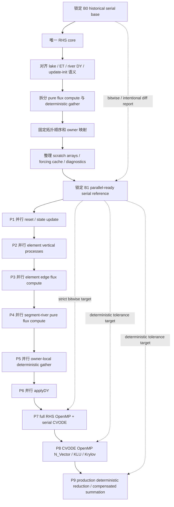
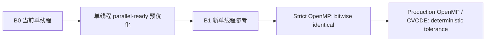

# SHUD 并行前对齐与完整并行改造路线（合并版）

> 本合并版把并行前对齐、单线程 parallel-ready 预优化、后续并行阶段和精度验收标准统一到一条路线中。

## 文档目录

1. 总览：阶段关系与 B0/B1/并行基线定义
2. 源码观察：为什么必须先做单线程 parallel-ready 对齐
3. 并行前必须完成的对齐工作
4. 单线程 parallel-ready 预优化路线
5. 后续并行阶段：每阶段改造哪些计算
6. 精度、一致性与回归验收标准
7. 风险登记与 go/no-go 检查表
8. Mermaid 路线图


---

# 00 总览：SHUD 并行前对齐与完整并行改造路线

## 1. 这次修订的核心变化

前一版文档主要回答“并行前要对齐什么”，但没有把后续并行阶段系统打包。新版的逻辑改为：

```text
先整理单线程 reference implementation
再打开 strict OpenMP 并行
最后进入 production deterministic 并行
```

也就是说，**对齐工作不是并行阶段的前置说明，而是整个并行工程的第一半部分**。如果 SHUD 当前单线程路径本身不具备并行改造基础，后面任何 OpenMP 改造都会把三类问题混在一起：

1. 物理方程路径差异；
2. 状态更新和共享副作用差异；
3. 浮点加法顺序差异。

这三类问题必须先拆开处理。

## 2. 为什么不能直接继续维护当前 `_omp` 路径

当前 `f.cpp` 在 `_OPENMP_ON` 和非 OpenMP 下调用的是两套不同 RHS 路径：

```text
OpenMP:     f_update_omp() → f_loop_omp() → f_applyDY_omp()
Serial:     f_update()     → f_loop()     → f_applyDY()
```

这意味着当前 OpenMP 路径不是串行路径的执行策略切换版，而是另一套实现。这样做的结果是：当并行结果和单线程结果不一致时，很难判断不一致来自并行、来自物理路径差异，还是来自浮点求和顺序。源码依据见 SHUD `f.cpp`：https://raw.githubusercontent.com/SHUD-System/SHUD/master/src/Model/f.cpp

因此，本路线要求：

> 后续不再以“维护 serial / omp 两套 RHS 逻辑”为目标，而是建立唯一 RHS core；OpenMP 只作为 loop policy / execution policy。

## 3. 三个基线定义

### B0：historical serial base

B0 是当前单线程 SHUD 的历史参考结果。用途是：

- 锁定当前模型行为；
- 识别单线程预优化是否改变结果；
- 为后续 intentional change 提供说明依据。

B0 不代表“数学上最准确”，只代表“当前实现的参考答案”。

### B1：parallel-ready serial reference

B1 是完成单线程 parallel-ready 预优化后的新参考实现。用途是：

- 作为 strict 并行阶段的唯一对照；
- 作为后续 production 并行容差比较对象；
- 作为长期回归测试标准。

B1 可能与 B0 完全 bitwise identical；如果在对齐阶段修复了明确的路径不一致或 bug，也可能与 B0 有差异。只要有差异，必须在变更记录中说明：

```text
差异来源：路径修复 / bug 修复 / I/O 缓存但保持语义 / 物理过程修复 / 数值算法变化
影响范围：RHS 局部数组 / 完整 run / 输出文件 / 水量平衡 / hydrograph 指标
是否接受：接受原因 + 验收指标
```

### P-strict：strict parallel result

P-strict 是 strict OpenMP 阶段的并行结果。目标是：

```text
P-strict 与 B1 bitwise identical
```

这个阶段不追求最大速度，而追求证明：**并行没有改掉模型**。

### P-prod：production deterministic result

P-prod 是 production 并行阶段的结果。可允许与 B1 有微小差异，但必须满足：

```text
同一配置多次运行可复现；
不同线程数差异可解释；
水量守恒和关键水文指标不恶化；
CVODE 统计变化可监控。
```

## 4. 总体阶段路线

```text
S0 锁定 B0 historical base
  ↓
S1 建立唯一 RHS core
  ↓
S2 对齐 serial / omp 已存在的语义差异
  ↓
S3 拆分 compute flux 与 deterministic gather
  ↓
S4 固定拓扑顺序、邻接表和 owner 映射
  ↓
S5 整理 scratch arrays、forcing cache 和诊断接口
  ↓
S6 锁定 B1 parallel-ready serial reference
  ↓
P1 并行 local state update / initialization
  ↓
P2 并行 element vertical processes
  ↓
P3 并行 element edge flux compute
  ↓
P4 并行 segment-river pure flux compute
  ↓
P5 并行 owner-local deterministic gather
  ↓
P6 并行 applyDY element / river / lake
  ↓
P7 完整 RHS OpenMP + serial CVODE
  ↓
P8 CVODE OpenMP N_Vector / KLU / Krylov / preconditioner
  ↓
P9 production deterministic reduction / compensated summation
```

## 5. 核心原则

### 原则 1：并行前先形成唯一 RHS core

不要让 `f_loop()` 和 `f_loop_omp()` 继续各自演化。正确方向是：

```cpp
rhs_core(t, Y, DY, execution_policy)
```

其中 execution policy 可以是 serial、strict_omp、production_omp；但物理过程和状态更新顺序由同一个核心实现描述。

### 原则 2：计算通量可以并行，汇总通量必须固定顺序

SHUD 中最危险的并行对象不是每个单元的局部计算，而是多个贡献项汇总到同一个 element、river 或 lake 的浮点加法。strict 模式中不应使用：

```cpp
#pragma omp atomic
sum += x;

#pragma omp parallel for reduction(+:sum)
```

OpenMP 规范明确指出，reduction 值的组合位置和组合顺序是 unspecified，不能保证 sequential 和 parallel bitwise identical。见 OpenMP reduction 规范：https://www.openmp.org/spec-html/5.0/openmpsu107.html

### 原则 3：strict 阶段只验证执行策略，不改物理过程

strict 阶段禁止把以下工作夹带进去：

- 更换 forcing 插值算法；
- 引入 Kahan / pairwise / reproducible summation；
- 调整 CVODE 容差；
- 改物理公式；
- 换线性求解器；
- 修改输出频率或 restart 语义。

这些都属于 B1 之后的独立变更，不能和 strict 并行混在一起。

### 原则 4：CVODE 内部并行晚于 RHS 并行

SUNDIALS/CVODE 支持 serial、MPI、OpenMP、Pthreads 等多种 `N_Vector` 实现，也支持多种 Krylov 线性迭代方法。见 CVODE 文档：https://sundials.readthedocs.io/en/latest/cvode/Introduction_link.html

但一旦打开 OpenMP `N_Vector`，norm、dot product、error test 等内部 reduction 顺序都可能变化，自适应步长路径也可能变化。因此必须先做到：

```text
RHS 并行 bitwise identical
完整 run + serial CVODE bitwise identical
```

然后才能进入 CVODE vector/linear solver 并行。

## 6. 推荐交付物

最终建议至少形成以下交付物：

| 交付物 | 内容 |
|---|---|
| B0 benchmark set | 小/中/大流域，含 lake/non-lake、dry/wet、边界条件和源汇项 |
| RHS snapshot harness | 固定 t、Y，导出所有关键 flux 和 DY 数组 |
| B1 reference result | 单线程 parallel-ready 实现的锁定输出 |
| deterministic topology manifest | segment/riv/ele/lake/upstream adjacency list 及排序规则 |
| strict OpenMP report | 每个阶段与 B1 的 bitwise 对比报告 |
| production tolerance report | P-prod 与 B1 的容差、守恒和性能报告 |
| risk register | 每阶段风险、触发条件和回滚方案 |

---

# 01 源码观察：为什么必须先做单线程 parallel-ready 对齐

本节只记录与“并行前对齐”和“并行阶段划分”直接相关的源码观察。它不是完整代码审查，而是为并行路线提供依据。

## 1. RHS 入口已经分成两套实现

`src/Model/f.cpp` 中，OpenMP 和 serial 条件编译调用不同函数链：

```text
OpenMP: f_update_omp(Y, DY, t) → f_loop_omp(Y, DY, t) → f_applyDY_omp(DY, t)
Serial: f_update(Y, DY, t)     → f_loop(t)            → f_applyDY(DY, t)
```

源码依据：https://raw.githubusercontent.com/SHUD-System/SHUD/master/src/Model/f.cpp

这说明当前 OpenMP 路径不是“同一 RHS 的并行执行策略”，而是另一套实现。因此，当前 OpenMP 结果和串行结果不一致时，不应先归咎于浮点加法顺序。

## 2. `f_loop()` 与 `f_loop_omp()` 的过程覆盖不一致

串行 `f_loop()` 中存在 lake element 分支：

```text
if lakeon && Ele[i].iLake > 0:
    updateLakeElement()
    fun_Ele_lakeVertical()
    qLakeEvap += ...
    qLakePrcp += ...
else:
    f_etFlux()
    updateElement()
    fun_Ele_Infiltraion()
    fun_Ele_Recharge()
```

之后还会对 lake element 调用 `fun_Ele_lakeHorizon()`，普通 element 调用 `fun_Ele_surface()` / `fun_Ele_sub()`；并在 river/segment/lake 处理后调用 `PassValue()`。源码依据：https://raw.githubusercontent.com/SHUD-System/SHUD/master/src/ModelData/MD_f.cpp

当前 `f_loop_omp()` 主要覆盖普通 element 的 update/infiltration/recharge、surface/sub、segment、river downflow，然后调用 `PassValue()`；从当前公开源码看，它没有等价覆盖串行路径中的 lake vertical/horizon 和 `f_etFlux()` 分支。源码依据：https://raw.githubusercontent.com/SHUD-System/SHUD/master/src/ModelData/MD_f_omp.cpp

这意味着 lake case、ET case 和普通 element case 在 serial/omp 路径中可能不是同一套 RHS。

## 3. `f_applyDY()` 与 `f_applyDY_omp()` 的 river DY 公式不一致

串行 `f_applyDY()` 中，river DY 先按 reach length 计算截面积变化，再限制负向变化不能超过可用截面积，最后通过 `fun_dAtodY()` 转换为水深变化：

```text
DY[iRIV] = (-QrivUp - QrivSurf - QrivSub - QrivDown + qBC) / Riv[i].Length
if DY[iRIV] < -Riv[i].u_CSarea:
    DY[iRIV] = -Riv[i].u_CSarea
DY[iRIV] = fun_dAtodY(DY[iRIV], Riv[i].u_topWidth, Riv[i].bankslope)
```

源码依据：https://raw.githubusercontent.com/SHUD-System/SHUD/master/src/ModelData/MD_f.cpp

当前 `f_applyDY_omp()` 的 river DY 则直接除以 `Riv[i].u_TopArea`，没有同样的可用截面积限制和 `fun_dAtodY()` 转换。源码依据：https://raw.githubusercontent.com/SHUD-System/SHUD/master/src/ModelData/MD_f_omp.cpp

因此，在 river stage 上，当前 OpenMP 路径不是串行路径的浮点加法重排，而是方程/变量转换路径不同。

## 4. `f_update()` 与 `f_update_omp()` 的初始化覆盖不一致

串行 `f_update()` 会执行：

- 清零 element flux arrays；
- 更新 `uYsf/uYus/uYgw`；
- 处理 element BC；
- 清零 `qEleExfil/qEleInfil`；
- 更新 river stage 和 river BC；
- 清零 `QrivSurf/QrivSub/QrivUp`、`Qe2r_*`；
- 更新 lake stage、lake area；
- 清零 lake 相关 flux；
- 清零 `DY`。

源码依据：https://raw.githubusercontent.com/SHUD-System/SHUD/master/src/ModelData/MD_update.cpp

当前 `f_update_omp()` 覆盖 element、river、DY 清零，但从当前公开源码看没有等价覆盖 lake 更新和 lake flux 清零。源码依据：https://raw.githubusercontent.com/SHUD-System/SHUD/master/src/ModelData/MD_f_omp.cpp

这说明并行前必须先统一 update/init 语义，避免“脏数组”“未清零”“lake 状态未更新”等差异。

## 5. `PassValue()` 是共享浮点累加的集中风险点

串行 `PassValue()` 会执行三类汇总：

```text
segment → river:
    QrivSurf[ir] += QsegSurf[i]
    QrivSub[ir]  += QsegSub[i]

segment → element:
    Qe2r_Surf[ie] += -QsegSurf[i]
    Qe2r_Sub[ie]  += -QsegSub[i]

upstream river → downstream river:
    QrivUp[iDownStrm] += -QrivDown[i]
```

源码依据：https://raw.githubusercontent.com/SHUD-System/SHUD/master/src/ModelData/MD_f.cpp

如果直接把这些循环改成 OpenMP 并行，并使用 `atomic +=` 或普通 `reduction`，虽然可以避免 data race，但无法保证与单线程相同的浮点加法顺序。strict 阶段必须把它改成 owner-local deterministic gather。

## 6. `fun_Seg_surface()` / `fun_Seg_sub()` 不能继续把“通量计算”和“汇总”绑在一起

`Model_Data.hpp` 显示 SHUD 当前有 `QsegSurf/QsegSub`、`QrivSurf/QrivSub`、`Qe2r_Surf/Qe2r_Sub`、`QLake*` 等 flux arrays。segment-river 交换如果在 flux 函数内部直接写入 river/element accumulator，就会形成并行共享写风险。相关结构定义见：https://raw.githubusercontent.com/SHUD-System/SHUD/master/src/ModelData/Model_Data.hpp

后续应把 segment-river 计算拆成两步：

```text
compute_segment_flux(i) → 只写 QsegSurf[i], QsegSub[i]
gather_segment_flux(owner) → 按固定顺序写 Qriv*, Qe2r_*
```

## 7. forcing 读取本身适合单线程预优化，但不能在 strict 并行阶段改变语义

`TimeSeriesData::read_csv()` 当前每次 refill 会重新打开文件，跳过 `MAXQUE * nQue + 2` 行，再读下一段；`getX()` 直接返回当前行值，不做插值。源码依据：https://raw.githubusercontent.com/SHUD-System/SHUD/master/src/classes/TimeSeriesData.cpp

forcing cache / preload 是加速方向，但它应放在单线程预优化阶段完成，并且在 B1 锁定前证明：

```text
同一 t、同一 col 下 getX(t, col) 与 B0 完全一致
```

如果后续要引入 forcing interpolation，那属于精度路线或 production numerical improvement，不能混入 strict 并行。

## 8. CVODE 相关优化应晚于 RHS strict 并行

`Control_Data` 当前主要暴露 `num_threads`、`abstol`、`reltol`、`InitStep`、`MaxStep` 等控制量。源码依据：https://raw.githubusercontent.com/SHUD-System/SHUD/master/src/classes/Model_Control.hpp

SUNDIALS/CVODE 支持多种 `N_Vector` 实现，包括 serial、MPI、OpenMP、Pthreads 等；也支持 GMRES、FGMRES、Bi-CGStab、TFQMR、PCG 等 Krylov 方法，并指出对大规模刚性系统 Krylov 方法通常优于直接法，预条件器通常很关键。文档依据：https://sundials.readthedocs.io/en/latest/cvode/Introduction_link.html

但这些改变会影响 CVODE 内部 norm、dot product、误差测试和线性求解路径，可能改变自适应步长序列。因此必须晚于 RHS strict 并行。

## 9. 结论

当前 SHUD 并行改造不能直接从 `#pragma omp parallel for` 开始。必须先做：

1. 唯一 RHS core；
2. serial/omp 语义对齐；
3. flux compute 与 gather 拆分；
4. fixed-order topology；
5. forcing/cache 语义锁定；
6. B1 parallel-ready serial reference。

只有这些完成后，后续并行阶段才能真正回答：

```text
并行是否正确？
并行是否快？
差异是否来自合理的 production 数值策略？
```

---

# 02 并行前必须完成的对齐工作

本节回答：**在真正开始并行前，SHUD 需要先对齐什么？**

关键原则是：并行阶段只能改“执行方式”，不应同时修“模型路径”。因此，凡是会导致 serial/parallel 语义不一致、会影响浮点加法顺序、会造成共享写入风险的工作，都应前移到单线程 parallel-ready 阶段。

## A0. 锁定 B0 historical serial base

### 目标

在任何代码改造前，先锁定当前单线程 SHUD 的行为。

### 要做的事

1. 选定最小标准算例：
   - 无 lake、小流域、短时段；
   - 有 lake、小流域、短时段；
   - 中等流域、含 river network；
   - 边界条件 / source-sink 激活算例；
   - dry/wet transition 算例。
2. 固定编译选项：
   - 禁止 `-ffast-math`；
   - 禁止非受控 FMA contraction；
   - 固定优化级别，例如 `-O2`；
   - 固定 SUNDIALS 版本。
3. 记录输出：
   - 所有 model output；
   - CVODE stats；
   - RHS call count；
   - wall-clock 和 I/O 时间；
   - 关键 flux/DY snapshots。

### 精度标准

B0 是历史基线，不需要和其他结果比。它的要求是：

```text
同一二进制、同一输入、多次单线程运行 bitwise identical。
```

如果 B0 自身不可复现，必须先解决 I/O、未初始化变量或非确定性路径问题。

### 风险

如果 B0 算例太少，会导致后续 B1 和并行验收覆盖不够。尤其需要覆盖 lake，因为当前 serial/omp 路径在 lake 处理上存在明显差异。

---

## A1. 建立唯一 RHS core

### 目标

把当前 `f_update/f_loop/f_applyDY` 与 `_omp` 路径整合为同一套 RHS core。

### 要做的事

当前入口：

```text
OpenMP: f_update_omp → f_loop_omp → f_applyDY_omp
Serial: f_update     → f_loop     → f_applyDY
```

应重构为：

```cpp
int f(double t, N_Vector CV_Y, N_Vector CV_Ydot, void *DS) {
    double* Y  = get_data(CV_Y);
    double* DY = get_data(CV_Ydot);
    MD->rhs_core(Y, DY, t, ExecPolicy::Serial);      // B1 阶段
    // 后续 strict OpenMP:
    // MD->rhs_core(Y, DY, t, ExecPolicy::StrictOMP);
}
```

`rhs_core()` 内部的过程顺序只写一份：

```text
reset/update state
  → element vertical processes
  → element/lake horizontal processes
  → segment-river flux compute
  → river downflow compute
  → deterministic gather
  → apply DY
```

### 精度标准

A1 完成后，如果只是函数组织调整，要求：

```text
RHS snapshots 与 B0 bitwise identical；
完整 run 与 B0 bitwise identical；
CVODE stats 与 B0 identical。
```

如果发现旧 `_omp` 路径与 serial 路径不同，不应把 `_omp` 路径作为 B1 依据；B1 首先继承 serial 语义。

### 风险

把代码抽成统一 core 时容易改变过程顺序。尤其是：

- ET 与 infiltration/recharge 的相对顺序；
- lake vertical/horizon 的相对顺序；
- `PassValue()` 调用位置；
- river downflow 与 segment flux 的先后关系。

这些顺序必须先按 B0 serial 固定。

---

## A2. 对齐已存在的 serial/omp 语义差异

### 目标

把当前 `_omp` 路径中缺失或不一致的逻辑，统一回 B1 serial RHS core 中。重点不是“修 OpenMP”，而是明确 B1 的唯一语义。

### 必须检查和对齐的事项

| 项 | 当前风险 | B1 处理原则 |
|---|---|---|
| lake vertical process | serial `f_loop()` 有 lake element 分支，`f_loop_omp()` 不等价 | B1 core 必须显式包含 lake vertical |
| lake horizon process | serial 对 lake element 调 `fun_Ele_lakeHorizon()` | B1 core 必须包含同等逻辑 |
| lake evaporation/precip accumulation | serial 中 `qLakeEvap/qLakePrcp += ...` | B1 先保持 serial 顺序；后续拆为 deterministic gather |
| ET | serial 普通 element 调 `f_etFlux()` | B1 必须明确 ET 调用位置 |
| river DY | serial 有 length、area clamp、`fun_dAtodY()`；omp 直接除 `u_TopArea` | B1 采用 serial 语义，除非另立数值修正变更 |
| lake DY | serial `f_applyDY()` 写 lake DY | B1 必须包含 lake DY |
| update/init | serial 清零 lake flux 和更新 lake area；omp 不等价 | B1 必须完整 reset |
| boundary/source-sink | serial/omp 细节需逐项比较 | B1 固定为单一实现 |
| negative state clipping | serial 和 omp 对 `Y` 是否 `max(0, Y)` 有差异 | 必须明确 B1 采用哪种语义，并解释 |

### 精度标准

如果 A2 只是把后续 parallel-ready core 明确继承 serial 语义，则 B1 仍应与 B0 bitwise identical。

如果 A2 修复了明确 bug，例如 `_omp` 路径缺 lake，但 B1 仍使用 serial 逻辑，则 B0 不变。只有当 serial 本身有明确 bug 并被修复时，才允许 B1 与 B0 不一致。

### 风险

A2 最容易把“并行对齐”误做成“物理修正”。建议规则：

```text
凡是会改变 B0 serial 输出的修复，必须单独立项，不混入并行对齐。
```

---

## A3. 拆分 compute flux 与 gather

### 目标

把所有“计算通量时顺手累加到 owner”的代码拆成两步：

```text
pure compute:     每条 edge/segment/lake-element 只写唯一 flux slot
deterministic gather: 每个 owner 按固定顺序汇总自己的贡献
```

### 需要拆的对象

| 对象 | 当前/潜在风险 | 改造方向 |
|---|---|---|
| segment → river | `QrivSurf[ir] += QsegSurf[i]` | `seg_by_riv[ir]` 固定顺序 gather |
| segment → element | `Qe2r_Surf[ie] += -QsegSurf[i]` | `seg_by_ele[ie]` 固定顺序 gather |
| upstream → downstream river | `QrivUp[down] += -QrivDown[i]` | `upstream_by_down[down]` 固定顺序 gather |
| lake element → lake | `qLakeEvap[lake] += ...` | `ele_by_lake[lake]` 固定顺序 gather |
| element neighbor flux | 可能双写邻居 flux | edge-owner 或 owner-local fixed j loop |
| global summaries | 水量平衡统计 | 单独 deterministic summary pass |

### 推荐模式

不推荐：

```cpp
#pragma omp parallel for
for (int i = 0; i < NumSegmt; ++i) {
    int ir = RivSeg[i].iRiv - 1;
    #pragma omp atomic
    QrivSurf[ir] += QsegSurf[i];
}
```

推荐：

```cpp
#pragma omp parallel for schedule(static)
for (int iseg = 0; iseg < NumSegmt; ++iseg) {
    compute_segment_flux(iseg);  // 只写 QsegSurf[iseg], QsegSub[iseg]
}

#pragma omp parallel for schedule(static)
for (int ir = 0; ir < NumRiv; ++ir) {
    double surf = 0.0;
    double sub  = 0.0;
    for (int k = 0; k < nseg_by_riv[ir]; ++k) {
        int iseg = seg_by_riv[ir][k]; // 固定升序
        surf += QsegSurf[iseg];
        sub  += QsegSub[iseg];
    }
    QrivSurf[ir] = surf;
    QrivSub[ir]  = sub;
}
```

### 精度标准

A3 在单线程中完成时，应先按 B0 的贡献顺序构造 adjacency list。若排序与 B0 循环顺序一致，则应达到：

```text
RHS snapshots 与 B0 bitwise identical。
```

如果 owner-local gather 的顺序与 B0 的全局 loop 顺序不同，会产生浮点 bit 差异。strict 阶段不允许这种差异，除非把 B1 明确锁定为新的 fixed-order reference。

### 风险

拆分后数组数量增加，内存上升；但这是换取 deterministic parallelism 的必要成本。

---

## A4. 固定拓扑顺序和 owner 映射

### 目标

让所有汇总都有确定的 owner 和确定的贡献顺序。

### 需要建立的 adjacency / owner list

| 名称 | 用途 | 排序规则 |
|---|---|---|
| `seg_by_riv[ir]` | river 汇总来自 segment 的 surface/sub flux | 原始 segment id 升序，或与 B0 loop 等价 |
| `seg_by_ele[ie]` | element 汇总来自 river segment 的交换 flux | 原始 segment id 升序，或与 B0 loop 等价 |
| `upstream_by_down[ir]` | downstream river 汇总 upstream downflow | upstream river id 升序，或与 B0 loop 等价 |
| `ele_by_lake[ilake]` | lake 汇总湖面降水/蒸发/湖岸 flux | element id 升序，或与 B0 loop 等价 |
| `edge_by_ele[ie]` | element total 汇总三个邻边 flux | 保持 `j=0..2` |
| `edge_owner[e]` | 每条 element-element edge 的唯一计算 owner | 固定规则，例如较小 element id owns |

### 精度标准

拓扑 list 构造本身不改变结果。用这些 list 替换原循环后要求：

```text
若贡献顺序等价于 B0：bitwise identical；
若贡献顺序不等价：必须先锁定为 B1，并记录差异。
```

### 风险

拓扑 list 的排序规则一旦改变，会改变浮点求和顺序。必须把排序规则写入 manifest，并纳入回归测试。

---

## A5. 整理 scratch arrays 与共享状态

### 目标

把所有临时数组和状态更新变成 owner-local 或 thread-local，避免隐式共享副作用。

### 要检查的对象

1. `qEle*`、`Qele*`、`Qseg*`、`Qriv*`、`QLake*`；
2. `Ele[i]`、`Riv[i]`、`lake[i]` 内部 update 函数是否写共享对象；
3. global variables：`uYsf/uYus/uYgw/uYriv/uYlake/globalY/timeNow/lakeon`；
4. debug / print / flood warning 是否在 RHS 内写共享文件；
5. NaN check 是否有非线程安全输出。

### 改造原则

```text
每个数组元素只能有唯一 owner 写入；
跨 owner 的贡献先写 flux slot，不直接写 accumulator；
线程内部临时变量放 stack 或 thread-local scratch；
RHS 内不做文件输出；
诊断输出放在 RHS 外部，或 strict serial diagnostic mode。
```

### 精度标准

A5 只整理写入所有权，不应改变公式和顺序。要求：

```text
RHS snapshots 与 B0/B1 bitwise identical。
```

### 风险

`Ele[i].updateElement()`、`Riv[i].updateRiver()`、`lake[i].update()` 若内部依赖全局变量或写共享对象，需要进一步拆出 pure update 或明确 owner。

---

## A6. forcing cache 与输入访问优化

### 目标

减少 forcing 反复读文件造成的 I/O 开销，同时不改变 `getX()` 语义。

### 背景

当前 `_TimeSeriesData::read_csv()` 每次 refill 都会重新打开文件，并跳过已读队列行。`getX()` 返回当前 queue 行的值。源码依据：https://raw.githubusercontent.com/SHUD-System/SHUD/master/src/classes/TimeSeriesData.cpp

### 要做的事

1. 先实现语义等价缓存：
   - 保持同样的时间单位转换；
   - 保持同样的 `movePointer()` 逻辑；
   - 保持 `getX()` 零阶取值，不引入插值。
2. 对每个 forcing 文件建立只读缓存或流式 reader：
   - 小文件可 preload；
   - 大文件可 memory-map / buffered sequential reader；
   - 禁止在 RHS 中反复打开文件。
3. 在 RHS snapshot 中比较所有 `tsd_*getX(t, col)` 返回值。

### 精度标准

```text
同一 t、同一 col，cache getX() 与 B0 getX() bitwise identical；
完整 run 与 B0/B1 bitwise identical。
```

### 风险

如果同时引入 forcing interpolation，会改变数值解；这属于精度路线，不属于 strict 并行前置优化。

---

## A7. 建立 RHS snapshot 和完整 run 验证工具

### 目标

后续每次改造都可以定位差异来自哪里。

### RHS snapshot 至少导出

```text
Y
DY
uYsf/uYus/uYgw/uYriv/uYlake
qElePrep/qEleNetPrep/qEleInfil/qEleExfil/qEleRecharge
qEs/qEu/qEg/qTu/qTg/qEleETP/qEleETA
QeleSurf/QeleSub/QeleSurfTot/QeleSubTot
QsegSurf/QsegSub
Qe2r_Surf/Qe2r_Sub
QrivSurf/QrivSub/QrivUp/QrivDown
QLakeSurf/QLakeSub/QLakeRivIn/QLakeRivOut/qLakeEvap/qLakePrcp
```

### 验证方法

1. 固定 `t` 和 `Y`，直接调用 RHS；
2. 对每个数组做：
   - bitwise compare；
   - max absolute error；
   - max relative error；
   - ULP histogram；
   - first mismatch index；
3. 完整 run 对比：
   - 输出文件；
   - CVODE stats；
   - RHS call count；
   - internal steps；
   - error test failures；
   - linear solver iterations。

### 精度标准

A7 是工具阶段，不改变模型。工具自身需要通过自测：同一文件和自身比较必须全通过；故意扰动一个数组值时必须能定位。

---

## A8. 锁定 B1 parallel-ready serial reference

### 目标

B1 是后续并行的唯一 base。

### B1 必须具备的性质

1. 唯一 RHS core；
2. flux compute 与 gather 已拆分；
3. 拓扑顺序固定；
4. forcing 访问语义锁定；
5. scratch arrays owner 明确；
6. 单线程完整 run 可复现；
7. strict instrumentation 可定位差异。

### B1 验收标准

理想目标：

```text
B1 与 B0 bitwise identical。
```

允许例外：如果 B1 包含明确 bug fix 或路径修复，则必须提供：

```text
B1_CHANGELOG.md
B0_vs_B1_RHS_report.md
B0_vs_B1_full_run_report.md
water_balance_report.md
hydrograph_metric_report.md
```

只有 B1 被锁定后，才进入并行阶段。

---

# 03 单线程 parallel-ready 预优化路线

本节回答：**为了保证更高并行效率和精度，为什么要先优化单线程 SHUD？具体优化什么？**

这里的“单线程优化”不是单纯追求单线程速度，而是把 SHUD 整理成后续并行可以安全接管的 reference implementation。

## 1. 单线程预优化的定位

### 不应做的事

单线程预优化阶段不应混入：

- 新物理过程；
- 新 forcing 插值方案；
- 新 CVODE 线性求解器；
- 新误差容差策略；
- pairwise / Kahan / superaccumulator 等新求和算法；
- 基于 OpenMP reduction 的并行汇总。

### 应做的事

单线程预优化阶段应完成：

1. 统一 RHS 路径；
2. 复用当前 serial 语义；
3. 拆分纯计算与汇总；
4. 固定拓扑顺序；
5. 降低 I/O 和重复更新开销；
6. 建立强验证工具；
7. 锁定 B1。

## 2. 为什么这一步能提升并行效率

如果不先做 parallel-ready 预优化，后续并行会遇到三个效率瓶颈：

### 2.1 共享累加导致 atomic/critical 开销

如果继续使用：

```cpp
QrivSurf[ir] += QsegSurf[i];
Qe2r_Surf[ie] += -QsegSurf[i];
```

后续并行时只能使用 atomic、critical 或私有副本合并。atomic/critical 会造成严重同步开销；私有副本合并如果无固定顺序，会破坏 bitwise reproducibility。

预优化通过 deterministic gather 把这类开销改为 owner-local loop。

### 2.2 两套 RHS 路径导致并行调试成本暴涨

如果继续维护 `f_loop()` 和 `f_loop_omp()` 两套实现，每次发现误差，都要同时排查：

```text
路径是否少算了过程？
数组是否没清零？
浮点顺序是否变化？
线程是否 data race？
```

统一 RHS core 后，strict 并行阶段只需要排查执行策略和写入所有权。

### 2.3 forcing I/O 和重复状态更新会掩盖真正计算热点

当前 forcing 读取存在反复打开文件和跳行的模式；同时某些状态 update 可能在 forcing update 和 RHS loop 中重复执行。单线程阶段先做缓存和 update 合并，能让后续并行 profiler 更真实地看到计算热点。

## 3. 为什么这一步能保证并行精度

并行精度的核心不是“每个线程都算得对”，而是：

```text
每个状态变量、通量变量和 DY 的写入 owner 明确；
每个浮点求和的贡献顺序明确；
每个过程只执行一次，且执行顺序可验证。
```

单线程预优化会把这些规则先落实到 B1。后续 strict OpenMP 只在 B1 上加 execution policy。

## 4. 单线程预优化阶段清单

| 阶段 | 目标 | 主要改造 | 是否允许改变 B0 输出 | 交付物 |
|---|---|---|---|---|
| S0 | 锁定 B0 | benchmark、RHS snapshot、CVODE stats | 不涉及 | B0 report |
| S1 | 唯一 RHS core | 合并 serial/omp 逻辑，统一过程顺序 | 原则上不允许 | `rhs_core()` |
| S2 | 语义对齐 | lake、ET、river DY、update/init 对齐 | 原则上不允许；bug fix 需单列 | semantic diff report |
| S3 | flux/gather 拆分 | pure compute + deterministic gather | 不允许，除非求和顺序变化被锁为 B1 | topology/gather report |
| S4 | 拓扑固定 | owner mapping、adjacency list、排序 manifest | 不允许 | topology manifest |
| S5 | scratch/状态整理 | owner-local arrays、thread-safe diagnostics | 不允许 | ownership map |
| S6 | forcing cache | 语义等价 cache/preload | 不允许 | forcing equivalence report |
| S7 | profile/instrument | wall-clock、RHS、I/O、CVODE stats | 不允许 | profile report |
| S8 | 锁定 B1 | B1 benchmark set | B1 可与 B0 相同或带解释差异 | B1 reference |

## 5. 推荐的单线程架构形态

### 5.1 RHS core 结构

建议把 RHS 拆成以下阶段：

```cpp
void rhs_core(double* Y, double* DY, double t, ExecPolicy policy) {
    rhs_reset_and_update_state(Y, DY, t, policy);
    rhs_element_vertical(t, policy);
    rhs_element_horizontal_flux(t, policy);
    rhs_segment_river_flux(t, policy);
    rhs_river_downflow(t, policy);
    rhs_lake_flux(t, policy);
    rhs_deterministic_gather(policy);
    rhs_apply_dy(DY, t, policy);
}
```

在 B1 阶段，`policy = Serial`，但所有函数已经具备 owner-local 和 fixed-order 结构。

### 5.2 flux storage

推荐把“通量计算结果”和“汇总结果”明确分开：

```text
QsegSurf/QsegSub       = segment flux slots
QedgeSurf/QedgeSub     = element-edge flux slots, if needed
QLakeEleSurf/Sub       = lake-element flux slots, if needed
QrivSurf/QrivSub       = river owner gather result
Qe2r_Surf/Qe2r_Sub     = element owner gather result
QrivUp                 = downstream river owner gather result
QeleSurfTot/SubTot     = element owner gather result
```

### 5.3 topology manifest

B1 需要保存拓扑排序规则，例如：

```yaml
segment_order: original_input_order
seg_by_riv_order: segment_id_ascending_matching_B0_loop
seg_by_ele_order: segment_id_ascending_matching_B0_loop
upstream_by_down_order: river_id_ascending_matching_B0_loop
lake_ele_order: element_id_ascending_matching_B0_loop
edge_owner_rule: min(element_id_i, element_id_j)
```

这个 manifest 不只是文档，也是回归测试的一部分。

### 5.4 diagnostics

RHS 内部不应直接输出大量日志。建议形成：

```text
RHS diagnostic buffer
  → RHS 结束后 serial dump
  → full run report
```

这样可以避免并行后文件输出顺序造成非确定性。

## 6. 单线程预优化中的精度标准

### 6.1 纯重构阶段

如果只是重排代码结构，但保持公式和求和顺序，要求：

```text
RHS bitwise identical with B0
full run bitwise identical with B0
CVODE stats identical with B0
```

### 6.2 fixed-order gather 阶段

如果 deterministic gather 的顺序与 B0 完全一致，仍要求 bitwise identical。

如果为了更适合并行而改变了 gather 顺序，应当：

1. 不在 strict 并行阶段做；
2. 先以单线程形式建立新 B1；
3. 报告 B0→B1 差异；
4. 后续 strict 并行只对 B1 做 bitwise identical。

### 6.3 forcing cache 阶段

forcing cache 必须逐点验证：

```text
for all tested t, col:
    old_getX(t, col) == cached_getX(t, col) bitwise
```

### 6.4 intentional bug fix 阶段

如果修复了 serial 本身的 bug，不能用“bitwise identical”作为验收，而应使用：

```text
局部 RHS 差异解释
水量平衡不恶化
关键输出差异可解释
回归报告记录为 B1 intentional change
```

## 7. 单线程预优化完成后的 go/no-go 条件

进入并行阶段前，必须满足：

- [ ] B0 已锁定；
- [ ] B1 已锁定；
- [ ] B1 单线程多次运行 bitwise identical；
- [ ] RHS snapshot 工具可用；
- [ ] full run 对比工具可用；
- [ ] topology manifest 可用；
- [ ] 所有 shared accumulation 已拆为 deterministic gather；
- [ ] 所有 process path 已在唯一 RHS core 中定义；
- [ ] forcing cache 与 B0/B1 语义一致；
- [ ] 编译选项固定且无 fast-math；
- [ ] 后续并行阶段的目标数组 owner 已明确。

如果其中任一项未满足，不建议进入 OpenMP 阶段。

---

# 04 后续并行阶段：每阶段改造哪些计算

本节回答：**在 B1 parallel-ready serial reference 建立后，每个并行阶段要改造哪些计算？**

原则：

```text
先并行无共享写的 local map；
再并行 pure flux compute；
再并行 owner-local deterministic gather；
最后才进入 CVODE 内部并行和 production reduction。
```

## P0. 并行执行策略框架

### 目标

在不改变 RHS core 语义的前提下，引入 execution policy。

### 改造对象

```cpp
enum class ExecPolicy {
    Serial,
    StrictOMP,
    ProductionOMP
};
```

所有 RHS 子过程都接收 policy：

```cpp
rhs_element_vertical(t, policy);
rhs_segment_river_flux(t, policy);
rhs_deterministic_gather(policy);
```

### 并行方式

P0 不真正并行，只建立接口。

### 精度标准

```text
policy = Serial 时，结果与 B1 bitwise identical。
```

---

## P1. 并行 reset / state update / initialization

### 目标

并行化最安全的 owner-local state update。

### 可改造计算

| 计算 | 并行方式 | owner |
|---|---|---|
| `DY[i] = 0` | `parallel for schedule(static)` | state index |
| `uYsf/uYus/uYgw` 更新 | element loop | element |
| element BC/SS 更新 | element loop | element |
| `qEleExfil/qEleInfil/...` 清零 | element loop | element |
| `uYriv`、`Riv[i].updateRiver()` | river loop | river |
| river BC 更新 | river loop | river |
| lake stage、area、lake flux 清零 | lake loop | lake |

### 不允许做的事

- 不允许在 update 阶段汇总跨 element/river/lake 的 flux；
- 不允许 debug print；
- 不允许对共享全局计数器做非原子写。

### 精度标准

```text
P1 RHS snapshot 与 B1 bitwise identical；
完整 run 与 B1 bitwise identical；
CVODE stats identical。
```

### 风险

`Ele[i].updateElement()`、`Riv[i].updateRiver()`、`lake[i].update()` 若内部写共享对象，会破坏并行安全。需要先审查这些函数是否只改自身对象。

---

## P2. 并行 element vertical processes

### 目标

并行化 element-local 垂向过程。

### 可改造计算

| 计算 | 说明 | owner |
|---|---|---|
| `f_etFlux(i,t)` | ET / canopy / snow / forcing local calculation | element |
| `Ele[i].updateElement()` | hydraulic properties update | element |
| `fun_Ele_Infiltraion(i,t)` | infiltration | element |
| `fun_Ele_Recharge(i,t)` | recharge | element |
| lake element vertical local terms | lake element 上的 local vertical flux | element |

### 前提条件

这些函数必须只写：

```text
Ele[i] 自身字段；
qEle*[i]；
yEle*[i]；
局部 scratch。
```

如果会写 `qLakeEvap[lake] += ...` 或其他 shared accumulator，必须改成：

```text
qLakeEvap_by_ele[i] = ...
qLakePrcp_by_ele[i] = ...
```

然后交给 P5 owner-local gather。

### 精度标准

strict 阶段：

```text
P2 与 B1 RHS bitwise identical。
```

由于 element vertical 是 owner-local，理论上最容易达到 bitwise identical。

### 风险

ET 或 snow 过程可能依赖 forcing pointer 状态。如果 forcing pointer 在 RHS 内被修改，必须保证 pointer update 在 RHS 前串行完成，或保证所有线程只读当前 forcing 值。

---

## P3. 并行 element horizontal / edge flux compute

### 目标

并行化 element-element surface/subsurface lateral flux 计算。

### 可改造计算

| 计算 | 说明 |
|---|---|
| `fun_Ele_surface(i,t)` | element surface lateral flux |
| `fun_Ele_sub(i,t)` | element subsurface lateral flux |
| edge-owner flux compute | 每条 edge 只计算一次 |

### 推荐策略

#### 策略 A：保持 element-owner + 固定 j loop

如果现有 `QeleSurf[i][j]` / `QeleSub[i][j]` 的写入只由 element `i` 自己负责，并且 `j=0..2` 顺序固定，则可以：

```cpp
#pragma omp parallel for schedule(static)
for (int i = 0; i < NumEle; ++i) {
    fun_Ele_surface(i, t);
    fun_Ele_sub(i, t);
}
```

前提是函数内部不写邻居的 `QeleSurf[inabr][jnabr]`。

#### 策略 B：改为 edge-owner flux slots

如果函数会同时写两侧 element，推荐改为 edge-owner：

```text
for each edge e:
    compute flux once
    QedgeSurf[e] = flux
    QedgeSub[e]  = flux

for each element i:
    gather its three edge fluxes in j=0..2 order
```

### 精度标准

如果使用策略 A 且写入顺序与 B1 相同：

```text
bitwise identical。
```

如果改为 edge-owner，单线程 B1 必须先建立并验证；并行阶段仍需与 B1 bitwise identical。

### 风险

element-element flux 是并行中最容易发生“双写邻居”的部分。必须先用 instrumentation 检查每个 `QeleSurf[i][j]` 和 `QeleSub[i][j]` 是否唯一写入。

---

## P4. 并行 segment-river pure flux compute

### 目标

并行化 river segment 与 element 的交换通量计算，但不做汇总。

### 可改造计算

| 计算 | 改造目标 |
|---|---|
| `fun_Seg_surface(iEle, iRiv, iSeg)` | 只写 `QsegSurf[iSeg]` |
| `fun_Seg_sub(iEle, iRiv, iSeg)` | 只写 `QsegSub[iSeg]` |

### 推荐结构

```cpp
#pragma omp parallel for schedule(static)
for (int iseg = 0; iseg < NumSegmt; ++iseg) {
    int ie = RivSeg[iseg].iEle - 1;
    int ir = RivSeg[iseg].iRiv - 1;
    QsegSurf[iseg] = compute_seg_surface(ie, ir, iseg, t);
    QsegSub[iseg]  = compute_seg_sub(ie, ir, iseg, t);
}
```

### 不允许做的事

```cpp
QrivSurf[ir] += QsegSurf[iseg];
Qe2r_Surf[ie] += -QsegSurf[iseg];
```

这些必须放到 P5 gather。

### 精度标准

```text
QsegSurf/QsegSub 与 B1 bitwise identical；
RHS snapshot 与 B1 bitwise identical。
```

### 风险

如果原函数内部同时做 compute 和 accumulate，拆分时要确保物理公式和符号方向完全一致。

---

## P5. 并行 owner-local deterministic gather

### 目标

并行化汇总，但保持每个 owner 内的浮点加法顺序固定。

### 可改造计算

| gather | owner | 贡献顺序 |
|---|---|---|
| segment → river | river | `seg_by_riv[ir]` |
| segment → element | element | `seg_by_ele[ie]` |
| upstream → downstream river | downstream river | `upstream_by_down[ir]` |
| lake element → lake | lake | `ele_by_lake[ilake]` |
| element edge → element total | element | `j=0..2` |

### 推荐结构

```cpp
#pragma omp parallel for schedule(static)
for (int ir = 0; ir < NumRiv; ++ir) {
    double surf = 0.0;
    double sub  = 0.0;
    for (int k = 0; k < seg_by_riv[ir].size(); ++k) {
        int iseg = seg_by_riv[ir][k];
        surf += QsegSurf[iseg];
        sub  += QsegSub[iseg];
    }
    QrivSurf[ir] = surf;
    QrivSub[ir]  = sub;
}
```

### 为什么不用 OpenMP reduction

OpenMP reduction 中值的组合位置和组合顺序未指定，不能保证与串行 bitwise identical。见规范：https://www.openmp.org/spec-html/5.0/openmpsu107.html

### 精度标准

strict 阶段：

```text
所有 gather 输出数组与 B1 bitwise identical。
```

需要比较：

```text
Qe2r_Surf/Qe2r_Sub
QrivSurf/QrivSub/QrivUp
QLakeSurf/QLakeSub/QLakeRivIn/QLakeRivOut/qLakeEvap/qLakePrcp
QeleSurfTot/QeleSubTot
```

### 风险

如果 owner 内贡献顺序与 B1 不一致，结果可能出现 1–若干 ULP 差异。strict 阶段不接受此差异。

---

## P6. 并行 applyDY

### 目标

并行化 element、river、lake 的 DY 写入。

### 可改造计算

| 计算 | owner | 风险 |
|---|---|---|
| element DY | element | 低 |
| river DY | river | 中，必须使用 B1 serial 公式 |
| lake DY | lake | 中，需 lake flux gather 已完成 |

### 推荐结构

```cpp
#pragma omp parallel for schedule(static)
for (int i = 0; i < NumEle; ++i) {
    apply_dy_element(i, DY, t);
}

#pragma omp parallel for schedule(static)
for (int i = 0; i < NumRiv; ++i) {
    apply_dy_river(i, DY, t);
}

#pragma omp parallel for schedule(static)
for (int i = 0; i < NumLake; ++i) {
    apply_dy_lake(i, DY, t);
}
```

### 精度标准

```text
DY 全量与 B1 bitwise identical。
```

### 风险

当前 `f_applyDY_omp()` 的 river DY 公式与 serial 不一致，P6 必须使用 B1 的统一公式，不能继承旧 `_omp` 公式。

---

## P7. 完整 RHS OpenMP + serial CVODE

### 目标

在 CVODE 仍使用 serial `N_Vector` / 原线性求解器的前提下，只并行 SHUD RHS 应用层。

### 改造对象

- `rhs_core(..., ExecPolicy::StrictOMP)`；
- 所有 RHS 子阶段使用 OpenMP；
- CVODE vector 层暂不换 OpenMP `N_Vector`；
- 不换线性求解器；
- 不改容差。

### 精度标准

如果 P1–P6 均通过，P7 应达到：

```text
RHS snapshots 与 B1 bitwise identical；
完整 run 输出与 B1 bitwise identical；
CVODE internal stats identical；
RHS call count identical。
```

### 风险

如果完整 run 不一致，但 RHS snapshots 一致，问题可能来自：

- CVODE vector data access 差异；
- 未初始化变量；
- 输出/summary 的并行副作用；
- 非确定性 debug/log；
- 编译器因 OpenMP 开关改变 floating behavior。

---

## P8. CVODE vector / linear solver 并行与稀疏求解

### 目标

进入高性能 production 阶段，优化 CVODE 内部向量运算和线性求解层。

### 可改造计算

| 改造 | 目的 | 备注 |
|---|---|---|
| OpenMP `N_Vector` | 加速 CVODE vector ops | 可能改变 norm/dot product reduction 顺序 |
| Sparse matrix / KLU | 中小规模稀疏直接解 | 需要 Jacobian/sparsity 支持 |
| GMRES / FGMRES | 大规模刚性系统 | 需要预条件器 |
| physics-block preconditioner | 降低 Krylov 迭代 | 设计复杂 |
| vector absolute tolerance | 按变量尺度控制误差 | 精度路线相关 |

SUNDIALS/CVODE 文档指出其支持多种 `N_Vector` 实现，包括 OpenMP/Pthreads/MPI，也支持 GMRES、FGMRES 等 Krylov 方法；对于大规模刚性系统，Krylov 方法通常更可行，预条件器很关键。文档见：https://sundials.readthedocs.io/en/latest/cvode/Introduction_link.html

### 精度标准

P8 不再要求与 B1 bitwise identical，而进入 deterministic tolerance：

```text
同一配置多次运行 deterministic；
与 B1 的状态差异在 CVODE 容差尺度内；
水量守恒不恶化；
NSE/KGE/peak/balance 等水文指标差异可接受；
CVODE stats 变化可解释。
```

### 风险

CVODE 内部 reduction 顺序改变可能导致 error test 结果和内部步长序列改变。即使 RHS 本身 bitwise identical，完整 run 也可能不再 bitwise identical。

---

## P9. production deterministic reduction / compensated summation

### 目标

在生产模式下进一步提高数值稳定性和并行效率。

### 可选策略

| 策略 | 作用 | 是否与 B1 bitwise identical |
|---|---|---|
| fixed pairwise summation | 降低求和误差，固定顺序 | 通常否 |
| Kahan / Neumaier summation | 降低累计误差 | 否 |
| binned / superaccumulator | 强可复现 | 否，成本高 |
| deterministic tree reduction | 多线程稳定复现 | 否，除非 B1 也是同树 |
| OpenMP reduction | 快，但顺序 unspecified | 不适合作 strict |

### 精度标准

P9 的标准是“确定性 + 可解释容差”，不是 bitwise B1：

```text
同一线程数、多次运行 bitwise identical 或严格 deterministic；
不同线程数之间差异低于 tolerance；
与 B1 的水文指标差异低于设定阈值；
如果数值误差更低，可作为 new numerical reference 单独立项。
```

### 风险

更好的求和算法可能使结果偏离 B1，但这不是错误。问题在于不能和并行 bug 混在一起。因此 P9 必须晚于 P7。

## 并行阶段总表

| 阶段 | 并行对象 | 是否 strict bitwise | 主要风险 |
|---|---|---|---|
| P1 | reset/update/init | 是 | update 函数写共享状态 |
| P2 | element vertical | 是 | forcing pointer / lake accumulator |
| P3 | element horizontal edge flux | 是 | 双写邻居 flux |
| P4 | segment-river flux compute | 是 | compute 与 accumulate 未拆干净 |
| P5 | deterministic gather | 是 | owner 内顺序不一致 |
| P6 | applyDY | 是 | river/lake DY 公式不一致 |
| P7 | full RHS OpenMP + serial CVODE | 是 | 编译/未初始化/日志副作用 |
| P8 | CVODE vector / linear solver | 否，tolerance | CVODE 内部步长路径变化 |
| P9 | production summation | 否，tolerance | 新求和算法改变参考结果 |

---

# 05 精度、一致性与回归验收标准

本节回答：**每个阶段的精度要达到什么程度？**

核心思想：

```text
B0/B1/strict 阶段：以 bitwise identical 为主；
production 阶段：以 deterministic tolerance 为主；
物理精度改进：必须单独立项，不混入并行验收。
```

## 1. 为什么不能只用 NSE/KGE 判断并行是否正确

NSE、KGE、峰值误差、水量平衡等指标适合判断水文模拟是否可接受，但不适合判断并行实现是否正确。原因是：

1. 很多并行 bug 只影响局部数组，短期 hydrograph 未必明显；
2. CVODE 自适应步长会放大小差异，使定位困难；
3. 水文指标可能掩盖 lake、river、groundwater 某个分量的错误；
4. 并行实现应先证明“同一 RHS”，再讨论“水文上是否等价”。

因此验收应分层。

## 2. 验收层级

### L0：自复现

同一版本、同一二进制、同一输入，多次运行结果一致。

适用：B0、B1、P-strict、P-prod。

### L1：RHS bitwise identical

固定 `t` 和 `Y`，直接比较 RHS 输出和所有关键中间数组。

适用：S1–S8、P1–P7。

### L2：完整 run bitwise identical

完整 CVODE run 的输出、CVODE stats、RHS call count 完全一致。

适用：B1 与 B0 的纯重构比较，P1–P7 与 B1 比较。

### L3：deterministic numerical tolerance

不再要求 bitwise identical，但要求同一配置多次运行 deterministic，与 B1 的差异在容差内。

适用：P8、P9。

### L4：hydrological acceptance

比较 NSE、KGE、水量平衡、峰值、峰现时间、状态变量误差等。

适用：P8、P9，以及后续物理精度路线。

## 3. B0 阶段验收

| 项 | 标准 |
|---|---|
| 单线程重复运行 | bitwise identical |
| 输出文件 | 内容一致，忽略时间戳/路径 metadata |
| CVODE stats | identical |
| RHS snapshot | 自身比较 identical |
| 性能记录 | wall-clock、RHS 次数、I/O 时间、CVODE stats 可复现到报告层面 |

如果 B0 不能自复现，不能进入后续改造。

## 4. 单线程预优化 S1–S8 验收

### 4.1 纯重构

包括：唯一 RHS core、函数拆分、接口调整、diagnostics 重构。

标准：

```text
RHS arrays bitwise identical with B0；
full run bitwise identical with B0；
CVODE stats identical；
performance 可改善但不是验收重点。
```

### 4.2 deterministic gather 拆分

如果 gather 顺序与 B0 完全一致：

```text
bitwise identical。
```

如果顺序改变：

```text
先建立 B1；
记录 B0→B1 ULP / abs / rel 差异；
证明水量平衡不恶化；
后续 strict 并行只对 B1 验收。
```

### 4.3 forcing cache

标准：

```text
old_getX(t, col) == cached_getX(t, col) bitwise。
```

并在完整 run 中确认输出与 B0/B1 bitwise identical。

### 4.4 intentional bug fix

如果修复 serial 代码中明确 bug，必须走变更门槛：

| 检查 | 标准 |
|---|---|
| 局部 RHS 差异 | 必须定位到具体数组和公式 |
| 完整 run 差异 | 必须可解释 |
| 水量平衡 | 不得恶化；若改变，应解释为物理修正 |
| 输出指标 | NSE/KGE/peak/baseflow 等不应异常退化 |
| 记录 | `B1_CHANGELOG.md` 必须说明 |

## 5. strict 并行 P1–P7 验收

P1–P7 的目标是证明“并行没有改变 B1”。因此验收标准应非常严格。

### 5.1 RHS snapshot 标准

对以下数组要求 bitwise identical：

```text
DY
uYsf/uYus/uYgw/uYriv/uYlake
qElePrep/qEleNetPrep/qEleInfil/qEleExfil/qEleRecharge
qEleETP/qEleETA/qEs/qEu/qEg/qTu/qTg
QeleSurf/QeleSub/QeleSurfTot/QeleSubTot
QsegSurf/QsegSub
Qe2r_Surf/Qe2r_Sub
QrivSurf/QrivSub/QrivUp/QrivDown
QLakeSurf/QLakeSub/QLakeRivIn/QLakeRivOut/qLakeEvap/qLakePrcp
```

标准：

```text
max_abs_error = 0
max_rel_error = 0
max_ulp = 0
first_mismatch = none
```

### 5.2 完整 run 标准

| 项 | 标准 |
|---|---|
| 输出文件内容 | bitwise identical |
| CVODE internal steps | identical |
| RHS call count | identical |
| error test failures | identical |
| linear solver setup/iteration stats | identical，如果该阶段未换 solver |
| water balance | identical |

### 5.3 编译和运行环境要求

strict 阶段建议：

```text
schedule(static)
固定线程数
禁用 dynamic/guided schedule
禁用 fast-math
禁用非受控 FMA contraction
固定 SUNDIALS 版本
固定输出频率
固定随机/无随机
```

### 5.4 不接受的情况

strict 阶段不接受：

- “只差 1 ULP”；
- “hydrograph 看起来一样”；
- “NSE/KGE 没变”；
- “多跑几次大概一样”；
- “atomic 解决了 data race 所以正确”。

这些都只能作为 production 阶段讨论，不能通过 strict 验收。

## 6. production 并行 P8–P9 验收

P8/P9 允许引入 CVODE OpenMP N_Vector、Krylov/KLU、预条件器、pairwise/Kahan/reproducible summation 等。这些改变可能使结果不再 bitwise identical。

### 6.1 deterministic 要求

同一配置必须可复现：

```text
same binary + same input + same thread count + same schedule
→ repeated runs deterministic
```

理想情况下 P-prod 同配置 bitwise identical；如果无法完全 bitwise，也必须给出稳定误差范围和原因。

### 6.2 与 B1 的状态误差标准

建议用 CVODE 容差尺度定义状态误差门槛：

```text
|Y_prod_i - Y_B1_i| <= C * (abstol_i + reltol_i * |Y_B1_i|)
```

其中：

- C 初始可取 10–50，用于 production solver 改造早期；
- 如果 SHUD 仍使用 scalar `abstol/reltol`，先按当前 `Control_Data` 中的 scalar 容差计算；
- 更推荐后续改为 vector absolute tolerance，按 surface/unsat/gw/river/lake 不同量纲分别设定。

当前 `Control_Data` 中有 scalar `abstol` 和 `reltol` 控制项，源码依据：https://raw.githubusercontent.com/SHUD-System/SHUD/master/src/classes/Model_Control.hpp

### 6.3 水量平衡标准

建议同时看两类指标：

```text
production 水量平衡 residual 不得显著大于 B1；
production 与 B1 的 cumulative water balance 差异应小于设定阈值。
```

初始门槛建议：

```text
Δ water balance residual <= max(10% * B1 residual, 0.01% of cumulative precipitation/input)
```

实际项目可根据流域尺度、输出频率和观测误差调整。

### 6.4 hydrograph 指标标准

对纯数值/并行优化，建议初始门槛：

| 指标 | 建议门槛 |
|---|---|
| ΔNSE | <= 0.001–0.005 |
| ΔKGE | <= 0.001–0.005 |
| peak flow relative difference | <= 0.1%–0.5% |
| peak timing difference | <= 1 output interval |
| baseflow relative difference | <= 0.1%–0.5% |
| runoff volume difference | <= 0.1% |

这些不是物理率定标准，而是“数值改造不应明显改变水文行为”的工程门槛。

### 6.5 CVODE stats 标准

P8/P9 应记录：

```text
number of internal steps
number of RHS evaluations
number of nonlinear iterations
number of error test failures
number of linear solver setups
number of linear iterations
number of convergence failures
```

如果 production solver 比 B1 快但 error test failures、nonlinear failures 明显上升，应视为风险，不应直接接受。

## 7. 各阶段精度目标总表

| 阶段 | 对照 | 目标精度 | 是否允许 bit 差异 |
|---|---|---|---|
| B0 | 自身 | 重复运行 bitwise identical | 否 |
| S1 RHS core | B0 | bitwise identical | 否 |
| S2 语义对齐 | B0/B1 | 纯继承 serial 则 bitwise；bug fix 需记录 | 原则上否 |
| S3 flux/gather 拆分 | B0/B1 | fixed order bitwise | 原则上否 |
| S4 topology | B0/B1 | bitwise | 否 |
| S5 scratch/ownership | B0/B1 | bitwise | 否 |
| S6 forcing cache | B0/B1 | getX + full run bitwise | 否 |
| S8 B1 | 自身 | 重复运行 bitwise identical | 否 |
| P1 update 并行 | B1 | RHS/full run bitwise | 否 |
| P2 vertical 并行 | B1 | RHS/full run bitwise | 否 |
| P3 edge flux 并行 | B1 | RHS/full run bitwise | 否 |
| P4 segment flux 并行 | B1 | RHS/full run bitwise | 否 |
| P5 gather 并行 | B1 | RHS/full run bitwise | 否 |
| P6 applyDY 并行 | B1 | RHS/full run bitwise | 否 |
| P7 full RHS OpenMP | B1 | full run bitwise | 否 |
| P8 CVODE/solver 并行 | B1 | deterministic tolerance | 是 |
| P9 production summation | B1 或 new numerical reference | deterministic tolerance | 是 |

## 8. 最终建议

对 SHUD 而言，最稳妥的验收顺序是：

```text
先 RHS bitwise
再 full run bitwise
再 production tolerance
最后 hydrological acceptance
```

不要一开始就用水文指标替代 RHS 级别的精确比较。否则并行 bug、浮点重排、CVODE 自适应差异和物理过程修复会混在一起，后续很难定位。

---

# 06 风险登记与 go/no-go 检查表

本节回答：**完整路线里有哪些新风险？如何判断能不能进入下一阶段？**

## 1. 总体风险分级

| 风险等级 | 含义 | 处理原则 |
|---|---|---|
| R0 | 不影响结果，只影响结构或性能 | 可继续，但需回归 |
| R1 | 可能产生 bit 差异，但可定位 | 暂停进入 strict 并行，先锁定 B1 |
| R2 | 可能改变物理语义 | 必须单独立项，不混入加速路线 |
| R3 | 可能导致非确定性或 data race | 必须阻断，不能进入下一阶段 |
| R4 | 可能导致守恒破坏或 solver 不稳定 | 必须回滚或重新设计 |

## 2. 主要风险登记

### 风险 1：继续维护两套 RHS 路径

- **来源**：`f.cpp` 中 serial 与 `_omp` 分别调用不同 RHS 函数链。
- **后果**：并行结果差异无法归因。
- **等级**：R3。
- **控制措施**：建立唯一 RHS core；OpenMP 只作为 execution policy。
- **go/no-go**：未完成唯一 RHS core，不进入 P1。

### 风险 2：lake/ET/river DY 语义未对齐

- **来源**：当前 serial 与 `_omp` 路径在 lake、ET、river DY 处理上存在明显差异。
- **后果**：并行结果改变物理过程，不是单纯并行误差。
- **等级**：R2/R3。
- **控制措施**：B1 继承 serial 语义；所有差异单独记录。
- **go/no-go**：未完成 semantic diff report，不进入 P1。

### 风险 3：shared floating accumulation

- **来源**：`PassValue()` 中 segment→river、segment→element、upstream→downstream 的 `+=`。
- **后果**：atomic/reduction 虽可避免 data race，但不能保证 bitwise identical。
- **等级**：R3。
- **控制措施**：compute flux 与 deterministic gather 拆分。
- **go/no-go**：存在 shared floating `+=`，不进入 P4/P5。

### 风险 4：OpenMP reduction 顺序不确定

- **来源**：OpenMP 规范指出 reduction values 的组合位置和顺序 unspecified。
- **后果**：与 B1 不 bitwise identical，多次运行或不同线程数可能有差异。
- **等级**：strict 阶段 R3；production 阶段 R1。
- **控制措施**：strict 阶段禁止普通 floating reduction；production 阶段使用 deterministic reduction 并设容差。
- **go/no-go**：P1–P7 不允许普通 floating reduction。

### 风险 5：forcing cache 改变时间采样语义

- **来源**：当前 `getX()` 是当前 queue 行取值；若缓存时顺手插值，会改变模型。
- **后果**：输出差异被误判为并行差异。
- **等级**：R2。
- **控制措施**：forcing cache 先保持 B0 语义；插值独立进入精度路线。
- **go/no-go**：cache `getX()` 未通过 bitwise 比较，不锁定 B1。

### 风险 6：CVODE OpenMP N_Vector 提前引入

- **来源**：SUNDIALS 支持 OpenMP N_Vector，但其 norm/dot product reduction 可能改变 solver 路径。
- **后果**：即使 RHS 正确，完整 run 不再 bitwise identical。
- **等级**：R1/R2。
- **控制措施**：先完成 P7 full RHS OpenMP + serial CVODE；再进入 P8。
- **go/no-go**：P7 未通过，不进入 P8。

### 风险 7：编译器优化改变浮点行为

- **来源**：fast-math、FMA contraction、不同优化级别、不同 BLAS/SUNDIALS 版本。
- **后果**：难以判断差异来自代码还是编译环境。
- **等级**：R2/R3。
- **控制措施**：strict 阶段固定工具链；禁止 fast-math；记录 compile manifest。
- **go/no-go**：没有 compile manifest，不进行 bitwise 回归判定。

### 风险 8：未初始化数组或旧值残留

- **来源**：serial/omp update/init 覆盖不一致，尤其 lake flux、river flux、Qe2r 等。
- **后果**：结果非确定性，或线程数相关。
- **等级**：R4。
- **控制措施**：统一 reset stage；debug 模式 fill NaN/sentinel；RHS snapshot 检测。
- **go/no-go**：存在未初始化读写，不进入 P1。

### 风险 9：诊断/日志输出破坏并行确定性

- **来源**：RHS 内 debug print、NaN check 输出、文件 flush。
- **后果**：并行运行输出顺序不确定，甚至影响性能。
- **等级**：R1/R3。
- **控制措施**：RHS 内只写 diagnostic buffer；RHS 后串行输出。
- **go/no-go**：strict 阶段禁止 RHS 内多线程文件输出。

### 风险 10：生产模式被误当成 strict 模式

- **来源**：CVODE vector 并行、Krylov solver、deterministic tree reduction 等都可能改变 bitwise 结果。
- **后果**：研发团队对“正确并行”的标准混乱。
- **等级**：R2。
- **控制措施**：明确 StrictOMP 和 ProductionOMP 两种模式。
- **go/no-go**：P8/P9 报告必须标注为 production tolerance，不得与 strict bitwise 混用。

## 3. 阶段 go/no-go 检查表

### 进入 S1 前

- [ ] B0 benchmark set 已确定；
- [ ] B0 单线程重复运行 bitwise identical；
- [ ] CVODE stats 可导出；
- [ ] RHS snapshot harness 初版可用；
- [ ] 编译环境已固定。

### 进入 S3 前

- [ ] 唯一 RHS core 初版完成；
- [ ] `policy=Serial` 与 B0 bitwise identical；
- [ ] lake/ET/river DY/update/init 差异已有报告；
- [ ] 没有把物理修正混入 RHS core 重构。

### 进入 S8/B1 锁定前

- [ ] compute flux 与 gather 已拆分；
- [ ] topology manifest 已生成；
- [ ] forcing cache 与 B0/B1 `getX()` bitwise identical；
- [ ] 所有 owner mapping 已记录；
- [ ] B1 单线程完整 run 可复现；
- [ ] B0→B1 差异如有，已写 changelog。

### 进入 P1 前

- [ ] B1 已锁定；
- [ ] strict OpenMP 编译选项确定；
- [ ] 禁用 fast-math；
- [ ] `schedule(static)` 规则确定；
- [ ] RHS 子阶段的 owner 写入规则已审查；
- [ ] 不存在共享浮点 `+=`。

### 进入 P4/P5 前

- [ ] element vertical 并行已通过 bitwise；
- [ ] element horizontal flux 的写入 owner 已明确；
- [ ] segment flux 函数只写 `Qseg*`；
- [ ] gather list 排序与 B1 一致；
- [ ] 禁止 atomic floating add。

### 进入 P7 前

- [ ] P1–P6 每阶段 RHS snapshot 均 bitwise identical；
- [ ] 完整 run 与 B1 bitwise identical；
- [ ] CVODE stats identical；
- [ ] 多线程重复运行 deterministic。

### 进入 P8 前

- [ ] P7 full RHS OpenMP + serial CVODE 通过；
- [ ] production tolerance 已定义；
- [ ] CVODE stats 输出完整；
- [ ] 已明确要试的 solver：OpenMP N_Vector / KLU / GMRES / FGMRES / preconditioner；
- [ ] 已准备 small/medium/large benchmark。

### 进入 P9 前

- [ ] P8 solver 路径已稳定；
- [ ] production 结果 deterministic；
- [ ] 与 B1 的误差在容差内；
- [ ] 水量平衡和 hydrograph 指标不恶化；
- [ ] 新 summation 策略独立记录，不再声称 bitwise B1。

## 4. 回滚策略

每个阶段都应保留上一阶段 tag：

```text
B0-tag
S1-rhs-core-tag
S3-gather-split-tag
B1-tag
P1-update-omp-tag
P2-vertical-omp-tag
P5-gather-omp-tag
P7-full-rhs-omp-tag
P8-cvode-prod-tag
```

如果出现差异：

1. 先停在 RHS snapshot，不跑完整 run；
2. 找 first mismatch array；
3. 找 first mismatch index；
4. 判断是公式差异、求和顺序差异、未初始化、还是共享写；
5. 回滚到上一 tag，单独修复。

## 5. 最重要的管理建议

把开发任务分成三类，不要混合：

```text
A 类：reference preserving refactor
B 类：parallel execution policy
C 类：numerical/physical improvement
```

A 类和 B 类在 strict 阶段必须 bitwise identical。C 类必须单独进入 production 或物理精度路线，不得夹带进并行正确性验证。

---

# SHUD 并行前对齐与完整并行改造 Mermaid 路线图



## 简化版


