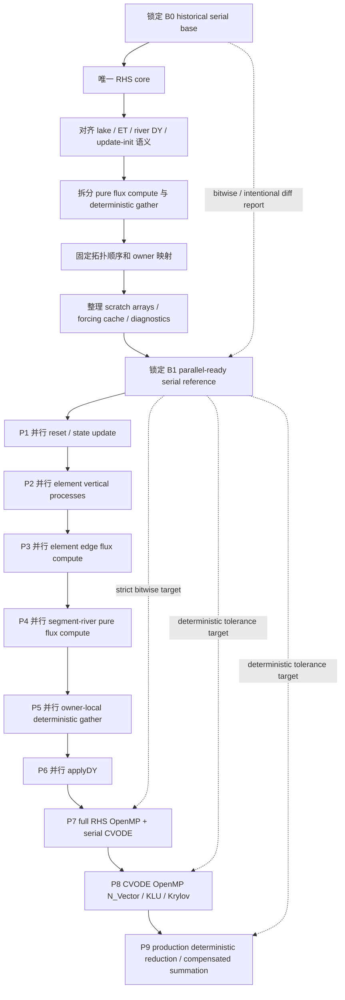
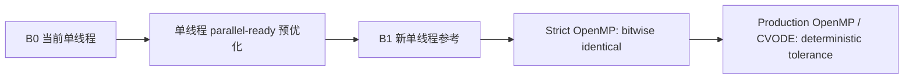

# SHUD 并行前对齐与完整并行改造 Mermaid 路线图

```mermaid
graph TD
    B0[锁定 B0 historical serial base] --> S1[唯一 RHS core]
    S1 --> S2[对齐 lake / ET / river DY / update-init 语义]
    S2 --> S3[拆分 pure flux compute 与 deterministic gather]
    S3 --> S4[固定拓扑顺序和 owner 映射]
    S4 --> S5[整理 scratch arrays / forcing cache / diagnostics]
    S5 --> B1[锁定 B1 parallel-ready serial reference]

    B1 --> P1[P1 并行 reset / state update]
    P1 --> P2[P2 并行 element vertical processes]
    P2 --> P3[P3 并行 element edge flux compute]
    P3 --> P4[P4 并行 segment-river pure flux compute]
    P4 --> P5[P5 并行 owner-local deterministic gather]
    P5 --> P6[P6 并行 applyDY]
    P6 --> P7[P7 full RHS OpenMP + serial CVODE]
    P7 --> P8[P8 CVODE OpenMP N_Vector / KLU / Krylov]
    P8 --> P9[P9 production deterministic reduction / compensated summation]

    B0 -. bitwise / intentional diff report .-> B1
    B1 -. strict bitwise target .-> P7
    B1 -. deterministic tolerance target .-> P8
    B1 -. deterministic tolerance target .-> P9
```

## 简化版

```mermaid
graph LR
    A[B0 当前单线程] --> B[单线程 parallel-ready 预优化]
    B --> C[B1 新单线程参考]
    C --> D[Strict OpenMP: bitwise identical]
    D --> E[Production OpenMP / CVODE: deterministic tolerance]
```
